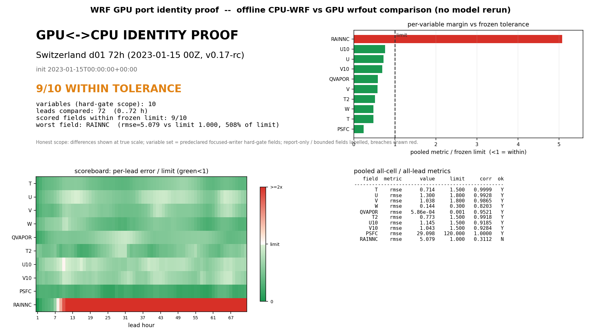
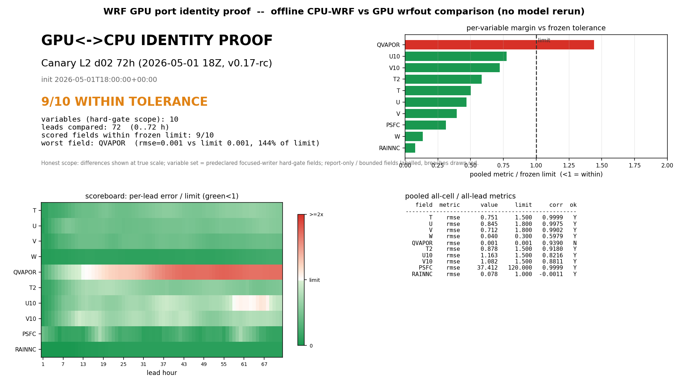
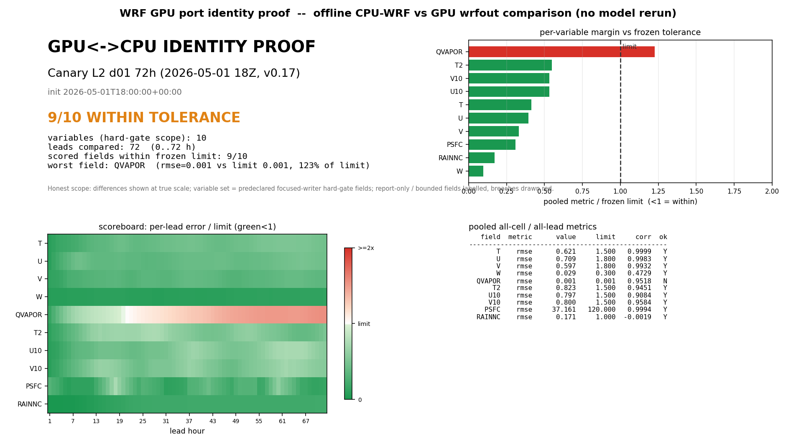

# wrf_gpu

**A GPU-native, WRF-compatible regional weather model.** `wrf_gpu` runs a
standalone WRF v4 ARW forecast end-to-end on a single GPU: it reads a standard
WRF `namelist.input`, assembles its own initial/boundary state from `met_em`
forcing (no `real.exe`, no CPU-WRF dependency), integrates a nonhydrostatic
split-explicit ARW dycore on the GPU, and writes a WRF-compatible `wrfout`
history file.

It is **not** a port of legacy WRF Fortran. It is a clean JAX rewrite that
targets the GPU memory hierarchy from day one and validates against WRF as an
**oracle** — proving cell-for-cell identity to CPU-WRF v4 rather than inheriting
WRF's architecture. The operational target is **Canary Islands daily
forecasting** (3 km then 1 km) on a single-workstation RTX 5090.

### What it is good for

- **Running real regional ARW forecasts on a GPU** from a standard WRF namelist —
  single-domain or live-nested (d01→d02→d03, down to the 1 km nest), with native
  init, restart, and a WRF-compatible `wrfout`.
- **Capability the CPU stack cannot reach on one box.** **MEASURED:** a **1 km
  single domain fits one RTX 5090 bit-identically**, and the **all-7-island 1 km
  nested case runs end-to-end on one card**. **PROJECTED:** large single grids and
  **cluster / multi-GPU weak-scaling** — the throughput path (memory arithmetic +
  fake-mesh bit-identity proven; real multi-GPU throughput **not yet benchmarked**).
- **A transparent, forkable research artifact.** Every claim has a proof object on
  disk; every architecture decision has a cross-model-reviewed ADR. It is built to
  be driven and extended by an AI manager agent (see [Use the manager](#use-the-manager-agent-driven-development)).

### What it is NOT

- **Not a universal WRF v4.** It covers the common operational ARW subset
  (the wired physics menu below); every unsupported namelist option **fails closed
  before any compute** with a named reason — it never silently substitutes a scheme.
- **Not proven for full 24 h/72 h forecast-skill equivalence.** The
  dynamics/thermodynamics core is proven **cell-for-cell identical** to CPU-WRF;
  the broader T2/U10/V10 forecast-skill equivalence is the honest **open gate**
  (see [Honest boundaries](#honest-boundaries--what-is-not-claimed)).
- **Not a single-card speedup story.** On tiny-nest geometries the GPU is
  launch/occupancy-bound and runs at ~parity with same-box CPU-WRF; an opt-in
  fast-mode reaches ~1.3×. The value is **capability** (1 km + scale), not raw
  single-card speed (see [Performance](#performance--honest)).
- **Not** DFI / FDDA / spectral-nudging / WRF-Chem / WRF-Fire / urban / lake.

> ### ⏱ First run is slow on purpose, then fast
> The first forecast **JIT-compiles the GPU kernels** — a **~8–12 min one-time cold
> compile with no output before integration starts**. It is compiling, not hung. A
> **persistent on-disk JIT cache** (on by default) makes **every later run a fast
> cache read** (`cold ~147 s → cache-hit ~29 s` on the d01 hour-1 wrapper); the
> cached executable is **bit-identical** to the cold one. The opt-in fused
> fast-mode (`GPUWRF_NESTED_FUSE=1`, below) carries a separate **~38 min one-time
> compile** — also cached after the first run.

---

## WRF-v4 identity — proven cell-for-cell against CPU-WRF v4

`wrf_gpu` is validated by a **reproducible, CPU-only identity-proof system**: it
compares a GPU `wrfout` against a CPU-WRF `wrfout` from the same init, over **all
grid cells, all 72 forecast leads, and all core prognostic variables**, against a
**frozen tolerance manifest** (read before comparison, never tuned). This
**cell-identity** method is the project's primary fidelity gate — a per-cell,
per-lead, per-variable proof, not an aggregate station-RMSE summary. Full method +
reproduce commands: **[docs/IDENTITY_PROOF.md](docs/IDENTITY_PROOF.md)**.

On each region the result is **9 of 10 hard-gate fields within frozen tolerance
with the full dynamics/thermodynamics core cell-for-cell identical** (`r ≈
0.99–1.00`). The one out-of-envelope field per region is a **bounded diagnostic,
drawn red, never painted green**: precipitation `RAINNC` (Switzerland) or moisture
`QVAPOR` (Canary) — pre-existing, physical, sub-2× of a tight bound, not an
identity failure. (See the honest framing below the plots.)

**Three regions are proven on retained v0.17 data:**

**Switzerland d01 — 72 h (9/10, dynamics/thermo cell-for-cell):**


**Canary L2 d02 — 72 h, nested (9/10, dynamics/thermo cell-for-cell):**


**Canary L2 d01 — 72 h, parent (9/10, dynamics/thermo cell-for-cell):**


Reproduce against any matching CPU/GPU `wrfout` pair (CPU-only, never touches the GPU):

```bash
taskset -c 0-3 python3 scripts/build_identity_proof_plots.py \
  --cpu-dir "$CPU_DIR" --gpu-dir "$GPU_DIR" \
  --domain d01 --init "2026-05-01T18:00:00+00:00" \
  --case-id canary_l2_d01_72h --region-label "Canary L2 d01 72h" \
  --tolerance-json proofs/v014/grid_delta_atlas/tolerance_manifest_candidate.json \
  --proof-dir proofs/v017/identity_proof/canary_l2_d01 \
  --asset-dir docs/assets/v017/identity_proof/canary_l2_d01
```

> **Honest framing — read this first.** `wrf_gpu` is a **WRF-compatible
> reimplementation** (a clean JAX rewrite validated against WRF as an oracle),
> **not a Fortran-source port**, and a **transparent research artifact, not a full
> WRF replacement.** The cell-identity proofs above show the
> **dynamics/thermodynamics core is cell-for-cell identical** to CPU-WRF v4 over 72
> h; the broader **24 h/72 h forecast-skill equivalence (T2/U10/V10) vs CPU-WRF is
> the credibility gate and is NOT claimed closed** — it is a hard
> dynamics-`ph'` / MYNN / `*_tendf` GPU problem and the dominant carry-over (KI-9).
> The earlier statistical-equivalence (TOST) framing is **superseded** by this more
> precise per-cell identity proof; **no "TOST PASS" / "statistically-proven
> equivalence" is claimed.**

---

## Quickstart

A fresh clone → install → **standalone GPU forecast** → `wrfout` in three steps.
Full walk-through (prerequisites, troubleshooting, output): **[docs/quickstart.md](docs/quickstart.md)**.

```bash
# 1. Clone + install (CUDA 13 GPU build of JAX, then the package)
git clone https://github.com/wrf-gpu/wrf_gpu.git && cd wrf_gpu
python -m venv .venv && . .venv/bin/activate     # or: conda create -n wrfgpu python=3.11
pip install --upgrade "jax[cuda13]"
pip install -e .
python -c "import jax; print(jax.devices())"     # should list a cuda device

# 2. Run a standalone forecast from a real-data case
#    (wrfinput_* + wrfbdy_d01 + met_em, no CPU wrfout needed)
python -m gpuwrf.cli run \
    --input-dir   my_case \
    --output-dir  runs/my_forecast \
    --domain      d02 \
    --hours       24 \
    --scratch-dir /fast/nvme/gpuwrf_scratch

# 3. Read the WRF-compatible history file
ncdump -h runs/my_forecast/wrfout_d02_*
```

`run` **auto-detects** the input directory: a case with a CPU-WRF `wrfout` →
replay mode; a case with only `real.exe` outputs → **standalone native-init mode**
(assembles `wrfinput`/`wrfbdy` and integrates on the GPU, **no CPU-WRF
dependency**). Bring your existing WRF `namelist.input` — the supported matrix runs
as-is; unsupported options fail closed with a named reason
([docs/namelist-compatibility.md](docs/namelist-compatibility.md)).

For a **live-nested** forecast (d01→d02→d03, down to the 1 km nest), add
`--max-dom N` — the parent builds each child's lateral boundary **live**, with no
pre-supplied `wrfbdy_d02`:

```bash
python -m gpuwrf.cli run --input-dir my_case --output-dir runs/nested \
    --max-dom 3 --hours 24 --scratch-dir /fast/nvme/gpuwrf_scratch
```

> Remember the **one-time cold compile** (~8–12 min, no output) on the first run;
> later runs read the persistent JIT cache. See the box at the top.

## Use the manager (agent-driven development)

This repository is built to be run and extended by an **AI manager agent** — the
shipped skill `.agent/skills/managing-sprints` is the operating manual. To drive
the project this way:

1. **Clone the repo on an isolated machine or VM** (the agent runs commands and the
   GPU; isolate it).
2. **Start Claude Code or a GPT/codex agent in auto-permission mode** in the repo
   directory.
3. **Tell it: "you are now the manager."** From that point the shipped
   `managing-sprints` skill tells it **where everything is and what to do** — read
   order (`PROJECT_CONSTITUTION.md` → `AGENTS.md` → the sprint contract → the
   relevant `.agent/skills`), the evidence/proof-object rules, how to dispatch and
   gate sub-agents (Opus ↔ GPT critic for kernel/perf-core work), the GPU lock, and
   the release protocol.

The manager assigns sprints, runs the acceptance gates, and merges — you steer it
at the milestone/decision level, not per-command.

## Performance — honest

Measured on the reference RTX 5090 workstation vs same-box CPU-WRF.

- **Default config is bit-identical to v0.16** and runs at **~parity total-wall**
  on the 72 h gates (Switzerland 0.99×, Canary 1.04× vs 24/28-rank CPU-WRF;
  forecast-only ~1.05–1.20×; warmed steady-state ~1.5×). This is a **GeForce fp64
  hardware law** (1/64 fp32 throughput), not a defect — the acoustic core is
  deliberately fp64 around cancellation.
- **Opt-in fused fast-mode** (`GPUWRF_NESTED_FUSE=1`) lifts the canary all-7
  (9/3/1 km) nested run to **~1.27–1.30× vs the same-box 12-rank CPU-WRF
  (MEASURED)**, GPU utilization 56 → 96 %. It is **tolerance-PASS vs CPU but NOT
  bitwise** (XLA FMA-contraction → a different valid trajectory) and carries a
  **~38 min one-time fused compile** (cached) — so it ships **opt-in**, and a
  24 h/72 h-tolerance check vs WRF v4 is the operator's gate for their case.
- **The honest ceiling** (profiler + independent GPT-5.5 cross-confirmed): after
  v0.17's host-orchestration fixes, the tiny-nest all-7 is **GPU-compute-bound
  (~674 s/forecast-hour)** — an nsys trace shows **many ~1.5 µs kernels with no
  hot-spot**, i.e. a **launch/occupancy limit, not a throughput limit**. So **fp32
  cannot move it** (broad fp32 is ~1.1×, proven), and **≥2× / 3× are NOT
  single-card reachable** for this tiny-nest geometry (a 12-rank CPU is competitive
  on ~55 k tiny columns). The genuine speedup/scale levers are **algorithmic +
  multi-GPU**, not fp32.

**HEADLINE = CAPABILITY, not single-card tiny-nest speedup.** **MEASURED:** 1 km
single domain fits one RTX 5090 bit-identically; the all-7 1 km nested case runs
end-to-end on one card; the ~1.27–1.30× opt-in fast-mode is real. **PROJECTED /
UNMEASURED:** large single grids + **cluster / multi-GPU weak-scaling** and
whole-Earth-at-1 km "fits one rack" (exact memory arithmetic; multi-GPU throughput
**not benchmarked**). Detail: [docs/PERFORMANCE.md](docs/PERFORMANCE.md),
[`RELEASE_NOTES_v0.17.0.md`](RELEASE_NOTES_v0.17.0.md),
[`proofs/v017/hostgap_fix_opus.md`](proofs/v017/hostgap_fix_opus.md).

**The whole Earth at 1 km fits in a single rack (PROJECTED).** The global 1 km
50-level state — ~25 billion cells, ~4.3 TB (≈13 TB with solver working memory) —
fits in the HBM of one **NVIDIA GB300 NVL72**. This is **exact memory arithmetic,
a "where this is going" note, not a near-term capability**: the multi-GPU
domain-decomposition path is bit-identity-proven on a **CPU fake mesh only**
(`shard_map` + `lax.ppermute` halo); **real multi-GPU throughput is not yet
shipped**, and a global wall-clock figure is **not claimed**.

**Opt-in performance env flags** (all default to the bit-identical path):
`GPUWRF_NESTED_FUSE=1` (fused cascade fast-mode; ~1.3×, not bitwise),
`GPUWRF_NESTED_SYNC_MODE` (`root` default / `advance` / `segment`),
`GPUWRF_EDGE_ONLY_BOUNDARY` (ring-only boundary, **default on, bit-identical**),
`GPUWRF_JIT_BOUNDARY` (jit the boundary builder, default off),
`GPUWRF_HOST_LEDGER` (per-phase host-time diagnostic).

## System requirements & resource profile

Measured on the reference RTX 5090. Full detail: **[docs/resource-profile.md](docs/resource-profile.md)**.

| Resource | What to expect |
|---|---|
| GPU / VRAM | NVIDIA GPU with **≥ 31 GiB free VRAM** for the nested 72 h fp64 case (RTX 5090 / 32 GiB reference). 72 h gate peaks: **22.9 GiB** (Switzerland d01) / **29.8 GiB** (Canary L2 d02, nested); d01 9 km standalone peaks **≈ 4.7 GiB**; the 1 km single domain fits in a fresh process at **18.25 GiB** (chunked BouLac). Peak is transient working memory, not persistent fp64 State, so **fp32 does not reduce it** — the VRAM levers are algorithmic + multi-GPU. |
| First-run compile | **~8–12 min** one-time cold JIT compile (no output during compile). The **persistent on-disk cache** (default on since v0.12.0) turns later runs into a fast cache read (**cold ~147 s → cache-hit ~29 s** d01 hour-1 wrapper); cached executable is **bit-identical**. The opt-in `GPUWRF_NESTED_FUSE=1` adds a separate **~38 min one-time** fused compile (cached). |
| Scratch | A **real (non-tmpfs) NVMe scratch dir**, a few GiB free. Set via `--scratch-dir` / `$GPUWRF_SCRATCH`. Do **not** use a RAM disk. |
| Throughput | **~Parity** default (Switzerland 0.99×, Canary 1.04× total-wall vs 24-rank CPU; forecast-only ~1.05–1.20×; warmed steady-state ~1.5×); **~1.27–1.30×** with the opt-in fused fast-mode (vs 12-rank CPU). No multi-× single-card speedup is claimed. See [docs/PERFORMANCE.md](docs/PERFORMANCE.md). |
| Toolchain | CUDA 13 + a JAX CUDA build that sees the GPU. |

## Version history

Newest first. Full per-release evidence is under [`proofs/`](proofs/) and the
`RELEASE_NOTES_v*.md` files.

| Version | Headline | Key proof / link |
|---|---|---|
| **v0.17.0** | **PERFORMANCE + honest ceiling.** Closes the live-nested GPU host-orchestration holes — the **all-7 island nest (`--max-dom 9`) now forecasts at all** (previously recompiled forever → 0 output); default config **bit-identical to v0.16**. Adds an **opt-in fused fast-mode** (`GPUWRF_NESTED_FUSE=1`: util 56→96 %, **~1.27–1.30× vs 12-rank CPU**, tolerance-PASS not bitwise, ~38 min one-time compile). Answers speedup honestly: tiny-nest all-7 is **launch/occupancy-bound (~674 s/hr, nsys-grounded)** — **fp32 cannot move it, ≥2×/3× not single-card reachable**. Value = **capability** (1 km fits one card + scale), not single-card tiny-nest speed. | [`RELEASE_NOTES_v0.17.0.md`](RELEASE_NOTES_v0.17.0.md), [`proofs/v017/hostgap_fix_opus.md`](proofs/v017/hostgap_fix_opus.md), [`docs/IDENTITY_PROOF.md`](docs/IDENTITY_PROOF.md) |
| **v0.16.0** | **STABILITY + 1 km-unlock.** Proves **24 of 25 L2 physics schemes run coupled-green** on a real Switzerland d01 case (25th = Noah-classic, honest scope-carry → `ALL_GREEN_OR_CARRIED`). Adds **aerosol-aware Thompson** (`mp_physics=28`, WRF-module oracle PASS). Ships a **chunked MYNN BouLac** that makes a **1 km single domain fit one RTX 5090 bit-identically** (dense OOMs at ≈18.8 GiB; chunked fits at 18.25 GiB). **fp32 make-or-break CONCLUDED** (Opus + independent GPT): valid-numerics ceiling **~1.1×**, 0 % VRAM-peak reduction — the ~4.3× "cost proxy" is numerically invalid. | [`RELEASE_NOTES_v0.16.0.md`](RELEASE_NOTES_v0.16.0.md), [`proofs/v016/fp32_verdict/`](proofs/v016/fp32_verdict/), [`proofs/v016/coverage/`](proofs/v016/coverage/) |
| **v0.15.0** | **Final fp64 kernel + WRF-fidelity.** Delivers the project's **final fp64 GPU kernel** (adversarially confirmed near-optimal, device-bound). Lands **MYNN-EDMF condensation `niter` 50→16** + **Thompson cold-collection**, fixes the **MUB/PB nest-base-state seam** (250.7 → 0.0078 Pa), and re-closes both 72 h gates **9/10 within frozen tolerance**, dynamics/thermo cell-for-cell. Honest **~parity total-wall** (0.99×/1.04×). | [`proofs/v015/finalgates/`](proofs/v015/finalgates/), [`proofs/perf/v015/kernel_characterization.md`](proofs/perf/v015/kernel_characterization.md) |
| v0.14.0 | Memory + WRF-identity: root-causes Switzerland venting (stratospheric-theta masking clamp), lands advance_w WRF-faithfulness + physics-`tendf` fold + 2D Smagorinsky on the default path, and **first closes both 72 h GPU-vs-CPU field-parity gates** with the reproducible identity-proof system. | [`proofs/v014/`](proofs/v014/) |
| v0.13.0 | Lifts the single-GPU VRAM ceiling (**RRTMG VRAM-floor chunking**, SW −88.6 % / LW −43.6 %), turns **GWD on by default on the nested 1 km path**, adds **MYJ+Janjic**, multi-GPU fake-mesh sharding, moisture flux-advection into RK3, clear-sky diagnostics (all opt-in/default-off). | [`proofs/v013/`](proofs/v013/), [`proofs/v0130/`](proofs/v0130/) |
| v0.12.0 | Standalone out-of-box CLI + live-nested `--max-dom`, **persistent JIT cache**, fail-closed scheme catalog, WRF-faithful PSFC fix, runnable equivalence demo. | [`proofs/v0120/`](proofs/v0120/) |
| v0.11.0 | Live multi-domain nesting, WRF restart bit-identity, conservation budgets closed, MYNN-EDMF, topographic/slope radiation, terrain-slope diffusion, Kain-Fritsch/BMJ/Tiedtke/Grell-Freitas cumulus. | [`proofs/v0110/`](proofs/v0110/) |
| v0.9.0–v0.10.0 | Consolidated standalone forecast system; removed a faithful Thompson sedimentation inefficiency. | [`proofs/v090/`](proofs/v090/), [`proofs/v0100/`](proofs/v0100/) |
| v0.1.0–v0.6.0 | Single-domain replay → native metgrid (v0.3.0) → native real-init proven equivalent to `real.exe` at t=0 (v0.4.0) → expanded operational physics menu (v0.6.0). | git tag history |
| v0.2.0 | Intended stable paper-claims baseline (accessible via git tag; never formally re-tagged). | git tag `v0.2.0` |

## Scope at a glance — implemented / fail-closed / out-of-scope

A high-level summary of what runs, what is recognized-but-refused (loudly, before
any compute), and what is a deliberate boundary. Full per-scheme support table:
**[docs/namelist-compatibility.md](docs/namelist-compatibility.md)**; open issues:
**[docs/KNOWN_ISSUES.md](docs/KNOWN_ISSUES.md)**.

| Area | Implemented (runs) | Fail-closed (recognized, refused with a named reason) | Out-of-scope / roadmap boundary |
|---|---|---|---|
| **Init** | Native real-init (`wrfinput`/`wrfbdy` from met_em, no `real.exe`); WRF restart | — | — |
| **Dynamics** | Nonhydrostatic ARW, RK3 + split-explicit acoustic, flux-form advection, constant-K (`diff_opt=2`/`km_opt=1`) + 2-D Smagorinsky (`diff_opt=1`/`km_opt=4`) horizontal diffusion | 3-D TKE / full Smagorinsky (`km_opt=2/3/5`) → use `km_opt=1` or `4` | Moving/global nests; adaptive Δt |
| **Microphysics** | Kessler, Lin, WSM3/5/6, Thompson, **aerosol-aware Thompson (mp=28)**, Morrison, WDM6 | Aerosol-coupled Morrison (mp=40), NSSL | WRF-Chem |
| **PBL / sfc** | YSU, MYNN-EDMF, ACM2, BouLac, MYJ; MYNN-SL, revised-MM5, Pleim-Xiu, Janjic-Eta sfclay | — | — |
| **Cumulus** | Kain-Fritsch, BMJ, Tiedtke (needs active flux-form moisture advection for RQVFTEN), Grell-Freitas (scale-aware) | New-Tiedtke | — |
| **Radiation** | RRTMG SW + LW with topographic shading + slope correction; Dudhia SW + classic RRTM LW (`ra_lw=1`); clear-sky `…C` flux diagnostics (opt-in) | — | — |
| **Land** | Noah classic, Noah-MP (prognostic) | — | Full Noah-MP snow-layer diagnostics in wrfout (KI-3) |
| **Nesting** | One-way live d01→d02→d03, per-domain subcycling, restart; GWD (`gwd_opt=1`) default-on on nested | — | Two-way feedback + radiation/w-relax in loop — finite/stable but 24 h equivalence untested (KI-11) |
| **Output** | Focused 104-variable `wrfout` (core met/spatial/vertical/soil + radiation-flux + Noah-MP snow-layer) | — | Full 375-variable wrfout; auxhist streams (KI-3) |
| **Multi-GPU** | `shard_map` + `lax.ppermute` halo sharding, single-GPU default = zero overhead | — | Real multi-GPU throughput (needs DGX/NVLink; fake-mesh bit-identical only) |
| **Data assim.** | Lateral-BC relaxation | — | DFI, FDDA, grid/obs/spectral nudging |
| **Other** | — | — | Urban (BEP/BEM), lake, fully aerosol-coupled MP / WRF-Chem (rejected, not roadmap) |

These are **boundaries and a roadmap, not hidden gaps**: every unsupported
namelist selection is rejected before any compute with a specific named reason —
the port never silently substitutes or skips a scheme. The honestly-prioritized
delta-to-complete-WRF ledger is in the [Roadmap](#roadmap--delta-to-a-complete-wrf-v4-port) below.

### GPU-operational physics menu (scan-wired, WRF-oracle-gated)

These are the schemes the operational scan actually dispatches; the wiring is in
[`src/gpuwrf/runtime/operational_mode.py`](src/gpuwrf/runtime/operational_mode.py)
(`_SCAN_WIRED_OPTIONS`) and
[`src/gpuwrf/coupling/scan_adapters.py`](src/gpuwrf/coupling/scan_adapters.py); the
namelist-accepted matrix is in
[`src/gpuwrf/contracts/physics_registry.py`](src/gpuwrf/contracts/physics_registry.py).

| Family | Namelist key | GPU-operational options (scan-wired) |
|---|---|---|
| Microphysics | `mp_physics` | 1 Kessler, 2 Purdue-Lin, 3 WSM3, 4 WSM5, 6 WSM6, 8 Thompson, 10 Morrison, 14 WDM5, 16 WDM6, **28 aerosol-aware Thompson** (QNWFA/QNIFA prognostics; WRF-module oracle PASS 5187-col GPU) |
| PBL | `bl_pbl_physics` | 1 YSU, 2 MYJ (mandatory Janjic pairing), 5 MYNN-EDMF (DMP mass flux + cloud-aware moisture/thermodynamics), 7 ACM2, 8 BouLac |
| Surface layer | `sf_sfclay_physics` | 1 revised-MM5, 2 Janjic-Eta (paired with MYJ), 5 MYNN-SL, 7 Pleim-Xiu |
| Cumulus | `cu_physics` | 1 Kain-Fritsch, 2 BMJ (fp64), 3 Grell-Freitas (scale-aware), 6 Tiedtke (needs flux-form moisture advection for RQVFTEN) |
| Radiation | `ra_sw_physics` / `ra_lw_physics` | RRTMG SW + LW (`=4`) with topo shading (`topo_shading=1`) + slope-corrected surface radiation (`slope_rad=1`); Dudhia SW (`ra_sw=1`) + classic RRTM LW (`ra_lw=1`); clear-sky `…C` flux diagnostics (opt-in) |
| Land surface | `sf_surface_physics` | 2 Noah classic (explicit static/land bundle), 4 Noah-MP (`use_noahmp=True`) |
| Diffusion | `diff_opt`, `km_opt` | constant-K and 2-D Smagorinsky (incl. terrain-slope + map-factor deformation terms; WRF formula parity, max residual `3.78e-15`) |
| GWD | `gwd_opt` | 1 gravity-wave drag — **default-ON on the nested 1 km path** (`GPUWRF_GWD_NESTED=0` forces off) |
| Advection | `moist_adv_opt`, `scalar_adv_opt` | moisture flux-advection into RK3 + PD/monotonic moisture limiter (both opt-in, default-off = byte-identical) |

`mp_physics=0`, `bl_pbl_physics=0`, `sf_sfclay_physics=0`, `cu_physics=0`, and
`ra_*=0` are accepted as "disabled" slots. **Parity-proven but fail-closed**
(recognized, loudly rejected if selected operationally): New-Tiedtke cumulus
(`cu_physics=16`) — passes per-scheme savepoint parity but is not scan-wired;
selecting it raises a specific named error before any compute, never a silent
fallback.

## Honest boundaries — what is NOT claimed

- **Not a universal WRF v4.** Standard regional ARW configs only; the common
  operational subset above. Everything else fails closed with a named reason.
- **24 h/72 h forecast-skill equivalence is NOT closed — the credibility gate.**
  On the runnable equivalence demo (24 h d02), the verdict is `NOT_EQUIVALENT`:
  short-lead fields track CPU-WRF within tolerance, but by 24 h the run diverges,
  **dominated by lead-time wind divergence** (3D V pooled RMSE 8.13 m s⁻¹ vs a
  1.8 m s⁻¹ bar). PSFC is improved (707.8 → 415.3 Pa) but still out of bar, its
  residual driven by that same dynamical divergence. **Neither the winds nor PSFC
  are equivalent at 24 h.** Off-by-default fidelity levers (moisture flux-advection
  into RK3, MYJ+Janjic, clear-sky diagnostics) move toward this gap but do **not**
  close it — hard dynamics-`ph'` / MYNN / `*_tendf` GPU work, no cheap knob. This
  is the gate for any "operational / replacement" claim. See
  [docs/equivalence-demo.md](docs/equivalence-demo.md) (KI-9).
- **Cell-identity proofs pass 9/10 per region with one bounded miss.** Each region
  closes with **9/10 hard-gate fields within frozen tolerance** and the
  dynamics/thermo core cell-for-cell identical, but each has one out-of-envelope
  **bounded** diagnostic — Switzerland `RAINNC` ~5.08 mm vs a 1.0 mm bound, Canary
  `QVAPOR` ~1.44×10⁻³ vs 1.0×10⁻³ kg/kg (~1.2–1.4× of limit). These are
  pre-existing/physical, drawn **red** in the dashboards, **not** identity failures;
  the frozen limits are unchanged (no goalpost moving).
- **No statistical-equivalence (TOST) claim.** The cell-identity proof above
  **supersedes** the earlier TOST framing as the primary fidelity gate. The
  station-RMSE TOST campaign is underpowered at the available corpus (n=15;
  n≈27 for full power) and is **not run / not claimed**; deferred (KI-5).
- **Not a single-card speedup release.** Default total-wall is ~parity; the opt-in
  fused fast-mode reaches ~1.27–1.30× (tolerance-PASS, not bitwise). On tiny-nest
  geometries the GPU is **launch/occupancy-bound**, so **≥2×/3× are NOT
  single-card reachable** and **fp32 cannot move it** (the valid-numerics fp32
  ceiling is ~1.1×, proven + cross-confirmed). The genuine speedup/scale levers are
  **algorithmic + multi-GPU**, not fp32.
- **Multi-GPU throughput unmeasured.** The `shard_map` + `lax.ppermute` halo
  sharding is bit-identical on a CPU fake mesh, but this workstation has one
  physical RTX 5090 — real multi-GPU throughput / NVLink-NCCL bandwidth / collective
  overlap are **UNMEASURED**; the whole-Earth memory note stays **PROJECTED**. **No
  per-watt / per-kWh claim is made.**
- **Not full two-way nesting.** One-way live nesting is proven over a 24–72 h
  window; the two-way feedback path is finite/stable but its 24 h real-GPU
  equivalence vs CPU-WRF is **untested** (KI-11).
- **fp64-only standalone.** The standalone CLI path forces pure fp64; there is no
  fp32 standalone path (gated-fp32 is an experimental ADR-007 preview, no faster on
  this memory-bound workload).
- **Free-running open-lateral-boundary stability.** Free-running without
  lateral-boundary relaxation on wide domains (nx≈160+) can go unstable beyond
  ~14 h. The validated operational path uses boundary forcing (KI-7).
- **Not** DFI / FDDA / spectral-nudging / adaptive-Δt; **aerosol-coupled Morrison
  (`mp=40`) and NSSL fail closed**; **not urban (BEP/BEM) / lake / WRF-Chem /
  WRF-Fire / WRF-Hydro** (rejected, not roadmap).
- **v0.2.0 paper tag not formally re-released.** All prior releases remain
  accessible via git tags on the org repo; v0.2.0 stays accessible for paper claims.

A code-grounded, prioritized inventory of the remaining gap to a complete WRF v4
replacement lives in
[`docs/GPU_PORT_GAPS_TODO.md`](docs/GPU_PORT_GAPS_TODO.md) and the roadmap table
above.

## Roadmap — delta to a complete WRF v4 port

Consolidated, honestly-prioritized ledger of everything still deferred / simplified
relative to official WRF v4, sorted by importance for an *optimal complete* port.
Complexity: **S** ≈ 1–2 focused sprints · **M** ≈ 3–5 · **L** ≈ 5–10 · **XL** ≈ 10+.

| # | Item — delta vs official WRF v4 | Cmplx | Detail |
|---|---|---|---|
| **Tier 1 — blocks a complete standalone WRF v4 replacement** | | | |
| 1 | **24 h/72 h forecast-skill closure (T2/U10/V10)** — the credibility gate; cell-identity proven, broad skill-equivalence open. Hard dynamics-`ph'`/MYNN/`*_tendf` work. | L | KI-9; docs/equivalence-demo.md |
| 2 | **Full multi-domain nested equivalence** — 24 h one-way proven; two-way feedback + radiation-in-loop + w relaxation + 5-domain long-run equivalence remain (2-way 24 h real-GPU equivalence untested). | L | GPU_PORT_GAPS P0-1; KI-11 |
| 3 | **Full `wrfout` variable coverage** — focused 104-variable writer vs WRF's 375. Blocks downstream tools. | M | GPU_PORT_GAPS P0-5; KI-3 |
| **Tier 2 — physics fidelity (faithful to the pinned Canary suite)** | | | |
| 4 | **MYNN PBL completeness** — EDMF mass flux wired; `icloud_bl=1` cloud PDF and `cloudmix` partial. Tied to the residual near-surface wind-skill gap. | M | GPU_PORT_GAPS P1-4 |
| 5 | **Thompson microphysics parity debts** — snow fall-speed approx, cloud-water sedimentation, invalid-column fallback. | M | GPU_PORT_GAPS P1-5 |
| 6 | **Moisture advection into RK3 + cadence fidelity** — wired opt-in (default-off); cadence refinements + operationalizing on the default path remain. | M | GPU_PORT_GAPS P1-6; KI-10 |
| 7 | **RRTMG SW taug top-layer convention fix** — 4 UV bands fail intermediate oracle; tier-1 fluxes faithful; pre-existing. | S | KI-6 |
| **Tier 3 — correctness / robustness debts** | | | |
| 8 | **Free-running open-lateral-boundary stability** — wide domains (nx≈160+) can blow up without boundary relaxation beyond ~14 h. | M | KI-7 |
| 9 | **U10 episodic under-prediction** — final-lead breach on the validated d02 case (tied to MYNN cloud PDF). | S–M | KI-4 |
| **Tier 4 — statistical / release closure** | | | |
| 10 | **Powered n≈27 TOST scoring** — corpus prepared, not scored; superseded as the primary gate by cell-identity but still a paper-equivalence item. | S–M | KI-5; ADR-029 |
| 11 | **v0.2.0 stable paper-release tag** — intended stable baseline never formally re-tagged. | S | `V0.2.0-PLAN.md` |
| **Tier 5 — performance (optional)** | | | |
| 12 | **fp32-physics islands fast-mode** — compact explicit-fp64-island restructuring (~1.5–1.6×, still < 2×) deferred to v0.18 as an optional fast-mode. | XL | [`proofs/v016/fp32_verdict/`](proofs/v016/fp32_verdict/) |
| 13 | **Real multi-GPU throughput** — sharding bit-identity proven on fake mesh; DGX/NVLink cluster required for real throughput. | M | `contracts/halo.py` |
| **Tier 6 — breadth / general WRF coverage** | | | |
| 14 | **Full physics scheme matrix** — alternate MP/PBL/CU/RA/LSM families beyond the wired set (recognized-but-fail-closed). | XL | GPU_PORT_GAPS P1-2 |
| 15 | **FDDA / grid+obs / spectral nudging** — none (only lateral-BC relaxation). | M–XL | GPU_PORT_GAPS P1-1 |
| 16 | **Map-projection / grid generality** — Lambert/Mercator/Polar + hybrid-eta C-grid only; no moving/global nests. | M | GPU_PORT_GAPS P2-1 |
| 17 | **Additional wrfout diagnostics / auxhist streams** (downstream-driven). | S–L | GPU_PORT_GAPS P2-3 |

**Critical path to a *complete* port:** items **1 → 2 → 3** are the
standalone-replacement chain; **4 / 5 / 6** are the highest-value fidelity levers
(where the remaining wind/T2 skill lives). The perf rewrite (12) and breadth
(14–17) are real but lower-leverage than finishing the skill + nest tiers.

## Core goals (immutable)

1. **GPU-native architecture.** Whole-state device residency after init. No
   host/device transfers inside the timestep loop without an ADR. Fused
   timestep-scale kernels, not micro-kernel launch storms.
2. **Operational skill parity with CPU WRF v4** on Canary L2/L3 cases — proven
   cell-for-cell on the dynamics/thermo core; 24–72 h T2/U10/V10 forecast-skill
   equivalence is the open credibility gate.
3. **Performance vs CPU WRF** on the same workstation, re-certified after every
   correctness fix (no stale speedup claims). The headline is the honest
   command-to-finish wall-clock ratio; kernel-level ratios are reported separately.
4. **Validation against WRF, not bitwise reproducibility.** Tiered pyramid: micro
   fixture / savepoint parity → physical invariants → short-run / convergence →
   cell-identity proof against CPU-WRF.
5. **Forkable and auditable.** Every claim has a proof object on disk. Every
   architecture decision has an ADR with cross-model review.

## Where to look first (in this order)

| When you want to… | Read |
|---|---|
| Install and run your first forecast | [`docs/quickstart.md`](docs/quickstart.md) |
| Size a machine (VRAM / compile / scratch / energy) | [`docs/resource-profile.md`](docs/resource-profile.md) |
| Know which namelist options run vs fail-closed | [`docs/namelist-compatibility.md`](docs/namelist-compatibility.md) |
| Understand the project scope | [`PROJECT_CONSTITUTION.md`](PROJECT_CONSTITUTION.md), [`CHANGELOG.md`](CHANGELOG.md) |
| See the WRF-v4 cell-identity proof + how to reproduce it | [`docs/IDENTITY_PROOF.md`](docs/IDENTITY_PROOF.md), `docs/assets/v017/identity_proof/`, [`proofs/v017/identity_proof/`](proofs/v017/identity_proof/) |
| Understand the performance (honest ~parity + opt-in fast-mode + ceiling) | [`docs/PERFORMANCE.md`](docs/PERFORMANCE.md), [`RELEASE_NOTES_v0.17.0.md`](RELEASE_NOTES_v0.17.0.md), [`proofs/v017/hostgap_fix_opus.md`](proofs/v017/hostgap_fix_opus.md) |
| Run & verify the GPU-vs-CPU equivalence demo | [`docs/equivalence-demo.md`](docs/equivalence-demo.md) — `scripts/equivalence_demo.py` |
| Run long GPU validation reliably | [`docs/GPU_RUNBOOK.md`](docs/GPU_RUNBOOK.md) — `scripts/run_gpu_lowprio.sh` |
| Check current known issues | [`docs/KNOWN_ISSUES.md`](docs/KNOWN_ISSUES.md) |
| Reproduce the proof collection on CPU | [`docs/REPRODUCIBILITY.md`](docs/REPRODUCIBILITY.md) — `scripts/verify_reproducibility.sh` |
| Run the community-standard validation suite | [`docs/VALIDATION.md`](docs/VALIDATION.md) — `scripts/community_validation.sh` |
| See the full WRF v4 gap inventory | [`docs/GPU_PORT_GAPS_TODO.md`](docs/GPU_PORT_GAPS_TODO.md) |
| See prior release proofs | [`proofs/`](proofs/) (`v017`, `v016`, `v015`, `v014`, `v013`, `v0120`, `v0110`, `v090`, `v0100`) |

## Known issues (v0.17.0)

Full detail with symptom / ruled-out / workaround / follow-up in
**[docs/KNOWN_ISSUES.md](docs/KNOWN_ISSUES.md)**.

| ID | Summary | Severity |
|---|---|---|
| **KI-9** | **The credibility gate.** Cell-identity proven (dynamics/thermo core cell-for-cell), but the broader **24 h/72 h forecast-skill equivalence** is open — equivalence demo 24 h d02 `NOT_EQUIVALENT`, dominated by **lead-time wind divergence** (3D V pooled RMSE 8.13 m/s). Hard dynamics-`ph'`/MYNN/`*_tendf` GPU work, no cheap knob. | Documented gap |
| **Bounded misses** | Two bounded, pre-existing/physical diagnostics out of frozen envelope on the cell-identity proofs (limits unchanged, drawn red): Switzerland **RAINNC** ~5.08 mm vs 1.0 mm, Canary **QVAPOR** ~1.44×10⁻³ vs 1.0×10⁻³ kg/kg. | Bounded acceptance |
| **Perf ceiling** | Tiny-nest single-card is launch/occupancy-bound; **≥2×/3× not single-card reachable**, fp32 ceiling ~1.1×. Opt-in fuse ~1.27–1.30× (not bitwise). Value = capability + scale. | Documented next-lever |
| **KI-4** | d02 **U10** episodic final-lead under-prediction (8.06 m/s vs 7.5 m/s bar); within bar at all other leads, beats persistence 23/24. Tied to KI-9. | Documented residual |
| **KI-3** | Operational `wrfout` is a focused **104-variable** subset (vs WRF's 375). | Scope boundary |
| **KI-5** | Powered TOST campaign not run; **superseded by cell-identity as the primary gate**. No TOST PASS claimed. | Scope boundary |
| **KI-6** | RRTMG SW intermediate `taug` top-layer convention differs in 4 UV bands; integrated fluxes pass tier-1 (< 0.05% rel). Pre-existing. | Isolated |
| **KI-7** | Free-running (`run_boundary=False`) on **wide domains** (nx≈160+) can go unstable beyond ~14 h. Validated path uses boundary forcing. | Robustness edge |
| **KI-10** | Moisture-advection cadence refinements (opt-in path; physics-tendency folding not yet WRF-cadence-exact). Default-off → no shipped-behavior impact. | Fidelity refinement |
| **KI-11** | 2-way nesting equivalence vs CPU-WRF untested (only finite/stable proven). | Scope boundary |

## Layout

```
.
├── PROJECT_CONSTITUTION.md          immutable end goal
├── ARCHITECTURE_PRINCIPLES.md       backend / runtime principles
├── VALIDATION_STRATEGY.md           validation pyramid
├── PRECISION_POLICY.md              FP64/FP32/BF16 rules
├── docs/                            user-facing references
├── fixtures/                        manifest schemas + analytic samples + Canary slice
├── src/gpuwrf/                      implementation code
│   ├── contracts/                   frozen State / grid / physics_registry
│   ├── coupling/                    scan adapters + physics dispatch
│   ├── runtime/                     operational forecast loop
│   ├── physics/                     scheme kernels
│   ├── io/                          namelist check + wrfout/wrfinput I/O
│   └── integration/                 daily pipeline / native init
├── scripts/                         CLIs, validators, identity-proof builder
├── tests/                           pytest suite
└── proofs/                          per-milestone proof objects (JSON + reports)
```
