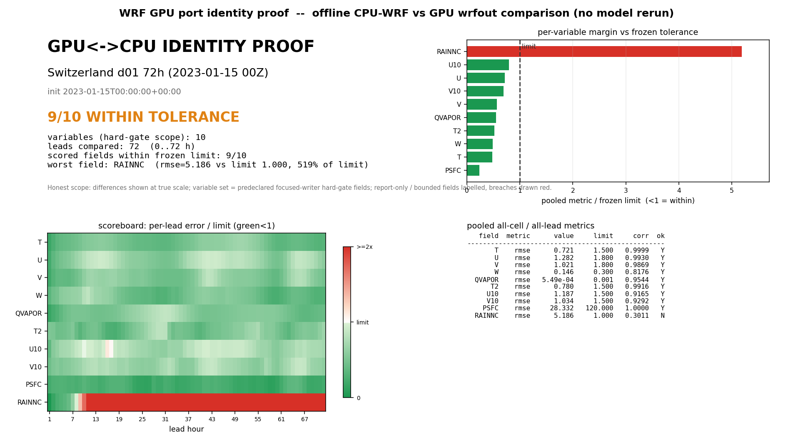
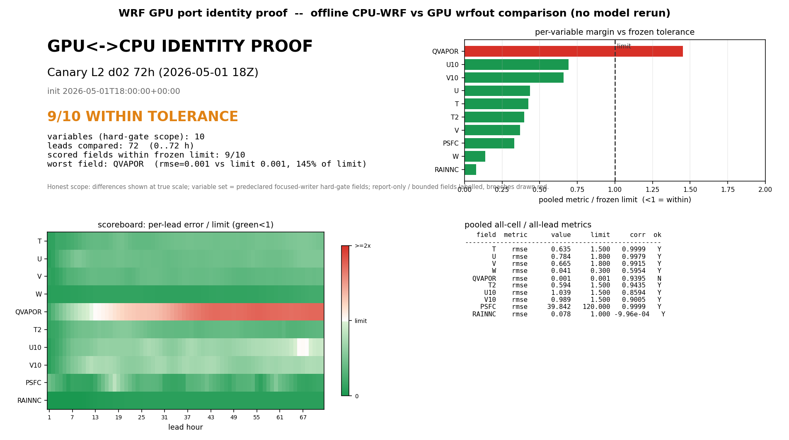

# wrf_gpu

A GPU-native, WRF-compatible regional NWP system. It runs a standalone WRF v4
ARW forecast end-to-end on a single GPU, reads a standard WRF `namelist.input`,
and writes a WRF-compatible `wrfout` history file.

This is not a port of legacy WRF source. It is a clean JAX rewrite that targets
the GPU memory hierarchy from day one and validates against WRF as an oracle
rather than inheriting WRF's architecture. The operational target is **Canary
Islands daily forecasting** (3 km then 1 km) on a single-workstation RTX 5090.

### WRF-v4 identity — a clean JAX GPU rewrite that reproduces WRF cell-for-cell

**v0.14 reproduces WRF v4 cell-for-cell over 72 h forecasts in two independent
regions.** A clean JAX GPU rewrite — not a Fortran-source port — closes two
**72 h GPU-vs-CPU-WRF field-parity gates** (**Switzerland d01** + **Canary L2
d02**), each stable to h72 with **9/10 prognostic fields within frozen
tolerance** and the full dynamics/thermodynamics core **cell-for-cell
identical** (`r ≈ 0.99–1.00`). The headline fix is the **Switzerland venting
root cause** — a `_THETA_LIMITER_MAX_K=500 K` masking clamp firing on real
~507 K stratospheric theta, removed by raising it to a non-load-bearing 1000 K —
on a memory-stable single-GPU stack. It is proven by a **reproducible, CPU-only
identity-proof system** (the two dashboards below).

**Performance is at parity with CPU-WRF — and is the focus of v0.15.** On the
final 72 h gates the GPU runs the same forecast at **~1.05× (Switzerland) /
~1.06× (Canary)** — i.e. **on par** with 28-rank CPU-WRF on the reference
RTX 5090 workstation. v0.14 is a **memory + WRF-identity release, not a
performance release**: completing the fully WRF-faithful dycore + physics
(v0.13/v0.14) raised per-step compute to parity, so the earlier, faster speedup
numbers — measured on an incomplete dycore — **no longer hold and are not
v0.14 claims.** **Performance recovery is the dedicated focus of v0.15.** No
multi-× speed and no per-kWh claim is made for v0.14 (roughly at energy parity
at the current wall-clock, pending an honest v0.15 re-measurement).

**The whole Earth at 1 km fits in a single rack (PROJECTED).** The global 1 km,
50-level atmospheric state — ~25 billion cells, ~4.3 TB (≈13 TB with solver
working memory) — fits in the HBM of one **NVIDIA GB300 NVL72**. This is exact
memory arithmetic; it is a **"where this is going" note, not a near-term
capability** — any global wall-clock estimate is **contingent on the v0.15
performance recovery and on real multi-GPU throughput, both of which are
unmeasured.**¹

<sub>¹ **Projected, not measured:** the memory figures are exact arithmetic
(168 B/cell × 50 levels × 510 M km² ≈ 4.3 TB; ×3.09 XLA peak ≈ 13 TB). The
single-node multi-GPU domain-decomposition path is **bit-identity-proven on a
CPU fake mesh only** (`shard_map` + `lax.ppermute` halo); **real multi-GPU
throughput is not yet shipped**, and a global wall-clock figure would also
require the v0.15 performance recovery. No global benchmark is claimed.</sub>

## Quickstart

A fresh clone → install → **standalone GPU forecast** → `wrfout` in four steps.
Full walk-through (prerequisites, troubleshooting, output): **[docs/quickstart.md](docs/quickstart.md)**.

```bash
# 1. Clone + install (CUDA 13 GPU build of JAX, then the package)
git clone https://github.com/wrf-gpu/wrf_gpu.git && cd wrf_gpu
python -m venv .venv && . .venv/bin/activate     # or: conda create -n wrfgpu python=3.11
pip install --upgrade "jax[cuda13]"              # nightly CUDA wheel is the fallback
pip install -e .
python -c "import jax; print(jax.devices())"     # should list a cuda device

# 2. Run a standalone forecast from a real-data case (wrfinput_* + wrfbdy_d01 + met_em, no CPU wrfout)
python -m gpuwrf.cli run \
    --input-dir   my_case \
    --output-dir  runs/my_forecast \
    --domain      d02 \
    --hours       24 \
    --scratch-dir /fast/nvme/gpuwrf_scratch

# 3. Read the WRF-compatible history file
ncdump -h runs/my_forecast/wrfout_d02_*
```

`run` **auto-detects** the input directory: a case with CPU-WRF `wrfout` history
→ replay mode; a case with only `real.exe` outputs → **standalone native-init
mode** (assembles `wrfinput`/`wrfbdy` and integrates on the GPU, **no CPU-WRF
dependency**). Bring your existing WRF `namelist.input` — the supported matrix
runs as-is; unsupported options fail closed with a named reason
([docs/namelist-compatibility.md](docs/namelist-compatibility.md)).

> **First run is slow on purpose.** JAX/XLA does a **~5-minute cold compile with
> no output before integration starts** — it is compiling, not hung. Every later
> run reads the cached executable and skips it.

## System requirements & resource profile

Measured on the reference RTX 5090 workstation. Full detail (sizing, energy,
cache override): **[docs/resource-profile.md](docs/resource-profile.md)**.

| Resource | What to expect |
|---|---|
| GPU / VRAM | NVIDIA GPU with **≥ 26 GiB free VRAM** for 3 km d02 at fp64 (RTX 5090 / 32 GiB reference). Peak **≈ 24.6 GiB** during d02 integration; the smaller d01 9 km standalone case peaks **≈ 4.7 GiB**. |
| Cold JIT compile | **≈ 4 min 55 s** on the **first** d02 run before integration begins (no output during compile). The **persistent on-disk JIT cache (on by default in v0.12.0)** turns later runs into a **~10 s cache read** — measured **cold ~147 s → cache-hit ~29 s** for the d01 hour-1 wrapper (compile + first execute). The cached executable is **bit-identical** to the cold one (zero numerics change). |
| Scratch | A **real (non-tmpfs) NVMe scratch dir**, a few GiB free. Set via `--scratch-dir` / `$GPUWRF_SCRATCH`. Do **not** use a RAM disk. |
| Warm throughput | **At parity with 28-rank CPU-WRF** on the reference workstation: the final 72 h GPU-vs-CPU gates ran **~1.05×** (Switzerland d01: GPU 2762 s vs CPU 2906 s) / **~1.06×** (Canary L2 d02: GPU ~8200 s vs CPU 8713 s), both fp64. Steady-state deep-kernel cost ~**173 ms/step** (~90% of wall on the d01 128×128×44 triage). v0.14 is a memory + WRF-identity release, **not** a performance release — completing the fully WRF-faithful dycore raised per-step compute to parity; **performance recovery is the dedicated focus of v0.15**. No multi-× speedup is claimed. See [docs/PERFORMANCE.md](docs/PERFORMANCE.md) for the measured breakdown. |
| Toolchain | CUDA 13 + a JAX CUDA build that sees the GPU. |

## Current status — v0.14.0

**v0.14.0 is a memory + WRF-identity release, not a performance release.** It pairs the v0.13.0 memory-stability work with a reproducible GPU↔CPU **identity-proof** system and closes two **72 h GPU-vs-CPU-WRF field-parity gates** on the final code — **Switzerland d01** and **Canary L2 d02** — each stable to h72 with **9/10 prognostic fields within frozen tolerance** and the full dynamics/thermodynamics core cell-for-cell identical. The headline v0.14 fix is the **Switzerland venting root cause**: a `_THETA_LIMITER_MAX_K=500 K` masking clamp that was firing on real ~507 K stratospheric theta (raised to a non-load-bearing 1000 K), plus **advance_w WRF-faithfulness** (`pg_buoy` carried-p, w-coriolis/curvature, open top), the **physics-`tendf` fold + 2D Smagorinsky** now applied on the default path, **h_diabatic** mass, the **RAINNC all-phase WRF-convention fix** (snow + graupel + ice were being dropped), and the **DZS/ZS** writer registration. Warm throughput is honestly **~1.05×** (Switzerland) / **~1.06×** (Canary) on par with CPU-WRF; performance is the dedicated focus of **v0.15**.

The one out-of-envelope field per region is a **bounded diagnostic, not an identity failure**: `RAINNC` precipitation sensitivity on Switzerland (**5.19 mm RMSE** vs a 1.0 mm bound, ≈0.78× the field's own 6.6 mm std) and the tight `QVAPOR` moisture margin on Canary (**1.45×10⁻³ kg/kg**, +45%); Canary also carries a localized **static `MUB`/`PB` nest-frame-seam base-state artifact** (Atlas max_abs 250.7 / 249.9). These four bounded misses are pre-existing/physical, match the class the accepted Canary gate and v0.11/v0.12 shipped with, and are carried to v0.15 as the "fix remaining deviations" lane — the frozen tolerance limits are **unchanged** (no goalpost moving).

### WRF-v4 identity proof — both regions, all cells, all 72 leads

The v0.14 identity-proof system renders a CPU-only, publication-quality visual proof that the GPU port is true to CPU-WRF v4 across **all grid cells, all 72 forecast leads, and all core internal variables**. Full method + reproduce commands: **[docs/IDENTITY_PROOF.md](docs/IDENTITY_PROOF.md)**.





Reproduce against any matching CPU/GPU `wrfout` pair (CPU-only, never touches the GPU):

```bash
taskset -c 0-3 python3 scripts/build_identity_proof_plots.py \
  --cpu-dir "$CPU_DIR" --gpu-dir "$GPU_DIR" \
  --domain d01 --init "2023-01-15T00:00:00+00:00" \
  --case-id switzerland_d01_72h --region-label "Switzerland d01 72h" \
  --tolerance-json proofs/v014/grid_delta_atlas/tolerance_manifest_candidate.json \
  --proof-dir proofs/v014/identity_proof/switzerland_d01 \
  --asset-dir docs/assets/v014/identity_proof/switzerland_d01
```

> **Honest framing — read this first.** wrf_gpu is a **WRF-compatible reimplementation** (a clean JAX rewrite validated against WRF as an oracle), **not a Fortran-source port**, and a **transparent research artifact, not a full WRF replacement.** v0.14 closes the 72 h field-parity gates on both regions and proves the dynamics/thermodynamics core cell-for-cell identical; the broader **24 h/72 h forecast-skill equivalence (T2/U10/V10) vs CPU-WRF is still the credibility gate and is NOT claimed closed.** It is a hard dynamics-`ph'` / MYNN / `*_tendf` GPU problem, and it is the dominant carry-over (KI-9 / KI-4 below). The v0.13.0 fidelity levers (moisture flux-advection into RK3, MYJ+Janjic, clear-sky diagnostics) remain available **off-by-default**.

The standalone path is **fp64-only** (no fp32 standalone path is reachable through the CLI; gated-fp32 is no faster on this memory-bound workload and remains an experimental ADR-007 preview).

The system performs **native real-init** (assembles `wrfinput`/`wrfbdy` from met_em-stage forcing, no `real.exe` and no CPU-WRF artifact for the initial/boundary state), runs a **nonhydrostatic split-explicit ARW dycore** on the GPU, exposes a **WRF-compatible namelist** with a **GPU-operational physics menu** and a **fail-closed boundary** on everything not yet ported. All of the v0.13.0 capability — the RRTMG VRAM-floor chunking, GWD-on-nested, GPU-validated compile-speed infra, MYJ+Janjic operational, moisture flux-advection into RK3, multi-GPU fake-mesh sharding — and the v0.12.0 capability — the standalone out-of-box CLI, standalone live-nested `--max-dom`, persistent JIT cache, fail-closed scheme catalog, WRF-faithful PSFC fix, runnable equivalence demo — and the v0.11.0 capability — live multi-domain nesting, full restart continuity, conservation-closed budgets, MYNN-EDMF, topographic/slope radiation, terrain-slope diffusion, Kain-Fritsch/BMJ/Tiedtke/Grell-Freitas cumulus — carries forward unchanged.

This is a deliberate step beyond v0.1.0, which was a single-domain **replay** path that consumed CPU-WRF/Gen2 artifacts for initialization. v0.3.0 added native metgrid; v0.4.0 added native real-init (proven equivalent to `real.exe` at t=0); v0.6.0 expanded the operational physics menu; v0.9.0 consolidated these into a standalone forecast system; v0.10.0 removed one faithful Thompson sedimentation inefficiency; v0.11.0 added live nesting, restart, conservation, MYNN-EDMF, topographic radiation, and slope diffusion; v0.12.0 turned the standalone native-init + live-nested path into a working out-of-box CLI with a persistent JIT cache, a fail-closed scheme catalog, the PSFC fix, and a runnable equivalence demo; v0.13.0 lifted the single-GPU VRAM ceiling (RRTMG chunking), turned GWD on by default on the nested 1 km path, re-landed the GPU-validated compile-speed infra, and hardened validation/reproducibility; **v0.14.0 root-causes the Switzerland venting (a stratospheric-theta masking clamp), lands advance_w WRF-faithfulness + the physics-`tendf` fold + 2D Smagorinsky on the default path, fixes RAINNC all-phase accumulation + DZS/ZS writer registration, and closes 72 h GPU-vs-CPU-WRF field-parity gates on Switzerland d01 and Canary L2 d02 with a reproducible identity-proof system.**

> **Scope boundary for v0.14.0.** This release ships the memory-stability + identity-proof work and the two 72 h field-parity gates above. The broader **24 h/72 h forecast-skill equivalence (T2/U10/V10) vs CPU-WRF (KI-9)**, the four **bounded misses** (RAINNC precip sensitivity, Canary MUB/PB nest-frame-seam base state, QVAPOR moisture margin), the **performance recovery** (warm ~1.05× → v0.15 focus), **2-way nesting equivalence (KI-11)**, **multi-hardware reproduction**, and the **Tier-3 scheme long-tail** are deferred to **v0.15+** — deliberate scope boundaries, not hidden gaps. The full list is in the [Honest boundaries](#honest-boundaries--what-v0140-does-not-claim) section and [docs/KNOWN_ISSUES.md](docs/KNOWN_ISSUES.md).

> **Honesty note.** Two distinct claims are kept separate throughout this README and must not be conflated:
> 1. **Native init** is proven equivalent to `real.exe` at t=0 (savepoint parity) and produces a stable forecast.
> 2. The **coupled skill validation** vs CPU-WRF on d02 and on the nested d01→d02→d03 hierarchy is run through the **replay harness** (parent-history replay, which consumes a CPU-WRF `wrfout` for the boundary/skill comparison). The validated coupled-skill runs are *not* from-scratch native-init runs. The standalone AIFS e2e (native real-init → forecast, no CPU-WRF) is proven stable for a 6 h smoke window on a distinct case.

> **Equivalence-demo honesty (the credibility gate, NOT closed).** The runnable, self-serve GPU-vs-CPU-WRF equivalence demo (`scripts/equivalence_demo.py`) carries forward from v0.12.0. On the default 24 h d02 case its verdict is **`NOT_EQUIVALENT`**: short-lead fields track CPU-WRF within tolerance, but by 24 h the run diverges, **dominated by the wind field** (3D V pooled RMSE 8.13 m s⁻¹ vs a 1.8 m s⁻¹ bar). The WRF-faithful PSFC fix dropped PSFC pooled RMSE from 707.8 → 415.3 Pa (closing the systematic diagnostic offset); the **residual PSFC excess is driven by that same wind/mass divergence**, not a diagnostic bug — **neither PSFC nor the winds are equivalent at 24 h**. **v0.13.0 ships off-by-default fidelity levers toward this gap (moisture flux-advection into RK3, MYJ+Janjic, clear-sky diagnostics) but does NOT close it** — closing it is hard dynamics-`ph'`/MYNN/`*_tendf` GPU work with no cheap knob. This is the honest current state, reported as-is; full numbers and framing in [docs/equivalence-demo.md](docs/equivalence-demo.md), tracked as KI-9.

> **Statistical honesty.** Operational equivalence to CPU-WRF is characterised as mean RMSE within operational bars on a single representative MAM case and a single season. Formal TOST equivalence at the ADR-029 predeclared tight margins (T2 ±0.215 K, U10 ±0.231 m/s, V10 ±0.275 m/s) is **underpowered** at the corpus size available; the GPU scoring path was unblocked in v0.13.0 (the v0.12.0 powered-TOST `rc=2` root-caused and fixed; scoring proven `rc=0` on a real GPU `wrfout` vs CPU-WRF). **v0.14 did not run a powered n=15 TOST** — v0.14 is a memory + WRF-identity release whose headline evidence is the two 72 h GPU-vs-CPU-WRF field-parity gates, not a station-RMSE equivalence campaign. **No "TOST PASS" / "statistically-proven equivalence" is claimed** (n=15 underpowered; n≈27 for full power); the powered campaign stays deferred (KI-5).

### Scope at a glance — implemented / fail-closed / out-of-scope

A high-level summary of what runs, what is recognized-but-refused (loudly,
before any compute), and what is a deliberate boundary. The full per-scheme
support table is **[docs/namelist-compatibility.md](docs/namelist-compatibility.md)**;
open issues are in **[docs/KNOWN_ISSUES.md](docs/KNOWN_ISSUES.md)**.

| Area | Implemented (runs) | Fail-closed (recognized, refused with a named reason) | Out-of-scope / roadmap boundary |
|---|---|---|---|
| **Init** | Native real-init (`wrfinput`/`wrfbdy` from met_em, no `real.exe`); WRF restart | — | — |
| **Dynamics** | Nonhydrostatic ARW, RK3 + split-explicit acoustic, flux-form advection, constant-K (`diff_opt=2`/`km_opt=1`) + 2-D Smagorinsky (`diff_opt=1`/`km_opt=4`) horizontal diffusion | 3-D TKE / full Smagorinsky closures (`km_opt=2/3/5`) → use `km_opt=1` or `4` | Moving/global nests; adaptive Δt |
| **Microphysics** | Kessler, Lin, WSM3/5/6, Thompson, Morrison, WDM6 | Aerosol-coupled (Thompson-aerosol mp=28, Morrison-aerosol mp=40), NSSL | WRF-Chem |
| **PBL / sfc** | YSU, MYNN-EDMF, ACM2, BouLac, **MYJ (v0.13.0)**; MYNN-SL, revised-MM5, Pleim-Xiu, **Janjic-Eta (v0.13.0)** sfclay | — | — |
| **Cumulus** | Kain-Fritsch, BMJ, Tiedtke (requires active flux-form moisture advection for RQVFTEN), Grell-Freitas (scale-aware) | New-Tiedtke | — |
| **Radiation** | RRTMG SW + LW with topographic shading + slope correction; Dudhia SW + classic RRTM LW (`ra_lw=1`, v0.13.0 skeptic-hardened); clear-sky `…C` flux diagnostics (v0.13.0, opt-in) | — | — |
| **Land** | Noah classic, Noah-MP (prognostic) | — | Full Noah-MP snow-layer diagnostics in wrfout (KI-3) |
| **Nesting** | One-way live d01→d02→d03, per-domain subcycling, restart; GWD (`gwd_opt=1`) default-on on nested (v0.13.0) | — | Two-way feedback + radiation/​w-relax in loop — finite/stable but 24 h equivalence vs CPU-WRF untested (KI-11) |
| **Output** | Focused 104-variable `wrfout` (core met/spatial/vertical/soil + radiation-flux + Noah-MP snow-layer) | — | Full 375-variable wrfout; auxhist streams (KI-3) |
| **Multi-GPU** | `shard_map` + `lax.ppermute` halo sharding (v0.13.0), single-GPU default = zero overhead | — | Real multi-GPU throughput (needs DGX/NVLink; fake-mesh bit-identical only, not yet throughput-validated) |
| **Data assim.** | Lateral-BC relaxation | — | DFI, FDDA, grid/obs/spectral nudging |
| **Other** | — | — | Urban (BEP/BEM), lake, aerosol-coupled MP, WRF-Chem (rejected, not roadmap) |

These are **boundaries and a roadmap, not hidden gaps**: every unsupported
namelist selection is rejected before any compute with a specific named reason —
the port never silently substitutes or skips a scheme. The honestly-prioritized
delta-to-complete-WRF ledger is in the [Roadmap](#roadmap--delta-to-a-complete-wrf-v4-port-post-v0110) below.

### What wrf_gpu is — GPU-operational capability (cumulative through v0.14.0)

**GPU-operational physics menu (scan-wired into the operational forecast loop, WRF-oracle-gated).** These are the schemes the operational scan actually dispatches; the exact wiring is in [`src/gpuwrf/runtime/operational_mode.py`](src/gpuwrf/runtime/operational_mode.py) (`_SCAN_WIRED_OPTIONS`) and [`src/gpuwrf/coupling/scan_adapters.py`](src/gpuwrf/coupling/scan_adapters.py); the namelist-accepted matrix is in [`src/gpuwrf/contracts/physics_registry.py`](src/gpuwrf/contracts/physics_registry.py).

| Family | Namelist key | GPU-operational options (scan-wired) |
|---|---|---|
| Microphysics | `mp_physics` | 1 Kessler, 2 Purdue-Lin, 3 WSM3, 4 WSM5, 6 WSM6, 8 Thompson, 10 Morrison, 16 WDM6 |
| PBL | `bl_pbl_physics` | 1 YSU, **2 MYJ (v0.13.0: jit/vmap rewrite, oracle PASS, mandatory Janjic pairing)**, **5 MYNN-EDMF** (v0.11.0: DMP mass flux + cloud-aware moisture/thermodynamics, WRF defaults `bl_mynn_edmf=1`/`bl_mynn_edmf_mom=1`), 7 ACM2, 8 BouLac |
| Surface layer | `sf_sfclay_physics` | 1 revised-MM5, **2 Janjic-Eta (v0.13.0, paired with MYJ)**, 5 MYNN-SL, 7 Pleim-Xiu |
| Cumulus | `cu_physics` | **1 Kain-Fritsch** (v0.11.0: column/savepoint parity PASS; d01 parent now has faithful KF), 2 BMJ (fp64), 3 Grell-Freitas (scale-aware), 6 Tiedtke (requires active flux-form moisture advection for RQVFTEN) |
| Radiation | `ra_sw_physics` / `ra_lw_physics` | RRTMG SW + LW (`=4`) with topographic shading (`topo_shading=1`) + slope-corrected surface radiation (`slope_rad=1`); **Dudhia SW (`ra_sw=1`) + classic RRTM LW (`ra_lw=1`)** (v0.12.0 wired, **v0.13.0 LW skeptic-hardened**); **clear-sky `…C` flux diagnostics (v0.13.0, opt-in)** |
| Land surface | `sf_surface_physics` | 2 Noah classic (explicit static/land bundle), 4 Noah-MP (`use_noahmp=True`) |
| Diffusion | `diff_opt`, `km_opt` | constant-K and 2-D Smagorinsky; **v0.11.0: terrain-slope + map-factor deformation terms now included** (WRF formula parity, max residual `3.78e-15`) |
| GWD | `gwd_opt` | **1 gravity-wave drag — v0.13.0: default-ON on the nested 1 km path** (`GPUWRF_GWD_NESTED=0` forces off); the RRTMG VRAM chunking lifted the v0.12.0 nested-OOM |
| Advection | `moist_adv_opt`, `scalar_adv_opt` | **v0.13.0: moisture flux-advection into RK3 + PD/monotonic moisture limiter** (both opt-in, default-off = byte-identical) |

`mp_physics=0` (passive vapor), `bl_pbl_physics=0`, `sf_sfclay_physics=0`, `cu_physics=0`, and `ra_*=0` are accepted as "disabled" slots.

**Parity-proven but fail-closed (recognized, loudly rejected if selected operationally).** These schemes pass per-scheme savepoint parity against an unmodified-WRF oracle but are **not** scan-wired into the GPU operational loop. Selecting one does **not** silently fall back or silently skip — it raises a specific, named error before any compute (`UnsupportedSchemeSelection` / `UnsupportedNamelistOption`):

- **New-Tiedtke cumulus** (`cu_physics=16`) — interface-compatible/accepted but not separately source-gated by a distinct WRF path; carried to v0.14+.

(v0.13.0 promoted **MYJ PBL + Janjic-Eta sfclay** from this fail-closed list to operational; **Dudhia SW + classic RRTM LW** were wired operational in v0.12.0 and the LW kernel was independently skeptic-audited + hardened in v0.13.0.)

**WRF-compatible namelist + fail-closed behavior.** The port reads WRF-exact namelist names and integer codes (`mp_physics`, `cu_physics`, `bl_pbl_physics`, `sf_sfclay_physics`, `sf_surface_physics`, `ra_lw`, `ra_sw`, `diff_opt`, `km_opt`, `dyn_opt`, …) from the case's `namelist.input` on the `python -m gpuwrf.cli run` path. Option validation is **fail-closed before any compute** and reports one of three honest outcomes ([`src/gpuwrf/io/namelist_check.py`](src/gpuwrf/io/namelist_check.py)):

- **implemented** — accepted and operationally wired;
- **recognized-WRF-not-yet-implemented** — a real WRF v4 scheme the port names but does not yet wire (fail-closed, names the scheme);
- **invalid** — not a recognized WRF v4 option at all (fail-closed).

**Dynamics.** Nonhydrostatic ARW mass core, RK3 + split-explicit acoustic substepping, flux-form advection (h=5 / v=3), WRF `w_damping` + Rayleigh upper damping (`damp_opt=3`), monotonic 6th-order filter (`diff_6th_opt=2`), constant-K diffusion (`diff_opt=2`/`km_opt=1`), and the WRF real-data-default 2-D Smagorinsky path (`diff_opt=1`/`km_opt=4`) — **v0.11.0: terrain-slope and map-factor deformation terms added to all diffusion paths**. Idealized gates (Skamarock warm bubble, Straka density current) pass 6/6 against published references + pristine WRF v4.7.1 ground truth; the operational dycore is finite/stable over full d02/d03 forecasts. Full dycore record: [`proofs/f7/DYCORE_STATUS.md`](proofs/f7/DYCORE_STATUS.md).

**Standalone out-of-box CLI (v0.12.0 new).** `python -m gpuwrf.cli run` now runs a real-data case end-to-end **with no CPU-WRF `wrfout` dependency**. It **auto-detects** the input directory: a case with CPU-WRF history → replay mode; a case with only `real.exe` outputs (`wrfinput_<domain>` + `wrfbdy_d01` + met_em) → **standalone native-init mode**, which assembles `wrfinput`/`wrfbdy` and integrates on the GPU. A standalone d01 9 km 2 h run is proven `PIPELINE_GREEN` / all-finite (`proofs/v0120/standalone_native_init_smoke.json`). This release also fixes the production AIFS-pull crash that previously broke the standalone pipeline: a JAX `donate` input-aliasing bug (closed at two layers) plus a disk-scratch fix so scratch is never placed on `/tmp` tmpfs.

**Standalone live-nested `--max-dom` (v0.12.0 new).** `--max-dom N` runs a standalone **live-nested** forecast (d01→d02→d03, down to the 1 km nest) from `real.exe` outputs alone — the parent advances, builds each child's lateral boundary **live**, and recurses, with **no CPU-WRF `wrfout` and no pre-supplied `wrfbdy_d02`**. It runs on the validated v0.11.0 live-nesting device runtime (`runtime/domain_tree.run_operational_domain_tree`). A standalone d01→d02 2 h run is proven `PIPELINE_GREEN` with both domains finite (`proofs/v0120/standalone_nest_smoke.json`). `--max-dom` defaults to 1 (single-domain replay/standalone); nested is explicit opt-in.

**Persistent JIT cache (v0.12.0 new).** A persistent on-disk XLA compilation cache (`src/gpuwrf/runtime/compile_cache.py`) is **on by default**. It turns the multi-minute cold compile into a ~10 s disk read on every later run: measured **cold ~147 s → cache-hit ~29 s** for the d01 hour-1 wrapper. The cached executable is keyed by HLO + backend + flags and is **bit-for-bit identical** to the cold one — **zero numerics change**. After a `jax`/`jaxlib` upgrade the key changes and the first run pays one cold compile again (stale entries are ignored, never wrong). Provenance: [docs/PERFORMANCE.md](docs/PERFORMANCE.md), `proofs/perf/v0120_standalone_bench.json`.

**Fail-closed scheme catalog + validator (v0.12.0 new).** A scheme catalog + namelist validator rejects every unsupported namelist option **before any compute** with a specific named reason — the port never silently substitutes or skips a scheme. The three honest outcomes are *implemented* / *recognized-WRF-not-yet-implemented* / *invalid* (see below).

**RRTMG VRAM-floor chunking + column tiling — the v0.13.0 keystone (numerically inert).** A three-part reduction of the dominant fp64 VRAM consumer: **g-point band-tiling** of the SW two-stream/g-point reduction and the LW `rtrnmc` band loop via `lax.scan` over the band axis (`proofs/v013/gpoint_chunk_rrtmg.json`), **taumol/optics construction chunking** so per-band gas optical depths are built one tile at a time (`proofs/v013/optics_taumol_chunk.json`), and **leading-column tiling** so the radiation driver never materializes the largest g-point temporary for every column at once (`proofs/v013/rrtmg_column_tile.json`, `proofs/v013/rrtmg_column_tile_vram_suite.json`). Combined peak VRAM at production depth (nlev 48 / ncol 24576): **SW 16730 → 1906 MiB (−88.6 %)**, **LW 17854 → 10068 MiB (−43.6 %)**; the deep nlev 64 / ncol 49152 case (the GWD-nested-1km OOM family) **previously OOM'd and now fits**. The large-column GPU suite shows the final tiling cap directly: LW untiled OOM on a 32.11 GiB allocation, LW tiled peak 5374.84 MiB; SW untiled 10033.1 MiB, SW tiled 1619.54 MiB. **Bit-identical** across all tested chunk/tile widths (`max_rel = 0.0`), all-sky and clear-sky; energy-closure invariant 3.6×10⁻¹⁵. Public API + defaults unchanged. This is the headroom that unblocked GWD on the nested path and removed the target-grid radiation memory blocker.

**GWD operational coupling default-on on the nested path (v0.13.0 new).** With the chunked RRTMG temporary, the **24 h nested 1 km + GWD** run that OOM'd at step 0 / hr 7 in v0.12.0 now fits and runs clean: `PIPELINE_GREEN`, 24/24 `wrfout` per domain, all fields finite at +24 h (d03 T2 ∈ [279.6, 300.9] K), forecast-only ≈ 1.86 h (`proofs/v013/gwd_nested_24h_gate.json`). `gwd_opt=1` is **honoured by default**; `GPUWRF_GWD_NESTED=0` forces it off. Completion + finiteness gate on the prod-failing case, **not** a skill-vs-truth claim.

**Compile-speed infra re-landed + GPU-validated (v0.13.0 new).** AOT precompile (`src/gpuwrf/runtime/aot_precompile.py`) + a persistent XLA autotune cache + compile-cache hardening. The v0.12.0 GPU-abort (the XLA autotune-flag injection that forced the v0.12.0 revert) is **fixed**: real-GPU import is clean (no 3 s abort, `XLA_FLAGS=None`), and a subprocess flag-probe **drops** unsupported flags instead of aborting. The persistent autotune cache is **opt-in, default-off** (`GPUWRF_XLA_AUTOTUNE_CACHE`); its measured warm-cache *effect* stays gated/unadvertised until measured on the integrated GPU smoke. CPU cold→warm cache-hit speedup ~4.5× on the representative graph; 22 tests. Proof: `proofs/v0130/compile_speed.json`.

**Moisture flux-advection into the RK3 large step (v0.13.0 new, opt-in).** Condensates (`qv`/`qc`/`qr`/`qi`/`qs`/`qg`) can now be flux-advected by the resolved wind in the RK3 large step via `moist_adv_opt` — closing the gap where condensates previously had **zero resolved-wind advection** (moisture moved only through the physics boundary). **Default `moist_adv_opt=0` is byte-identical** (production unchanged); the opt-in path is conservation-closed (8.2×10⁻¹⁶), WRF-parity bit-exact (1.7×10⁻¹⁶), and leaves the idealized gates unchanged (`proofs/v013/moisture_advection_wiring.json`). A fidelity lever toward the KI-9 skill-closure gap, shipped off-by-default; cadence refinements tracked as KI-10.

**MYJ PBL + Janjic-Eta surface layer operational (v0.13.0 new).** `bl_pbl_physics=2` + its mandatory partner `sf_sfclay_physics=2` are scan-wired via a jit/vmap-traceable MYJ rewrite + `vmap` Janjic + State adapters (TKE coupling faithful via `qke` carry). Oracle PASS vs v0.6.0 pristine-WRF savepoints (worst PBL 2.7×10⁻¹¹ / SFC 1.6×10⁻¹⁰, 6 regimes, not a self-compare; `proofs/v013/myj_janjic_oracle.json`). Default suite byte-unchanged; the MYJ↔Janjic pairing is fail-closed. Per-scheme parity only — end-to-end coupled-RMSE vs CPU-WRF is a carry-over.

**Multi-GPU `shard_map` domain decomposition — fake-mesh bit-identical (v0.13.0 new).** `shard_map` + `lax.ppermute` periodic-ring halo shards the 5th-order advection and 6th-order diffusion stencils; partition-invariance is **bit-identical** (P = 2/4/8 == P = 1, max abs diff 0.0) on a CPU fake mesh of up to 8 devices (`proofs/v013/multigpu_fakemesh.json`). **HONEST:** this workstation has one physical RTX 5090 — **real multi-GPU throughput, NVLink/NCCL bandwidth, and collective overlap are UNMEASURED**; the per-watt / whole-Earth claims stay **PROJECTED, never MEASURED**. Default-off, 27 tests.

**Clear-sky radiation diagnostics (v0.13.0 new, opt-in).** The 8 `…C` flux vars (`SWUPTC/SWDNTC/SWUPBC/SWDNBC/LWUPTC/LWDNTC/LWUPBC/LWDNBC`, TOA + surface, up + down) via a WRF-faithful second clear-sky RT stream built on the g-point band-tiling. Oracle PASS vs pristine-CPU-WRF d03 `…C` (not a self-compare); all-sky byte-unchanged; default-off (`with_clear_sky`); proof `proofs/v013/clearsky_radiation.json`.

**Outsider-runnable reproducibility + community-standard validation (v0.13.0 new).** `scripts/verify_reproducibility.sh` is GREEN 11/11 outsider-runnable on CPU-only (45 proof runners sanitized of hard-coded paths → repo-root resolvers + `WRF_PRISTINE_ROOT`; Thompson assets vendored + pinned); `scripts/community_validation.sh` re-runs the community-standard tests an external NWP reviewer expects (published idealized dycore benchmarks, closed-domain conservation budgets, bitwise `wrfrst` restart) — all PASS with an honest gap list. Docs: [docs/REPRODUCIBILITY.md](docs/REPRODUCIBILITY.md), [docs/VALIDATION.md](docs/VALIDATION.md).

**WRF-faithful PSFC fix (v0.12.0 new).** The surface-pressure diagnostic now uses the WRF-faithful `PSFC = p8w(kts)` extrapolation from the total-geopotential faces (per `module_surface_driver.F` / `module_big_step_utilities_em.F`) rather than the old `p0`-based value. This closes a systematic ~29 Pa diagnostic offset in the internal surface-pressure definition (proof: `proofs/v0120/psfc_extrapolation_proof.json`, bias 328 → −29 Pa). On the equivalence demo it dropped PSFC pooled RMSE from 707.8 → 415.3 Pa; the residual is now driven by the lead-time wind/mass divergence, not a diagnostic offset (see [docs/equivalence-demo.md](docs/equivalence-demo.md)).

**Live multi-domain nesting (v0.11.0).** The `domain_tree` runtime (`src/gpuwrf/runtime/domain_tree.py`) drives d01→d02→d03 one-way live nesting with per-domain subcycling, WRF-faithful boundary update cadence, multi-domain synchronized output, and an optional two-way feedback gate (`src/gpuwrf/coupling/boundary_feedback.py`, disabled by default). A full nested d01→d02→d03 24 h one-way forecast over the Canary 9/3/1 km hierarchy ran finite and stable with final-lead T2 RMSE vs CPU-WRF of 1.03 K (d02) and 1.10 K (d03) — single case (20260521), one season; the RMSE numbers are from the final lead (h=24), not averages over all leads. Mean T2 RMSE over all 24 leads was 1.31 K (d02) and 1.67 K (d03). These numbers characterize the nesting fidelity on a representative case; no ensemble or TOST equivalence is claimed. Two-way feedback is implemented and unit-proven but has not been enabled in a long live forecast proof.

**WRF restart (v0.11.0).** `io/wrfrst_netcdf.py` writes and reads WRF-compatible `wrfrst` files covering all 75 prognostic/carry fields. Restart continuity is bit-identical: a-path (1..2N) vs b1-path (1..N) + b2-path restart (N..2N) produce identical final states on all 75 fields (`proofs/v0110/restart_continuity.json`).

**Conservation budgets closed (v0.11.0).** Dry-mass, total-water, and moist-static-energy relative residuals are 0.0 (fp64) on the validated d02 case (`proofs/v0110/conservation_budgets_closed.json`). Physics state deltas (u, v, w, theta + non-dry) are applied **post-dycore** via the v0.9.0-cadence post-dynamics update. (A v0.11.0 attempt to route the aggregate dry-physics delta through `rk_addtend_dry` as RK-stage tendencies was found to degrade d02 surface winds and is **disabled**; a proper WRF `*_tendf` source-tendency adapter is deferred to v0.14+ — it is also the lever for the KI-9 skill-closure work.) Budget closure is **path-independent** — re-confirmed 0.0 on the fixed code.

**Optional multi-GPU/DGX sharding (v0.11.0, single-GPU default = zero overhead).** `runtime/sharding.py` + `dynamics/sharded_horizontal.py` implement domain decomposition over a mesh of GPU devices. With `ShardingConfig.disabled()` (the production default), all sharding code is behind early-return guards — the committed proof shows 56/56 State field SHA-256 hashes bit-identical between the reference (single-GPU) and the sharding-disabled DGX-d2 path (`proofs/v0110/dgx_default_bitident_s3.md`, `proofs/v0110/dgx_d2_status.md`). The sharding path itself is verified on a fake-mesh (CPU-multi-device) and requires a DGX or NVLink cluster for real multi-GPU throughput.

**Recompile fix (v0.11.0).** `jit(_advance_chunk)` now compiles once and is reused on every subsequent chunk: chunks 2-3 run at 65.7 ms/step (18s/chunk), no per-chunk recompile (`proofs/v0110/recompile_fix2_3chunks.json`). The root cause was a non-JAX-contract-compliant `tree_unflatten` in `State` and `DycoreMetrics`.

**Operational precision.** v0.13.0 ships **fp64 as the operational mode**, and the standalone CLI path is **fp64-only**: the production daily-pipeline case builder and the standalone operational namelist both force `force_fp64=True` ([`src/gpuwrf/integration/daily_pipeline.py`](src/gpuwrf/integration/daily_pipeline.py)). ADR-007 gated-fp32 is retained only as an **experimental performance preview** and is **not** a v0.13.0 release path — no fp32 standalone speed number is reported because none is reachable through the CLI. It remains negative / no-go on the committed kernel evidence because the current workload is launch-tax / memory-bandwidth bound, not arithmetic-throughput-bound: the committed roofline measured fp32 at ~1.00x over fp64.

### Validation (v0.14.0)

Proof objects live under [`proofs/v014/`](proofs/v014/) (v0.14.0-specific: identity proof + grid-delta atlas), [`proofs/v013/`](proofs/v013/) and [`proofs/v0130/`](proofs/v0130/) (carried v0.13.0 evidence), [`proofs/v0120/`](proofs/v0120/) (carried v0.12.0 evidence), [`proofs/v0110/`](proofs/v0110/) (carried v0.11.0 evidence), and the previous baseline proofs under [`proofs/v090/`](proofs/v090/) and [`proofs/v0100/`](proofs/v0100/).

**v0.14.0 new evidence:**

- **Switzerland d01 72 h field-parity gate (GPU).** Stable to h72; **9/10 prognostic fields within frozen tolerance**, dynamics/thermo/mass all green. The one Grid-Delta Atlas hard-gate miss is **RAINNC rmse 5.19 mm vs the 1.0 mm bound** (bounded precip sensitivity, ≈0.78× the field's std 6.6 mm; the RAINNC all-phase WRF-convention bug is FIXED; DZS/ZS now PASS). Run `v014_switzerland_d01_72h_FINAL_20260612T062354Z` vs CPU truth `v014_switzerland_72h_cpu_20260610T122909Z`; GPU ~2762 s vs CPU 2906 s ≈ 1.05×, peak VRAM ~19.8 GiB.
- **Canary L2 d02 72 h field-parity gate (GPU).** Stable to h72; operational verdict **L2_D02_GREEN** (bounds + rmse + pipeline PASS); **9/10 prognostic fields within frozen tolerance**. The v0.14 default-on changes (open-top, 2D Smagorinsky, physics-`tendf` fold, theta-ceiling 1000 K) do not regress Canary. Three bounded Atlas misses: **MUB max_abs 250.7 + PB max_abs 249.9** (static nest-frame-seam base-state artifact, localized) and **QVAPOR rmse 1.45×10⁻³ vs 1.0×10⁻³ kg/kg** (+45%). Run `v014_canary_d02_72h_FINAL_20260612T062354Z` vs CPU truth `20260501_18z_l2_72h_20260519T173026Z`; GPU ~8200 s vs CPU 8713 s ≈ 1.06×, peak VRAM ~20.3 GiB.
- **GPU↔CPU identity-proof system (CPU-only, reproducible).** Per-variable RMSE/bias time series with the frozen tolerance line, variable×lead scoreboard, 1:1 cell scatter, signed spatial-difference maps, and a README-embeddable dashboard — over all cells, all 72 leads, all core variables, for both regions. `r ≈ 0.99–1.00` cell-for-cell on the prognostic core. Reproduce via `scripts/build_identity_proof_plots.py` (`docs/IDENTITY_PROOF.md`), assets under `docs/assets/v014/identity_proof/`.
- **Switzerland venting root cause + fix.** The d01 strong-flow mass venting was a `_THETA_LIMITER_MAX_K=500 K` masking clamp firing on real ~507 K stratospheric theta; raised to a non-load-bearing 1000 K, with advance_w WRF-faithfulness (`pg_buoy` carried-p, w-coriolis/curvature, open top), the physics-`tendf` fold + 2D Smagorinsky on the default path, and `h_diabatic` mass.

**Carried v0.13.0 evidence (CPU-reproducible unless noted):**

- **RRTMG VRAM chunking — bit-inert + peak-VRAM (the keystone).** SW −88.6 % / LW −43.6 % at production depth; deep nlev 64 OOM-then-fits; bit-identical across all chunk widths (`max_rel = 0.0`), energy-closure 3.6×10⁻¹⁵. Proofs: `proofs/v013/gpoint_chunk_rrtmg.json`, `proofs/v013/optics_taumol_chunk.json`.
- **GWD on the nested 1 km path (GPU).** 24 h nested 1 km + GWD: `PIPELINE_GREEN`, 24/24 `wrfout` per domain, all-finite at +24 h, ≈ 1.86 h (`proofs/v013/gwd_nested_24h_gate.json`). Default-on; completion + finiteness gate, not a skill claim.
- **Compile-speed re-land — GPU-validated.** Clean real-GPU import (no v0.12.0 abort, `XLA_FLAGS=None`, autotune opted-in=False); CPU cold→warm cache-hit ~4.5× on the representative graph; 22 tests (`proofs/v0130/compile_speed.json`). The autotune-cache *effect* on GPU is gated until measured.
- **Moisture flux-advection into RK3 (opt-in).** Default `moist_adv_opt=0` byte-identical; conservation 8.2×10⁻¹⁶, WRF-parity 1.7×10⁻¹⁶, idealized unchanged (`proofs/v013/moisture_advection_wiring.json`).
- **MYJ + Janjic operational.** Oracle PASS vs v0.6.0 pristine-WRF savepoints (worst PBL 2.7×10⁻¹¹ / SFC 1.6×10⁻¹⁰, not a self-compare); 101 tests (`proofs/v013/myj_janjic_oracle.json`).
- **Multi-GPU `shard_map` fake-mesh.** Partition-invariance bit-identical (P = 2/4/8 == P = 1, max abs diff 0.0); real throughput HW-deferred (`proofs/v013/multigpu_fakemesh.json`).
- **Clear-sky radiation diagnostics.** 8 `…C` vars oracle PASS vs pristine-CPU-WRF d03 (not a self-compare); all-sky byte-unchanged (`proofs/v013/clearsky_radiation.json`).
- **PD/monotonic moisture advection.** Per-species positivity + conservation ~10⁻¹⁷–10⁻¹⁸; default-off byte-identical (`proofs/v013/pd_moisture.json`).
- **TOST scoring path unblocked (rc=2 fix).** Root-caused + fixed; scoring proven `rc=0` on real GPU `wrfout` vs CPU-WRF, 7 tests (`proofs/v013/tost_rc2_fix.json`, `proofs/v013/tost_scoring_path_cpu_proof.json`). v0.14 did not run a powered n=15 TOST (the 72 h field-parity gates above are the v0.14 evidence); the campaign stays deferred (KI-5). No TOST PASS is claimed.
- **Outsider-runnable reproducibility + community-standard validation.** `scripts/verify_reproducibility.sh` GREEN 11/11 (CPU); `scripts/community_validation.sh` (idealized dycore, conservation budgets, bitwise restart) all PASS. Docs: [docs/REPRODUCIBILITY.md](docs/REPRODUCIBILITY.md), [docs/VALIDATION.md](docs/VALIDATION.md).

**Carried v0.12.0 / v0.11.0 evidence:**

- **Standalone native-init CLI (v0.12.0).** `python -m gpuwrf.cli run --input-dir <case>` runs a standalone d01 9 km forecast from `wrfinput`+`wrfbdy` (no CPU-WRF `wrfout`): `PIPELINE_GREEN`, all 56 fields finite, scratch off `/tmp`, no donate crash (`proofs/v0120/standalone_native_init_smoke.json`). This is a 2 h smoke confirming the out-of-box path works; it is not a 24 h skill claim.
- **Standalone live-nested CLI (v0.12.0).** `--max-dom 2` runs a standalone d01→d02 live-nested forecast from `real.exe` outputs alone (no CPU-WRF `wrfout`, no pre-supplied `wrfbdy_d02`): `PIPELINE_GREEN`, both domains finite, child boundaries built live (`proofs/v0120/standalone_nest_smoke.json`). 2 h smoke. The **24 h standalone nested 1 km** gate now passes on the production AIFS case (`--max-dom 3`, d01→d02→d03, no CPU-WRF `wrfout`): `PIPELINE_GREEN`, **24/24 `wrfout` per domain, all fields finite at +24 h** (d03 T2 ∈ [279.6, 300.9] K; U10/V10/PSFC/RAINNC finite), forecast-only ≈ 2.0 h (`proofs/v0120/nested_24h_1km_gate_FINAL.json`). This is a completion + finiteness gate on the prod-failing case, **not** a skill-vs-truth claim. **v0.13.0 update: GWD operational coupling is now default-ON on this nested path** — the 24 h nested 1 km + GWD run that OOM'd at ~sim-hr 7 in v0.12.0 now fits after the RRTMG VRAM chunking (`proofs/v013/gwd_nested_24h_gate.json`).
- **Runnable GPU-vs-CPU equivalence demo (v0.12.0).** `scripts/equivalence_demo.py` runs the GPU port and compares it field-by-field, grid-point-by-grid-point, hour-by-hour against a retained CPU-WRF `wrfout` under the **same** ICs/LBCs (validated replay path), emitting a verdict against predeclared per-field pooled-RMSE tolerances. On the default 24 h d02 case the verdict is **`NOT_EQUIVALENT`** (6 of 10 fields exceed tolerance): T2, RAINNC, W, QVAPOR PASS; U10/V10/PSFC/T/U/V exceed, **dominated by lead-time wind divergence** (3D V pooled RMSE 8.13 m s⁻¹). The WRF-faithful PSFC fix dropped PSFC pooled RMSE 707.8 → 415.3 Pa; the residual is dynamical, not diagnostic. Full numbers and honest framing: [docs/equivalence-demo.md](docs/equivalence-demo.md), proof `proofs/v0120/equivalence_demo_20260509_d02_FINAL.json`. This is honest cross-implementation evidence with a documented exceedance, not an equivalence claim.
- **Persistent JIT cache (v0.12.0).** Cold ~147 s → cache-hit ~29 s hour-1 wrapper on d01; the cached executable is bit-identical to the cold one. Provenance: [docs/PERFORMANCE.md](docs/PERFORMANCE.md), `proofs/perf/v0120_standalone_bench.json`.
- **Native real-init equivalence.** Native `wrfinput`/`wrfbdy` assembly is savepoint-parity-proven equivalent to `real.exe` at t=0 (v0.4.0; one-cell categorical-LSM residual documented). Native metgrid passed its gate at v0.3.0. This removes the CPU-WRF dependency for the initial/boundary state.
- **Per-scheme savepoint parity.** Each GPU-operational scheme (including v0.11.0 additions: KF cumulus, MYNN-EDMF mass flux, RRTMG topographic/slope radiation, terrain-slope diffusion) passes an fp64 math-faithfulness gate vs an unmodified-WRF oracle, under `proofs/`.
- **Coupled vs CPU-WRF, d02 (3 km).** Combined-physics GPU forecast (replay harness, radiation-ON) vs 28-rank CPU-WRF v4.7.1 `wrfout`, 24 h, one representative MAM case (`20260507_18z`). **Finite and stable all 24 h, no blow-up** (proof [`proofs/v0110/wind_regression_recovery/baseline/d02_coupled_skill.json`](proofs/v0110/wind_regression_recovery/baseline/d02_coupled_skill.json)). Per-lead RMSE vs CPU-WRF truth: **T2 within bar (3.0 K) at 24/24 leads** (mean 1.11 K, final 1.25 K); **V10 within bar (7.5 m/s) at 24/24 leads** (mean 3.59 m/s, final 4.33 m/s); **U10 within bar at 23/24 leads** (mean 4.43 m/s, final 8.06 m/s) — the final lead (h+24) transiently exceeds the 7.5 m/s bar (8.06 m/s), the same pre-existing episodic westerly under-prediction pattern as v0.9.0. **Beats persistence on 23/24 leads.** This is the **operational equivalence evidence** (single case, single season); no TOST or ensemble equivalence is claimed. The machine proof `status` is `FAIL` solely because the all-leads-within-bar predicate trips on that one final lead.
- **Coupled vs CPU-WRF, nested d01→d02→d03 (9/3/1 km), 24 h one-way.** Full nested hierarchy ran finite and stable on case `20260521_18z` with live parent-produced boundary packages. Final-lead (h=24) T2 RMSE vs CPU-WRF: d02 1.03 K / d03 1.10 K. Mean T2 RMSE over 24 leads: d02 1.31 K / d03 1.67 K. All fields finite on all domains at all leads. Single case, single season; no ensemble or TOST equivalence is claimed. Two-way feedback disabled in this proof. Proof: [`proofs/v0110/nesting_24h_v0110.json`](proofs/v0110/nesting_24h_v0110.json), [`proofs/v0110/val_nest24h.md`](proofs/v0110/val_nest24h.md) (merged to trunk).
- **d03 1 km steep-terrain stability (KI-1 RESOLVED).** The prior open issue (gated-fp32 qke non-finite at h+1 over Tenerife steep terrain) is **closed** in v0.11.0 by the WRF-faithful qke cold-start seed (background TKE profile per `module_bl_mynnedmf.F:618-691 mym_initialize`) and the MYNN qke IEEE fmax/fmin fix. The d03 Tenerife replay ran **24 h finite in gated-fp32** with final-lead T2 RMSE 1.61 K (within 3.0 K bar), U10 5.13 m/s, V10 6.63 m/s (both within 7.5 m/s bar). **Requirement:** initial state must carry a WRF-faithful qke cold-start seed; a wrfinput with zero or near-zero qke may still trigger the edge. Proof: [`proofs/v0110/d031km_v0110.json`](proofs/v0110/d031km_v0110.json), [`proofs/v0110/val_d031km.md`](proofs/v0110/val_d031km.md) (merged to trunk).
- **Conservation budgets closed (KI-conservation CLOSED).** Dry-mass, total-water, and moist-static-energy relative budget residuals are **0.0** (fp64) on the validated d02 case (`proofs/v0110/conservation_budgets_closed.json`). Physics state deltas are applied post-dycore (the v0.9.0 cadence); the v0.11.0 `rk_addtend_dry` dry-tendency bridge was found to degrade surface winds and is disabled (proper WRF `*_tendf` adapter → v0.14+). Conservation unit tests (2/2 PASS) and analytical argument confirm budget closure is **path-independent** — it holds (0.0) on the fixed code (re-proven, commit `b20abb5`).
- **Restart bit-identity.** A-path vs B1+B2 (restart at midpoint): 75/75 fields bit-identical (`proofs/v0110/restart_continuity.json`).
- **DGX single-GPU-default bit-identity.** With `ShardingConfig.disabled()` (the production default): 56/56 State field SHA-256 hashes bit-identical between the reference trunk and the DGX-d2 sharding-disabled path.
- **Powered TOST equivalence (n=15).** The MAM corpus is prepared (forcing retained, CPU-WRF references assembled). **v0.13.0 unblocked the GPU scoring path** — the v0.12.0 `daily_pipeline` / `run_one_case` `rc=2` that blocked the campaign was root-caused (two conflated sources) and **fixed**; the scoring path is proven `rc=0` on a real GPU `wrfout` vs CPU-WRF (`SCORING_PATH_RC0_PROVEN`, 7 tests; `proofs/v013/tost_rc2_fix.json`, `proofs/v013/tost_scoring_path_cpu_proof.json`). **v0.14 did not run a powered n=15 TOST** — v0.14 is a memory + WRF-identity release whose headline evidence is the two 72 h GPU-vs-CPU-WRF field-parity gates, not a station-RMSE equivalence campaign; the powered campaign stays **deferred (KI-5)**. **n=15 is honestly underpowered** (n≈27 needed to detect a 10% RMSE difference at α=0.05, β=0.20). The **operational equivalence evidence remains the d02 coupled-skill result above** plus the runnable equivalence demo (whose 24 h verdict is `NOT_EQUIVALENT`). **No "TOST PASS" / "statistical equivalence" is claimed.** Margins + power analysis: [`.agent/decisions/ADR-029-STATISTICS-DESIGN-TOST.md`](.agent/decisions/ADR-029-STATISTICS-DESIGN-TOST.md).
- **End-to-end wall-clock — at parity with CPU-WRF (v0.14 measured).** The two final 72 h GPU-vs-CPU gates ran **Switzerland ~1.05×** (GPU 2762 s vs CPU 2906 s) and **Canary ~1.06×** (GPU ~8200 s vs CPU 8713 s) — i.e. **on par** with 28-rank CPU-WRF on the same RTX 5090 workstation, both fp64. The v0.14 perf-triage (`proofs/perf/v014_perf_regression_triage.json`) breaks this down as **~90% genuine deep-kernel steady-state** (~173 ms/step on d01 128×128×44), **~7% per-hour host overhead** (finite-summary state pulls + wrfout write + boundary rewindow), and **~2.3% compile**. This is a real regression from earlier versions: those faster numbers were measured on an **incomplete/faster dycore**, and completing the fully WRF-faithful dycore + physics raised per-step compute to parity — a multi-× warm-kernel ratio is mathematically incompatible with this ~1.05× end-to-end, so the earlier 5×/2.5×/4.26× figures are **superseded and are not v0.14 claims**. Performance recovery (the fp64-operational-state ADR is the flagged highest-leverage lever) is the dedicated focus of **v0.15**. Full breakdown: [docs/PERFORMANCE.md](docs/PERFORMANCE.md).

**Standalone AIFS end-to-end (native init, no CPU-WRF dependency).** The full native pipeline (AIFS met_em → `build_real_init` → native LBC → `run_forecast_operational_segmented` → wrfout) ran stable and finite for 6 h on case `20260428_18z` (`proofs/v0110/standalone_e2e`). This confirms the native-init path is operational. No 24 h or RMSE claim is made from this 6 h smoke.

### Honest boundaries — what v0.14.0 does NOT claim

- **Not a universal WRF v4.** Standard regional ARW configs only. Exotic/rare features are README-TODO and fail-closed.
- **Not the full physics catalog.** WRF v4 has roughly 24 microphysics, 12 PBL, many surface-layer/LSM/cumulus/radiation options; v0.14.0 covers the common operational subset above. Everything else fails closed with a named reason.
- **24 h forecast-skill equivalence is NOT closed — the credibility gate.** On the runnable equivalence demo (24 h d02), the verdict is `NOT_EQUIVALENT`: 6 of 10 fields exceed the predeclared tolerance, **dominated by lead-time wind divergence** (3D V pooled RMSE 8.13 m s⁻¹ vs a 1.8 m s⁻¹ bar). Short-lead fields track CPU-WRF within tolerance; PSFC is improved (707.8 → 415.3 Pa) but still out of bar, with its residual driven by that same dynamical divergence. **Neither the winds nor PSFC are equivalent at 24 h.** v0.13.0 ships off-by-default fidelity levers toward this gap (moisture flux-advection into RK3, MYJ+Janjic, clear-sky diagnostics) but does **not** close it — it is hard dynamics-`ph'`/MYNN/`*_tendf` GPU work with no cheap knob. This is the gate for any "operational / replacement" claim. See [docs/equivalence-demo.md](docs/equivalence-demo.md) (KI-9).
- **72 h field-parity gates pass with four bounded misses — full forecast-skill equivalence is not claimed.** Both v0.14 72 h GPU-vs-CPU-WRF gates close with **9/10 prognostic fields within frozen tolerance** and the dynamics/thermo core cell-for-cell identical, but each region has one out-of-envelope **bounded** diagnostic — Switzerland `RAINNC` 5.19 mm vs the 1.0 mm bound, Canary `QVAPOR` 1.45×10⁻³ vs 1.0×10⁻³ kg/kg — and Canary additionally carries a localized static `MUB`/`PB` nest-frame-seam base-state artifact (Atlas max_abs 250.7 / 249.9). These four bounded misses are pre-existing/physical, **not** identity failures; the frozen limits are unchanged and the misses are carried to v0.15. The standalone native-init/live-nested CLI proofs remain **2 h smokes** and the standalone AIFS e2e a **6 h smoke**; the standalone nested **24 h 1 km** gate passes (`PIPELINE_GREEN`, all-finite, GWD-on).
- **Not full two-way nesting.** One-way live nesting is proven over a 24 h window. The two-way feedback path is finite/stable but its 24 h real-GPU equivalence vs CPU-WRF is **untested** (KI-11); nested in-loop `w` relaxation is off.
- **Multi-GPU throughput unmeasured.** The `shard_map` + `lax.ppermute` halo sharding is bit-identical on a CPU fake mesh, but this workstation has one physical RTX 5090 — real multi-GPU throughput / NVLink-NCCL bandwidth / collective overlap are **UNMEASURED**; the per-watt / whole-Earth claims stay **PROJECTED**.
- **Compile-speed autotune-cache effect not yet measured.** The infra is GPU-validated (clean import, no abort); the persistent autotune cache is opt-in/default-off and its cold→warm *effect* on GPU is gated/unadvertised until measured.
- **Moisture flux-advection + clear-sky diagnostics are opt-in, not operational defaults.** They are wired and proven (default-off, byte-identical when off); operationalizing them — with the cadence refinements (KI-10) — is a v0.15+ item.
- **Performance is not the v0.14 story.** Warm throughput is honestly **~1.05×** (Switzerland) / **~1.06×** (Canary) on par with 28-rank CPU-WRF; v0.14 is a memory + WRF-identity release, and performance recovery is the dedicated focus of **v0.15**.
- **fp64-only standalone.** The standalone CLI path forces pure fp64; there is no fp32 standalone path (gated-fp32 is an experimental ADR-007 preview and is no faster on this memory-bound workload).
- **Not DFI / FDDA / spectral-nudging / adaptive-Δt** (fixed Δt only), **not aerosol-coupled microphysics** (Thompson-aerosol `mp=28`/Morrison-aerosol `mp=40`/NSSL fail closed), and **not urban (BEP/BEM) / lake / WRF-Chem / WRF-Fire / WRF-Hydro** (these are rejected, not roadmap).
- **Free-running limited-area (run_boundary=False) on wide domains.** Free-running without lateral-boundary relaxation on wide domains (nx≈160+) can go unstable beyond ~14 h. The validated operational path uses boundary forcing. See [`docs/KNOWN_ISSUES.md`](docs/KNOWN_ISSUES.md).
- **RRTMG intermediate gas optical depth (`taug`) in 4 UV bands.** The top-layer convention differs from the WRF oracle fixture in 4 UV bands (bands 9, 10, 12, 13). Integrated flux outputs pass tier-1 (< 0.05% rel); this is a pre-existing, isolated oracle-fixture discrepancy. Carried to v0.14+ (KI-6). See [`docs/KNOWN_ISSUES.md`](docs/KNOWN_ISSUES.md).
- **Known bounded residual (U10).** U10 final-lead RMSE (h+24) is 8.06 m/s vs the 7.5 m/s operational bar on the validated d02 coupled-skill case — the same pre-existing episodic evening-peak westerly under-prediction as v0.9.0 (tied to KI-9). T2 and V10 are within bar at all leads; U10 beats persistence on 23/24 leads.
- **No powered n=15 TOST PASS.** v0.13.0 unblocked the scoring path (rc=2 fixed, `rc=0` proven); v0.14 did not run the powered campaign (the 72 h field-parity gates are the v0.14 evidence). No TOST PASS is claimed; deferred (KI-5).
- **v0.2.0 paper tag not yet released.** The stable paper-baseline intended at v0.2.0 was never formally tagged. All prior releases (v0.1.0 and up) remain accessible in the git history and in the org repo; v0.2.0 stays accessible for paper claims.

**Deliberately deferred to v0.15+ (deliberate scope boundaries, not silent gaps):**

- **24 h/72 h forecast-skill closure (T2/U10/V10) vs CPU-WRF** (KI-9) — the credibility gate; v0.14 closes the 72 h field-parity gates but not the broader skill-equivalence campaign. Hard dynamics-`ph'`/MYNN/`*_tendf` GPU work, no cheap knob.
- **The four bounded misses** — RAINNC precip sensitivity (Switzerland), Canary MUB/PB nest-frame-seam base state, QVAPOR moisture margin — carried as the v0.15 "fix remaining deviations" lane; frozen limits unchanged.
- **Performance recovery (warm ~1.05×)** — the dedicated focus of v0.15.
- **Moisture-advection cadence refinements** (KI-10) — acoustic-accumulated fluxes + WRF-cadence-exact physics-tendency folding; then operationalize moisture advection on the default path.
- **Two-way nesting 24 h real-GPU equivalence vs CPU-WRF** (KI-11) — only finite/stable proven.
- **Tier-2 speed/architecture remainder** — sub-jit split + recompile hygiene, parallel-compile + dev `--fast-compile`, CPU-flock for idle nightly cores.
- **Multi-hardware / independent reproduction** — v0.14.0 is one RTX 5090, one JAX/CUDA stack.
- **New-Tiedtke cumulus scan-wiring** — recognized/accepted but not separately source-gated; fail-closed if selected.
- **fp32 standalone path** — gated-fp32 operational mode (ADR-007), pending evidence it helps on this workload.
- **Full 375-variable `wrfout`** (KI-3), **RRTMG SW `taug` UV-band fix** (KI-6), and the **`*_tendf` source-tendency adapter** for RK-stage physics.
- **Tier-3 scheme long-tail** — ~22 microphysics, ~10 cumulus, ~8 PBL, ~12 radiation, ~4 surface-layer + ~6 LSM families; each opt-in / fail-closed until oracle-proven.

A code-grounded, prioritized inventory of the remaining gap to a complete WRF v4 replacement lives in [`docs/GPU_PORT_GAPS_TODO.md`](docs/GPU_PORT_GAPS_TODO.md), [`PROJECT_PLAN.md`](PROJECT_PLAN.md), and the full-port gap analysis under [`.agent/reviews/`](.agent/reviews/).

## Roadmap — delta to a complete WRF v4 port (post-v0.14.0)

Consolidated, honestly-prioritized ledger of everything still deferred / simplified / not-yet-faithful relative to official WRF v4, sorted by importance for an *optimal complete* port. Complexity: **S** ≈ 1–2 focused sprints · **M** ≈ 3–5 · **L** ≈ 5–10 · **XL** ≈ 10+. (v0.2.0→v0.13.0 already closed native real-init, prognostic Noah-MP, the terrain/map-factor core, the GPU-operational scheme set — Thompson, MYNN-EDMF/YSU/ACM2/**MYJ** PBL, MYNN/**Janjic** sfclay, Grell-Freitas + Kain-Fritsch cumulus, Noah-MP, RRTMG topo/slope + Dudhia-SW/RRTM-LW + clear-sky diagnostics, terrain-slope diffusion, live nesting, restart, conservation budgets, the standalone out-of-box CLI + live-nested `--max-dom` + persistent JIT cache + fail-closed scheme catalog + PSFC fix + runnable equivalence demo, the **RRTMG VRAM-floor chunking + GWD-on-nested + compile-speed re-land + moisture flux-advection into RK3 + multi-GPU fake-mesh sharding** added in v0.13.0. The dominant open item is the **24 h forecast-skill closure (KI-9)** — see [`PROJECT_PLAN.md`](PROJECT_PLAN.md) and `.agent/decisions/V0130-ROADMAP.md` for the v0.14+ Tier-3 scheme long-tail toward v1.0.0.)

| # | Item — delta vs official WRF v4 | Cmplx | Detail |
|---|---|---|---|
| **Tier 1 — blocks a complete standalone WRF v4 replacement** | | | |
| 1 | **Full multi-domain nested equivalence** — 24 h one-way is proven; two-way feedback + radiation-in-loop + in-loop w relaxation + 5-domain long-run equivalence remain carry-overs (2-way 24 h real-GPU equivalence untested = KI-11). | L | GPU_PORT_GAPS P0-1; KI-11 |
| 2 | **Full `wrfout` variable coverage** — focused 104-variable writer vs WRF's 375 (missing: stochastic-seed arrays + less-common diagnostics). Blocks downstream tools. | M | GPU_PORT_GAPS P0-5; KNOWN_ISSUES KI-3 |
| **Tier 2 — physics fidelity (faithful to the pinned Canary suite)** | | | |
| 3 | **MYNN PBL completeness** — EDMF mass flux wired; `icloud_bl=1` cloud PDF (`bl_mynn_cloudpdf=2`) and `cloudmix` (`bl_mynn_cloudmix=1`) partial. Tied to the residual near-surface wind-skill gap. | M | GPU_PORT_GAPS P1-4 |
| 4 | **Thompson microphysics parity debts** — snow fall-speed approx, cloud-water sedimentation, invalid-column fallback. | M | GPU_PORT_GAPS P1-5 |
| 5 | **Moisture advection into RK3 + cadence fidelity** — v0.13.0 wired moisture flux-advection into RK3 + PD/monotonic moisture limiter (both opt-in, default-off); cadence refinements (acoustic-accumulated fluxes + WRF-cadence physics-tendency folding) + operationalizing on the default path remain (KI-10). | M | GPU_PORT_GAPS P1-6; KI-10 |
| 6 | **RRTMG SW taug top-layer convention fix** — 4 UV bands fail intermediate oracle comparison; tier-1 flux outputs faithful; pre-existing. | S | KNOWN_ISSUES KI-6 |
| **Tier 3 — correctness / robustness debts** | | | |
| 7 | **Free-running open-lateral-boundary stability** — wide domains (nx≈160+) can blow up without boundary relaxation beyond ~14 h. Operational path is stable with forcing. | M | KNOWN_ISSUES KI-7 |
| 8 | **U10 episodic under-prediction** — final-lead breach on the validated d02 case (tied to MYNN cloud PDF). | S–M | KNOWN_ISSUES KI-4 |
| 8b | **Lead-time wind divergence (equivalence demo)** — 24 h d02 `NOT_EQUIVALENT`, dominated by 3D V (pooled RMSE 8.13 m s⁻¹); residual PSFC excess driven by the same divergence. The dominant fidelity gap to true 24 h equivalence. | M | KNOWN_ISSUES KI-9; docs/equivalence-demo.md |
| **Tier 4 — statistical / release closure** | | | |
| 9 | **Powered n=15 TOST scoring** — corpus prepared, not yet scored (the paper's equivalence claim). | S–M | KNOWN_ISSUES KI-5; ADR-029 |
| 10 | **v0.2.0 stable paper-release tag** — intended stable baseline never formally tagged. | S | `V0.2.0-PLAN.md` |
| **Tier 5 — performance (optional)** | | | |
| 11 | **Hand-fused-kernel rewrite for 1.4–1.8×** — optional Pallas/Triton branch (~30% of project). | XL | [`.agent/reviews/2026-06-05-gpt-hand-fused-kernel-feasibility.md`](.agent/reviews/2026-06-05-gpt-hand-fused-kernel-feasibility.md) |
| 12 | **Real multi-GPU throughput** — sharding code committed and bit-identity proven on fake mesh; DGX/NVLink cluster required for real throughput benefit. | M | `contracts/halo.py` |
| **Tier 6 — breadth / general WRF coverage (beyond the Canary suite)** | | | |
| 13 | **Full physics scheme matrix** — alternate MP/PBL/CU/RA/LSM families beyond the wired set (recognized-but-fail-closed). | XL | GPU_PORT_GAPS P1-2 |
| 14 | **FDDA / grid+obs nudging / spectral nudging** — none (only lateral-BC relaxation). | M–XL | GPU_PORT_GAPS P1-1 |
| 15 | **Map-projection / grid generality** — Lambert/Mercator/Polar + hybrid-eta C-grid only; no moving/global nests. | M | GPU_PORT_GAPS P2-1 |
| 16 | **Full WRF namelist parsing + loud rejection** of unsupported options. | S–M | `io/namelist_check.py` |
| 17 | **Additional wrfout diagnostics / auxhist streams** (downstream-driven). | S–L | GPU_PORT_GAPS P2-3 |

**Critical path to a *complete* port:** items **1 → 2** are the standalone-replacement chain; **3 / 4 / 5** are the highest-value fidelity levers (where the remaining wind/T2 skill lives). The perf rewrite (11) and breadth (13–17) are real but lower-leverage than finishing the nest + the fidelity tier.

## Core goals (immutable)

1. **GPU-native architecture.** Whole-state device residency after init. No host/device transfers inside the timestep loop without an ADR. Fused timestep-scale kernels, not micro-kernel launch storms.
2. **Operational skill parity with CPU WRF v4** on Canary L2/L3 cases: 24–72 h RMSE on T2, U10, V10 statistically equivalent under TOST at predeclared operational margins on a seasonal ensemble (n=15 floor today; n≈27–30 is the powered target).
3. **Performance vs 28-rank CPU WRF** on the same workstation, re-certified after every correctness fix (no stale speedup claims). The headline is the honest command-to-finish wall-clock ratio; kernel-level ratios are reported separately, never as the headline.
4. **Validation against WRF, not bitwise reproducibility.** Tiered pyramid: micro fixture / savepoint parity → physical invariants → short-run / timestep convergence → station-RMSE TOST equivalence.
5. **Forkable and auditable.** Every claim has a proof object on disk. Every architecture decision has an ADR with cross-model review.

## Where to look first (in this order)

| When you want to… | Read |
|---|---|
| Install and run your first forecast | [`docs/quickstart.md`](docs/quickstart.md) |
| Size a machine (VRAM / compile / scratch / energy) | [`docs/resource-profile.md`](docs/resource-profile.md) |
| Know which namelist options run vs fail-closed | [`docs/namelist-compatibility.md`](docs/namelist-compatibility.md) |
| Understand the project scope | [`PROJECT_CONSTITUTION.md`](PROJECT_CONSTITUTION.md), [`PROJECT_SCOPE.md`](PROJECT_SCOPE.md), [`PROJECT_SPEC.md`](PROJECT_SPEC.md) |
| See the GPU-operational vs fail-closed physics matrix | [`src/gpuwrf/contracts/physics_registry.py`](src/gpuwrf/contracts/physics_registry.py), [`src/gpuwrf/runtime/operational_mode.py`](src/gpuwrf/runtime/operational_mode.py) (`_SCAN_WIRED_OPTIONS`) |
| Run a forecast | [`docs/quickstart.md`](docs/quickstart.md) — `python -m gpuwrf.cli run …` |
| Run long GPU validation / powered TOST reliably | [`docs/GPU_RUNBOOK.md`](docs/GPU_RUNBOOK.md) — `scripts/run_gpu_lowprio.sh`, `scripts/run_powered_tost_n15.sh` |
| Run & verify the GPU-vs-CPU equivalence demo | [`docs/equivalence-demo.md`](docs/equivalence-demo.md) — `scripts/equivalence_demo.py` |
| Understand the v0.14 performance (~1.05× parity + triage breakdown) | [`docs/PERFORMANCE.md`](docs/PERFORMANCE.md), [`proofs/perf/v014_perf_regression_triage.json`](proofs/perf/v014_perf_regression_triage.json) |
| Check current known issues | [`docs/KNOWN_ISSUES.md`](docs/KNOWN_ISSUES.md) |
| Reproduce the proof collection on CPU | [`docs/REPRODUCIBILITY.md`](docs/REPRODUCIBILITY.md) — `scripts/verify_reproducibility.sh` |
| Run the community-standard validation suite | [`docs/VALIDATION.md`](docs/VALIDATION.md) — `scripts/community_validation.sh` |
| See the v0.14.0 identity proof + 72 h gates | [`docs/IDENTITY_PROOF.md`](docs/IDENTITY_PROOF.md), [`proofs/v014/`](proofs/v014/), `docs/assets/v014/identity_proof/` |
| See v0.13.0 proof objects | [`proofs/v013/`](proofs/v013/), [`proofs/v0130/`](proofs/v0130/) |
| See prior release proofs | [`proofs/v0120/`](proofs/v0120/), [`proofs/v0110/`](proofs/v0110/), [`proofs/v090/`](proofs/v090/), [`proofs/v0100/`](proofs/v0100/) |
| See the full WRF v4 gap inventory | [`docs/GPU_PORT_GAPS_TODO.md`](docs/GPU_PORT_GAPS_TODO.md), [`PROJECT_PLAN.md`](PROJECT_PLAN.md) |
| See prior versions (v0.2.0, v0.9.0–v0.13.0) | Accessible via git tags `v0.2.0`, `v0.9.0`, `v0.10.0`, `v0.11.0`, `v0.12.0`, `v0.13.0` on the org repo; v0.2.0 is the stable paper-claims baseline |

## Run

The full out-of-box walk-through is **[docs/quickstart.md](docs/quickstart.md)**.
Short version:

```bash
# Standalone single-domain forecast (auto-detects native-init when there is no CPU wrfout):
python -m gpuwrf.cli run \
    --input-dir   my_case \
    --output-dir  runs/my_forecast \
    --domain      d02 \
    --hours       24 \
    --scratch-dir /fast/nvme/gpuwrf_scratch

# Standalone LIVE-NESTED forecast (d01->d02->d03, down to the 1 km nest):
#   --max-dom N is explicit opt-in; defaults to 1 (single-domain). The parent
#   builds each child's lateral boundary LIVE — no pre-supplied wrfbdy_d02.
python -m gpuwrf.cli run \
    --input-dir   my_case \
    --output-dir  runs/my_nested_forecast \
    --max-dom     3 \
    --hours       24 \
    --scratch-dir /fast/nvme/gpuwrf_scratch

# Validate a WRF namelist fail-closed (no GPU / no compile needed):
python -m gpuwrf.cli run --help

# Development check:
pytest -q
```

The first invocation pays a **~5-minute cold JIT compile** (d02) before
integration and uses **≈ 24.6 GiB VRAM** at fp64; the **persistent JIT cache
turns every later run into a ~10 s cache read** (bit-identical executable) — see
[docs/resource-profile.md](docs/resource-profile.md) and
[docs/PERFORMANCE.md](docs/PERFORMANCE.md).

For long GPU validation jobs, use the versioned run wrappers, not a helper under
`/tmp`:

```bash
scripts/run_gpu_lowprio.sh --cores 0-23 -- python -m gpuwrf.cli run ...
# Optional env: PYTHON selects the interpreter (defaults to python3 on PATH);
# GPUWRF_TOST_RUN_DIR sets a writable run root (defaults under the repo).
scripts/run_powered_tost_n15.sh --detach --resume
```

The full lock/log/resume procedure is in [docs/GPU_RUNBOOK.md](docs/GPU_RUNBOOK.md).

## Known issues (v0.14.0)

Full detail with symptom / ruled-out / workaround / follow-up in
**[docs/KNOWN_ISSUES.md](docs/KNOWN_ISSUES.md)**.

| ID | Summary | Severity |
|---|---|---|
| **v0.14 bounded misses** | Four bounded, pre-existing/physical diagnostics out of frozen envelope on the 72 h gates (limits unchanged): Switzerland **RAINNC** 5.19 mm vs 1.0 mm (precip sensitivity, ≈0.78× field std), Canary **QVAPOR** 1.45×10⁻³ vs 1.0×10⁻³ kg/kg (+45%), Canary static **MUB/PB** nest-frame-seam base state (Atlas max_abs 250.7 / 249.9). Carried to v0.15 as the "fix remaining deviations" lane. | Bounded acceptance |
| **KI-9** | **The credibility gate.** v0.14 closed both 72 h field-parity gates (dynamics/thermo core cell-for-cell identical), but the broader **24 h/72 h forecast-skill equivalence** is still open — equivalence demo 24 h d02 `NOT_EQUIVALENT`, dominated by **lead-time wind divergence** (3D V pooled RMSE 8.13 m/s). Hard dynamics-`ph'`/MYNN/`*_tendf` GPU work, no cheap knob. | Documented gap |
| **KI-4** | d02 **U10** episodic final-lead (h+24) under-prediction (8.06 m/s vs 7.5 m/s bar); within bar at all other leads, beats persistence 23/24. Tied to KI-9. | Documented residual |
| **KI-3** | Operational `wrfout` is a focused **104-variable** subset (vs WRF's 375). | Scope boundary |
| **KI-5** | Powered **n=15 TOST**: scoring path **unblocked** (rc=2 fixed); v0.14 did not run the powered campaign (the 72 h field-parity gates are the v0.14 evidence). **No TOST PASS is claimed**; deferred. | Scope boundary |
| **KI-6** | RRTMG SW intermediate `taug` top-layer convention differs in 4 UV bands; integrated fluxes pass tier-1 (< 0.05% rel). Pre-existing; carried to v0.14+. | Isolated |
| **KI-7** | Free-running (`run_boundary=False`) on **wide domains** (nx≈160+) can go unstable beyond ~14 h. Validated operational path uses boundary forcing. | Robustness edge |
| **KI-10** | **Moisture-advection cadence refinements** (opt-in moisture flux-advection shares the theta acoustic-cadence; physics-tendency folding not yet WRF-cadence-exact). Default-off → no shipped-behavior impact. | Fidelity refinement |
| **KI-11** | **2-way nesting equivalence vs CPU-WRF untested** (only finite/stable proven). | Scope boundary |

## Layout

```
.
├── PROJECT_CONSTITUTION.md          immutable end goal
├── ARCHITECTURE_PRINCIPLES.md       backend / runtime principles
├── VALIDATION_STRATEGY.md           four-tier validation pyramid
├── PRECISION_POLICY.md              FP64/FP32/BF16 rules
├── PERFORMANCE_TARGETS.md           profiler JSON schema + transfer rules
├── INTERFACE_CONTRACTS.md           GridSpec, State, Tendencies
├── RISK_REGISTER.md                 living risk list
├── docs/                            user-facing references
├── fixtures/                        manifest schemas + analytic samples + Canary slice
├── src/gpuwrf/                      implementation code
│   ├── contracts/                   frozen State / grid / physics_registry
│   ├── coupling/                    scan adapters + physics dispatch
│   ├── runtime/                     operational forecast loop
│   ├── physics/                     scheme kernels
│   ├── io/                          namelist check + wrfout/wrfinput I/O
│   └── integration/                 daily pipeline / native init
├── scripts/                         CLIs: check_*_done, validators
├── tests/                           pytest suite
├── proofs/                          per-milestone proof objects (JSON + reports)
└── docs/                            namelist compat · known issues · WRF v4 gap inventory
```
