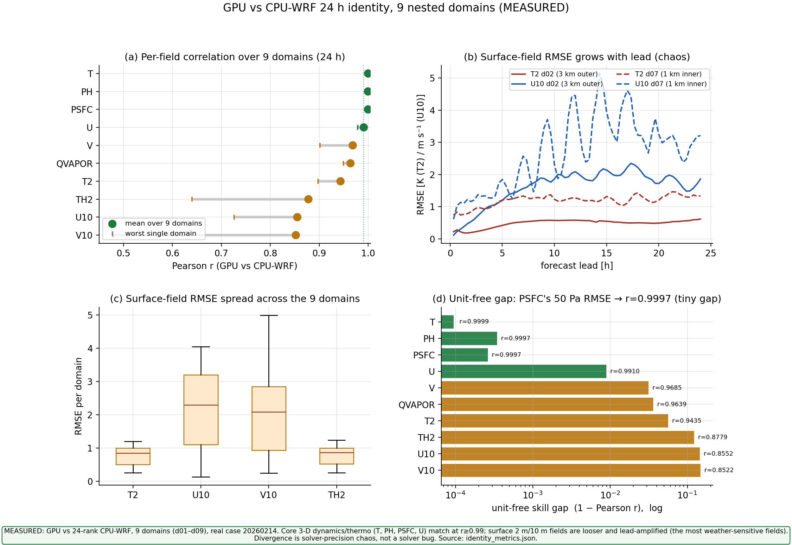
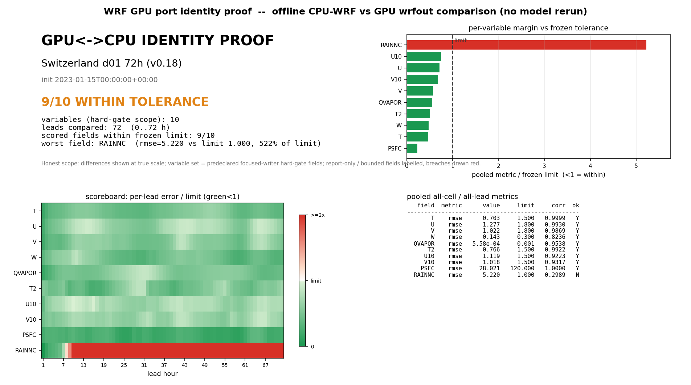
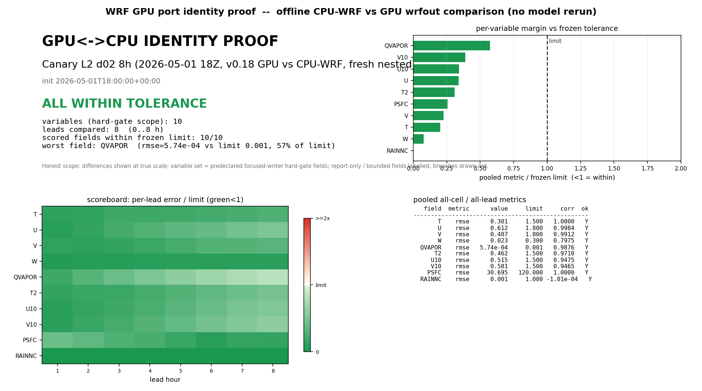
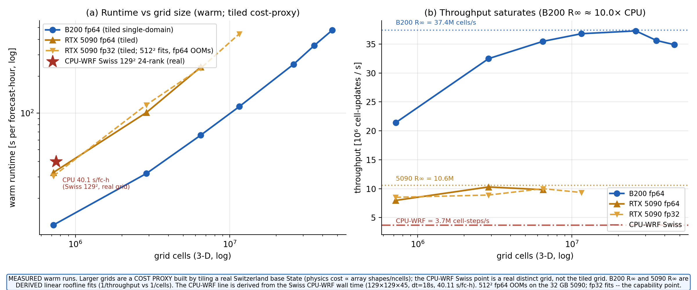
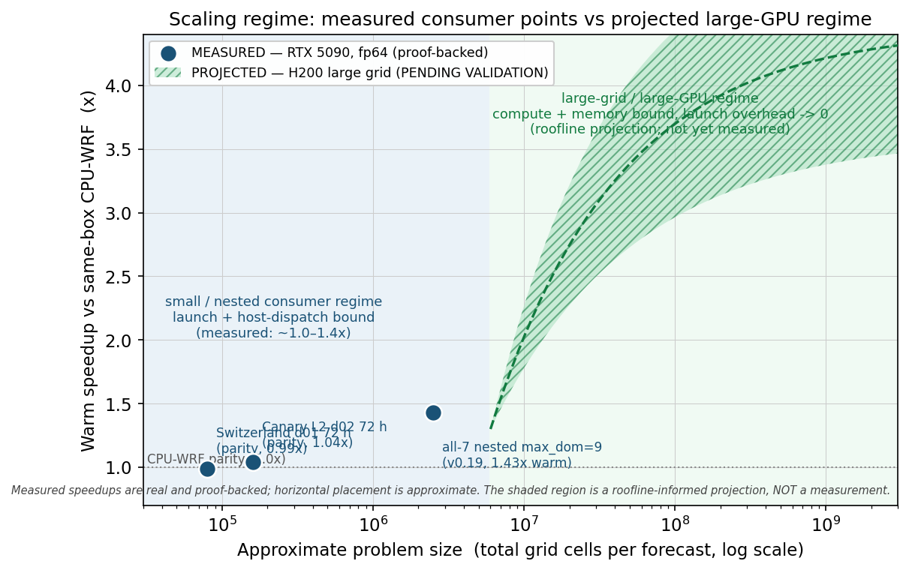
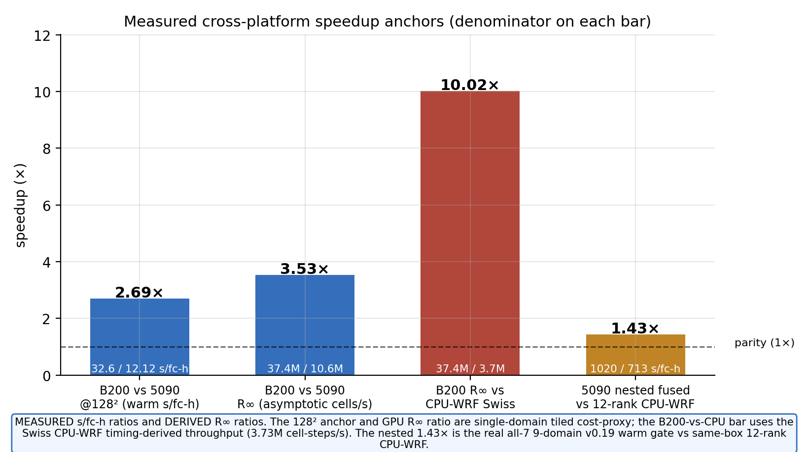
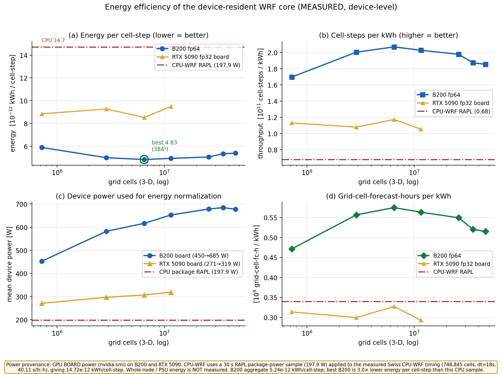
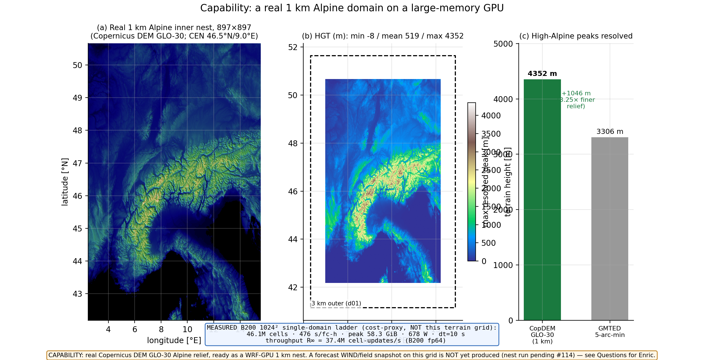

# wrf_gpu

**A GPU-native, WRF-compatible regional weather model.** `wrf_gpu` runs a
standalone WRF v4 ARW forecast end-to-end on a single GPU: it reads a standard
WRF `namelist.input`, assembles its own initial/boundary state from `met_em`
forcing (no `real.exe`, no CPU-WRF dependency), integrates a nonhydrostatic
split-explicit ARW dycore on the GPU, and writes a WRF-compatible `wrfout`
history file.

It is **not** a port of legacy WRF Fortran. It is a clean JAX rewrite that
targets the GPU memory hierarchy from day one and validates against WRF as an
**oracle** — proving cell-for-cell identity to CPU-WRF v4 rather than inheriting
WRF's architecture. The dynamical core runs in **fp64** (around the
pressure-gradient / buoyancy cancellation). The original operational target is
**Canary Islands daily forecasting** (3 km then 1 km) on a single-workstation
RTX 5090 — but its real strength is at the **opposite end of the spectrum: large
grids, big fp64-native GPU systems, and GPU clusters** (B200 / GB300 /
NVL72-class).

### What it is good for

- **Running real regional ARW forecasts on a GPU** from a standard WRF namelist —
  single-domain or live-nested (d01→d02→d03, down to the 1 km nest), with native
  init, restart, and a WRF-compatible `wrfout`.
- **Energy efficiency + modern-HPC fit (PROJECTED).** Past a certain level of
  parallelism, GPUs are inherently more energy-efficient per unit compute than
  CPUs. For serious/large workloads this rewrite is **projected** to run at
  **>3× the energy efficiency** of the CPU stack, to scale with GPU size, and to
  ride the trend of ever-faster, cheaper GPU compute — per kWh and per dollar.
  *(Projected from the device-bound kernel + architecture; not yet benchmarked at scale.)*
- **Capability the CPU stack cannot reach on one box.** **MEASURED:** a **1 km
  single domain fits one RTX 5090 bit-identically**, and the **all-7-island 1 km
  nested case runs end-to-end on one card**. **PROJECTED:** large single grids and
  **cluster / multi-GPU weak-scaling** — the throughput path (memory arithmetic +
  fake-mesh bit-identity proven; real multi-GPU throughput **not yet benchmarked**).
- **A transparent, forkable research artifact.** Every claim has a proof object on
  disk; every architecture decision has a cross-model-reviewed ADR. It is built to
  be driven and extended by an AI manager agent (see [Use the manager](#use-the-manager-agent-driven-development)).

### What it is NOT

- **Not a universal WRF v4.** It covers the common operational ARW subset
  (the wired physics menu below); every unsupported namelist option **fails closed
  before any compute** with a named reason — it never silently substitutes a scheme.
- **Not proven for full 24 h/72 h forecast-skill equivalence.** The
  dynamics/thermodynamics core is proven **cell-for-cell identical** to CPU-WRF;
  the broader T2/U10/V10 forecast-skill equivalence is the **open credibility gate**
  (see [Boundaries](#boundaries--what-is-not-claimed)).
- **Not a blanket single-card speedup story.** On tiny standalone geometries the
  GPU can still be launch/occupancy-bound — on a single-domain 129² grid it is
  **~2.3× SLOWER** than 24-rank CPU-WRF (host/launch-bound). The GPU advantage
  **grows with scale**: the v0.20.0 all-7-island 1 km nested fast path is
  **MEASURED ~1.07× faster than v0.19** and **~1.53× faster than the same-box
  12-rank CPU-WRF baseline**, byte-identical to v0.19 (1926/1926 vars,
  maxΔ=0). The broader value remains **capability** (1 km + scale), **fidelity**,
  **stability/reliability**, and **energy efficiency** (see [Performance](#performance)).
- **Not** DFI / FDDA / spectral-nudging / WRF-Chem / WRF-Fire / urban / lake.

**The current release is v0.21.0** — a **stability + compile-cache-speed**
release on top of the v0.20.x line. Its priority order is explicit: **stability >
identity > speed > memory**. The two headline changes are a **dycore
boundary-stability fix** (the all-7-island, 9-domain Canary nest now runs **finite
through the divergence window that previously failed near step 67**) and the **AOT
cheap-key cross-process warm-start** — after a one-time cold compile, a fresh
process **loads the compiled GPU executable from disk via a cheap metadata key and
skips the multi-tens-of-minutes re-lower** the old cache still paid. It also adds a
**default-on fail-fast finite guard** and a **version-keyed compile cache**.

**Read the scope of the speed win plainly.** v0.21.0 is faster at *getting a run
started* (compile / warm-start time), **not** at running the forecast itself. Warm
forecast throughput (seconds per forecast-hour) is **unchanged** from v0.20 and the
default path is **byte-identical** — the warm start rides the same fused runtime
executable, it just loads it from disk in seconds instead of re-lowering it. The
fp64 default carries forward unchanged; v0.21.0 adds **no new physics** and does
**not** claim the open 24–120 h forecast-skill gate is closed. The most-extreme
1 km Mont-Blanc (~1042 m/cell) terrain is **not** fully stabilized (the fix
*relocates* that failure rather than removing it) and is carried to v0.21.1. Full
notes: [`RELEASE_NOTES_v0.21.0.md`](RELEASE_NOTES_v0.21.0.md).

*[MEASURED: v0.21.0 — 3-domain fused+AOT cold→warm gate byte-identical (REF_COMPARE equal, max_abs_diff 0), 0 re-lower, no runtime regression; 9-nest fused stress re-confirm both fused phases `source=aot_blob`, 0 re-lower, all 9 domains finite past step 67 (warm peak host RSS 16.4 GB). De-fuse measured +18.8% s/step ⇒ reverted; not the default.]*

The rest of this section is the **v0.20.x capability narrative, carried forward**
as the context v0.21.0 builds on — it still applies where v0.21.0 does not
explicitly change it.

**v0.20.0 is a correctness, stability, capability, and reliability release.** It
is **bit-identical-safe by default** (the fp64 path is byte-for-byte unchanged)
and adds an honest, modest nest speedup, an opt-in fp32 capability mode, and a
compile cache that **just works across runs and across forecast dates**. On the
canonical all-7-island, 9-domain case the default fused nested path measures
**~668 s/forecast-hour warm** (range 645–680) on the reference GPU — **~1.07×
faster than v0.19** (713 s/forecast-hour) and **~1.53× faster than the 12-rank
CPU-WRF baseline** (1020 s/forecast-hour) — and is **byte-identical to v0.19
output (1926/1926 vars, maxΔ=0.000e+00)**, the gain coming entirely from a
numerics-free CUDA stream-ordered allocator. (v0.21.0 keeps this warm forecast
throughput unchanged.) v0.18 remains the feature-completeness baseline: every WRF
v4 namelist scheme is classified and handled, with no silent substitution or
skipped scheme. See the [Scheme
triage](#scheme-triage--every-wrf-v4-scheme-classified).

*[MEASURED: COMBINED_SPEEDUP.md §5/§7 — ~668 / 1.07× / 1.53× / 1926-byte-identical.]*

> ### First run is slow on purpose, then a seconds-fast warm start (new in v0.21.0)
> The first forecast **JIT-compiles the GPU kernels** — a one-time **cold compile
> with no output before integration starts**, scaling with grid size (roughly a
> few minutes for an ordinary single-domain case; the large all-7 9-domain nest is
> a separate, larger one-time compile of tens of minutes). It is compiling, not
> hung. **That cold compile is still a real one-time cost.**
>
> A **persistent, per-user on-disk JIT cache is on by default with zero config** —
> no flag, no setup — and in v0.21.0 it is **version-keyed** (`gpuwrf` + JAX/JAXLIB
> + backend), so a stale older-release cache is never mistaken for a warm one.
>
> **New in v0.21.0: a fresh process now warm-LOADS the compiled executable in
> seconds.** Previously, even with a warm cache, a new process had to *re-lower*
> (re-trace) the giant nested module — tens of minutes for the all-7 9-nest — just
> to look up the right cached executable. v0.21.0 serializes the compiled GPU
> executable to disk and indexes it by a **cheap metadata key computed without
> lowering**, so a fresh process **loads it directly and skips the re-lower**. It is
> **on by default on the fused runtime path**. MEASURED: the 9-nest fused stress
> re-confirm has both fused phases load `source=aot_blob` cross-process with **0
> re-lower** and all 9 domains finite (warm peak host RSS 16.4 GB); the 3-domain
> cold→warm gate is **byte-identical to the cold compile** (`REF_COMPARE` equal,
> max_abs_diff 0) with **no runtime regression**. A fresh load is numerically inert
> — the cheap key only *locates* the blob, and the loaded executable is byte-for-byte
> the cold one; a `GPUWRF_AOT_VERIFY=1` fail-closed backstop is available. The
> v0.20 single-domain warm-cache read was already fast (`cold ~147 s → cache-hit
> ~29 s` on the d01 hour-1 wrapper, bit-identical), and the cache also **hits across
> forecast dates** (a new or leap-year date is a warm hit with 0 new cache entries,
> default path bit-identical). Opt out of AOT with `GPUWRF_NESTED_AOT=0`; set
> `GPUWRF_BITWISE=1` or `GPUWRF_NESTED_FUSE=0` for the eager bitwise/debug path.
>
> *[MEASURED: v0.21.0 9-nest AOT cold→warm re-confirm — 9/9 phases `source=aot_blob`, 0 re-lower, all finite, RSS 16.4 GB; 3-domain fused+AOT gate byte-identical (max_abs_diff 0), no runtime regression. v0.20 cross-date: JULDAY_CACHE_FIX_REPORT.md — cross-date HLO sha identical across 3 dates incl. leap; 0 new cache entries; 64/64 byte-identical.]*

> ### Optional fp32 mixed-precision mode (capability + VRAM, opt-in)
>
> v0.20.0 adds an **opt-in** perturbation-authoritative fp32 mode
> (`GPUWRF_ACOUSTIC_PRECISION_MODE=mixed_perturb_fp32_v020`). **The default stays
> fp64 (`fp64_default`) and is byte-for-byte unchanged** — the GPU all-7 9-domain
> fp64 output is **963/963 vars maxΔ=0.000e+00, byte-identical** across all 9
> domain files, and warm fp64 speed is unchanged (within noise).
>
> The value of fp32 is **capability + VRAM headroom + stability, NOT single-card
> speed**: it cuts whole-run VRAM by **−14.4%** (aggressive mode) and extends
> full-physics cell capability **~1.16×** (fits a 700² grid where fp64 caps at
> 650²; in a dynamics-only stress fp64 OOMs at 1M columns where fp32 still fits).
> On the single RTX 5090 it is **NOT a speedup** — the fp32/fp64 throughput-ceiling
> ratio is **≈0.91 (≈1, not ≈2)** and there is **no peak-VRAM win on small
> single domains** (peak is radiation-transient-bounded below ~384²).
>
> **Honest scope of the fp32 fidelity check:** the fp32 tolerance bands are checked
> at the **1 h forecast lead** (19/19 fields green) — real, but **NOT stringent**
> (it sits 2–3 orders of magnitude inside the eventual 24 h skill bands). fp32 is
> only truly stressed by the **24–120 h skill gate, which is future work, out of
> v0.20 scope**. Do not read the 1 h pass as 24–120 h skill proof.
>
> *[MEASURED: FP32_INTEGRATION_REPORT.md §4.1/§4.2 — 963/963 byte-identical fp64; 19/19 fields 1h tolerance-green. V0200-STATE — −14.4% VRAM / 1.16× cells. INCONCLUSIVE on single-card speed: T2T3 R∞ ratio ≈0.91.]*

**v0.20.1 is a reliability + I/O-readiness patch** (carried-forward context;
v0.21.0 above is the current release). It does **not** add any single-card speedup
— it makes the existing nested path **easier and safer to operate**, and the
**fp64 default stays byte-identical to v0.20.0**. Four things change, all honest
about their limits. *(Note for v0.21.0: the warm-cache narrative below is now
superseded by the AOT cheap-key warm-start above — a fresh process no longer pays a
multi-tens-of-minutes re-lower; the OOM mitigation here is still in force, now
joined by the default-on finite guard and the dycore stability fix.)*

- **The warm compile cache now also hits across forecast dates for the *nested*
  path.** v0.20.0 fixed this for single domains; the nested path still baked the
  date into the program and paid the full **~50 min cold compile** on every new
  date. Now the date is a runtime argument, so a new (or leap-year) date is a warm
  cache hit and the fused nest is **not re-compiled**. *Warm is faster, not
  "instant"*: you still pay a one-time **module load + link** of the cached
  executable, so the net saving is **~30 min per new date**, not zero. The change
  is **bit-identical** on the default nested path.
- **An opt-in compact training-output mode.** Set
  `GPUWRF_TRAINING_OUTPUT_SUBSET` to write a focused **36-variable training set**
  (plus mandatory coordinates) with lossless compression instead of the full
  variable list — much smaller `wrfout` files for building training corpora. The
  kept variables are **bit-for-bit identical**, just fewer of them. **Off by
  default**, and the default output stays byte-identical to v0.20.0.
- **GPU out-of-memory hardening for the nested path (mitigation, not a blanket
  fix).** For `--max-dom > 1` the CLI now runs a fast **CPU-side preflight** that
  checks free VRAM headroom *before* the ~50 min nested compile and **fails closed
  (exit 75)** instead of OOMing tens of minutes in. The RRTMG radiation
  column-tile cap is also lowered (2048 → 1024), which cuts the radiation
  transient's largest single allocation **0.432 → 0.271 GiB (−37 %, GPU-measured)**
  while staying **bit-identical** (`max_abs = 0.0`). *Read this honestly:* this is
  a **mitigation, not an OOM-proof guarantee** — solo `cuda_async` fragmentation
  can still OOM the full fp64 nest, and a reproducer
  (`scripts/rrtmg_transient_reproducer.py`) ships so the failure can be tracked.
  No fp32-nest and no 24 h large-nest claim. **v0.21.0 adds to this**, without
  claiming OOM is solved: a **default-on fail-fast finite guard**
  (`GPUWRF_FINITE_CHECK`) that aborts with the exact `{domain, field, level, step,
  sim-time, index}` on the first non-finite prognostic, and a **dycore
  boundary-stability fix** that takes the all-7 9-domain Canary nest **finite
  through the step-67 divergence window** that previously failed. The long-horizon
  9-nest can still hit a GPU-VRAM OOM around the ~90 min integration horizon.
- **Paid-B200 I/O-readiness tooling (CPU-only).** A manifest/WRF-dimension
  validator and a block drain/resume/stop-pull tool (with read-back-verify-before-
  delete) so a large paid nest run can stream and verify training output safely.
  *Tested on synthetic/local dry-runs only* — the real S3 read-back/delete path
  has not yet been exercised end-to-end, so the first paid run must do a disposable
  dry-run first.

v0.20.1 also applies an **honesty refresh** to the public claims (perf-headline
framing, memory accounting, and an identity-metric clarification — the inner-nest
`TH2` "low correlation" is a **low-variance Pearson-metric artifact, not a bug**;
identity reporting now also carries a variance-robust `nRMSE` next to Pearson `r`)
with **no fabricated numbers**. The open 24–120 h forecast-skill gate remains
future work and is **not** claimed closed. See
[RELEASE_NOTES_v0.20.1.md](RELEASE_NOTES_v0.20.1.md).

*[MEASURED: RELEASE_NOTES_v0.20.1.md — #114 cold→warm cross-date cache_delta = 2 (nest not re-traced); #123 RRTMG cap 0.432 → 0.271 GiB (−37 %), bit-identical max_abs = 0.0; preflight fail-closed exit 75. CPU tests: cache-key 9/9, training-subset 10/10, OOM-hardening 9/9, B200 I/O 22/22.]*

---

## WRF-v4 identity — proven cell-for-cell against CPU-WRF v4

`wrf_gpu` is validated by a **reproducible, CPU-only identity-proof system**: it
compares a GPU `wrfout` against a CPU-WRF `wrfout` from the same init, over **all
grid cells, all 72 forecast leads, and all core prognostic variables**, against a
**frozen tolerance manifest** (read before comparison, never tuned). This
**cell-identity** method is the project's primary fidelity gate — a per-cell,
per-lead, per-variable proof, not an aggregate station-RMSE summary. Full method +
reproduce commands: **[docs/IDENTITY_PROOF.md](docs/IDENTITY_PROOF.md)**.

The result is **9 of 10 hard-gate fields within frozen tolerance with the full
dynamics/thermodynamics core cell-for-cell identical** (`r ≈ 0.99–1.00`). The one
out-of-envelope field is a **bounded diagnostic, drawn red, never painted green**:
accumulated precipitation `RAINNC`, which stays inside a bounded multiple of a
tight 1.0 mm bound (see the framing below the plots).

**24 h, nine nested domains — GPU vs 24-rank CPU-WRF v4 (MEASURED):**


> *MEASURED 24 h, nine-domain GPU-vs-24-rank-CPU-WRF comparison: the **core fields
> hold `r ≥ 0.99`** (T `r=0.9999`, RMSE 0.69 K; PH/PSFC `r=0.9997`) — the
> dynamics/thermo core is the strong, exciting result. The **near-surface fields are
> the disclosed weak point and grow with forecast lead** — more on the 1 km inner
> nests than the 3 km outer (e.g. U10 `r≈0.86`, innermost-nest V10 as low as
> `r≈0.48`). That is **solver-precision chaos** (different rounding realizations of
> the same deterministic case) on the most-sensitive surface behavior, **not a solver
> bug** — and it is exactly the open 24–120 h skill gate below, stated honestly.*

**The v0.18 default Thompson microphysics is strictly more WRF-faithful than
v0.17.** v0.18 adds Thompson cold-process fidelity (rci/sci cloud-ice collection,
cloud-water freezing, graupel-number diagnostics) and, during the v0.18 release
gate, fixed a warm-process regression that the cold-process work had introduced:
WRF's sparse-graupel melt-intercept override (`module_mp_thompson.F:2802-2806`) is
now transcribed verbatim, and the rci/sci ice-collection family is gated on WRF's
cold block `T < T_0` (`module_mp_thompson.F:2554`). Against the WRF mass oracle the
warm-process `qr`/`qg` errors drop by ~3–4 orders of magnitude vs both v0.17 and
the intermediate trunk; cell-level `qv` error reaches **1.2×10⁻¹³ (bit-exact
WRF)**. Proof: `proofs/v018/integration_report.md` (F1 closeout),
`proofs/v018/thompson_process_oracle.json`.

**Switzerland d01 — 72 h, v0.18 (9/10, dynamics/thermo cell-for-cell):**


This dashboard is built from the **retained v0.18 72 h GPU run**
(`v018_rainnc_qvapor_switzerland_d01_72h_qcfz_20260616T115735Z`, default
Thompson/RRTMG/MYNN/Noah, 72 hourly `wrfout` leads) paired cell-for-cell against
the retained CPU-WRF truth (`v014_switzerland_72h_cpu_20260610T122909Z`), scored
against the **frozen** tolerance manifest. 10 fields scored, **9 within tolerance**,
the single miss being `RAINNC` (5.22 mm vs the 1.0 mm bound). Manifest:
`proofs/v018/identity_proof/switzerland_d01/identity_proof_manifest.json`.

**Canary L2 d02 — 8 h, nested v0.18 (10/10, all fields within frozen tolerance):**


> **Plot provenance — stated plainly.** The Switzerland dashboard above is
> regenerated from **v0.18** run data
> (`v018_rainnc_qvapor_switzerland_d01_72h_qcfz_20260616T115735Z`, 72 leads). The
> **Canary L2 d02** dashboard is regenerated from a **fresh v0.18 nested-Canary 8 h
> GPU run** (run id `v018_canary_d02_8h_gpu_20260617T081455Z`, d01→d02 one-way nest,
> init 2026-05-01 18Z) paired cell-for-cell against CPU-WRF from the same init,
> scored against the **frozen** tolerance manifest: **10/10 fields within frozen
> tolerance** (worst field QVAPOR at 0.57× its tolerance limit). Both the GPU and CPU
> `wrfout` for this Canary pair are on disk and re-scorable.

> **The one red field — RAINNC — in plain terms.** Nine of ten gate fields are
> within tolerance; the single miss is **RAINNC**, the *total accumulated
> precipitation* summed over the 72 h forecast. Its **physics is correct** — the
> individual rain / ice / snow microphysics processes match WRF to ~1e-7
> (oracle-green). What does not close to the tight 1.0 mm bound is the *accumulated
> total*: precipitation placement is the **most chaotically-sensitive field** in any
> weather model, so tiny, physically-legitimate differences (down to floating-point
> operation order) move a shower one grid cell over or a few minutes earlier, and
> summed over 72 h that grows to a few-mm cell-by-cell difference in the total —
> even though the water budget and the physics are right (WRF compared against
> *itself* on a different compiler / core count would likely also exceed a 1.0 mm
> accumulated-precip bound). **RAINNC is a derived diagnostic** (a running counter)
> that does **not** feed back into the forecast; the prognostic fields that drive
> forecast skill — wind, temperature, and moisture (**QVAPOR, which passes and even
> improved in v0.18**) — are all within tolerance. We draw RAINNC red and carry it
> honestly rather than widen the frozen tolerance to paint it green.

Reproduce against any matching CPU/GPU `wrfout` pair (CPU-only, never touches the GPU):

```bash
taskset -c 0-3 python3 scripts/build_identity_proof_plots.py \
  --cpu-dir "$CPU_DIR" --gpu-dir "$GPU_DIR" \
  --domain d01 --init "2023-01-15T00:00:00+00:00" \
  --case-id switzerland_d01_72h --region-label "Switzerland d01 72h (v0.18)" \
  --tolerance-json proofs/v014/grid_delta_atlas/tolerance_manifest_candidate.json \
  --proof-dir proofs/v018/identity_proof/switzerland_d01 \
  --asset-dir docs/assets/v018/identity_proof/switzerland_d01
```

> **Framing — read this first.** `wrf_gpu` is a **WRF-compatible reimplementation**
> (a clean JAX rewrite validated against WRF as an oracle), **not a Fortran-source
> port**, and a **transparent research artifact, not a full WRF replacement.** The
> cell-identity proofs above show the **dynamics/thermodynamics core is
> cell-for-cell identical** to CPU-WRF v4 over 72 h; the broader **24 h/72 h
> forecast-skill equivalence (T2/U10/V10) vs CPU-WRF is the credibility gate and is
> NOT claimed closed** — it is a hard dynamics-`ph'` / MYNN / `*_tendf` GPU problem
> and the dominant carry-over (KI-9). The earlier statistical-equivalence (TOST)
> framing is **superseded** by this more precise per-cell identity proof; **no
> "TOST PASS" / "statistically-proven equivalence" is claimed.**

---

## Quickstart

A fresh clone → install → **standalone GPU forecast** → `wrfout` in three steps.
Full walk-through (prerequisites, troubleshooting, output): **[docs/quickstart.md](docs/quickstart.md)**.

> **Prerequisite environment variables.** The table-using schemes (Noah-MP and
> RRTM/RRTMG) load lookup tables from a pristine WRF v4 install at runtime, so two
> paths must be set before you run a case that selects them:
>
> | Variable | Required for | What it points to |
> | --- | --- | --- |
> | `GPUWRF_WRF_ROOT` | Noah-MP, RRTM/RRTMG | Root of a pristine WRF v4 source/run tree — provides the RRTM/RRTMG `.F` sources and the `run/` tables (including `run/CCN_ACTIVATE.BIN` for Thompson aerosol). |
> | `GPUWRF_CANAIRY_ROOT` | the validation cases | The `met_em` / run corpus root for the validation cases (run inputs + CPU-WRF reference). |
>
> Optional (performance / scratch, all defaulted): `GPUWRF_JAX_CACHE_DIR` — the
> persistent JIT-cache location (the standard JAX `JAX_COMPILATION_CACHE_DIR` is
> also honored as an alias) — and `GPUWRF_TMPDIR` (scratch root, default
> `~/.cache/gpuwrf`).
>
> Without `GPUWRF_WRF_ROOT` set, the table-loading schemes (Noah-MP, RRTM/RRTMG)
> **fail closed with a clear named error** before any compute — they never silently
> substitute a scheme. Cases whose physics menu does not use those schemes run
> without it.

```bash
# 1. Clone + install (CUDA 13 GPU build of JAX, then the package)
git clone https://github.com/wrf-gpu/wrf_gpu.git && cd wrf_gpu
python -m venv .venv && . .venv/bin/activate     # or: conda create -n wrfgpu python=3.11
pip install --upgrade "jax[cuda13]"
pip install -e .
python -c "import jax; print(jax.devices())"     # should list a cuda device

# 2. Run the BUNDLED Switzerland 3 km case — real GFS-initialized inputs that ship
#    in the repo at examples/switzerland_d01 (wrfinput_d01 + wrfbdy_d01 +
#    namelist.input; native-init, no CPU wrfout needed). Its physics (RRTMG
#    radiation + Noah-MP) read WRF tables, so point GPUWRF_WRF_ROOT at your pristine
#    WRF v4 tree first (see the prerequisite box above):
export GPUWRF_WRF_ROOT=/path/to/your/WRF        # your pristine WRF v4 source/run tree
python -m gpuwrf.cli run \
    --input-dir   examples/switzerland_d01 \
    --output-dir  runs/switzerland_d01 \
    --domain      d01 \
    --hours       1 \
    --scratch-dir /tmp/gpuwrf_scratch           # any real (non-tmpfs) fast disk

# 3. Read the WRF-compatible history file
ncdump -h runs/switzerland_d01/wrfout_d01_*
```

> The bundled `examples/switzerland_d01` inputs are derived from public-domain
> NCEP **GFS** analysis (2023-01-15 00Z, 42×42 @ 3 km, 44 levels) via WPS/`real.exe`
> — freely redistributable. They need **only** `GPUWRF_WRF_ROOT`;
> `GPUWRF_CANAIRY_ROOT` is for the larger Canary validation corpus, not this case.

`run` **auto-detects** the input directory: a case with a CPU-WRF `wrfout` →
replay mode; a case with only `real.exe` outputs → **standalone native-init mode**
(assembles `wrfinput`/`wrfbdy` and integrates on the GPU, **no CPU-WRF
dependency**). Bring your existing WRF `namelist.input` — the supported matrix runs
as-is; unsupported options fail closed with a named reason
([docs/namelist-compatibility.md](docs/namelist-compatibility.md)).

For a **live-nested** forecast (d01→d02→d03, down to the 1 km nest), add
`--max-dom N` — the parent builds each child's lateral boundary **live**, with no
pre-supplied `wrfbdy_d02`:

```bash
python -m gpuwrf.cli run --input-dir my_case --output-dir runs/nested \
    --max-dom 3 --hours 24 --scratch-dir /fast/nvme/gpuwrf_scratch
```

> Remember the **one-time cold compile** (no output) on the first run; later runs
> read the persistent JIT cache. Compile time **scales with domain size**: the
> bundled single-domain d01 case compiles in roughly **½–2 min**, while a large
> nested case can take **~8–12 min**. See the box at the top.

### Run JUST the current version without the full repo (VERIFIED)

You do not need the whole repository (proofs, agent infrastructure, validation
corpora) to *run* `wrf_gpu`. A **cone sparse-checkout of just `src` + the vendored
runtime data tables** is enough — the working tree shrinks from the full repo to a
source-only install. This path was **verified end-to-end fresh** (clone → sparse →
`pip install -e .` → `import gpuwrf` → `python -m gpuwrf.cli run --help`, all
succeeding) on a clean machine; evidence:
`proofs/v018/quickstart_minimal_source_verified.txt`.

```bash
# Shallow, no-checkout clone, then cone-sparse-checkout only what `run` needs.
git clone --depth 1 --no-checkout \
    https://github.com/wrf-gpu/wrf_gpu.git wrf_gpu && cd wrf_gpu
git sparse-checkout init --cone
# In cone mode the root files (pyproject.toml, README.md, LICENSE_NOTES.md) come
# automatically; add the source package and the vendored runtime data tables
# (the Thompson/RRTMG tables are loaded at import — `src` alone is not enough):
git sparse-checkout set src data/fixtures
git checkout

# Install (CPU import works without a GPU; add the CUDA jaxlib to run on GPU):
python -m venv .venv && . .venv/bin/activate
pip install -e .                  # CPU import-check; or:
pip install -e ".[cuda]"          # GPU execution (CUDA 13 jaxlib)

# Verify:
python -c "import gpuwrf; print('wrf_gpu', gpuwrf.__version__)"
python -m gpuwrf.cli run --help   # the CLI is the entrypoint
```

`pip install` builds and installs the `gpuwrf` package and its runtime
dependencies (`jax`, `numpy`, `netCDF4`, `xarray`, …). A plain `pip install -e .`
pulls in CPU `jax` so the **import and namelist-validation paths work without a
GPU**; GPU execution needs the CUDA jaxlib (`pip install "jax[cuda13]"` or the
`cuda` extra). The vendored `data/fixtures/` tables (~147 MiB: Thompson + RRTMG)
are required at import — that is the only large data the runtime itself needs.

## Use the manager (agent-driven development)

This repository is built to be run and extended by an **AI manager agent** — the
shipped skill `.agent/skills/managing-sprints` is the operating manual. To drive
the project this way:

1. **Clone the repo on an isolated machine or VM** (the agent runs commands and the
   GPU; isolate it).
2. **Start Claude Code or a GPT/codex agent in auto-permission mode** in the repo
   directory.
3. **Tell it: "you are now the manager."** From that point the shipped
   `managing-sprints` skill tells it **where everything is and what to do** — read
   order (`PROJECT_CONSTITUTION.md` → `AGENTS.md` → the sprint contract → the
   relevant `.agent/skills`), the evidence/proof-object rules, how to dispatch and
   gate sub-agents (Opus ↔ GPT critic for kernel/perf-core work), the GPU lock, and
   the release protocol.

The manager assigns sprints, runs the acceptance gates, and merges — you steer it
at the milestone/decision level, not per-command.

## Performance

Measured on the reference RTX 5090 workstation vs same-box CPU-WRF.

> **What v0.21.0 changed for performance.** v0.21.0 improves **compile and
> warm-start time** (version-keyed cache + the default-on AOT cheap-key warm-start
> that skips the multi-tens-of-minutes re-lower — MEASURED on the 9-nest fused
> stress: both fused phases load `source=aot_blob` cross-process, 0 re-lower, all 9
> domains finite) and **stability** (the 9-nest is now finite through the step-67
> divergence window). It does **not** change warm forecast throughput — the
> s/forecast-hour numbers below are the measured fused runtime numbers and remain
> current for the default path, which stays byte-identical. De-fuse is an explicit
> low-host-compile-RAM fallback with a documented runtime cost (+18.8% s/step,
> measured), so it is **not** the default.

- **v0.20.0 makes the all-7 nested fast path faster than v0.19 and CPU,
  byte-identically.** The default fused all-7-island, 9-domain run measures
  **~668 s/forecast-hour warm** (range 645–680) on the reference GPU versus
  **713 s/forecast-hour for v0.19** and the canonical **12-rank CPU-WRF baseline
  at 1020 s/forecast-hour** — **~1.07× faster than v0.19** and **~1.53× faster
  than CPU**. The output is **byte-identical to v0.19 (1926/1926 vars,
  maxΔ=0.000e+00)**: the gain comes entirely from a **numerics-free CUDA
  stream-ordered allocator** (`cuda_async`, now the default), which carries
  essentially the whole improvement (~+44 s/forecast-hour); the async-output and
  host-RAM-guard levers are stability/neutral by design. Peak VRAM is **122 MiB
  leaner** than v0.19 and stays flat over 12 output groups (1 km fit, no OOM).
  *Honest framing:* this nest is **host-bound** (~7–8% GPU duty) and the headline
  is a **range, not a point** — measured under live CPU-corpus contention with
  ~±2–3% run-to-run noise; the relative cuda_async win and all identity/fit/VRAM
  gates are robust regardless. The bigger structural multipliers (acoustic
  substep config, fused megakernel, fp32-relaxed tolerance) are an explicit
  **future wave, NOT in v0.20**.
  *[MEASURED: COMBINED_SPEEDUP.md §4–§8.]*
- **fp64 default is byte-identical and same-speed as v0.19.** The fp64_default
  GPU all-7 9-domain output is **963/963 vars maxΔ=0.000e+00, byte-identical**;
  warm fp64 forecast-only time is **HEAD ≈ baseline** (within noise). v0.20 adds
  no numerics risk on the default path.
  *[MEASURED: FP32_INTEGRATION_REPORT.md §4.1/§4.1b.]*
- **fp32 mixed-precision is opt-in, capability/VRAM-only.** It reduces whole-run
  VRAM **−14.4%** (aggressive) and fits **~1.16×** more cells; on the single card
  it is **NOT a speedup** (fp32/fp64 throughput-ceiling ratio **≈0.91**), and its
  tolerance is checked only at the **1 h lead** (not the 24–120 h skill gate).
  *[MEASURED on VRAM/capability; INCONCLUSIVE on single-card speed: V0200-STATE; T2T3 R∞≈0.91.]*
- **The compile cache just works out of the box, including across dates.** On by
  default, persistent per-user, zero config; warm after the first run; and **new
  in v0.20** a warm hit **across forecast dates** (0 new cache entries on a new or
  leap-year date), default path bit-identical.
  *[MEASURED: JULDAY_CACHE_FIX_REPORT.md.]*
- **Single-domain scaling is measured and honest.** On a tiny single-domain 129²
  grid the GPU is **~2.3× slower** than 24-rank CPU-WRF (host/launch-bound). It
  pulls ahead at 1 km / large / nested scale. A parametrized single-domain
  scaling study (Swiss base, tiled) shows throughput saturating at a ceiling of
  **~9.6e6 cells/s (fp32) / ~1.06e7 cells/s (fp64)** by ~384²; fp32 **fits 512²
  (11.5 M cells) where fp64 OOMs** (capability), with **no single-domain speed
  win** from fp32.
  *[MEASURED: T2T3_REPORT.md G-series + Swiss-CPU-match.]*
- **The single-card ceiling, restated.** The tiny-nest all-7 is
  **GPU-compute-bound at ~674 s/forecast-hour** — an nsys trace shows many ~1.5 µs
  kernels with no hot-spot (a launch/occupancy limit, not a throughput limit). So
  **fp32 cannot move it** and **≥2× / 3× are NOT single-card reachable** for this
  tiny-nest geometry. The genuine speedup/scale levers are **algorithmic +
  multi-GPU**, not fp32.
  *[MEASURED: HISTORICAL §CASE-1 (~674 floor); prior nsys, v0.17.]*

**HEADLINE = correctness + stability + capability + reliability, plus a modest
measured nest speedup.** **MEASURED:** 1 km single domain fits one RTX 5090
bit-identically; the all-7 1 km nested case runs end-to-end on one card;
v0.20.0 default fused mode is **~1.07× faster than v0.19 / ~1.53× faster than the
12-rank CPU-WRF baseline, byte-identical to v0.19**; fp32 opt-in cuts VRAM
**−14.4%** and fits **~1.16×** more cells; the cache hits across runs **and dates**
out of the box. **PROJECTED / UNMEASURED:** larger single grids and higher
throughput on bigger GPUs (H200 — measurable via the parametrized harness),
**cluster / multi-GPU weak-scaling** (e.g. one domain across a GB300-NVL72), and
whole-Earth-at-1 km "fits one rack" (exact memory arithmetic; an SPMD shard_map +
collective-halo foundation is bit-identity-validated on a fake/CPU mesh, but
**real multi-GPU throughput is not benchmarked — no perfect-scaling claim**).
Detail: [docs/PERFORMANCE.md](docs/PERFORMANCE.md).

## Scaling, energy & capability — where this rewrite gets exciting (and where it doesn't yet)

The section above is the per-release performance summary; this one is the
figure-driven scaling story behind it. There is a single physical story behind
every number here: **a clean
GPU-native dycore is overhead-dominated when the grid is tiny and
roofline-dominated when the grid is large.** That one fact explains both the
genuinely exciting part — *the bigger and higher-resolution you go, the more this
architecture wins* — and the honest small print — *on a postage-stamp grid a
24-rank CPU is still faster.* Everything below is labeled **MEASURED** (a real
run / device counter) or **DERIVED** (a roofline fit or a timing-derived
denominator), and no number is invented.

### The scaling law — the reason to be excited

A controlled single-domain Switzerland sweep (3 km, 44 levels) tiled to
increasing horizontal extent — **4 fp32 + 3 fp64 real runs** on the reference
RTX 5090. Read it by **throughput (cells/s)**, not raw wall-clock: throughput is
what reveals the law.



| grid | cells | fp32 s/fc-h | fp64 s/fc-h | fp32 cells/s | fp64 cells/s | fp32 VRAM | fp64 VRAM |
|---|---|---|---|---|---|---|---|
| 128²×44 | 0.72 M | 30.5 | 32.6 | 8.5e6 | 8.0e6 | 7.4 / 12.8 GB | 7.4 / 12.8 GB |
| 256²×44 | 2.88 M | 116.6 | 100.8 | 8.9e6 | 1.03e7 | 7.4 / 13.4 GB | 7.4 / 12.7 GB |
| 384²×44 | 6.49 M | 232.6 | 237.5 | 1.00e7 | 9.83e6 | 9.8 / 22.0 GB | 9.2 / 21.1 GB |
| 512²×44 | 11.53 M | 444.5 | OOM (~32 GB) | 9.34e6 | — | 16.2 / 29.8 GB | — |

*(MEASURED: per-grid runtimes, throughput, VRAM, and the 512² fp64 OOM point.)*

Wall-clock rises with grid size — but throughput **climbs and saturates at a
hardware ceiling R∞ (DERIVED from the roofline fit): fp64 ≈ 1.06×10⁷ cells/s,
fp32 ≈ 9.6×10⁶ cells/s.** That ceiling is the headline: it says the device is
busy doing real arithmetic, not waiting on launch overhead, once the grid is big
enough. The opt-in fp32 mode is precision-only (unchanged topology), so it tracks
fp64 throughput (R∞ ratio ≈ 0.91) but **fits a 512² / 11.5 M-cell grid where fp64
OOMs near 32 GB** — a VRAM/capability win, not a single-card speedup.



*(Explanatory schematic — **not** a measurement.)* Small grids (≤128²) sit in the
**launch/occupancy-bound regime** where per-cell overhead dominates, so a *tiny*
single-domain grid can trail a 24-rank CPU. As the grid grows that overhead
amortizes and throughput approaches R∞. In other words, **wrf_gpu's advantage is
large grids, 1 km, and nested / multi-GPU scale** — exactly where operational
high-resolution forecasting lives — and the small-grid deficit is overhead, not a
flaw in the math.

### Cross-platform anchors — and the bigger iron



Every bar is labeled with its own denominator so nothing is mixed up:

- **MEASURED:** a **B200 is ≈2.69× the RTX 5090** at the 128² anchor; and the
  only *nested, real* speedup is the v0.19 fused all-7 9-domain path at **~1.53×
  the same-box 12-rank CPU-WRF** (~1.43× in the v0.19 measurement), byte-identical
  to v0.19.
- **DERIVED:** the asymptotic-throughput ratio puts a **B200 at ≈3.53× the 5090**,
  and ≈10.0× a timing-derived Swiss CPU-WRF throughput denominator.

This is the multi-GPU / cluster path stated honestly: the *capability* (memory
arithmetic, fake-mesh bit-identity) is proven, the bigger-iron throughput ratios
are derived, and **real multi-GPU throughput is not yet benchmarked** — no
single-card multi-× headline and no perfect-scaling claim.

### Energy efficiency — order-of-magnitude at the device level (MEASURED), honest about scope



**MEASURED (device/board power only):** on the scaling ladder the best B200 point
is **4.83×10⁻¹² kWh per cell-step** (at 384²) versus a CPU RAPL package-power
**sample** of **1.47×10⁻¹¹** — roughly an **order of magnitude fewer joules per
cell-step** at the device level for large grids (≈3.05× at the best point, ≈2.81×
ladder-aggregate). **DERIVED:** the CPU point applies a current package-power
sample to the measured Swiss CPU-WRF wall time (not a historical same-run log).
**Honest scope: whole-node / PSU energy is NOT measured (an open gap), and there
is no same-large-grid CPU run.** The CPU baseline is a modern Zen-5 part, so this
is not a legacy-CPU strawman.

### Capability — a real 1 km Alpine domain on one card (MEASURED terrain)



**MEASURED (terrain only).** A real **897² 1 km Alpine inner nest** built from
Copernicus DEM GLO-30 (heights −8…4352 m — **+1046 m higher peaks and 3.25× finer
relief** than the GMTED 5-arc-minute terrain usually used at this scale). This is
a **capability** figure: it shows we have *built and can run* a grid of this
class on a single card. It does **not** yet show a forecast wind field on this
grid (an explicit, honest open gap), and the B200 annotation on the figure
belongs to the separate tiled 1024² cost-proxy ladder, not to a run on this 897²
nest.

**The whole Earth at 1 km fits in a single rack (PROJECTED).** The global 1 km
50-level state — ~25 billion cells, ~4.3 TB (≈13 TB with solver working memory) —
fits in the HBM of one NVIDIA GB300 NVL72. This is **exact memory arithmetic, a
"where this is going" note, not a near-term capability**: the multi-GPU
domain-decomposition path is bit-identity-proven on a CPU fake mesh only, **real
multi-GPU throughput is not yet shipped**, and a global wall-clock figure is
**not claimed**.

> **The limitations, kept in the same breath (do not skip these).** The exciting
> scaling story does **not** erase the open gaps: (1) the **24–120 h
> forecast-skill equivalence gate is OPEN** — the 24 h equivalence demo is
> `NOT_EQUIVALENT`, dominated by lead-time wind divergence; (2) **tiny
> single-domain grids are host/launch-bound** (~2.3× slower than 24-rank CPU at
> 129²) and **fp32 cannot move that**; (3) **surface-layer winds on complex inner-
> nest terrain spread** with lead time (innermost-nest 10 m winds as low as r≈0.48
> — the most-sensitive surface field, not a solver bug); (4) **extreme terrain
> (Mont-Blanc ~1042 m/cell) is not fully stabilized** (relocates → v0.21.1); and
> (5) **v0.21.0 does not speed up the forecast itself** — its win is capability +
> compile/warm-start + scale, with warm s/forecast-hour unchanged and
> byte-identical on the default path.

### Apples-to-apples vs AceCAST (EXPECTATION / PROJECTED — not measured)

`wrf_gpu` is not the first GPU WRF effort — commercial directive-based ports
(**AceCAST**, OpenACC WRF) and other open efforts (`FahrenheitResearch`) exist.
**No head-to-head benchmark has been run:** there is no AceCAST wall-clock on our
cases, our GPU, or our precision regime, and AceCAST is fp32-dominant
directive-accelerated Fortran whereas our dynamical core is fp64 by design. On a
**like-for-like basis — same GPU class, same precision regime, same domain size,
same physics — we EXPECT to land in the same ballpark as hand-tuned-CUDA/OpenACC
ports like AceCAST**, because the dominant cost is the same memory-bound stencil +
column-physics work and our fp64 core is already device-bound / near-roofline. This
is an **EXPECTATION / PROJECTED positioning note, not an established competitive
claim** — we do **not** claim parity with, or an advantage over, AceCAST. Reasoning
and what would turn it into a measured claim:
[`proofs/v018/acecast_reconciliation.md`](proofs/v018/acecast_reconciliation.md).

**Performance / identity env flags**:
`GPUWRF_BITWISE=1` or `GPUWRF_NESTED_FUSE=0` (eager non-fused bitwise/debug path),
`GPUWRF_NESTED_AOT=0` (opt out of the v0.21.0 AOT cheap-key warm-start, **on by
default** on the fused path — a fresh load is numerically inert),
`GPUWRF_AOT_VERIFY=1` (fail-closed lower-once + HLO-digest warm-load verification
backstop, default off),
`GPUWRF_FINITE_CHECK=0` (opt out of the **default-on** fail-fast finite guard —
observational on finite states; opt out only for max-performance experiments),
`GPUWRF_NESTED_DEFUSE_COMPILE=1` / `GPUWRF_NESTED_PARALLEL_COMPILE=N` (opt-in
low-host-compile-RAM de-fuse path + optional parallel prewarm; **slower runtime**,
not the default),
`GPUWRF_NESTED_SYNC_MODE` (`root` default / `advance` / `segment`),
`GPUWRF_EDGE_ONLY_BOUNDARY` (ring-only boundary, **default on, bit-identical**),
`GPUWRF_JIT_BOUNDARY` (jit the boundary builder, default off),
`GPUWRF_ALLOCATOR` (live-nested GPU allocator: `cuda_async` **default** — the
CUDA stream-ordered pool, pooled but fragmentation-free; `platform` — the
synchronous cudaMalloc/cudaFree fallback used before v0.20; `bfc` — the XLA
default arena. An explicit `XLA_PYTHON_CLIENT_ALLOCATOR` overrides this. Choice
is numerics-free — it changes only where device buffers live, not the math),
`GPUWRF_HOST_LEDGER` (per-phase host-time diagnostic),
`GPUWRF_ACOUSTIC_PRECISION_MODE` (`fp64_default` **default**, byte-identical;
`mixed_perturb_fp32_v020` — opt-in perturbation-authoritative fp32 for VRAM /
capability, **not** a single-card speedup; see the fp32 subsection above).

## System requirements & resource profile

Measured on the reference RTX 5090. Full detail: **[docs/resource-profile.md](docs/resource-profile.md)**.

| Resource | What to expect |
|---|---|
| GPU / VRAM | The **1 km-NESTED all-island AC1_FIT case** (9/3/1, d03 520x280x45, ~145k columns) now fits the reference RTX 5090 at **~18.1 GiB peak VRAM**; before v0.18.2 it OOMed near **31.8/32 GiB**. Retained 72 h gate peaks: **22.9 GiB** (Switzerland d01) / **29.8 GiB** (Canary L2 d02, nested); d01 9 km standalone peaks **≈ 4.7 GiB**; the 1 km single domain fits in a fresh process at **18.25 GiB** (chunked BouLac). Peak is transient working memory, not persistent fp64 State; the v0.18.2 levers are bit-identical radiation/cold-start column tiling, with multi-GPU still the scale path. |
| First-run compile / warm-start | A one-time cold JIT compile (no output during compile), scaling with grid size — a few minutes for ordinary single-domain/nested programs, tens of minutes for the large all-7 9-domain nest. **New in v0.21.0: a fresh process then warm-LOADS the compiled executable in seconds** via the default-on AOT cheap-key warm-start, which **skips the multi-tens-of-minutes re-lower** the old cache still paid (MEASURED: 9-nest fused stress — both fused phases `source=aot_blob`, 0 re-lower, warm peak host RSS 16.4 GB; 3-domain cold→warm gate byte-identical, no runtime regression). The **persistent on-disk cache** is default-on, zero config, and **version-keyed** (`gpuwrf` + JAX/JAXLIB + backend), so a stale older-release cache is never mistaken for warm; the v0.20 single-domain read was already fast (**cold ~147 s → cache-hit ~29 s** d01 hour-1 wrapper) and **hits across forecast dates** (0 new cache entries on a new/leap-year date), cached executable bit-identical. |
| Scratch | A **real (non-tmpfs) NVMe scratch dir**, a few GiB free. Set via `--scratch-dir` / `$GPUWRF_SCRATCH`. Do **not** use a RAM disk. |
| Throughput | **Warm forecast throughput is unchanged in v0.21.0** (its speed win is compile/warm-start time, not the forecast itself). The measured fused runtime number stands: **v0.20.0 all-7 nested fast path: ~668 s/forecast-hour warm (645–680) vs 713 for v0.19 and 1020 for 12-rank CPU-WRF — ~1.07× vs v0.19, ~1.53× vs CPU, byte-identical to v0.19 (1926/1926, maxΔ=0)**. On a tiny 129² single domain the GPU is ~2.3× slower than 24-rank CPU (host-bound); it pulls ahead at 1 km/large/nested scale. No multi-× single-card speedup is claimed. See [docs/PERFORMANCE.md](docs/PERFORMANCE.md). |
| Runtime data | The vendored `data/fixtures/` tables (~147 MiB: Thompson + RRTMG) are loaded at import; a minimal run install needs `src` + `data/fixtures` (see the source-only quickstart above). |
| Toolchain | CUDA 13 + a JAX CUDA build that sees the GPU. |

## Version history

Newest first. Full per-release evidence is under [`proofs/`](proofs/) and the
`RELEASE_NOTES_v*.md` files.

| Version | Headline | Key proof / link |
|---|---|---|
| **v0.21.0** | **Stability + compile-cache-speed; warm forecast throughput unchanged + byte-identical on the default path.** Priority order **stability > identity > speed > memory**. **AOT cheap-key cross-process warm-start (default on, fused path):** after a one-time cold compile, a fresh process loads the compiled GPU executable from disk via a cheap metadata key (computed **without lowering**) and **skips the multi-tens-of-minutes re-lower** the old cache still paid (MEASURED: 3-domain cold→warm gate byte-identical, `REF_COMPARE` equal / max_abs_diff 0, no runtime regression; 9-nest fused stress both fused phases `source=aot_blob`, 0 re-lower, all 9 domains finite, warm peak host RSS 16.4 GB). **Dycore boundary-stability fix** takes the all-7 9-domain Canary nest **finite through the old step-67 divergence window** (mechanism fix, identity-preserving on the CPU regression baseline, zero new regressions). **Default-on fail-fast finite guard** (`GPUWRF_FINITE_CHECK`) reports the first non-finite prognostic `{domain, field, level, step, sim-time, index}`. **Version-keyed compile cache** + default-on autotune cache; opt-in steep-terrain GPU gate. **De-fuse is opt-in only** (low host-compile-RAM, measured **+18.8% s/step ⇒ reverted as default**); runtime default stays fused. **Carried:** most-extreme 1 km Mont-Blanc (~1042 m/cell) terrain not fully stabilized (relocates → v0.21.1); long-horizon 9-nest can still OOM around the ~90 min horizon; open 24–120 h skill gate not closed. No new physics. | [`RELEASE_NOTES_v0.21.0.md`](RELEASE_NOTES_v0.21.0.md) |
| **v0.20.1** | **Reliability + I/O-readiness patch; fp64 default byte-identical to v0.20.0.** No single-card speedup. The warm compile cache now **hits across forecast dates for the nested path too** (#114 — a new/leap date is a warm hit, the fused nest is not recompiled; saves the ~50 min cold compile, net ~30 min/date since you still pay a one-time module load/link — **warm, not "instant"**; bit-identical default path). Adds an **opt-in compact training-output mode** (`GPUWRF_TRAINING_OUTPUT_SUBSET`, 36-var subset + coordinates, lossless; **off by default**, default output byte-identical). **GPU OOM-hardening for the nested path (mitigation, not a blanket fix):** a `--max-dom > 1` CPU-side **VRAM-headroom preflight** that fails closed (exit 75) before the ~50 min compile, plus an RRTMG column-tile cap 2048→1024 that cuts the radiation transient's largest alloc **0.432 → 0.271 GiB (−37 %, GPU-measured), bit-identical (`max_abs = 0.0`)** — but solo `cuda_async` fragmentation **can still OOM the full fp64 nest** (reproducer shipped; **no OOM-proof / fp32-nest / 24 h large-nest claim**). Adds **CPU-only paid-B200 I/O tooling** (manifest/dimension validation + block drain/resume/stop-pull with read-back-verify-before-delete; tested on synthetic/local dry-runs only). **Honesty refresh** (perf framing, memory accounting, identity metric — inner-nest `TH2` low-`r` is a **low-variance Pearson artifact, not a bug**; now also reports variance-robust `nRMSE`), no fabricated numbers. Open 24–120 h skill gate carried, not closed. | [`RELEASE_NOTES_v0.20.1.md`](RELEASE_NOTES_v0.20.1.md), [`proofs/v013/rrtmg_column_tile.json`](proofs/v013/rrtmg_column_tile.json) |
| **v0.20.0** | **Correctness + stability + capability + reliability; modest measured nest speedup.** Default fused all-7 9-domain nest is **~1.07× faster than v0.19 / ~1.53× faster than 12-rank CPU-WRF (~668 vs 713 vs 1020 s/forecast-hour), byte-identical to v0.19 (1926/1926, maxΔ=0)** — gain from a numerics-free `cuda_async` allocator (now default). Adds **opt-in fp32 mixed-precision** (`mixed_perturb_fp32_v020`) for **−14.4% VRAM / ~1.16× cell capability** (fp64 default byte-identical, 963/963 maxΔ=0; fp32 is **not** a single-card speedup, tolerance checked at 1 h only). **Compile cache now hits across forecast dates** (#91 — 0 new cache entries on new/leap dates, default path 64/64 byte-identical), zero config. GPU-vs-CPU all-7 24 h identity: **core EXCELLENT — T corr 0.9999 (RMSE 0.69 K), PH/PSFC 0.9997, U 0.991, V 0.968, QVAPOR 0.964; surface diagnostics looser (most parameterization-sensitive) — T2 0.944 (RMSE 0.78 K), TH2 0.878, U10 0.855, V10 0.852 mean corr; on the inner 1 km Alpine nests d06/d07 the 10 m winds spread to corr ~0.48–0.65 / RMSE ~4–5 m/s** — the expected most-sensitive field on complex terrain, **byte-identical to validated v0.19 (not a v0.20 regression)**, divergence grows with lead time; logged as v0.20.1 characterization item (#119). | `proofs/v020/lowhang/COMBINED_SPEEDUP.md`, `proofs/v020/fp32_integration/FP32_INTEGRATION_REPORT.md`, `proofs/v020/julday_cache/JULDAY_CACHE_FIX_REPORT.md`, `proofs/v020/benchmark/T2T3_REPORT.md`, `proofs/v020/validation/identity/`, `RELEASE_NOTES_v0.20.0.md` |
| **v0.19.0** | **Fast all-7 nested fusion + terrain-blend fidelity.** Default fused nesting plus the restored fast `_advance_chunk` loop body makes the all-7-island `max_dom=9` case **1.43x faster than the 12-rank CPU-WRF baseline** (713 vs 1020 s/forecast-hour; best segment 683). The one-time fused compile remains large (~41 min first segment, cached). The live-nest terrain/base-state fix closes the HGT/MUB/PB/PHB red-field class; all 9 domains write finite `wrfout` and the established grid comparator reports 102 fields/domain, 0 tolerance failures. | [`proofs/v019/release_prep/gate_summary.json`](proofs/v019/release_prep/gate_summary.json), [`proofs/v019/release_prep/grid_compare_summary.json`](proofs/v019/release_prep/grid_compare_summary.json), [`RELEASE_NOTES_v0.19.0.md`](RELEASE_NOTES_v0.19.0.md) |
| **v0.18.3** | **max_dom=9 compile fix + nested `history_interval` cadence fix, bit-identical.** The all-7-island `--max-dom 9` nest compiled forever (`jit__advance_chunk` constant-folding static `s64[nz]` Thompson scan-index arrays across 9 domain shapes) → now all 9 domain-shape compiles complete **bounded** (≤409 s cold / ≤22 s warm), integrate (~85 % util), and write output. Also fixes the nested pipeline ignoring the namelist `history_interval` (was hardcoded hourly). Default numerics bit-identical (26/26 `wrfout` exact, `max_abs_diff 0.0`); hourly gates unchanged. | [`proofs/v018/maxdom9_fix/report.md`](proofs/v018/maxdom9_fix/report.md), [`RELEASE_NOTES_v0.18.3.md`](RELEASE_NOTES_v0.18.3.md) |
| **v0.18.2** | **1 km nested VRAM-efficiency fix, bit-identical.** The AC1_FIT 9/3/1 all-island nested case now fits the reference RTX 5090 (**OOM near 31.8/32 GiB → 18.1 GiB peak**) via radiation column-tile defaults 16384→2048 plus tiled MYNN cold-start. Default numerics unchanged: 26/26 `wrfout` fields exact, MYNN cold-start `qke`/`pblh` diffs 0.0. Warm steady-state utilization is ~85–88%; full-run aggregate is lower because it includes the one-time load/cold-JIT prefix. Restores Thompson aero+cold runtime fixture tables. | [`proofs/v018/oom_fix/fix_report.md`](proofs/v018/oom_fix/fix_report.md), [`RELEASE_NOTES_v0.18.2.md`](RELEASE_NOTES_v0.18.2.md) |
| **v0.18.0** | **FEATURE-COMPLETENESS + scheme triage.** Classifies and handles **every WRF v4 namelist scheme**: **50 operational** / **23 reference-only-with-real-oracle** / **33 documented-boundary or proven-irrelevant** (State = 67 leaves; no scheme/leaf dropped). Default **Thompson microphysics is strictly more WRF-faithful than v0.17** (cold-process additions + a warm-process melt/cold-gate fix → cell `qv` bit-exact WRF). **Perf-neutral vs v0.17** (default case, dual-confirmed). Adds **experimental, default-OFF K2 multi-GPU** domain decomposition (periodic-BC bit-exact; specified-BC not yet faithful — lab-only). | [`proofs/v018/integration_report.md`](proofs/v018/integration_report.md), [`proofs/v018/scheme_count_no_clobber.json`](proofs/v018/scheme_count_no_clobber.json), [`proofs/v018/suite_triage.md`](proofs/v018/suite_triage.md), [`docs/IDENTITY_PROOF.md`](docs/IDENTITY_PROOF.md) |
| **v0.17.0** | **PERFORMANCE + ceiling.** Closes the live-nested GPU host-orchestration holes — the **all-7 island nest (`--max-dom 9`) now forecasts at all** (previously recompiled forever → 0 output); default config **bit-identical to v0.16**. Adds an **opt-in fused fast-mode** (`GPUWRF_NESTED_FUSE=1`: util 56→96 %, **~1.27–1.30× vs 12-rank CPU**, tolerance-PASS not bitwise, ~38 min one-time compile). Answers speedup plainly: tiny-nest all-7 is **launch/occupancy-bound (~674 s/hr, nsys-grounded)** — **fp32 cannot move it, ≥2×/3× not single-card reachable**. Value = **capability** (1 km fits one card + scale), not single-card tiny-nest speed. | [`proofs/v017/analyze_hostgap_arm.py`](proofs/v017/analyze_hostgap_arm.py), [`proofs/v017/run_all7_hostgap_arm.sh`](proofs/v017/run_all7_hostgap_arm.sh) |
| **v0.16.0** | **STABILITY + 1 km-unlock.** Proves **24 of 25 L2 physics schemes run coupled-green** on a real Switzerland d01 case (25th = Noah-classic, scope-carry → `ALL_GREEN_OR_CARRIED`). Adds **aerosol-aware Thompson** (`mp_physics=28`, WRF-module oracle PASS). Ships a **chunked MYNN BouLac** that makes a **1 km single domain fit one RTX 5090 bit-identically** (dense OOMs at ≈18.8 GiB; chunked fits at 18.25 GiB). **fp32 make-or-break CONCLUDED** (Opus + independent GPT): valid-numerics ceiling **~1.1×**, 0 % VRAM-peak reduction. | [`proofs/v016/coverage/`](proofs/v016/coverage/), [`proofs/v016/coverage_map.json`](proofs/v016/coverage_map.json) |
| v0.15.0 | **Final fp64 kernel + WRF-fidelity.** Delivers the project's **final fp64 GPU kernel** (adversarially confirmed near-optimal, device-bound). Lands **MYNN-EDMF condensation `niter` 50→16** + **Thompson cold-collection**, fixes the **MUB/PB nest-base-state seam** (250.7 → 0.0078 Pa), re-closes both 72 h gates **9/10 within frozen tolerance**, dynamics/thermo cell-for-cell. **~parity total-wall** (0.99×/1.04×). | [`proofs/v015/finalgates/`](proofs/v015/finalgates/), [`proofs/perf/v015/kernel_characterization.md`](proofs/perf/v015/kernel_characterization.md) |
| v0.14.0 | Memory + WRF-identity: root-causes Switzerland venting (stratospheric-theta masking clamp), lands advance_w WRF-faithfulness + physics-`tendf` fold + 2D Smagorinsky on the default path, and **first closes both 72 h GPU-vs-CPU field-parity gates** with the reproducible identity-proof system. | [`proofs/v014/`](proofs/v014/) |
| v0.13.0 | Lifts the single-GPU VRAM ceiling (**RRTMG VRAM-floor chunking**, SW −88.6 % / LW −43.6 %), turns **GWD on by default on the nested 1 km path**, adds **MYJ+Janjic**, multi-GPU fake-mesh sharding, moisture flux-advection into RK3, clear-sky diagnostics (all opt-in/default-off). | [`proofs/v013/`](proofs/v013/), [`proofs/v0130/`](proofs/v0130/) |
| v0.12.0 | Standalone out-of-box CLI + live-nested `--max-dom`, **persistent JIT cache**, fail-closed scheme catalog, WRF-faithful PSFC fix, runnable equivalence demo. | [`proofs/v0120/`](proofs/v0120/) |
| v0.11.0 | Live multi-domain nesting, WRF restart bit-identity, conservation budgets closed, MYNN-EDMF, topographic/slope radiation, terrain-slope diffusion, Kain-Fritsch/BMJ/Tiedtke/Grell-Freitas cumulus. | [`proofs/v0110/`](proofs/v0110/) |
| v0.9.0–v0.10.0 | Consolidated standalone forecast system; removed a faithful Thompson sedimentation inefficiency. | [`proofs/v090/`](proofs/v090/), [`proofs/v0100/`](proofs/v0100/) |
| v0.1.0–v0.6.0 | Single-domain replay → native metgrid (v0.3.0) → native real-init proven equivalent to `real.exe` at t=0 (v0.4.0) → expanded operational physics menu (v0.6.0). | git tag history |
| v0.2.0 | Intended stable paper-claims baseline (accessible via git tag; never formally re-tagged). | git tag `v0.2.0` |

## Scope at a glance — implemented / fail-closed / out-of-scope

A high-level summary of what runs, what is recognized-but-refused (loudly, before
any compute), and what is a deliberate boundary. Full per-scheme support table:
**[docs/namelist-compatibility.md](docs/namelist-compatibility.md)**; open issues:
**[KNOWN_ISSUES.md](KNOWN_ISSUES.md)**.

| Area | Implemented (runs) | Fail-closed (recognized, refused with a named reason) | Out-of-scope / roadmap boundary |
|---|---|---|---|
| **Init** | Native real-init (`wrfinput`/`wrfbdy` from met_em, no `real.exe`); WRF restart | — | — |
| **Dynamics** | Nonhydrostatic ARW, RK3 + split-explicit acoustic, flux-form advection, constant-K (`diff_opt=2`/`km_opt=1`) + 2-D Smagorinsky (`diff_opt=1`/`km_opt=4`) horizontal diffusion | 3-D TKE / full Smagorinsky (`km_opt=2/3/5`) → use `km_opt=1` or `4` | Moving/global nests; adaptive Δt |
| **Microphysics** | Kessler, Purdue-Lin, WSM3/5/6/7, Thompson, **aerosol-aware Thompson (mp=28)**, Morrison, SBU-YLin, WDM5/6/7, Goddard GCE | Aerosol-coupled Morrison (mp=40), NSSL, and the rest of the WRF MP tail (recognized, real-oracle or documented-boundary) | WRF-Chem |
| **PBL / sfc** | YSU, MYJ, MYNN-EDMF, ACM2, BouLac, GFS, GBM-TKE, MRF, **Shin-Hong (operational, TKE-diagnostic follow-up)**; MYNN-SL, revised-MM5, Pleim-Xiu, Janjic-Eta, NCEP-GFS sfclay | CAM-UW (`bl=9`); reference-only PBL tail (real oracle) | — |
| **Cumulus** | Kain-Fritsch, BMJ, Tiedtke (needs active flux-form moisture advection for RQVFTEN), Grell-Freitas (scale-aware) | New-Tiedtke + the reference-only/​documented-boundary CU tail (real oracle or named reason) | — |
| **Radiation** | RRTMG SW + LW with topographic shading + slope correction; Dudhia SW + classic RRTM LW (`ra_lw=1`); clear-sky `…C` flux diagnostics (opt-in) | Reference-only RA tail (real oracle); `ra_*={14,24}` compiled-out (BUILD-gated, like WRF) | — |
| **Land** | Noah classic, Noah-MP (prognostic), Pleim-Xiu LSM, thermal-diffusion slab | RUC LSM (reference-only, real oracle staged); **CLM4 (`sf_surface_physics=5`) / CTSM (`6`) — documented architecture boundary, fail-closed (no oracle claimed)** | Full Noah-MP snow-layer diagnostics in wrfout (KI-3) |
| **Nesting** | One-way live d01→d02→d03, per-domain subcycling, restart; GWD (`gwd_opt=1`) default-on on nested | — | Two-way feedback + radiation/w-relax in loop — finite/stable but 24 h equivalence untested (KI-11) |
| **Output** | Focused 104-variable `wrfout` (core met/spatial/vertical/soil + radiation-flux + Noah-MP snow-layer) | — | Full 375-variable wrfout; auxhist streams (KI-3) |
| **Multi-GPU** | `shard_map` + `lax.ppermute` halo sharding, single-GPU default = zero overhead; **experimental K2 domain-decomposition (default-OFF, periodic-BC only)** | — | Real multi-GPU throughput (needs DGX/NVLink; fake-mesh bit-identical only); K2 specified-BC not yet faithful |
| **Data assim.** | Lateral-BC relaxation | — | DFI, FDDA, grid/obs/spectral nudging |
| **Other** | — | — | Urban (BEP/BEM), lake, fully aerosol-coupled MP / WRF-Chem (rejected, not roadmap) |

These are **boundaries and a roadmap, not hidden gaps**: every unsupported
namelist selection is rejected before any compute with a specific named reason —
the port never silently substitutes or skips a scheme. The full per-scheme
classification is in the [Scheme triage](#scheme-triage--every-wrf-v4-scheme-classified)
below.

### GPU-operational physics menu (scan-wired, WRF-oracle-gated)

These are the schemes the operational scan actually dispatches; the wiring is in
[`src/gpuwrf/runtime/operational_mode.py`](src/gpuwrf/runtime/operational_mode.py)
(`_SCAN_WIRED_OPTIONS`) and
[`src/gpuwrf/coupling/scan_adapters.py`](src/gpuwrf/coupling/scan_adapters.py); the
namelist-accepted matrix is in
[`src/gpuwrf/contracts/physics_registry.py`](src/gpuwrf/contracts/physics_registry.py).

| Family | Namelist key | GPU-operational options (scan-wired) |
|---|---|---|
| Microphysics | `mp_physics` | 0 passive, 1 Kessler, 2 Purdue-Lin, 3 WSM3, 4 WSM5, 6 WSM6, 8 Thompson, 10 Morrison, 13 SBU-YLin, 14 WDM5, 16 WDM6, 24 WSM7, 26 WDM7, **28 aerosol-aware Thompson** (QNWFA/QNIFA prognostics; WRF-module oracle PASS), 97 Goddard GCE |
| PBL | `bl_pbl_physics` | 1 YSU, 2 MYJ (mandatory Janjic pairing), 3 GFS, 5 MYNN-EDMF (DMP mass flux + cloud-aware moisture/thermodynamics), 7 ACM2, 8 BouLac, 11 Shin-Hong, 12 GBM-TKE, 99 MRF |
| Surface layer | `sf_sfclay_physics` | 1 revised-MM5, 2 Janjic-Eta (paired with MYJ), 3 NCEP-GFS, 5 MYNN-SL, 7 Pleim-Xiu, 91 old-MM5 |
| Cumulus | `cu_physics` | 1 Kain-Fritsch, 2 BMJ (fp64), 3 Grell-Freitas (scale-aware), 6 Tiedtke (needs flux-form moisture advection for RQVFTEN) |
| Radiation | `ra_sw_physics` / `ra_lw_physics` | RRTMG SW + LW (`=4`) with topo shading (`topo_shading=1`) + slope-corrected surface radiation (`slope_rad=1`); Dudhia SW (`ra_sw=1`) + classic RRTM LW (`ra_lw=1`); Held-Suarez idealized radiation (`ra_lw=31`); clear-sky `…C` flux diagnostics (opt-in) |
| Land surface | `sf_surface_physics` | 1 thermal-diffusion slab, 2 Noah classic (explicit static/land bundle), 4 Noah-MP (`use_noahmp=True`), 7 Pleim-Xiu LSM |
| Diffusion | `diff_opt`, `km_opt` | constant-K and 2-D Smagorinsky (incl. terrain-slope + map-factor deformation terms; WRF formula parity, max residual `3.78e-15`) |
| GWD | `gwd_opt` | 1 gravity-wave drag — **default-ON on the nested 1 km path** (`GPUWRF_GWD_NESTED=0` forces off) |
| Advection | `moist_adv_opt`, `scalar_adv_opt` | moisture flux-advection into RK3 + PD/monotonic moisture limiter (both opt-in, default-off = byte-identical) |

`mp_physics=0`, `bl_pbl_physics=0`, `sf_sfclay_physics=0`, `cu_physics=0`, and
`ra_*=0` are accepted as "disabled" slots.

### Scheme triage — every WRF v4 scheme classified

v0.18 closes the scheme gap by **classifying every WRF v4 namelist scheme** into
one of three buckets, with no scheme silently dropped (State = **67 leaves**, set-
union integrity proven across all family branches):

| Class | Count | Meaning |
|---|---|---|
| **Operational** | **50** | Scan-wired into the GPU forecast loop, WRF-oracle-gated. (mp 15, cu 5, bl 10, sfclay 7, sf_surface 5, ra_lw 4, ra_sw 4) |
| **Reference-only-with-real-oracle** | **23** | A real WRF v4 scheme, validated against a real WRF oracle, **not** scan-wired; selecting it operationally **fails closed** with a named reason (never a silent fallback). (cu 9, bl 4, ra_lw 4, ra_sw 4, sf_surface 2) |
| **Documented-boundary / proven-irrelevant** | **33** | Recognized WRF option, **fail-closed** as a documented architecture boundary (e.g. CLM4/CTSM, CAM-UW) or proven-irrelevant tail. (mp 23, cu 3, ra_lw 2, ra_sw 2, sf_surface 2 [CLM4/CTSM], bl 1 [CAM-UW]) |

Proof object (set-union integrity, no-clobber, per-family counts):
[`proofs/v018/scheme_count_no_clobber.json`](proofs/v018/scheme_count_no_clobber.json)
(`checks.all_green=true`), independently re-verified by the v0.18 integration
critic ([`proofs/v018/integration_honesty_critic_opus.md`](proofs/v018/integration_honesty_critic_opus.md)).
The full per-code support table is in
[`docs/namelist-compatibility.md`](docs/namelist-compatibility.md).

## Boundaries — what is NOT claimed

- **Not a universal WRF v4.** Standard regional ARW configs only; the common
  operational subset above. Every other scheme is classified
  (reference-only-with-oracle or documented-boundary) and fails closed with a named
  reason.
- **24 h/72 h forecast-skill equivalence is NOT closed — the credibility gate.**
  On the runnable equivalence demo (24 h d02), the verdict is `NOT_EQUIVALENT`:
  short-lead fields track CPU-WRF within tolerance, but by 24 h the run diverges,
  **dominated by lead-time wind divergence** (3D V pooled RMSE 8.13 m s⁻¹ vs a
  1.8 m s⁻¹ bar). PSFC is improved (707.8 → 415.3 Pa) but still out of bar, its
  residual driven by that same dynamical divergence. **Neither the winds nor PSFC
  are equivalent at 24 h.** Off-by-default fidelity levers (moisture flux-advection
  into RK3, MYJ+Janjic, clear-sky diagnostics) move toward this gap but do **not**
  close it — hard dynamics-`ph'` / MYNN / `*_tendf` GPU work, no cheap knob. This
  is the gate for any "operational / replacement" claim. See
  [docs/equivalence-demo.md](docs/equivalence-demo.md) (KI-9).
- **Cell-identity proof passes 9/10 with one bounded miss.** The Switzerland 72 h
  cell-identity proof closes with **9/10 hard-gate fields within frozen tolerance**
  and the dynamics/thermo core cell-for-cell identical; the one out-of-envelope
  field is accumulated `RAINNC` (**5.22 mm vs the 1.0 mm bound**, class-c). This is a
  derived accumulated-precip diagnostic with no expected forecast-skill impact,
  drawn **red** in the dashboard, **not** an identity failure; the frozen limit is
  unchanged (no goalpost moving, no tolerance widening). Proof:
  `proofs/v018/rainnc_qvapor_status.json`.
- **K2 multi-GPU is EXPERIMENTAL and default-OFF.** The K2 domain-decomposition
  path (`GPUWRF_K2_EXPERIMENTAL=1`) is **lab-tested only**: with the gate unset the
  default single-GPU graph is **bit-identical** (no collectives emitted,
  `proofs/v018/k2_flag_off_graph.json`). With the gate set, the **periodic-BC**
  decomposition reproduces the single-GPU reference **bit-for-bit at roundoff** on
  interior + internal shard seams — but the **physical (specified) boundary is NOT
  yet faithful** (periodic vs WRF specified BC diverge by design at the true domain
  edge; the boundary ring is *excluded* from the pass gate, not hidden behind a
  loosened tolerance). Do **not** enable K2 specified-BC multi-GPU for production.
  Proof: `proofs/v018/k2_multigpu_report.md`.
- **No statistical-equivalence (TOST) claim.** The cell-identity proof above
  **supersedes** the earlier TOST framing as the primary fidelity gate. The
  station-RMSE TOST campaign is underpowered at the available corpus (n=15;
  n≈27 for full power) and is **not run / not claimed**; deferred (KI-5).
- **Single-card speedup is measured but modest and scale-dependent.** v0.20.0
  default fused all-7 nesting is **~1.07× faster than v0.19 / ~1.53× faster than
  the same-box 12-rank CPU-WRF baseline** and **byte-identical to v0.19**, but on
  tiny single-domain geometries the GPU is **host/launch-bound and slower than
  CPU** (~2.3× slower at 129²). The tiny-nest all-7 is compute-bound at **~674
  s/forecast-hour**: **≥2× / 3× are NOT single-card reachable** and **fp32 cannot
  move it** (fp32 single-card speed ratio ≈0.91, INCONCLUSIVE-to-none). The
  remaining scale levers are **algorithmic + multi-GPU**, not broad fp32.
- **Multi-GPU throughput is PROJECTED, not measured.** An SPMD
  `shard_map` + collective-halo (`lax.ppermute`) foundation exists and is
  **bit-identity-validated on a fake/CPU mesh**, and the parametrized scaling
  harness lifts 1:1 to bigger GPUs — but this workstation has **one physical RTX
  5090**. Real multi-GPU throughput (e.g. one domain across a GB300-NVL72),
  NVLink/NCCL bandwidth, and collective overlap are **UNMEASURED**; the
  whole-Earth memory note stays **PROJECTED**. We do **not** claim it scales
  perfectly on GB300, and **no per-watt / per-kWh claim is made**.
- **Shin-Hong PBL (`bl_pbl_physics=11`) is operational with a TKE-diagnostic
  follow-up.** It is scan-wired and operational despite a ~28.5 % residual in the
  diagnostic TKE field, which was source-traced as **non-driving** (the dynamics
  tendencies never read it); the TKE-oracle upgrade is a documented follow-up, not
  a masked failure. See `proofs/v018/schemes_critic_opus.md`.
- **Not full two-way nesting.** One-way live nesting is proven over a 24–72 h
  window; the two-way feedback path is finite/stable but its 24 h real-GPU
  equivalence vs CPU-WRF is **untested** (KI-11).
- **fp32 is opt-in, capability/VRAM-only.** The standalone default path runs pure
  fp64 (byte-identical). The opt-in `mixed_perturb_fp32_v020` mode buys VRAM
  (−14.4%) and cell capability (~1.16×), **not** single-card speed (ratio ≈0.91),
  and its fidelity is verified only at the 1 h lead (24–120 h skill is future
  work).
- **Free-running open-lateral-boundary stability.** Free-running without
  lateral-boundary relaxation on wide domains (nx≈160+) can go unstable beyond
  ~14 h. The validated operational path uses boundary forcing (KI-7).
- **Apples-to-apples vs AceCAST is an EXPECTATION, not a benchmark.** No
  head-to-head run exists; see the [Performance](#apples-to-apples-vs-acecast-expectation--projected--not-measured)
  note. No competitive claim is made.
- **Not** DFI / FDDA / spectral-nudging / adaptive-Δt; **aerosol-coupled Morrison
  (`mp=40`) and NSSL fail closed**; **not urban (BEP/BEM) / lake / WRF-Chem /
  WRF-Fire / WRF-Hydro** (rejected, not roadmap).
- **v0.2.0 paper tag not formally re-released.** All prior releases remain
  accessible via git tags on the org repo; v0.2.0 stays accessible for paper claims.

A code-grounded, prioritized inventory of the remaining gap to a complete WRF v4
replacement lives in
[`docs/GPU_PORT_GAPS_TODO.md`](docs/GPU_PORT_GAPS_TODO.md) and the roadmap table
below.

## Roadmap — remaining work toward a complete WRF v4 port

v0.18 is **feature-complete on scheme classification** — every WRF v4 namelist
scheme is operational, reference-only-with-oracle, or documented-boundary. What
remains is **fidelity, robustness, statistical closure, and performance/scale**, not
"missing schemes." Consolidated, prioritized ledger, sorted by importance for an
*optimal complete* port. Complexity: **S** ≈ 1–2 focused sprints · **M** ≈ 3–5 ·
**L** ≈ 5–10 · **XL** ≈ 10+.

| # | Item — remaining delta vs official WRF v4 | Cmplx | Detail |
|---|---|---|---|
| **Tier 1 — fidelity (blocks an operational replacement claim)** | | | |
| 1 | **24 h/72 h forecast-skill closure (T2/U10/V10)** — the credibility gate; cell-identity proven, broad skill-equivalence open. Hard dynamics-`ph'`/MYNN/`*_tendf` work. | L | KI-9; docs/equivalence-demo.md |
| 2 | **RAINNC bounded accumulated-precip residual** — 5.22 mm RMSE vs 1.0 mm bound (class-c, no skill impact expected); diffuse Thompson staging + coupled accumulated-precip propagation, no single bounded missing process. | M | `proofs/v018/rainnc_qvapor_status.json` |
| 3 | **MYNN PBL completeness** — EDMF mass flux wired; `icloud_bl=1` cloud PDF and `cloudmix` partial. Tied to the residual near-surface wind-skill gap. | M | GPU_PORT_GAPS P1-4 |
| 4 | **Shin-Hong PBL TKE-diagnostic** — operational; diagnostic TKE field ~28.5 % residual (non-driving, source-traced); oracle upgrade follow-up. | S | `proofs/v018/schemes_critic_opus.md` |
| 5 | **Moisture advection into RK3 + cadence fidelity** — wired opt-in (default-off); cadence refinements + operationalizing on the default path remain. | M | GPU_PORT_GAPS P1-6; KI-10 |
| 6 | **RRTMG SW taug top-layer convention fix** — 4 UV bands fail intermediate oracle; tier-1 fluxes faithful; pre-existing. | S | KI-6 |
| **Tier 2 — nesting / output completeness** | | | |
| 7 | **Full multi-domain nested equivalence** — 24 h one-way proven; two-way feedback + radiation-in-loop + w relaxation + 5-domain long-run equivalence remain (2-way 24 h real-GPU equivalence untested). | L | GPU_PORT_GAPS P0-1; KI-11 |
| 8 | **Full `wrfout` variable coverage** — focused 104-variable writer vs WRF's 375. Blocks downstream tools. | M | GPU_PORT_GAPS P0-5; KI-3 |
| **Tier 3 — correctness / robustness debts** | | | |
| 9 | **Free-running open-lateral-boundary stability** — wide domains (nx≈160+) can blow up without boundary relaxation beyond ~14 h. | M | KI-7 |
| 10 | **U10 episodic under-prediction** — final-lead breach on the validated d02 case (tied to MYNN cloud PDF). | S–M | KI-4 |
| 11 | **CLM4/CTSM land-surface** — documented architecture boundary (fail-closed, no oracle); a faithful port needs the CLM/CTSM column model, a v1.0 boundary. | XL | `proofs/v018/lsm_family_status.json` |
| **Tier 4 — statistical / release closure** | | | |
| 12 | **Powered n≈27 TOST scoring** — corpus prepared, not scored; superseded as the primary gate by cell-identity but still a paper-equivalence item. | S–M | KI-5; ADR-029 |
| 13 | **v0.2.0 stable paper-release tag** — intended stable baseline never formally re-tagged. | S | `V0.2.0-PLAN.md` |
| **Tier 5 — performance / scale** | | | |
| 14 | **Real multi-GPU throughput** — K2 domain-decomposition periodic-BC bit-exact (experimental, default-off); specified-BC decomposition not yet faithful; DGX/NVLink cluster required for real throughput. | L | `proofs/v018/k2_multigpu_report.md`; `contracts/halo.py` |
| 15 | **fp32-physics islands fast-mode** — compact explicit-fp64-island restructuring (~1.5–1.6×, still < 2×) as an optional fast-mode. | XL | `proofs/v016/fp32_verdict/` |
| **Tier 6 — breadth beyond the wired set** | | | |
| 16 | **Scan-wire the reference-only-with-oracle tail** — 23 schemes validated against a real oracle but fail-closed operationally; wiring each is incremental. | XL | `proofs/v018/scheme_count_no_clobber.json` |
| 17 | **FDDA / grid+obs / spectral nudging** — none (only lateral-BC relaxation). | M–XL | GPU_PORT_GAPS P1-1 |
| 18 | **Map-projection / grid generality** — Lambert/Mercator/Polar + hybrid-eta C-grid only; no moving/global nests. | M | GPU_PORT_GAPS P2-1 |

**Critical path to a *complete operational* port:** item **1** (skill closure) is
the gate; **2–6** are the highest-value fidelity levers (where the remaining
wind/T2 skill lives); **7–8** complete nesting + output; the perf/scale items
(14–15) and breadth (16–18) are real but lower-leverage than the skill + fidelity
tier.

## Core goals (immutable)

1. **GPU-native architecture.** Whole-state device residency after init. No
   host/device transfers inside the timestep loop without an ADR. Fused
   timestep-scale kernels, not micro-kernel launch storms.
2. **Operational skill parity with CPU WRF v4** on Canary L2/L3 cases — proven
   cell-for-cell on the dynamics/thermo core; 24–72 h T2/U10/V10 forecast-skill
   equivalence is the open credibility gate.
3. **Performance vs CPU WRF** on the same workstation, re-certified after every
   correctness fix (no stale speedup claims). The headline is the
   command-to-finish wall-clock ratio; kernel-level ratios are reported separately.
4. **Validation against WRF, not bitwise reproducibility.** Tiered pyramid: micro
   fixture / savepoint parity → physical invariants → short-run / convergence →
   cell-identity proof against CPU-WRF.
5. **Forkable and auditable.** Every claim has a proof object on disk. Every
   architecture decision has an ADR with cross-model review.

## Where to look first (in this order)

| When you want to… | Read |
|---|---|
| Install and run your first forecast | [`docs/quickstart.md`](docs/quickstart.md) |
| Run the bundled real-data case (no download) | [`examples/switzerland_d01/`](examples/switzerland_d01/) |
| Compare the GPU port to CPU-WRF yourself | [`docs/equivalence-switzerland.md`](docs/equivalence-switzerland.md) |
| Run JUST the current version without the full repo | [Run JUST the current version](#run-just-the-current-version-without-the-full-repo-verified) above (`proofs/v018/quickstart_minimal_source_verified.txt`) |
| Size a machine (VRAM / compile / scratch / energy) | [`docs/resource-profile.md`](docs/resource-profile.md) |
| Know which namelist options run vs fail-closed | [`docs/namelist-compatibility.md`](docs/namelist-compatibility.md) |
| See every WRF v4 scheme's classification | [Scheme triage](#scheme-triage--every-wrf-v4-scheme-classified), [`proofs/v018/scheme_count_no_clobber.json`](proofs/v018/scheme_count_no_clobber.json) |
| Understand the project scope | [`PROJECT_CONSTITUTION.md`](PROJECT_CONSTITUTION.md), [`CHANGELOG.md`](CHANGELOG.md) |
| See the WRF-v4 cell-identity proof + how to reproduce it | [`docs/IDENTITY_PROOF.md`](docs/IDENTITY_PROOF.md), `docs/assets/v018/identity_proof/`, [`proofs/v018/identity_proof/`](proofs/v018/identity_proof/) |
| Understand the performance (the scaling law, energy & capability figures; v0.21 compile/warm-start win; v0.20 runtime all-7 ~1.07× vs v0.19 / ~1.53× vs CPU) | [Scaling, energy & capability](#scaling-energy--capability--where-this-rewrite-gets-exciting-and-where-it-doesnt-yet) above, [`RELEASE_NOTES_v0.21.0.md`](RELEASE_NOTES_v0.21.0.md), [`docs/PERFORMANCE.md`](docs/PERFORMANCE.md), [`proofs/v020/lowhang/COMBINED_SPEEDUP.md`](proofs/v020/lowhang/COMBINED_SPEEDUP.md), [`proofs/v020/benchmark/T2T3_REPORT.md`](proofs/v020/benchmark/T2T3_REPORT.md) |
| Read the AceCAST positioning (PROJECTED) | [`proofs/v018/acecast_reconciliation.md`](proofs/v018/acecast_reconciliation.md) |
| Run & verify the GPU-vs-CPU equivalence demo | [`docs/equivalence-demo.md`](docs/equivalence-demo.md) — `scripts/equivalence_demo.py` |
| Run long GPU validation reliably | [`docs/GPU_RUNBOOK.md`](docs/GPU_RUNBOOK.md) — `scripts/run_gpu_lowprio.sh` |
| Check current known issues | [`KNOWN_ISSUES.md`](KNOWN_ISSUES.md), [`proofs/v018/suite_triage.md`](proofs/v018/suite_triage.md) |
| Reproduce the proof collection on CPU | [`docs/REPRODUCIBILITY.md`](docs/REPRODUCIBILITY.md) — `scripts/verify_reproducibility.sh` |
| See the full WRF v4 gap inventory | [`docs/GPU_PORT_GAPS_TODO.md`](docs/GPU_PORT_GAPS_TODO.md) |
| See prior release proofs | [`proofs/`](proofs/) (`v019`, `v018`, `v017`, `v016`, `v015`, `v014`, `v013`, `v0120`, `v0110`, `v090`, `v0100`) |

## Known issues (v0.21.0)

Full detail with symptom / ruled-out / workaround / follow-up in
**[KNOWN_ISSUES.md](KNOWN_ISSUES.md)**. The release carries only the
items below; everything resolved in prior releases is dropped. Two former entries
no longer apply in v0.21.0: the all-7 9-domain nest now runs **finite through the
old step-67 divergence window** (dycore boundary-stability fix), and a warm start
is no longer a multi-tens-of-minutes re-lower (the AOT cheap-key warm-start loads
the compiled executable in seconds).

| ID | Summary | Severity |
|---|---|---|
| **Extreme-terrain (Mont-Blanc ~1042 m/cell)** | The v0.21.0 dycore boundary-stability fix takes the standard all-7 9-domain Canary nest **finite past its step-67 divergence window**, but the most-extreme 1 km Mont-Blanc (~1042 m/cell) terrain is **not fully stabilized** — the fix **relocates** the failure rather than removing it. The deep boundary-stability fix for the extreme regime is **v0.21.1**. | Carried limitation |
| **#123 solo-fragmentation OOM** | The **co-resident-headroom** OOM mode is **SOLVED** by the launch-time VRAM preflight (GPU-validated fail-closed exit 75 + healthy-card happy path). The **solo `cuda_async` fragmentation** mode is **MITIGATED, not fixed**: the bit-identical 1024 RRTMG column-tile cap cuts the transient's largest allocation **0.432 → 0.271 GiB (−37 %, GPU-measured)**, but solo fragmentation **can still OOM the full fp64 nest**, and the long-horizon 9-nest can still OOM around the ~90 min integration horizon (a reproducer is shipped). v0.21.0 adds a **default-on fail-fast finite guard** (`GPUWRF_FINITE_CHECK`) so a corrupted state aborts cleanly with `{domain, field, level, step, sim-time, index}` instead of propagating. **No OOM-proof / fp32-nest / 24 h large-nest claim.** | Mitigated + carried limitation |
| **fp32 1 h-only fidelity** | The opt-in fp32 mode (`mixed_perturb_fp32_v020`) is tolerance-checked **only at the 1 h lead** (19/19 fields green) — real but **not stringent**; the **24–120 h skill gate is future work, out of scope**. fp64 stays the byte-identical default. | Documented scope |
| **High resident host RAM (~36 GB)** | A run holds **~36 GB of host RAM** resident even at only ~9.6 GB VRAM, because the Noah-MP/physics constant tables are currently baked into the compiled executable (static aux) rather than passed as runtime arguments. This is **precision-independent** and **does not affect correctness, single-run stability, or results** — but it limits running two instances on a 64 GB box and reduces large-grid / pod-density headroom. Root-caused; the tables-as-runtime-args fix is **still deferred (not in v0.21.0)**. | Root-caused, deferred |
| **fp32 mixed-precision OOMs on the deep all-7 nest** | The opt-in fp32 mode is **single-domain / capability-only**; on the full all-7 9-domain nest it can OOM on the recurring RRTMG radiation transient (allocator fragmentation) and is **~5× slower than fp64 there anyway**. The nest default is **fp64 + `cuda_async`**, which is bounded (~12.6 GB peak); the v0.20.1 preflight + 1024 RRTMG cap **reduce but do not eliminate** the solo-fragmentation OOM. fp32-on-nest remains **out of scope**. | Documented scope; fp64 nest unaffected |
| **RAINNC residual** | Accumulated `RAINNC` is **5.22 mm RMSE vs the 1.0 mm bound** (class-c) on the Switzerland 72 h cell-identity proof — a bounded, derived accumulated-precip diagnostic with **no expected forecast-skill impact**; **no tolerance widening**, drawn red. Diffuse Thompson staging + coupled accumulated-precip propagation; no single bounded missing process. | Bounded acceptance |
| **CLM4/CTSM boundary** | CLM4 (`sf_surface_physics=5`) / CTSM (`6`) are a **documented architecture boundary** — recognized, **fail-closed** with a named reason, **no oracle claimed**. A faithful port needs the CLM/CTSM column model; a v1.0 boundary. | Scope boundary |
| **K2 multi-GPU experimental** | The K2 domain-decomposition path is **EXPERIMENTAL, default-OFF, lab-only**: periodic-BC bit-exact on interior + shard seams, **physical specified-BC not yet faithful** (boundary ring excluded from the pass gate, not hidden). Default single-GPU graph bit-identical (no collectives). Not for production. | Experimental |
| **Shin-Hong PBL11 TKE** | Shin-Hong (`bl_pbl_physics=11`) is operational despite a ~28.5 % diagnostic-TKE residual, source-traced as **non-driving** (dynamics tendencies never read it); TKE-oracle upgrade is a documented follow-up. | Documented follow-up |
| **CPU suite xfail debt** | The full CPU test suite carries **38 documented non-strict xfail tests**, all **pre-existing** (each fails identically on tag `v0.17.0`; **zero v0.18-introduced regressions**, verified). They run and surface an XPASS if they start passing. Triage + per-test disposition: [`proofs/v018/suite_triage.md`](proofs/v018/suite_triage.md). | Carried test-debt |
| **KI-9** | **The credibility gate.** Cell-identity proven (dynamics/thermo core cell-for-cell), but the broader **24 h/72 h forecast-skill equivalence** is open — equivalence demo 24 h d02 `NOT_EQUIVALENT`, dominated by **lead-time wind divergence** (3D V pooled RMSE 8.13 m/s). Hard dynamics-`ph'`/MYNN/`*_tendf` GPU work, no cheap knob. | Documented gap |
| **Fused fast-path caveat** | The default fused all-7 nesting is **~1.53× faster than 12-rank CPU-WRF / ~1.07× faster than v0.19 (byte-identical to v0.19)** and all-fields tolerance-green, but it is tolerance-green rather than bitwise-vs-eager and still pays a **one-time cold compile** on the very first run. In v0.21.0 a fresh process then warm-loads the compiled executable in seconds via the default-on AOT cheap-key warm-start (no multi-tens-of-minutes re-lower). Use `GPUWRF_BITWISE=1` or `GPUWRF_NESTED_FUSE=0` for eager bitwise/debug comparisons. | Carried caveat |
| **KI-4** | d02 **U10** episodic final-lead under-prediction (8.06 m/s vs 7.5 m/s bar); within bar at all other leads, beats persistence 23/24. Tied to KI-9. | Documented residual |
| **KI-3** | Operational `wrfout` is a focused **104-variable** subset (vs WRF's 375). | Scope boundary |
| **KI-5** | Powered TOST campaign not run; **superseded by cell-identity as the primary gate**. No TOST PASS claimed. | Scope boundary |
| **KI-6** | RRTMG SW intermediate `taug` top-layer convention differs in 4 UV bands; integrated fluxes pass tier-1 (< 0.05% rel). Pre-existing. | Isolated |
| **KI-7** | Free-running (`run_boundary=False`) on **wide domains** (nx≈160+) can go unstable beyond ~14 h. Validated path uses boundary forcing. | Robustness edge |
| **KI-10** | Moisture-advection cadence refinements (opt-in path; physics-tendency folding not yet WRF-cadence-exact). Default-off → no shipped-behavior impact. | Fidelity refinement |
| **KI-11** | 2-way nesting equivalence vs CPU-WRF untested (only finite/stable proven). | Scope boundary |

## Layout

```
.
├── PROJECT_CONSTITUTION.md          immutable end goal
├── ARCHITECTURE_PRINCIPLES.md       backend / runtime principles
├── VALIDATION_STRATEGY.md           validation pyramid
├── PRECISION_POLICY.md              FP64/FP32/BF16 rules
├── docs/                            user-facing references
├── fixtures/                        manifest schemas + analytic samples + Canary slice
├── data/fixtures/                   vendored runtime tables (Thompson + RRTMG)
├── src/gpuwrf/                      implementation code
│   ├── contracts/                   frozen State / grid / physics_registry
│   ├── coupling/                    scan adapters + physics dispatch
│   ├── runtime/                     operational forecast loop
│   ├── physics/                     scheme kernels
│   ├── io/                          namelist check + wrfout/wrfinput I/O
│   └── integration/                 daily pipeline / native init
├── scripts/                         CLIs, validators, identity-proof builder
├── tests/                           pytest suite
└── proofs/                          per-milestone proof objects (JSON + reports)
```
