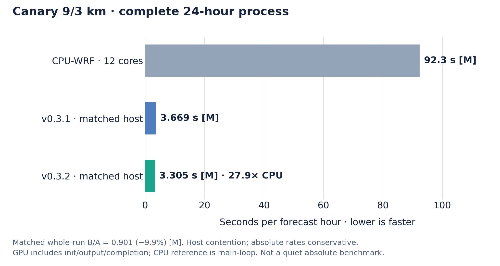
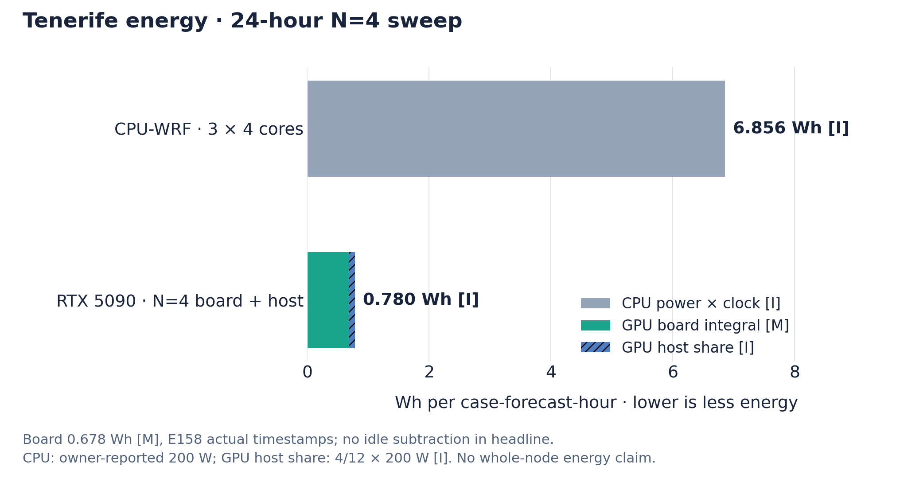
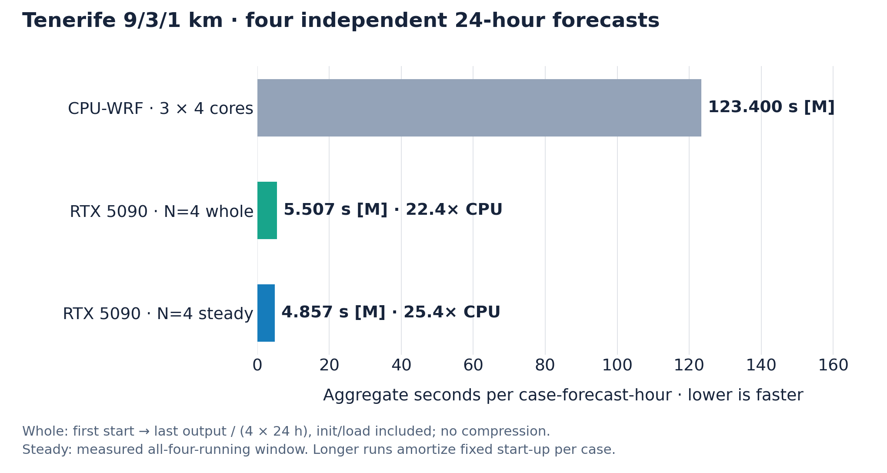
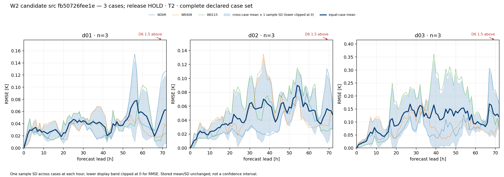
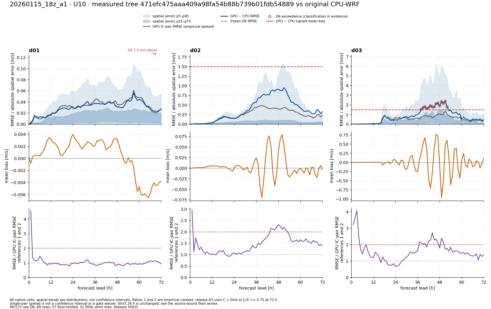
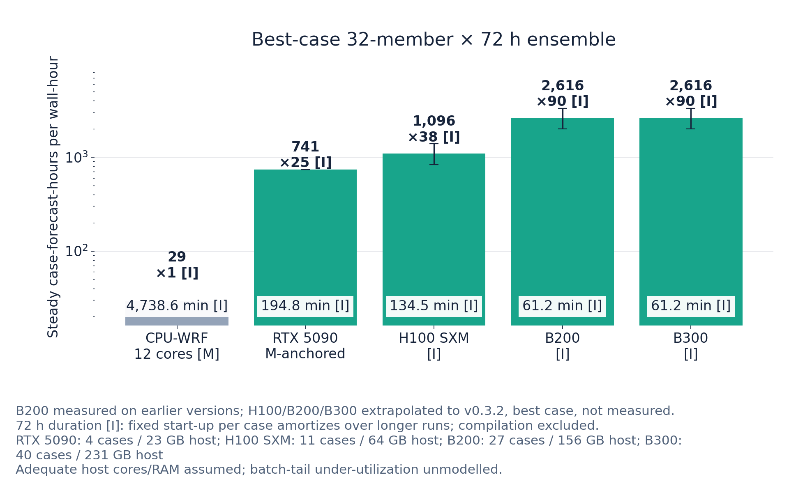
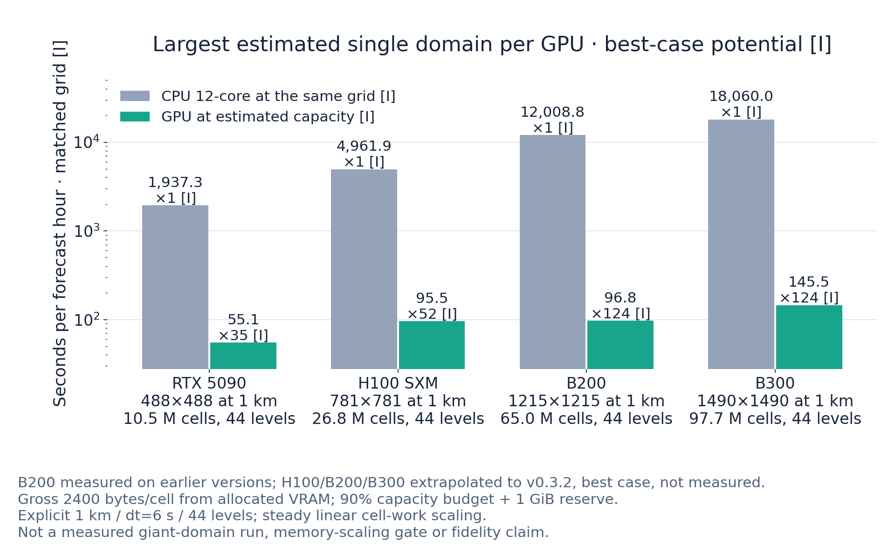

# wrf_gpu

[User guide and forecast instructions](https://wrf-gpu.github.io/wrf_gpu/)

**WRF-compatible forecasts on one NVIDIA GPU.**

`wrf_gpu` is a GPU rewrite of WRF v4's ARW dynamics and physics, validated against
the original Fortran. It reads WRF inputs, advances the physical equations with
JAX/XLA/Pallas, and writes WRF-compatible history. The aim is practical regional
forecasting: shorter turnaround, more independent forecasts per workstation,
and less energy per forecast hour.

This is an independent implementation, not WRF itself, and is not affiliated
with or endorsed by UCAR/NCAR. **v0.3.3** has completed its eight-arm validation with the disclosed deviations below. WRF-order physics corrections and fast paths
are enabled by default. Its fresh 72-hour identity evidence is described below;
the speed and energy figures retain their explicitly dated v0.3.2 receipts.

## Speed and energy first — measured on v0.3.2

On an **RTX 5090 (sm_120, CUDA 13)** with a **Ryzen 9 9950X host**, a cached
two-domain Canary 9/3 km forecast completes 24 simulated hours at **3.305 seconds
per forecast hour**: a **27.9× ratio to the twelve-core CPU-WRF reference** [M].
Four independent three-domain Tenerife forecasts sharing the card reach
**5.507 seconds per case-forecast-hour**, or **22.4× CPU-WRF's three-by-four-core
throughput** [M], in the measured 24-hour sweep. Its all-four-running steady
window reaches **4.857 s/case-hour, 25.4×** [M].

The GPU timings include start-up and output. The CPU reference clocks cover
their main loops. These are ratios of explicitly stated clocks, not identical
timing windows. Other NVIDIA GPUs and other hosts have not been tested in these measurements. The absolute Canary result was measured under host contention and is
conservative; the accepted matched A/B ratio is **0.901, 9.9% less whole-run
wall time** against v0.3.1 [M]. It is not a quiet-host absolute benchmark.
Details and source hashes are in the [measurement report](docs/release/V0.3.2.md).

| Canary 9/3 km, 24 h | CPU-WRF, 12 cores | v0.3.1, matched host | v0.3.2, matched host |
|---|---:|---:|---:|
| Seconds per forecast hour [M] | 92.3 | 3.669 | **3.305** |

<picture><source media="(prefers-color-scheme: dark)" srcset="docs/release/img/v032_speed_dark.png"></picture>

The matched complete GPU process took **79.319 seconds for 24 forecast hours**,
against **88.060 seconds** for its v0.3.1 reference on the same contended host.
The v0.3.2 steady-segment median is **2.625 s/hour** and initialization/pre-step
work **15.008 seconds**, both diagnostics included in the whole run [M]. The
first unpaired S1 attempt had 11.9% A/A variation and is excluded from speed
claims. Historical v0.3.1's quieter 3.604 s/hour remains a separately scoped
measurement; it is not used to manufacture the matched percentage.

Energy matters as much as speed. For the 24-hour Tenerife sweep, timestamped
board-power samples give **0.678 Wh (2.441 kJ) per case-forecast-hour** at N=4 [M].
Adding an explicit host-share scenario gives **0.780 Wh (2.808 kJ)** [I], versus
**6.86 Wh (24.68 kJ)** [I] for the CPU reference. That is approximately **8.8×
less energy on this accounting basis**, not a measured whole-machine efficiency
claim. The next figure makes the measured and assumed parts visible.

<picture><source media="(prefers-color-scheme: dark)" srcset="docs/release/img/v032_energy_dark.png"></picture>

The CPU basis is **approximately 200 W, owner-reported power for the twelve-core
CPU-WRF run**. CPU energy multiplies that power by its 123.4 s/case-hour
reference [I]. GPU board energy integrates actual timestamped `nvidia-smi`
samples with a trapezoid rule [M]. The added host share is **4/12 of 200 W,
about 67 W per GPU**, an assumption [I]. GPU sampling gaps and endpoint tails
are disclosed; no DRAM, storage, PSU or whole-node measurement is invented.
The [energy method and receipts](docs/release/V0.3.2.md#energy-accounting)
state the windows. The shipped four-core Swiss example has no CPU energy claim.

## What it is good for — and what it is not

Use a supported regional WRF configuration with existing `wrfinput`, `wrfbdy`
and `namelist.input` files. Keep WRF preprocessing and downstream analysis,
and run time integration on one GPU. Original-CPU comparisons cover maritime
terrain, convection-permitting nests and winter Alpine snow.

Independent cases are another useful match. Different initial dates, ensemble
members or parameter studies can share the card through separate processes.
The launcher checks both GPU and host memory and queues remaining work. More
concurrency improves aggregate throughput here, but can increase the elapsed
time of an individual case: N=4 is a batching result, not a promise that each
forecast finishes four times sooner.

It is **not universal WRF option parity**, an MPI replacement or a neural weather
surrogate. Multi-GPU domain decomposition is unimplemented. An isolated module
or oracle does not establish operational support: preflight refuses unsupported
selections with a named reason.

## Scope and physics menu at a glance

The v0.3.3 final validation uses **Thompson microphysics, RRTMG radiation, MYNN
turbulence/surface layer and Noah-MP land physics**. Kain–Fritsch is used on
the appropriate outer Canary/Tenerife domains; the Swiss examples disable
cumulus. Those choices define the headline evidence, rather than every possible
combination in the wider scheme catalog.

| Area | Current scope |
|---|---|
| Implemented and measured in this release | WRF real-data inputs; ARW dynamics; the physics combination above; fixed one-way nests; complete history; memory-aware independent-case launcher |
| Implemented, with a historical v0.3.1 regression gate | Nested checkpoint/resume; 2,262 variables byte-identical across six control/resume files [M] |
| Recognized, but refused operationally where unwired | Reference-only schemes and unsupported options; diagnostics explain the selected scheme and reason |
| Out of scope or unimplemented | MPI/multi-GPU domain decomposition, moving/vortex-following nests, coupled chemistry/fire/hydrology, FDDA/4DVAR and stochastic physics |

The wider catalog includes Kessler/Lin/WSM/Morrison/aerosol-aware Thompson,
KF/BMJ/Grell–Freitas/Tiedtke and several boundary-layer/surface-layer pairs.
Catalog support does not extend these measurements to every pairing.
Reference-only examples include CAM-UW/NSSL. The [physics guide](https://wrf-gpu.github.io/wrf_gpu/physics.html)
and [machine-readable catalog](src/gpuwrf/io/scheme_catalog.py) give exact status;
operational preflight is authoritative. Recognized cadence approximations are
reported separately from scheme support.

The dedicated Noah-MP glacier runtime remains unported. Glacier initialization
and missing-value history conventions are corrected, but agreement on a whole
domain does not establish each glacier process. Urban, ocean and other advanced
options should be checked against their individual support status, not inferred
from the presence of similarly named source files.

## Quickstart: run the bundled Alpine case

Use **Python 3.11+**, CUDA 13-compatible NVIDIA drivers and WRF v4 runtime tables.
The tested workstation is RTX 5090/9950X; other recent NVIDIA GPUs should be
usable in principle but are untested [I]. Install the CUDA JAX build before
running the model:

```bash
git clone https://github.com/wrf-gpu/wrf_gpu.git
cd wrf_gpu
pip install "jax[cuda13]==0.10.*"
pip install -e .
export GPUWRF_WRF_ROOT=/path/to/WRF   # contains run/ and its runtime tables

python -m gpuwrf.cli run --input-dir examples/switzerland_d01 \
  --output-dir runs/switzerland --domain d01 --hours 24 \
  --scratch-dir runs/switzerland_scratch
```

The [bundled example](examples/switzerland_d01/README.md) is a small 3 km Alpine
cutout initialized on 2023-01-15 00Z. Its input files ship with the repository.
It selects Thompson/RRTMG/Noah-MP/MYNN, with cumulus off. The example page explains
the expected files and original four-core CPU-WRF comparison. The pre-W2
69d8a9a7d run passes D6 and strict integrity on all 25 hourly frames; its
benchmark states the timestamp precision and clocks. W2 Swiss was cancelled. The current b6 Swiss 24-hour D6 and all-frame integrity annex pass; the older benchmark measurements retain their pre-W2 label. The overall candidate remains held.

**The first run compiles.** It can spend minutes before the first integration
output; a new geometry is a new compilation workload. Later runs reuse cached
executables. Run a new version or domain geometry alone once first, so its compiled programs and memory plan are cached.
Keep the case inputs and runtime tables consistent. v0.3.2 repairs auxiliary
cache reuse after installation relocation; a new version or geometry still
needs compilation.

History uses WRF NetCDF names/dimensions and familiar NetCDF/xarray tools.
A matching header establishes compatibility, not physics fidelity. For a new
case, retain the original CPU reference, input hashes and cadence, and use a
fresh output directory rather than mixing histories.

For multiple fixed nests, use `--domains-from-namelist` so the domain count comes
from the case. For operational setup, follow the [User's Guide](https://wrf-gpu.github.io/wrf_gpu/)
or [AI-assisted operator instructions](AI_OPERATOR.md). `python -m gpuwrf.cli
run --help` lists the supported controls. The normal recipe uses the public CLI;
no development lock or force override is required in a public installation.

An approved [history cleanup](docs/release/HISTORY_CLEANUP.md) is not established in that historical record.
After its verified push, use a fresh clone; affected commit/tag hashes change,
and retained maps connect old receipts to the new hashes. Forecast source
trees must remain unchanged by the cleanup.

## Several independent forecasts on one GPU

```bash
scripts/run_parallel_cases.sh --out-root runs/batch CASE_A CASE_B CASE_C -- \
  --domains-from-namelist --hours 24
```

The launcher admits cases when both the GPU and host budgets allow them,
records the admission decisions and queues the rest. Cold compilation needs
more host memory than a warm forecast. The launcher recognizes the required cached
executables and supports the fused three-nest C-auto memory plan; a guessed
steady-state memory budget is not used to admit several cold compiles at once.

| WN3 Tenerife, three nests, four concurrent 24-hour runs [M] | Whole run | All-four-running steady window |
|---|---:|---:|
| Aggregate s/case-forecast-hour | **5.507** | **4.857** |
| CPU-WRF 3×4-core throughput ratio | **22.4×** | **25.4×** |

<picture><source media="(prefers-color-scheme: dark)" srcset="docs/release/img/v032_parallel_dark.png"></picture>

These are whole-run figures including each case's start-up, so longer runs amortize it further; output was not compressed (the v0.3.0 figures used compression).
The whole aggregate clock is the first process start to the phase's last history
file divided by 4×24 forecast hours. The steady rate uses the measured window
where all four cases were advancing. The v0.3.1 six-hour N=1/3/4 results remain
[historical context](docs/release/V0.3.1.md#parallel-throughput-m); the change in
run length prevents treating the whole-run difference as a pure code speedup.

Warm per-case GPU allocation was **5,032 MiB**, with reported host high-water
memory around **5.6 GB**. Every case exited successfully, and the shared 0227
case retained all 75 file hashes against cold/validation outputs [M], a GPU
regression control. Those resources are observed values, not universal sizing
constants. Actual admission still checks CUDA/desktop use, host headroom and
the resolved geometry. [Sweep receipts](docs/release/evidence/v032/sweep24_summary.json)
retain the clocks, memory samples and decisions.

## v0.3.3 validation

All eight original-CPU scoring readers are closed. The manager accepts the disclosed deviations under the Owner rule; raw failed checks remain failed.

[All final identity plots](docs/release/evidence/v033/final_w3/index.html) show per-hour RMSE, bias and spatial bands against original CPU-WRF. Seven 72 h runs include six Tenerife primary/IC/replica arms and Storm Monica; the shipped Swiss case is 24 h.

| Comparison | Forecast | Strict 24 h (raw) | Full-window D6 (raw) | Interpretation |
|---|---:|---|---|---|
| Tenerife 0115 primary | 72 h | FAIL | FAIL | 61 floor-limited rows; one real V10 miss. Rain and cirrus lifetime differences disclosed (L4/L6/L7). |
| Tenerife 0227 primary | 72 h | PASS | FAIL | All eight breaches pass the frozen CPU-pair spread annex (L5). |
| Tenerife 0408 primary | 72 h | PASS | PASS | D6 passes; trace graupel integrity miss disclosed (L1). |
| 0227 IC member | 72 h | PASS | FAIL | All six breaches pass the frozen CPU-pair spread annex; integrity annex passes. |
| 0115 IC member | 72 h | FAIL | FAIL | 54 floor-limited rows; strict rain FAIL retained. Integrity annex passes; IC difference included. |
| 0115 same-IC replica | 72 h | PASS | FAIL | Eight floor-limited rows, two real V10 misses (h42/h44). Cirrus lifetime integrity FAIL disclosed; same-IC fresh-compile replica. |
| Storm Monica | 72 h | PASS | PASS | D6 and all-frame integrity pass. |
| Shipped Swiss | 24 h | PASS | PASS | D6 and all-frame integrity pass; 25 frames on one domain. |

0227 stations classify CLEAR (raw DAMAGE retained). 0115 coastal wind-speed RMSE is about 1.8% higher; temperature, humidity and wind direction improve. The small persistent excess and late cirrus lifetime differences are disclosed, not renamed PASS. [Release notes](release_notes/RELEASE_NOTES_v0.3.3.md) and [technical appendix](docs/release/TECHNICAL_VALIDATION_APPENDIX_v0.3.3.md) give the numbers, unchanged limits, IC/replica qualifications and source bridge.

Whole-run speed/energy figures above remain dated v0.3.2 measurements; no new throughput benchmark is inferred from this science wave.

## Historical W2 candidate: source-dated 72-hour record

Three Tenerife cases have new 72-hour histories on the reviewed W2
configuration: **657 paired hourly domain-frames**, all 73 hours on each
of three domains [M]. The candidate source tree is `fb50726fee1e`; source
and resolved-control proofs retain the actual executed hashes. The 24-hour
D6 gate stays strict. This is validation in progress, not release acceptance.

| Historical W2 comparison [M] | Domains | Frames/domain | Recorded reading |
|---|---|---:|---|
| Tenerife 0227, W2bR | d01/d02/d03 | 73 | Seven raw d03 rows; all floor-limited under A3; strict 24 h passes |
| Validation day 0408, W0408 | d01/d02/d03 | 73 | Raw D6 clean; all-frame trace exceptions disclosed |
| Validation day 0115, W0115 | d01/d02/d03 | 73 | 89 raw d03 breaches; 57 floor-limited, **32 wind rows fail the annex** |
| Storm Monica / bundled Swiss | d01/d02 / d01 | Source-dated | Monica W2 diagnostic has E41 HARD FAIL; W2 Swiss was cancelled; current b6 results are separate above |

[All retained identity galleries](docs/release/evidence/v033/index.html), including the [W2 per-variable line/band plots](docs/release/evidence/v033/w2/index.html)
show hourly RMSE, signed bias, spatial |GPU−CPU| p25–p75/p5–p95 and frozen
limits, plus equal-case mean ± one sample SD. All native cells are used,
with no masks. Where available, IC-pair RMSE provides empirical predictability
context; one pair is not a confidence interval or a gate waiver.



W0115's outstanding d03 wind rows are U10 h38–52 and V10 h37–58
(17 of those V10 hours fail the annex). The raw wind maxima are 2.38/3.04 m/s.
Its 54 accumulated-rain breaches are floor-limited; that does not excuse the
wind rows. Independent station scoring confirms systematic 0115 wind
speed damage in A/B/C (the late B′ scope is CLEAR), while 0227's fresh replicate does not reproduce the
afternoon wind-speed candidate. The Y0 rerun is byte-identical through its
copied autotune pin and supplies no independent realization. Distinct ZR/ZP
checks classify PROPERTY, IC-R-specific; W0115's recorded FAIL is retained. [Exact rules and limits](docs/release/V0.3.3.md)
keep the source scopes and raw failures visible.



Two 0227 checks now establish **no regression vs FINAL** under frozen
`GATES_FROZEN a791805a250f`: A7 uses FINAL V0227/V0227M as the problem-day
base/pair after the RC twin inputs were deleted (260/260 PASS, 204 cells
below FINAL). A8 uses FINAL's printed F1'' limits after N0/X_PLUME were
deleted, conservatively counting the half-last-digit rounding band as
NOT ok (8/8, 4/4, 8/8 PASS). FINAL itself passed against the original RC
references. The [exact reference chain](docs/release/V0.3.3.md#w2-reference-chain-a7a8)
preserves that scope; direct fidelity evidence remains original CPU-WRF.

R32-65's 0227 pair is **8/8 CLEAR** under its frozen rule [M], with a
qualification: B/T2 has gate-A DAMAGE on IC R (+0.0148 K versus S 0.0109),
while same-IC P is −0.0038 K. It is NOT REPLICATED, so the pair-rule result
is CLEAR, a disclosed one-realization class. There is one realization per
IC; both are slightly better than FINAL on the same IC.

The [pre-W2 69d8a9a7d record](docs/release/evidence/v033/final33v/index.html)
retains its 803 paired hours and Swiss 25-frame comparison. Those historical
passes were not transferred to W2; that historical candidate was held.

## Honest limitations and what is not claimed

All-hour integrity retains its raw reports. A pre-registered trace annex explains
13 new rows; two disclosed manager judgements accept three canopy-ice and two
boundary-graupel rows above their unchanged caps. One canopy cell is reproduced
by the CPU IC twin; the other is a GPU-only placement departure. These are
**recorded exceptions**, not an unqualified clean-output claim.

W2 adds eight reviewed defaults, including urban soil coefficients, MYNN
predictor floors and horizontal SWDOWN history. Their original-WRF source
bindings are in the [fix inventory](docs/release/V033_W2_FIXES.md).

BD92(c) remains a **known residual**, with binding d01 diagnostic maximum
0.0136 K; the non-binding late 0227 d03 departure is disclosed separately.
Night clear-sky cooling aloft is a v0.3.4 investigation. Dedicated glacier
runtime, universal physics pairing parity, MPI/multi-GPU domain decomposition,
whole-machine energy savings and data-centre GPU measurements are not claimed.

Earlier six-case 72-hour Tenerife and 162-hour Canary studies remain dated
v0.3.0 evidence, including their [raw frame failures](docs/release/VALIDATION.md).
They are not relabelled as new v0.3.3 runs. The detailed
[floor, integrity and residual disclosures](docs/release/V0.3.3.md) distinguish
accepted release rules from raw clean results. Original CPU-WRF is the fidelity
reference; comparisons with older GPU releases establish regression only.

## How it works — and where the time goes

WRF's ARW equations remain recognizable: third-order Runge–Kutta dynamics,
time-split acoustic integration, staggered-grid state and column physics.
JAX stages programs for fixed geometry and XLA compiles them; Pallas/native
GPU kernels handle hot stencils, vertical recurrences and column operations.
The Python interfaces retain the case/grid/state/I/O structure while the
expensive execution is rewritten for the device.

Precision is a performance decision with a fidelity gate. **WRF REAL work and
carry use fp32 fast kernels by default; WRF DOUBLE islands retain double
precision.** On the tested consumer GPU, fp64 arithmetic throughput is about
**1/64 of fp32**, inferred from [NVIDIA’s documented SM core counts](https://docs.nvidia.com/cuda/archive/12.9.1/cuda-c-programming-guide/index.html#compute-capability-12-0) [I]. Moving an entire legacy array program onto a card therefore
does not automatically make it fast. The rewrite targets arithmetic precision,
kernel structure and memory traffic together; it does not simply disable
double precision globally or loosen comparison bounds.

The hot path combines larger device operations, keeps forecast carry on the
device and avoids repeatedly materializing intermediates. Column dependencies
need deliberate layouts and recurrences; radiation has different work from an
ordinary dynamics root. Stable executable reuse and buffer lifetime matter
alongside arithmetic. Init, load, history writing and process completion still
cost time, which is why the headline uses a complete forecast clock.

On the historical v0.3.1 Canary profiling program, ordinary-root device time is **30.393 ms** and
radiation-root device time **78.093 ms** [M]. A root represents one outer step
and its nested work; these are profiler diagnostics, not seconds per forecast
hour. Eight conservative kInput flags are bound to their actual PROD runtime:
maximum **0.049 ms**, ordinary-root sum **0.213 ms**, maximum stack **32 B**.
The flags are disclosed rather than called absent. The source/executable/options
binding accompanies the [v0.3.1 runtime evidence](docs/release/V0.3.1.md); these
profile numbers are not transferred to the optimized v0.3.2 program as new measurements.

That historical ordinary kernel-plus-copy **mean is 33.109 ms/root**; the figures
above are kernel-only medians and should not be mixed. The latest accepted
[endpoint evidence](docs/release/S4_ENDPOINT_RC3.md) preserves all measured time:

| Largest ordinary-root families | Device ms/root [M] |
|---|---:|
| Acoustics | 9.835 |
| MYNN | 4.028 |
| Advection | 3.304 |
| Carry/stage glue | 2.499 |
| Positive-definite scalar transport | 2.076 |
| Full kernel + copy mean | **33.109** |

Even deleting all d02 advection, glue and scalar-transport work would cap that
scoped device speedup at **1.27× [I]**. A further 2× needs changes across several
families: a common stable layout and cooperative spatial/column tiles keeping
acoustic coefficients, face fluxes and stage intermediates on chip are a
structural route to investigate. Such a gain is unproven. The traffic model
actually overcounts the measured total; it is not a calibrated bandwidth floor
or a claim of “90% hardware utilization.”

A roofline compares arithmetic capacity with memory bandwidth, but neither
number alone predicts a full forecast. Launch latency, dependent vertical
work, cache state, layouts, output and host scheduling can limit progress
before a theoretical roof is reached. The N=4 sweep reported median SM
utilization near 99% [M]; utilization is evidence of activity, not a proof that
every kernel is optimal. Performance changes still need measured profiles and
the same physical work, with correctness riding alongside.

## Scaling direction: larger GPUs and independent batches

JAX is the foundation for a scalable implementation, and data-centre GPUs are
a development target. Today one forecast runs on one GPU. Independent cases
offer a route to larger batches; distributed domains and a validated multi-GPU
forecast driver remain future work.

The new figures show **best-case potential [I]** for long ensembles and giant
single domains, anchored on the measured v0.3.2 24-hour sweep and PROD steady
rate. A common **32-member × 72-hour ensemble** makes the workload comparable:
the conditional completion estimates are about **195 minutes on RTX 5090**, 134
on H100 and **61 minutes on B200/B300** [I]. Even CPU/RTX durations are inferred
from measured rates; no 72-hour v0.3.2 benchmark is claimed.

<picture><source media="(prefers-color-scheme: dark)" srcset="docs/release/img/v032_best_case_ensemble_dark.png"></picture>

Run length matters because the fixed start-up cost per case is amortized over
more forecast hours. The 24-hour anchor gives a **15.6-second fixed-cost proxy
per case**; it stays unscaled and is divided by 72 in the ensemble scenario.
Device-related steady work scales with bandwidth and a historical efficiency
assumption. These are warm, saturated, well-provisioned cases; cold compilation
and FIFO-tail under-utilization are not priced as a measured completion result.
Resident capacities are H100 **11**, B200 **27** and B300 **40** cases, requiring
roughly **64/156/231 GB host RAM** before reserve [I].

<picture><source media="(prefers-color-scheme: dark)" srcset="docs/release/img/v032_best_case_giant_domain_dark.png"></picture>

The giant-domain scenario estimates about **488×488 at 1 km on RTX 5090**,
781×781 on H100, **1,215×1,215 on B200** and **1,490×1,490 on B300**, each with
44 levels [I]. GPU/CPU times are compared at the same domain size for each
card. Gross allocated bytes per cell include pools, context and scratch; the
linear capacity/work assumption does not prove a domain fits or passes physics
validation. The explicit timestep is **6 seconds**. Different layouts, physics,
stability and output needs can change both the limit and the speed.

**B200 measured on earlier versions; H100/B200/B300 extrapolated to v0.3.2,
best case, not measured.** Historical B200/5090 efficiency transfers to this
new kernel mix by assumption; bands are not confidence intervals. The
[best-case scaling method](docs/release/V032_BEST_CASE_SCALING.md) and
[actual normalized anchors](docs/release/evidence/v032/best_case_anchors.json)
record the model, reserves, timestep and source hashes. The v0.3.1 shorter-run
[scenarios](docs/release/SCALING_METHOD.md) remain a conservative, differently
scoped reference; no multi-GPU forecast or data-centre run is claimed.

## v0.3.3 W2 fixes — under validation

The next frozen release tree will include the reviewed W2 subset: urban soil
parameter overrides, horizontal SWDOWN history on slopes, MYNN predictor
stability floors, exposed-area canopy water capacity, and the land-only
post-Noah Q2 cap. The [cause → WRF source → key inventory](docs/release/V033_W2_FIXES.md)
records their scope; they are not declared validated defaults yet.

The old RC's k0 warm PBL error masked an urban cold soil term. Removing the
warm compensator exposes that older surface error; W2 repairs the soil
parameters instead of restoring a compensating bias. The perturbed-IC
repeat reproduces B/T2 and B/RH2*, but **A/WD10 is NOT REPLICATED** and is
kept as a disclosed roadmap item. The original DAMAGE reading is retained.
Current numbers/plots above are explicitly **pre-W2 69d8a9a7d evidence**;
they will be regenerated from the new frozen validation source.

## What's new, and what comes next

v0.3.3 restores WRF's MYNN plume geometry, cloud/mass-flux floors, condensation
carry and per-column convergence, plus surface density and TKE/length budgets.
D1/D2/D3 restore held KF, PBL water/moist-theta and radiation tendency coupling
through RK. WRF constants, boundary re-pinning, Julian timing and restart/import
corrections compose with those changes; the validated set is default on.
[Release notes](release_notes/RELEASE_NOTES_v0.3.3.md) give the exact source,
original-WRF gates and remaining limitations.

The next work includes the measured BD92(c) clear-night residual, broader
independent station/case verification, glacier runtime, and measured memory
and launch-overhead opportunities. These are research directions, not booked
speedups. Existing v0.3.2 ensemble/giant-domain scenarios remain [I] with their
original assumptions; v0.3.3 has not re-benchmarked those data-centre scenarios.

| Version | Short history |
|---|---|
| v0.3.3 candidate | WRF-order MYNN and D1/D2/D3 plus W2 corrections; 72 h band evidence; current 0115 rain/station and 0408 rain/graupel failures; release held |
| v0.3.2 | Matched whole-run −9.9%; N=4 24 h throughput 22.4× CPU; stable layout, startup/cache and momentum work |
| v0.3.1 | WRF-order/snow/writer corrections; historical performance and validation |
| v0.3.0 | fp32 hot kernels became default; historical six-case gates and long-lead studies |
| v0.23.4 and earlier | Earlier capability/oracle work; different precision and performance baseline |

## Get involved and read further

If the rewrite interests you, start with [CONTRIBUTING.md](CONTRIBUTING.md),
the [release methods](docs/release/METHODS.md), the
[validation report](docs/release/V0.3.2.md) and the [User's Guide](https://wrf-gpu.github.io/wrf_gpu/).
Include the namelist, input provenance, version, output cadence and a
reproducible comparison in reports.
[Questions and issues](https://github.com/wrf-gpu/wrf_gpu/issues) are welcome.
Documentation, setup, fidelity, performance and independent validation
contributions are welcome; speedups need scientific and timing evidence.

## License

wrf_gpu's own code is released under the [MIT License](LICENSE). Some files keep
upstream terms: AER's RRTMG/RRTM code and data may not be sold; NCAR MMM physics
translations carry NCAR's BSD 3-Clause notice; WRF-derived material carries the
UCAR public-domain notice. See [THIRD_PARTY_NOTICES.md](THIRD_PARTY_NOTICES.md).
wrf_gpu is not affiliated with UCAR/NCAR; WRF® is a registered trademark of UCAR.


W2 qualification update (2026-10-07 10:18Z, source471): the distinct ZR realization leaves two REAL V10 rows at h42/h44; ZP has zero REAL rows. Frozen Z class is PROPERTY, IC-R-specific, and the original W0115 FAIL is retained. R32-67 v3 confirms SYSTEMATIC station WS10 damage in A/B/C (13 CLEAR, 3 SYSTEMATIC, 0 OPEN); B′ remains CLEAR. Earlier OPEN statements above are dated readings, superseded by this result. W3 must apply the affected original-CPU and station gates on its final source; no W2 waiver or inherited clearance.
