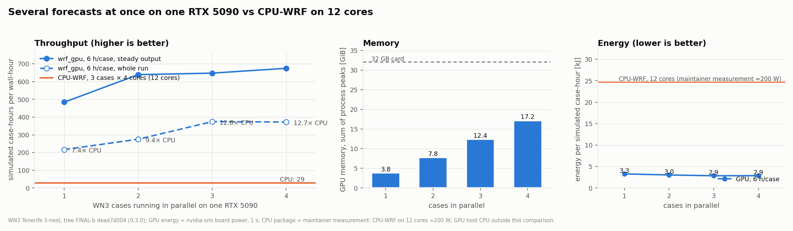
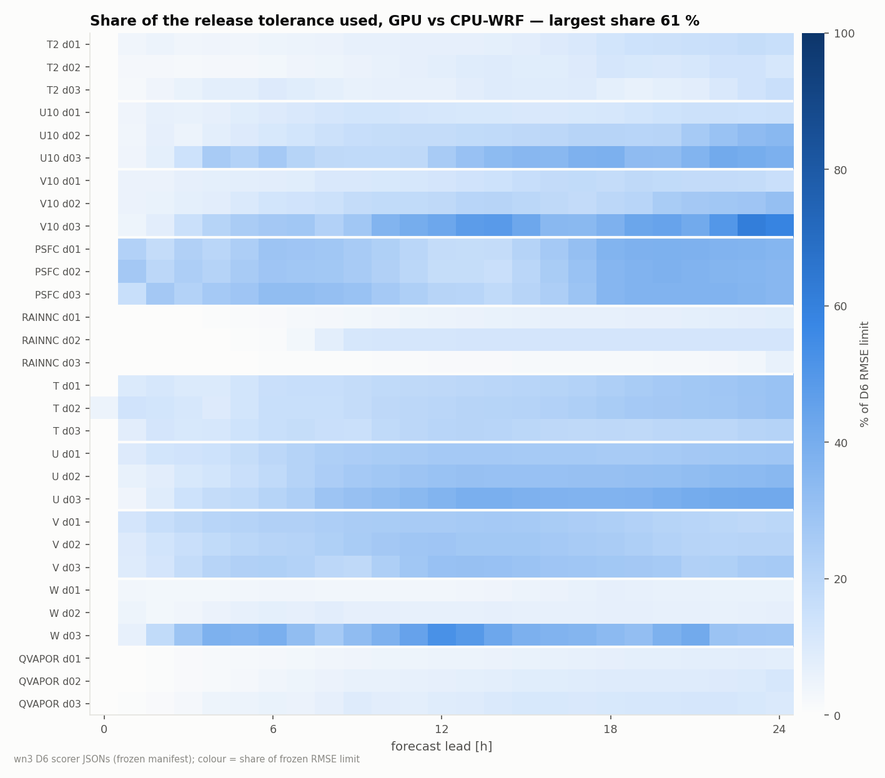

# wrf_gpu

**A WRF-compatible regional weather model, rewritten for GPU hardware.**

`wrf_gpu` rewrites WRF v4's ARW dynamics and physics in **JAX/XLA/Pallas** so
WRF-class regional forecasts can run efficiently on GPU hardware. It reads
standard WRF inputs, writes WRF history, and is validated against the original
Fortran CPU-WRF.

This is an independent implementation, **not WRF itself**, and is not affiliated
with or endorsed by UCAR/NCAR. It supports a tested subset of WRF options.
MPI and multi-GPU domain decomposition are **not
implemented**.

Supported forecasts use Thompson microphysics, RRTMG radiation, MYNN turbulence,
Noah-MP land physics, outer-domain Kain–Fritsch and GWDO, with one-way nesting.

## Measured performance

These cached v0.3.0 results [M] were measured on an **NVIDIA RTX 5090**, with an
**AMD Ryzen 9 9950X host**. CPU-WRF uses twelve cores: 12 ranks or 3 × 4 ranks.

| Forecast | CPU-WRF, 12 cores | RTX 5090 |
|---|---:|---:|
| Canary, 9/3 km, 24 h | 92.3 s/forecast hour | **4.12 s/forecast hour**, 22.4× |
| Tenerife, six-hour parallel benchmark | 123.4 s/case-hour, 3 × 4 cores | **9.68 s/case-hour**, 4 cases, 12.75× |
| Tenerife, 72 h production batch: six cases, two waves of three | 123.4 s/case-hour, 3 × 4 cores | **6.28 s/case-hour**, 19.6× |

GPU rates include startup and output; parallel rates also include compression
and launcher completion. The Canary CPU reference measures its main loop.
The production batch is a separate bulk rate, not the controlled six-hour
benchmark. Three and four cases perform within 0.5%.
[Methods](docs/release/METHODS.md) define the clocks;
[receipts](docs/release/PROVENANCE.md) identify the runs.

<p align="center"><picture><source media="(prefers-color-scheme: dark)" srcset="docs/release/img/parallel_dark.png"></picture></p>

Release-validated hardware: RTX 5090 (sm_120, CUDA 13).
**B200: tested with earlier versions; not yet validated with v0.3.0.**
The [historical B200 evidence](docs/release/B200_EXTRAPOLATION.md) retains the
old-version measurements and their limits; the
[v0.22.1 notes](release_notes/RELEASE_NOTES_v0.22.1.md) also document defects
observed during an earlier B200 nested run. Neither establishes v0.3.0 validation.
B300 operation and multi-GPU scaling remain untested.

## Design direction

JAX was chosen as a foundation for scalable operation. Future
development will target multi-GPU execution and data-centre GPUs, including
B200/B300. Multi-GPU execution is not implemented. Earlier B200 tests do not
validate this release; B300 operation remains untested.
B200 projections are **inferences [I]**, confined to the [methods](docs/release/METHODS.md),
rather than release results.

## Capability: independent cases in parallel

The launcher runs independent forecasts on one GPU, checking GPU and host
memory and queuing remaining cases:

```bash
scripts/run_parallel_cases.sh --out-root runs/batch CASE_A CASE_B CASE_C -- \
  --domains-from-namelist --hours 24
```

This runs independent cases; it does not distribute one domain across GPUs.
The [User's Guide](https://wrf-gpu.github.io/wrf_gpu/) explains setup and operation.

## Quickstart

Use Python 3.11+, CUDA 13-compatible drivers, and WRF v4's runtime tables:

```bash
git clone https://github.com/wrf-gpu/wrf_gpu.git
cd wrf_gpu
pip install "jax[cuda13]==0.10.*"
pip install -e .
export GPUWRF_WRF_ROOT=/path/to/WRF   # directory containing run/ and its tables
python -m gpuwrf.cli run --input-dir examples/switzerland_d01 \
  --output-dir runs/switzerland --domain d01 --hours 24 \
  --scratch-dir runs/switzerland_scratch
```

The first run compiles; later runs reuse the executable. The
[Switzerland example](examples/switzerland_d01/README.md) includes the original
four-core CPU-WRF comparison. Use `--domains-from-namelist` for nested cases;
[AI-assisted setup](AI_OPERATOR.md) is available.

## Validation and known limits

The release gate covers **6 Tenerife cases × three domains × 24 h**:
375 fields compared with original CPU-WRF, 62 with frozen per-variable numerical
limits (D6), **zero bound failures**, and all compared numeric values finite.
Strict output-integrity checks retain their raw failures; every trace-level,
canopy-onset and known writer exception is [disclosed](docs/release/VALIDATION.md#wn3-output-integrity).

<p align="center"><picture><source media="(prefers-color-scheme: dark)" srcset="docs/release/img/identity_curves_wn3_heatmap_dark.png"></picture></p>

Beyond 24 h, two of six Tenerife cases exceed those 24-hour-designed limits on
the 1 km domain. A complete six-case comparison on earlier internal build
1fece48da (before the albedo/snow-aging fix) records 0227 U10/V10 from +41 h,
V at +67 h, W at +69–70 h and RAINNC at +67–72 h; 0120 U10 at +58 h.
The scored v0.3.0 0227 case agrees with the displaced wake/convection pattern.
Our analysis attributes it to a displaced lee-wake/convection feature with small
mean bias; a CPU-vs-CPU control that would quantify natural predictability has
not been run.
The Canary **162 h** comparison stays within its limits.
[Validation](docs/release/VALIDATION.md) preserves exact failures and signed biases.

Component tests use pristine WRF Fortran; ALISIOS performs station verification
separately. The dedicated glacier runtime is unported. [Known issues](KNOWN_ISSUES.md)
cover glacier, writer and allocation limitations.
Version 0.3 adds default fused fp32 kernels, WRF-order snow/water/albedo fixes,
and full history; see the [changelog](CHANGELOG.md) and [release notes](release_notes/README.md).

## Autonomous AI rewrite / development workflow

This is an autonomous AI rewrite under human direction, organized as a network
of managers, implementation workers, testers and reviewers. Managers own scope
and integration; workers implement bounded changes; testers retain execution
evidence; reviewers challenge correctness and scientific claims before release.

According to the project owner's attribution, development began with **GPT 5.5
and Opus 4.8** and was completed with **Opus 5.5 and GPT 6.1 Sol**, with occasional
contributions from **Fable 5.1 and GPT 6 Astra**. These are the owner-reported
model names, not an audited per-commit model-provenance record or a claim about
provider releases.

To continue as a manager with Claude/Opus or another agent, read
[AGENTS.md](AGENTS.md), then load the portable
[manager skill](docs/agent-workflow/manager/SKILL.md). It links worker, tester and
reviewer instructions, repository-relative commands, scientific gates and safe
handoffs. Discover the available runtime and tools first; no particular agent
host, orchestrator or GPU is required to begin a scoped bug investigation.

## Get involved

Interested in the rewrite? Start with [CONTRIBUTING.md](CONTRIBUTING.md) and the
[methods](docs/release/METHODS.md). Questions and
[issues](https://github.com/wrf-gpu/wrf_gpu/issues) are welcome.

## License

wrf_gpu's own code is released under the [MIT License](LICENSE). Some files keep
upstream terms: AER's RRTMG/RRTM code and data may not be sold; NCAR MMM physics
translations carry NCAR's BSD 3-Clause notice; WRF-derived material carries the
UCAR public-domain notice. See [THIRD_PARTY_NOTICES.md](THIRD_PARTY_NOTICES.md).
wrf_gpu is not affiliated with UCAR/NCAR; WRF® is a registered trademark of UCAR.
