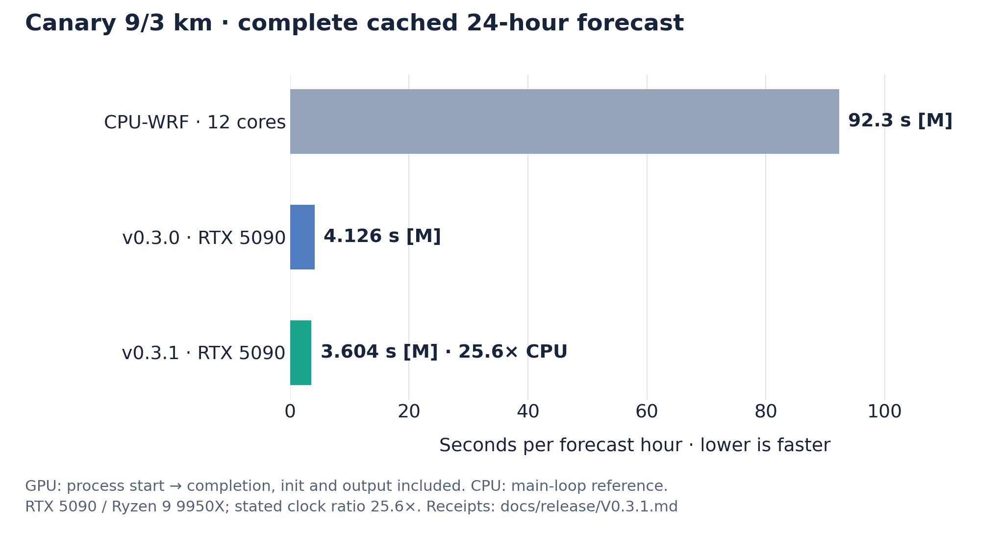
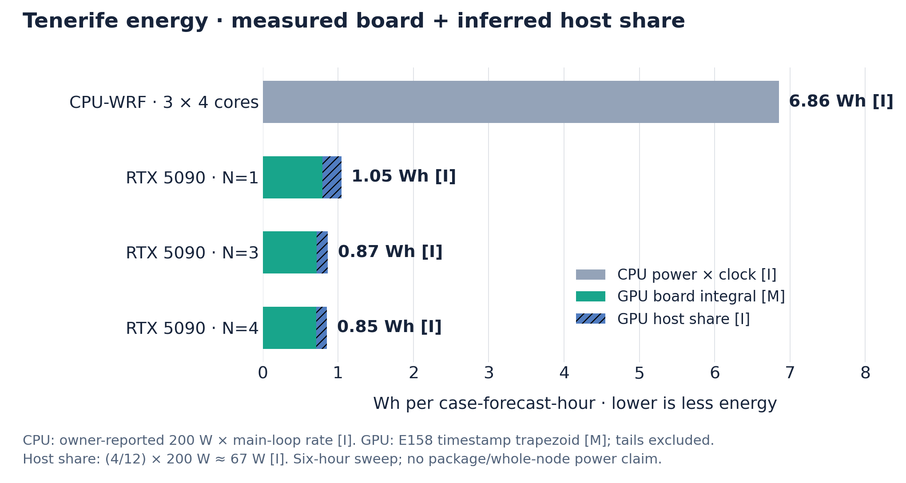
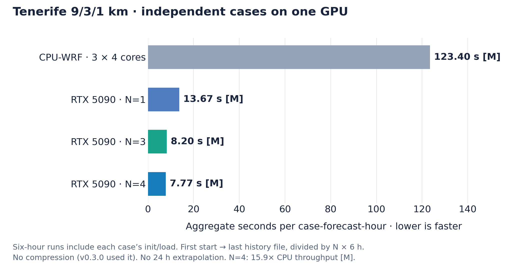
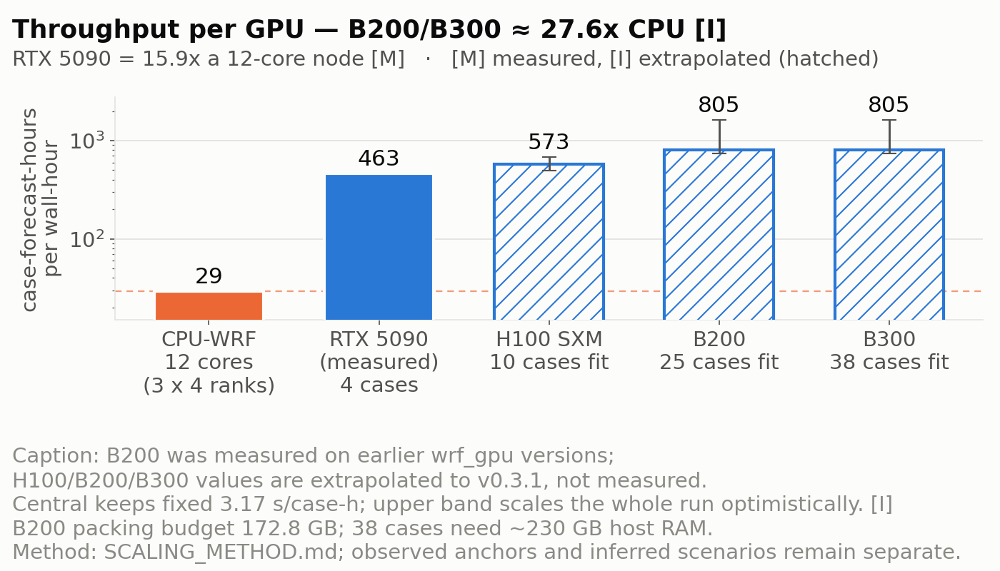
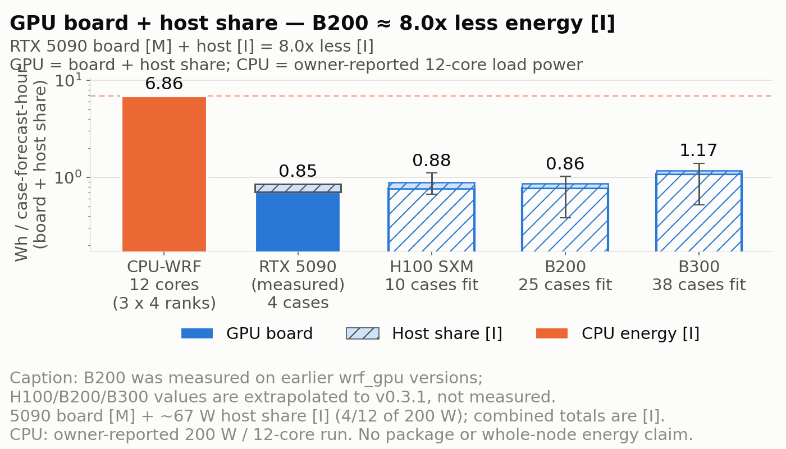

# wrf_gpu

**WRF-compatible forecasts on one NVIDIA GPU.**

`wrf_gpu` is a GPU rewrite of WRF v4's ARW dynamics and physics, validated against
the original Fortran. It reads WRF inputs, advances the physical equations with
JAX/XLA/Pallas, and writes WRF-compatible history. The aim is practical regional
forecasting: shorter turnaround, more independent forecasts per workstation,
and less energy per forecast hour.

This is an independent implementation, not WRF itself, and is not affiliated
with or endorsed by UCAR/NCAR. The current release is **v0.3.1**. Its fast paths
are enabled by default; the measurements below use that model rather than an
experimental flag collection.

## Speed and energy first

On an **RTX 5090 (sm_120, CUDA 13)** with a **Ryzen 9 9950X host**, a cached
two-domain Canary 9/3 km forecast completes 24 simulated hours at **3.604 seconds
per forecast hour**: a **25.6× ratio to the twelve-core CPU-WRF reference** [M].
Four independent three-domain Tenerife forecasts sharing the card reach
**7.77 seconds per case-forecast-hour**, or **15.9× CPU-WRF's three-by-four-core
throughput** [M], in the measured six-hour sweep.

The GPU timings include start-up and output. The CPU reference clocks cover
their main loops. These are ratios of explicitly stated clocks, not identical
timing windows. Other NVIDIA GPUs and other hosts have not been tested on this
release. Details and source hashes are in the [measurement report](docs/release/V0.3.1.md).

| Canary 9/3 km, 24 h | CPU-WRF, 12 cores | v0.3.0, RTX 5090 | v0.3.1, RTX 5090 |
|---|---:|---:|---:|
| Seconds per forecast hour [M] | 92.3 | 4.126 | **3.604** |

<picture><source media="(prefers-color-scheme: dark)" srcset="docs/release/img/v031_speed_dark.png"></picture>

The complete cached GPU process took **86.507 seconds for 24 forecast hours**.
That is **12.6% less wall time** than v0.3.0, equivalent to 14.5% more throughput.
Repeated short arms differed by 0.84%. The short steady proxy is 3.088 s/hour;
it is useful for development, but is not substituted for the complete-run
headline. Initialization/pre-step work accounts for about 17.1 seconds and is
included above [M].

Energy matters as much as speed. For the six-hour Tenerife sweep, timestamped
board-power samples give **0.710 Wh (2.557 kJ) per case-forecast-hour** at N=4 [M].
Adding an explicit host-share scenario gives **0.85 Wh (3.075 kJ)** [I], versus
**6.86 Wh (24.68 kJ)** [I] for the CPU reference. That is approximately **8.0×
less energy on this accounting basis**, not a measured whole-machine efficiency
claim. The next figure makes the measured and assumed parts visible.

<picture><source media="(prefers-color-scheme: dark)" srcset="docs/release/img/v031_energy_dark.png"></picture>

The CPU basis is **approximately 200 W, owner-reported power for the twelve-core
CPU-WRF run**. CPU energy multiplies that power by its 123.4 s/case-hour
reference [I]. GPU board energy integrates actual timestamped `nvidia-smi`
samples with a trapezoid rule [M]. The added host share is **4/12 of 200 W,
about 67 W per GPU**, an assumption [I]. GPU sampling gaps and endpoint tails
are disclosed; no DRAM, storage, PSU or whole-node measurement is invented.
The [energy method and receipts](docs/release/V0.3.1.md#energy-accounting)
state the windows. The shipped four-core Swiss example has no CPU energy claim.

## What it is good for — and what it is not

The most direct use is a regional forecast with a supported WRF configuration
and existing `wrfinput`, `wrfbdy` and `namelist.input` files. You can keep the
usual WRF preprocessing chain and much of the downstream analysis, while
running the time integration on one GPU. The release cases include maritime
terrain, convection-permitting nests and winter Alpine snow. They are real
forecasts with original CPU-WRF comparisons, not a dynamics-only throughput
test presented as an operational result.

Independent cases are another useful match. Different initial dates, ensemble
members or parameter studies can share the card through separate processes.
The launcher checks both GPU and host memory and queues remaining work. More
concurrency improves aggregate throughput here, but can increase the elapsed
time of an individual case: N=4 is a batching result, not a promise that each
forecast finishes four times sooner.

For developers interested in the rewrite, the numerical structure is accessible
Python and JAX alongside dedicated GPU kernels. Pristine Fortran savepoints,
whole-grid comparisons and runtime profiles support changes. This is a place
to examine how WRF equations, precision choices, column dependencies and GPU
execution interact, without accepting performance at the expense of fidelity.

It is **not universal WRF option parity**, an MPI replacement, a neural weather
surrogate or a validated distributed forecast engine. Multi-GPU domain
decomposition is not implemented. A module or isolated oracle in the repository
does not imply that its scheme is wired into the operational forecast. The
recognized scheme catalog distinguishes those cases and refuses unsupported
operational selections with a named reason; it does not quietly swap physics.

## Scope and physics menu at a glance

The release validation uses **Thompson microphysics, RRTMG radiation, MYNN
turbulence/surface layer and Noah-MP land physics**. Kain–Fritsch is used on
the appropriate outer Canary/Tenerife domains; the Swiss examples disable
cumulus. Those choices define the headline evidence, rather than every possible
combination in the wider scheme catalog.

| Area | Current scope |
|---|---|
| Implemented and measured in this release | WRF real-data inputs; ARW dynamics; the physics combination above; fixed one-way nests; complete history; memory-aware independent-case launcher |
| Implemented, with a separate regression gate | Nested checkpoint/resume; 2,262 variables byte-identical across six control/resume files [M] |
| Recognized, but refused operationally where unwired | Reference-only schemes and unsupported options; diagnostics explain the selected scheme and reason |
| Out of scope or unimplemented | MPI/multi-GPU domain decomposition, moving/vortex-following nests, coupled chemistry/fire/hydrology, FDDA/4DVAR and stochastic physics |

The wider catalog includes microphysics such as Kessler, Lin, WSM3/5/6,
Morrison and aerosol-aware Thompson; cumulus options including KF, BMJ,
Grell–Freitas and Tiedtke; and several boundary-layer/surface-layer pairs.
**Catalog support is not the v0.3.1 speed/fidelity claim for every pairing.**
Reference-only examples include CAM-UW and NSSL configurations. Check the
[physics guide](https://wrf-gpu.github.io/wrf_gpu/physics.html) and the
[machine-readable catalog](src/gpuwrf/io/scheme_catalog.py) for exact codes,
status and constraints. The executable preflight is authoritative for your
namelist. A recognized cadence approximation is disclosed separately from a
supported scheme; a warning is part of the result, not something to ignore.

The dedicated Noah-MP glacier runtime remains unported. Glacier initialization
and missing-value history conventions are corrected, but agreement on a whole
domain does not establish each glacier process. Urban, ocean and other advanced
options should be checked against their individual support status, not inferred
from the presence of similarly named source files.

## Quickstart: run the bundled Alpine case

Use **Python 3.11+**, CUDA 13-compatible NVIDIA drivers and WRF v4 runtime tables.
The tested workstation is RTX 5090/9950X; other recent NVIDIA GPUs should be
usable in principle but are untested [I]. Install the CUDA JAX build before
running the model:

```bash
git clone https://github.com/wrf-gpu/wrf_gpu.git
cd wrf_gpu
pip install "jax[cuda13]==0.10.*"
pip install -e .
export GPUWRF_WRF_ROOT=/path/to/WRF   # contains run/ and its runtime tables

python -m gpuwrf.cli run --input-dir examples/switzerland_d01 \
  --output-dir runs/switzerland --domain d01 --hours 24 \
  --scratch-dir runs/switzerland_scratch
```

The [bundled example](examples/switzerland_d01/README.md) is a small 3 km Alpine
cutout initialized on 2023-01-15 00Z. Its input files ship with the repository.
It selects Thompson/RRTMG/Noah-MP/MYNN, with cumulus off. The example page explains
the expected files, its fresh v0.3.1 benchmark and original four-core CPU-WRF
comparison, including its own strict-integrity findings.

**The first run compiles.** It can spend minutes before the first integration
output; a new geometry is a new compilation workload. Later runs reuse cached
executables. Run a new version or domain geometry alone once first, so its compiled programs and memory plan are cached.
Keep the case inputs and runtime tables consistent. A fresh version or a moved
installation can still compile auxiliary programs even when a main AOT program
is reused; a cache hit is not a blanket zero-compile guarantee.

History output is NetCDF with WRF variable names and dimensions. Open it with
your usual NetCDF/xarray tools; `ncdump -h` is an optional first check. A matching
header proves compatibility, not physical fidelity. For your own case, keep
the original CPU reference, input hashes and output cadence when assessing
agreement. Use a fresh output directory for an independent run rather than
mixing old and new histories.

For multiple fixed nests, use `--domains-from-namelist` so the domain count comes
from the case. For operational setup, follow the [User's Guide](https://wrf-gpu.github.io/wrf_gpu/)
or [AI-assisted operator instructions](AI_OPERATOR.md). `python -m gpuwrf.cli
run --help` lists the supported controls. The normal recipe uses the public CLI;
no development lock or force override is required in a public installation.

## Several independent forecasts on one GPU

```bash
scripts/run_parallel_cases.sh --out-root runs/batch CASE_A CASE_B CASE_C -- \
  --domains-from-namelist --hours 24
```

The launcher admits cases when both the GPU and host budgets allow them,
records the admission decisions and queues the rest. Cold compilation needs
more host memory than a warm forecast. v0.3.1 recognizes the required cached
executables and supports the fused three-nest C-auto memory plan; a guessed
steady-state memory budget is not used to admit several cold compiles at once.

| WN3 Tenerife, three nests, six-hour runs [M] | N=1 | N=3 | N=4 |
|---|---:|---:|---:|
| Whole-run aggregate s/case-forecast-hour | 13.67 | 8.20 | **7.77** |
| CPU-WRF 3×4-core throughput ratio | 9.0× | 15.0× | **15.9×** |

<picture><source media="(prefers-color-scheme: dark)" srcset="docs/release/img/v031_parallel_dark.png"></picture>

These are whole-run figures including each case's start-up, so longer runs amortize it further; output was not compressed (the v0.3.0 figures used compression).
The aggregate clock is the first process start to the phase's last history file,
divided by N×6 forecast hours. The separate launcher-wall comparison improves
about 14%/12%/17.5% at N=1/3/4 relative to v0.3.0, with that compression
difference disclosed. No 24-hour or energy extrapolation is made from those
timing ratios.

Warm per-case GPU allocation was **5,354 MiB**, with reported host high-water
memory around **6.1 GB**. The host MemAvailable floor was 50.4 GB; N=3 and N=4
were admitted together and every case exited successfully [M]. These are
observed resources, not universal sizing constants. GPU desktop allocations,
CUDA contexts, installed host RAM and your grid/physics mix affect admission.
The [selected sweep receipt](docs/release/evidence/v031/parallel_sweep_selected.json)
keeps exact clocks and decisions. [Clock method](docs/release/V0.3.1.md#parallel-throughput-m).

## Agreement with WRF v4, checked on the same grid

Fidelity comes from **original CPU-WRF**, not comparing the rewrite with itself.
GPU and Fortran forecasts use matched inputs and are paired by domain and valid
time. The comparator examines the common numeric fields on the grid and checks
predeclared, variable-specific limits. The release gate is the full **24-hour
window**, including lead zero where both runs wrote it. Bounds are frozen before
scoring; they are not adjusted to make a particular forecast pass.

| v0.3.1 original CPU-WRF comparison [M] | Domains | Frames/domain | Frozen-bound failures |
|---|---|---:|---:|
| Canary 9/3 km | d01/d02 | 24-hour gate | 0 / 0 |
| Tenerife 0227, 9/3/1 km | d01/d02/d03 | 25 | 0 / 0 / 0 |
| Swiss 2025-02-18, 3/1 km | d01/d02 | 25 | 0 / 0 |
| Swiss 2023-01-15, 3/1 km | d01/d02 | 25 | 0 / 0 |

Worst hourly whole-domain RMSE through 24 hours gives a more useful impression
than a pass label alone. The Canary case has T2 **0.066/0.059 K**, U10
**0.073/0.141 m/s**, V10 **0.126/0.157 m/s** and PSFC **1.55/1.55 Pa** on
d01/d02 ([VAL31b 24-hour scores](docs/release/evidence/v031/prod24_d6_selected.json), not the earlier six-hour window). Tenerife's 1 km domain has T2 **0.142 K**, U10/V10 **0.325/0.377 m/s**
and PSFC **4.49 Pa**. Swiss January has T2 **0.255/0.441 K**, U10/V10 up to
**0.487/0.498 m/s**, PSFC **3.93/7.14 Pa** and rainfall **0.310/0.416 mm**
on d01/d02 [M]. These are RMSE values, not maximum single-cell errors.

January's mean interior 10 m wind-speed bias is **−0.017/−0.028 m/s**. Its
**direct RC3 strict output-integrity check passes all 25 frames in both domains**,
with no degenerate fields, missing CPU variables or attribute gaps. The glacier
writer control checks all 50 CPU frames, with zero violations [M]. The
[complete validation evidence](docs/release/V0.3.1.md) states which build was
scored and which fields are proven unchanged by the writer-only final update.

Whole-forecast agreement is tolerance-based, not a claim of bit-identical
Fortran/GPU trajectories. Separate component checks use pristine WRF savepoints
and real columns, including snow/water coupling and boundary logic. Separate
GPU regression checks verify restart and unchanged output bytes. Their purposes
are distinct: a successful GPU-to-GPU restart is not independent physics
validation, and an undefined WRF history value is not a physical prediction.

## Honest limitations and what is not claimed

Strict integrity is a second check alongside the numerical limits. Raw findings
on other cases remain visible: **R2** negligible ice/snow traces, **R4** canopy-water
onset/decay timing and **R5** canopy-ice/ground-snow threshold timing. Registered
exceptions retain the original field/frame reports; they do not become an
unqualified clean-output claim. The glacier runtime limitation also remains,
despite corrected initialization and writer conventions.

Longer-lead evidence is explicitly dated. The six-case 72-hour Tenerife and
162-hour Canary studies were run on **v0.3.0**, not repeated on v0.3.1. Canary
stayed within its limits in that older study. Two Tenerife 1 km cases exceeded
the 24-hour-designed bounds: 0227 U10 from h44–72, reaching about 3.7 m/s,
RAINNC at h67–72 and W at h69–70; 0120 U10 at h58, 1.58 m/s. The other four
twins and d01/d02 were clean over 72 hours. Their
[exact frame failures](docs/release/VALIDATION.md) stay published. Without a
perturbed CPU ensemble, those comparisons do not establish a predictability
limit or absolve every error as chaos.

The release does not claim every physics pairing validated, station skill equal
to CPU-WRF in every environment, a measured H100/B200/B300 forecast, a new
multi-day throughput result, whole-system energy savings, or an optimal GPU
implementation in every geometry. Station verification is a separate ALISIOS
activity. CPU tests exercise supporting behavior, while real GPU runs establish
GPU timing and execution. See [KNOWN_ISSUES.md](KNOWN_ISSUES.md) for the carried
limitations and [methods](docs/release/METHODS.md) for the clock definitions.

## How it works — and where the time goes

WRF's ARW equations remain recognizable: third-order Runge–Kutta dynamics,
time-split acoustic integration, staggered-grid state and column physics.
JAX stages programs for fixed geometry and XLA compiles them; Pallas/native
GPU kernels handle hot stencils, vertical recurrences and column operations.
The Python interfaces retain the case/grid/state/I/O structure while the
expensive execution is rewritten for the device.

Precision is a performance decision with a fidelity gate. **WRF REAL work and
carry use fp32 fast kernels by default; WRF DOUBLE islands retain double
precision.** On the tested consumer GPU, fp64 arithmetic throughput is about
**1/64 of fp32**, inferred from [NVIDIA’s documented SM core counts](https://docs.nvidia.com/cuda/archive/12.9.1/cuda-c-programming-guide/index.html#compute-capability-12-0) [I]. Moving an entire legacy array program onto a card therefore
does not automatically make it fast. The rewrite targets arithmetic precision,
kernel structure and memory traffic together; it does not simply disable
double precision globally or loosen comparison bounds.

The hot path combines larger device operations, keeps forecast carry on the
device and avoids repeatedly materializing intermediates. Column dependencies
need deliberate layouts and recurrences; radiation has different work from an
ordinary dynamics root. Stable executable reuse and buffer lifetime matter
alongside arithmetic. Init, load, history writing and process completion still
cost time, which is why the headline uses a complete forecast clock.

On the measured Canary program, ordinary-root device time is **30.393 ms** and
radiation-root device time **78.093 ms** [M]. A root represents one outer step
and its nested work; these are profiler diagnostics, not seconds per forecast
hour. Eight conservative kInput flags are bound to their actual PROD runtime:
maximum **0.049 ms**, ordinary-root sum **0.213 ms**, maximum stack **32 B**.
The flags are disclosed rather than called absent. The source/executable/options
binding and retained profiles accompany the [runtime evidence](docs/release/V0.3.1.md).

The full ordinary kernel-plus-copy **mean is 33.109 ms/root**; the figures
above are kernel-only medians and should not be mixed. The latest accepted
[endpoint evidence](docs/release/S4_ENDPOINT_RC3.md) preserves all measured time:

| Largest ordinary-root families | Device ms/root [M] |
|---|---:|
| Acoustics | 9.835 |
| MYNN | 4.028 |
| Advection | 3.304 |
| Carry/stage glue | 2.499 |
| Positive-definite scalar transport | 2.076 |
| Full kernel + copy mean | **33.109** |

Even deleting all d02 advection, glue and scalar-transport work would cap that
scoped device speedup at **1.27× [I]**. A further 2× needs changes across several
families: a common stable layout and cooperative spatial/column tiles keeping
acoustic coefficients, face fluxes and stage intermediates on chip are a
structural route to investigate. Such a gain is unproven. The traffic model
actually overcounts the measured total; it is not a calibrated bandwidth floor
or a claim of “90% hardware utilization.”

A roofline compares arithmetic capacity with memory bandwidth, but neither
number alone predicts a full forecast. Launch latency, dependent vertical
work, cache state, layouts, output and host scheduling can limit progress
before a theoretical roof is reached. The N=4 sweep reported median SM
utilization near 99% [M]; utilization is evidence of activity, not a proof that
every kernel is optimal. Performance changes still need measured profiles and
the same physical work, with correctness riding alongside.

## Scaling direction: larger GPUs and independent batches

JAX is the foundation for a scalable implementation, and data-centre GPUs are
a development target. Today one forecast runs on one GPU. Independent cases
offer a route to larger batches; distributed domains and a validated multi-GPU
forecast driver remain future work.

The H100/B200/B300 scenarios are **inferences [I]**, not measurements of this
release. Earlier B200 experiments used an older fp64-heavy, single-domain
model. They provide a historical B200/5090 speed ratio of roughly 2.69–3.61,
with a throughput-ceiling ratio of 3.53. Transferring that ratio to today's
three-nest, full-physics program is an assumption, not a hardware benchmark.

The central scenario scales the device-related part and keeps the measured
fixed start-up/load contribution unscaled. An optimistic whole-run scaling
scenario is the upper band. Host memory and CPU dispatch can bind before GPU
capacity does, and board power is combined with an explicitly inferred host
share. A larger HBM pool does not, by itself, guarantee greater per-case energy
efficiency or let one forecast span GPUs.

<picture><source media="(prefers-color-scheme: dark)" srcset="docs/release/img/v031_scaling_throughput_dark.png"></picture>
<picture><source media="(prefers-color-scheme: dark)" srcset="docs/release/img/v031_scaling_energy_dark.png"></picture>

**B200 was measured on earlier wrf_gpu versions; H100/B200/B300 values are
extrapolated to v0.3.1, not measured.** Scenario ranges are not confidence
intervals. The [scaling method](docs/release/SCALING_METHOD.md) records the
assumptions and the [historical B200 record](docs/release/B200_EXTRAPOLATION.md)
preserves the old workload. Verify usable device memory and host resources on
actual hardware before treating a packing estimate as an admission plan.

## What's new, and what comes next

v0.3.1 combines performance work with corrections found through original-WRF
comparisons. Nested forecasts now use WRF's open model top, per-record boundary decoupling and single edge-wind relaxation,
removing the systematic dry-mass/surface-pressure offset. Snow heat/moisture
roughness, thin snow films, warm cloud-ice process selection, nested lead-zero
state and water/glacier history conventions follow WRF more closely. Faster
acoustic and Noah-MP kernels, warm launcher admission and three-nest memory
planning are enabled in the release. The
[release notes](release_notes/RELEASE_NOTES_v0.3.1.md) explain each change.

The next performance work targets measured residuals: nested-domain layout
variation, install-path-specific auxiliary cache keys and opportunities to
reduce working memory and launch overhead. A manual layout pin failed its
full preservation/performance gates and is not enabled. EOS metadata pruning
remains off by default because removing copies did not produce a measured
standalone wall/VRAM gain. These are research directions, not booked speedups.
Further physics/options, glacier runtime support and longer independent
validation need their own gates; multi-GPU execution is a longer-term direction.

| Version | Short history |
|---|---|
| v0.3.1 | WRF-order/snow/writer corrections; 3.604 s/hour Canary and 15.9× measured N=4 Tenerife throughput; current evidence above |
| v0.3.0 | fp32 hot kernels became the default; six 24-hour Tenerife gates, longer-lead studies and a parallel sweep, preserved as historical results |
| v0.23.4 and earlier | Earlier implementation, capability/oracle work and different performance characteristics; not the current precision or speed baseline |

## Get involved and read further

If the rewrite interests you, start with [CONTRIBUTING.md](CONTRIBUTING.md),
the [release methods](docs/release/METHODS.md), the
[validation report](docs/release/V0.3.1.md) and the [User's Guide](https://wrf-gpu.github.io/wrf_gpu/).
An issue with a namelist, input provenance, version, output cadence and a
reproducible comparison is far more useful than a pass/fail screenshot alone.
[Questions and issues](https://github.com/wrf-gpu/wrf_gpu/issues) are welcome.
Contributions can improve documentation, setup, physics fidelity, performance
or independent validation; a proposed speedup should preserve the scientific
comparison as well as the timing result.

## License

wrf_gpu's own code is released under the [MIT License](LICENSE). Some files keep
upstream terms: AER's RRTMG/RRTM code and data may not be sold; NCAR MMM physics
translations carry NCAR's BSD 3-Clause notice; WRF-derived material carries the
UCAR public-domain notice. See [THIRD_PARTY_NOTICES.md](THIRD_PARTY_NOTICES.md).
wrf_gpu is not affiliated with UCAR/NCAR; WRF® is a registered trademark of UCAR.
