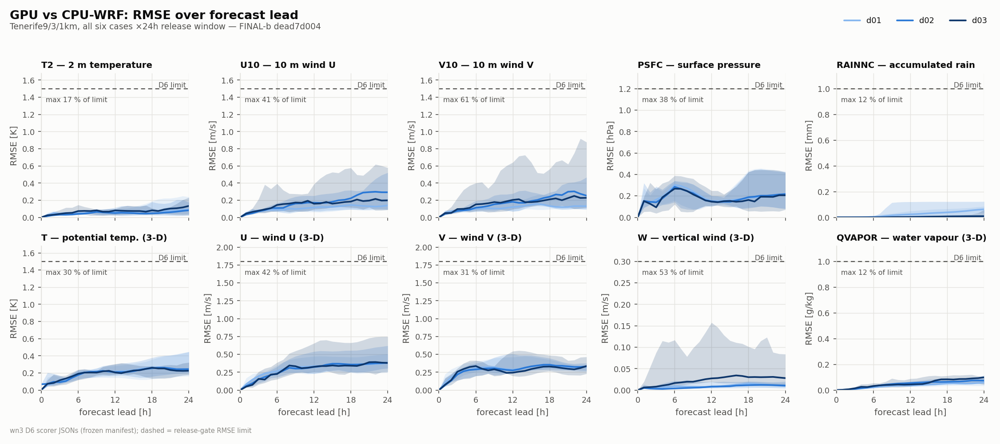
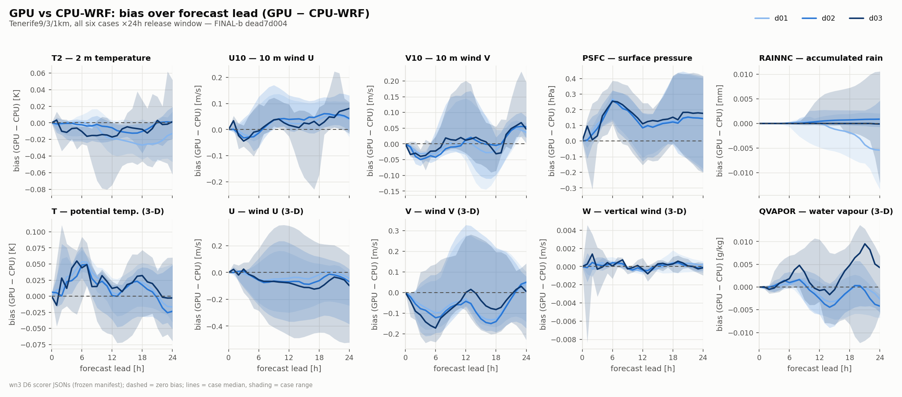
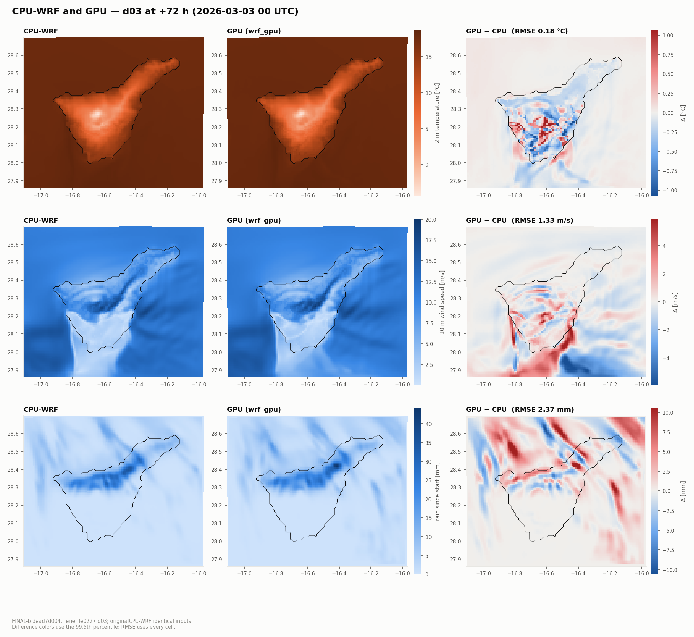
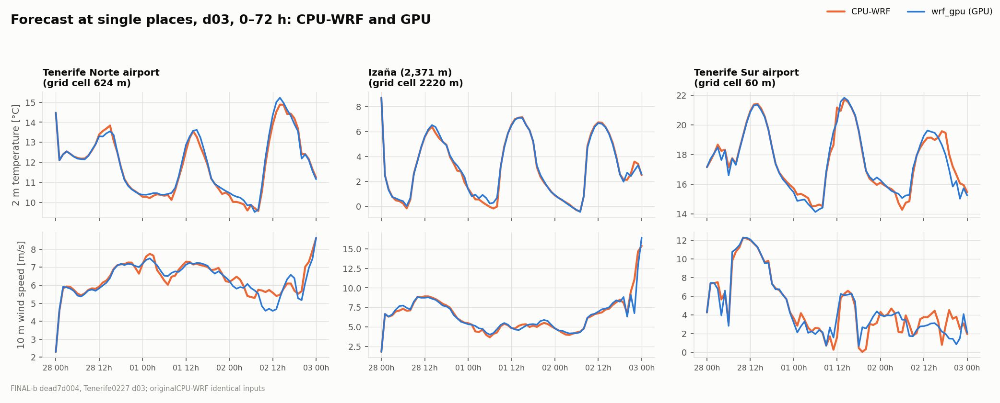
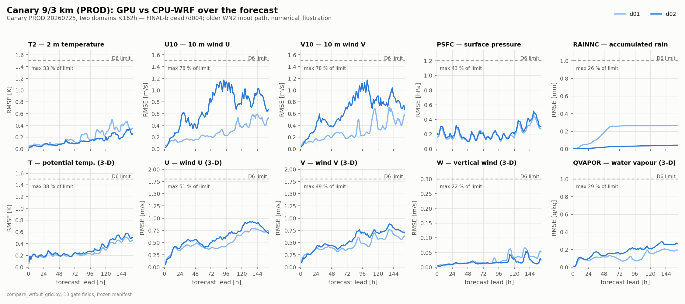
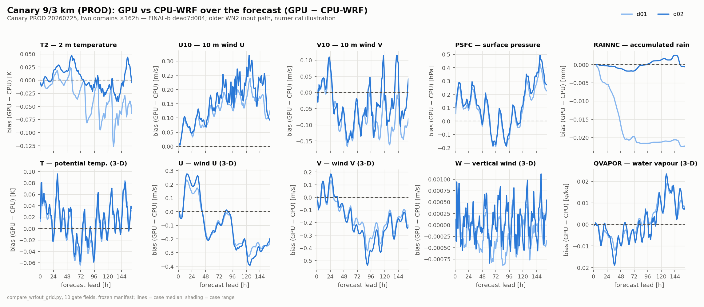
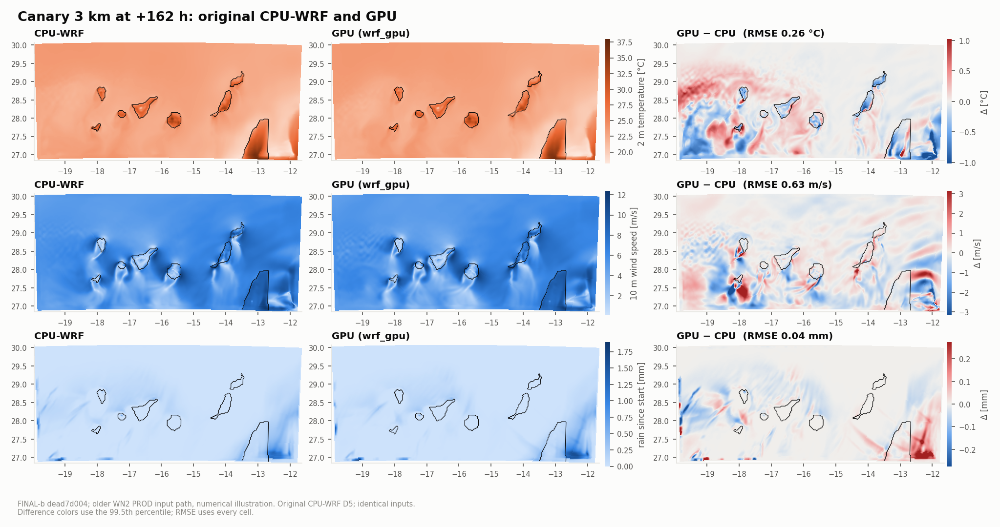

# Validation against original CPU-WRF

v0.3.0 (internal build dead7d004, called FINAL-b during validation) Switzerland and Canary results are complete. Tenerife's FINAL-b reports
are pending; the predecessor section below explicitly describes FINAL-a.

The operational release gate compares all six Tenerife WN3 cases, three domains and
hourly leads 0–24 with original CPU-WRF from identical inputs. Every CPU output field
is compared; the project's frozen per-variable tolerance set, D6, gives numerical
limits for 62 fields. Required
variables, exact Times, finite values and full CPU-WRF global-header coverage are
checked separately from numerical bounds. Additional GPU diagnostics are permitted.
A strict integrity exception retains its raw FAIL result and needs explicit approval
and a per-field disclosure; it is never silently converted to PASS.

The same cases run through 72 h for extended-lead drift and formal ALISIOS twin
verification. Their 72 h limits and any failures are disclosed separately from the
24 h release gate. Curves show the median and range across cases; the heatmap shows
the largest RMSE share across cases at each field/domain/lead.

## Predecessor 72 h frame failures

On an earlier internal build of v0.3.0 (1fece48da; identical except the Noah-MP albedo/snow-aging fix), the 24 h gate passes, but the following hourly RMSE values
exceed frozen bounds. These are frame-level failures, even where an aggregate score
over the full forecast remains below its bound. FINAL-b results will be reported
separately; no predecessor failure is removed from its record.

| Case | Domain | Field | Failing lead hours | RMSE bound | Peak RMSE (hour) | GPU − CPU bias at peak |
|---|---|---|---|---|---|---|
| 0227 | d03 | U10 | 41, 49–50, 54–70 | 1.5 m/s | 3.675 m/s (65) | −1.700 m/s |
| 0227 | d03 | V10 | 44, 49–72 | 1.5 m/s | 3.711 m/s (67) | −0.441 m/s |
| 0227 | d03 | V | 67 | 1.8 m/s | 1.898 m/s (67) | −0.256 m/s |
| 0227 | d03 | RAINNC | 67–72 | 1 mm | 2.333 mm (72) | +0.460 mm |
| 0227 | d03 | W | 69–70 | 0.3 m/s | 0.361 m/s (69) | −0.000070 m/s |
| 0120 | d03 | U10 | 58 | 1.5 m/s | 1.576 m/s (58) | +0.714 m/s |

The [full frame table](evidence/predecessor_72h_failures.json) retains exact values,
signed biases, frozen checks and the SHA-256 of every source report. This census
corrects an earlier shorthand that mixed the U10/V10 lead sets and omitted V.

d01/d02 and the other four twins are clean at 72 h. The release gate is the 24 h
window, which passes; 72 h is informational; ALISIOS' frozen twin thresholds decide
its verdict. CPU-only [D30 spatial analysis](evidence/predecessor_d30_classification.json)
classifies the lee-wind divergence and late rain/V/W exceedances as displaced
wake/convective features. For late V/W/rain, absolute bias/RMSE is at most 0.20;
W pattern correlation is 0.76–0.92, V 0.98–0.99, and rain 0.57–0.89 with a centroid
offset at most 2.4 km. The 0227 d03 event has 18% more domain-mean rain on the GPU;
rain differences have opposite signs in other domains/cases (for example 0227 d02
−10%, 0120 d02/d03 −11%/−8%, and 0614 d02/d03 +7%/−9%). This classification does
not change any numerical failure, and must be checked against FINAL-b's census.
CPU lag-sensitivity evidence uses only three clusters with low support; it does
not establish equivalence to a separately perturbed CPU ensemble. A CPU-vs-CPU
control that would quantify natural predictability has not been run.

The older Canary WN2 path provides a separate 162 h numerical illustration on
FINAL-b `dead7d004`. Both domains pass every frozen bound at all 162 leads;
the curves preserve all 3,240 field-hour values for the ten plotted variables.
Original reports compare 375 fields per domain. See
[the summary](evidence/finalb_prod162_summary.json) and
[map provenance](evidence/finalb_prod162_maps.json).

<picture><source media="(prefers-color-scheme: dark)" srcset="img/maps_prod_d02_dark.png"></picture>

Component fidelity tests use unmodified WRF Fortran and deletion controls. Restart
and concurrent-versus-solo byte comparisons are regression evidence, not CPU-WRF
fidelity. ALISIOS station verification is a separate observational test.

## Known scope and disclosures

The supported case suite uses Thompson, RRTMG, MYNN, Noah-MP, Kain–Fritsch and GWDO
where enabled by the namelist. The separate NOAHMP_GLACIER runtime is unported;
whole-domain numerical bounds do not establish glacier-runtime fidelity. Carbon and
water fill conventions, initialization output statics and low-amplitude canopy or ice
events require explicit per-case disclosure. Systematic boundary-ring traces are
labelled systematic, not round-off. These observations remain visible even when their
meteorological amplitude is negligible.

[INTEGRITY_EXCEPTIONS.md](INTEGRITY_EXCEPTIONS.md) records exact trace values and frame
counts. [FIDELITY_FIXES.md](FIDELITY_FIXES.md) describes corrected defects. FINAL-b
includes the WRF night ALBEDO hold, initial albedo seed and a single snow-aging call;
Swiss validation also reports TAUSS against original CPU-WRF on a fixed initial snow
mask, alongside the [example](../../examples/switzerland_d01/README.md).

## Switzerland 24 h

FINAL-b `dead7d004` passes all 25 hourly D6 frames against the original four-rank
CPU-WRF reference: 362 common variables, 361 numeric, 62 frozen bounds, zero
bound failures and all compared GPU values finite. All CPU variables and global
header attributes are present at every hour.

Strict retains **raw FAIL in 15 fields**, explicitly approved for disclosure on
2026-10-04T10:32:44Z. The standalone report samples three frames for degeneracy;
the table below comes from calling the unchanged strict function separately
on all 25 frames. CPU sentinel values are included in these maxima.

| Field | Frames flagged / 25 | CPU maximum absolute value, native units |
|---|---:|---:|
| APAR | 15 | 9.9999996e+35 |
| BGAP | 24 | 9.9999996e+35 |
| FWET | 1 | 9.9999996e+35 |
| GDD | 24 | 9.9999996e+35 |
| GPP | 24 | 9.9999996e+35 |
| GRAIN | 24 | 9.9999996e+35 |
| NEE | 24 | 9.9999996e+35 |
| NPP | 24 | 9.9999996e+35 |
| PSN | 15 | 9.9999996e+35 |
| QNRAIN | 1 | 84.113365 |
| QRAIN | 1 | 1.1864996e-08 |
| WA | 24 | 9.9999996e+35 |
| WGAP | 24 | 9.9999996e+35 |
| WSLAKE | 24 | 9.9999996e+35 |
| WT | 24 | 9.9999996e+35 |

The thirteen diagnostic/statics fields have GPU zero at the listed hours where
CPU-WRF has glacier SPVAL or inactive-option outputs. `WA`/`WT` also differ on
valid land cells (CPU 4900 vs GPU zero), and `GRAIN` has CPU initial 1e-10 vs GPU
zero. This combines an unported glacier runtime with writer convention/statics
gaps; it is not evidence of glacier fidelity. `FWET` at +2 h has SPVAL on the 22
CPU glacier cells, with zero on valid cells on both sides.

The +22 h rain event has CPU maxima 1.1865e-8 kg/kg (`QRAIN`) and 84.1134 kg⁻¹
(`QNRAIN`), with GPU zero. At +21 h both have weak rain; at +23 h both are zero:
a weak tail decays one hourly frame earlier on the GPU. It is a disclosed rain
timing difference, with the raw flags retained. The
[full field audit](../../examples/switzerland_d01/evidence/integrity_every_frame.json)
and [example README](../../examples/switzerland_d01/README.md) provide the evidence
and plots. Albedo has zero sentinel cells at all 25 hours; the first eight night
frames match CPU-WRF exactly. Fixed-mask snow-aging TAUSS RMSE at +24 h is
0.01694 (previous tree 0.07695), reported without an invented TAUSS bound.

## v0.3.0 72 h addenda

Original CPU-WRF comparisons completed as of 2026-10-04T12:13:35.251821+00:00. Each listed case has complete hourly coverage in all three domains. This table is a per-frame census, including failures hidden by pooled scores. Other cases are not inferred from this set.

| Case | Domain | Field | Failing hours | Peak RMSE | GPU − CPU bias at peak |
|---|---|---|---|---:|---:|
| 0227 | d03 | RAINNC | 67–72 | 2.37343 | +0.493389 |
| 0227 | d03 | U10 | 41, 49–50, 54–70 | 3.72594 | -1.67654 |
| 0227 | d03 | V | 66–67 | 1.94275 | -0.234583 |
| 0227 | d03 | V10 | 44, 49–71 | 3.84663 | -0.295769 |
| 0227 | d03 | W | 69–70 | 0.37267 | +0.000259091 |

Units and exact frozen checks are retained in the [full addendum](evidence/finalb_72h_addenda.json). The release window is 24 h, which passes; 72 h is informational for the release, while ALISIOS uses its frozen twin thresholds for its own verdict.

## WN3 output integrity

All six FINAL-b 24 h strict reports retain raw FAIL results. Every CPU variable and full global header is present at every paired hour. The remaining constant-field events below are explicitly accepted for disclosure by the release gate decision of 2026-10-04T12:25:19Z. Degeneracy samples the first, middle and last frames; counts here describe those sampled events.

| Case | Domain | Field | Frames flagged | CPU maximum absolute value, native units |
|---|---|---|---:|---:|
| 0227 | d02 | QICE | 1 | 1.9070093e-06 |
| 0227 | d02 | QNICE | 1 | 385806.12 |
| 0227 | d02 | QSNOW | 1 | 6.5759245e-11 |
| 0502 | d01 | CANLIQ | 1 | 0.0028311047 |
| 0502 | d01 | CANWAT | 1 | 0.0028311047 |
| 0502 | d01 | ECAN | 1 | 1.1075167e-06 |
| 0502 | d01 | EVC | 1 | 2.7803099 |
| 0502 | d01 | FWET | 1 | 0.17413302 |
| 0502 | d01 | QICE | 1 | 1.2287557e-18 |
| 0502 | d01 | QSNOW | 1 | 2.0222256e-17 |
| 0614 | d01 | QICE | 1 | 5.8699844e-11 |
| 0614 | d01 | QSNOW | 1 | 1.725597e-10 |
| 0220 | d01 | QICE | 1 | 7.8265279e-27 |
| 0220 | d01 | QSNOW | 1 | 1.9354915e-26 |
| 0608 | d01 | QICE | 1 | 3.6285676e-15 |
| 0608 | d01 | QSNOW | 1 | 1.5249232e-14 |
| 0120 | d01 | QICE | 2 | 5.1018911e-11 |
| 0120 | d01 | QSNOW | 2 | 2.2563233e-10 |

Classes are weak ice/snow traces or onset timing, and the 0502 canopy dew/frost event. These are accepted numerical/physics observations, not missing output fields. Raw reports, exact event values and approval records are linked from the [provenance bundle](PROVENANCE.md).
