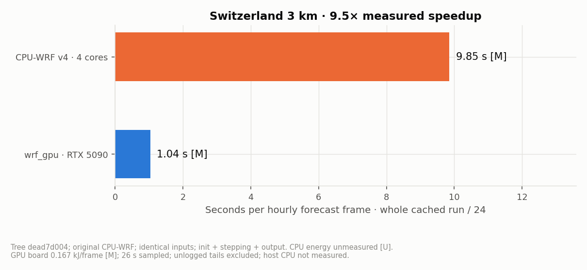
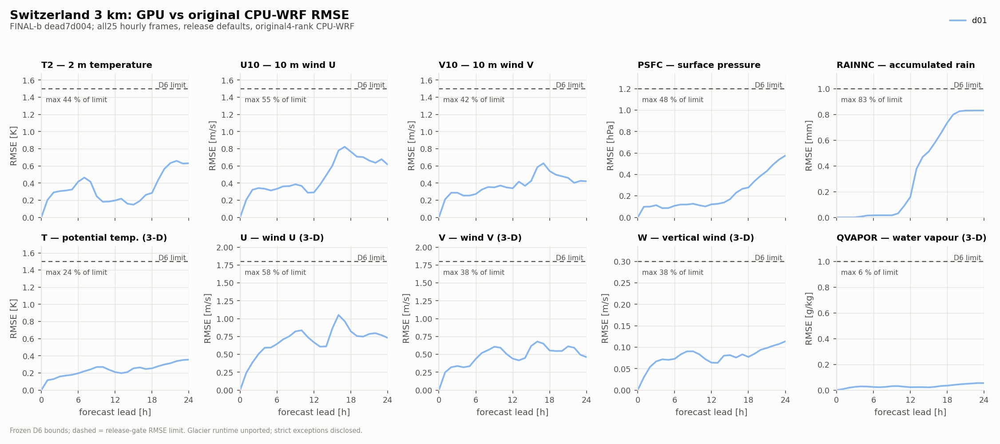
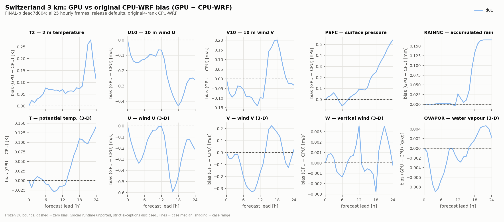
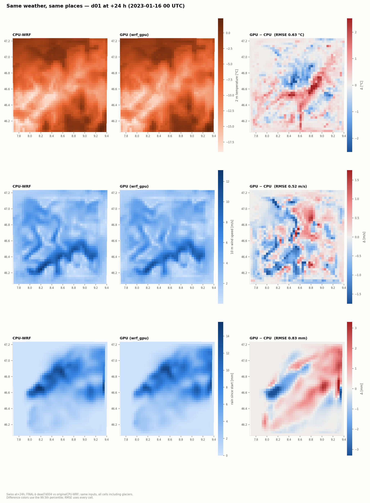

# Switzerland 3 km — v0.3 example (d01)

A small, self-contained real-data case so a fresh clone can run an end-to-end GPU
forecast with no external data download. The forecast window is **24 hours**.

## What's here

| File | Size | What it is |
| --- | --- | --- |
| `wrfinput_d01` | ~3.8 MB | WRF initial condition (one time level) |
| `wrfbdy_d01` | ~9.6 MB | Lateral boundary tendencies for the run window |
| `namelist.input` | ~4 KB | The WRF namelist (physics + domain) for this case |

Domain: **42 × 42 mass points, 44 vertical levels, Δx = Δy = 3 km**, single domain.
Init: **2023-01-15 00:00 UTC**. Boundary interval: 3-hourly.
Physics menu: `mp_physics=8` (Thompson), `ra_lw/sw=4` (RRTMG), `sf_surface=4`
(Noah-MP), `bl_pbl=5` / `sf_sfclay=5` (MYNN), `cu_physics=0`.

## Provenance & license

The fields are derived from **NCEP GFS** analysis (US Government, public domain)
through the standard WPS / `real.exe` preprocessing chain (`TITLE = OUTPUT FROM
REAL_EM V4.7.1 PREPROCESSOR`, `SIMULATION_INITIALIZATION_TYPE = REAL-DATA CASE`).
GFS products are public domain, so these derived inputs are freely redistributable.

## Run it

This case selects RRTMG radiation and Noah-MP, which read lookup tables from a
pristine WRF v4 install, so set `GPUWRF_WRF_ROOT` first (see the top-level
[run instructions](../../README.md)):

```bash
export GPUWRF_WRF_ROOT=/path/to/your/WRF      # your pristine WRF v4 source/run tree
python -m gpuwrf.cli run \
    --input-dir   examples/switzerland_d01 \
    --output-dir  runs/switzerland_d01 \
    --domain      d01 \
    --hours       24 \
    --scratch-dir runs/switzerland_scratch

ncdump -h runs/switzerland_d01/wrfout_d01_2023-01-15_00:00:00
```

This uses the release defaults without a flag file. The first run compiles the
model, and later runs reuse the cache. Cold
compile time and cached whole-run time are reported separately below.

## Reference and benchmark

The reference is **original CPU-WRF v4**, using the same executable as the WN3
CPU reference forecasts. It ran the three shipped input files unchanged, with
four MPI ranks on four physical cores (AMD Ryzen 9 9950X, nice 19, one thread per
rank). It produced all 25 hourly frames from 2023-01-15 00Z through 2023-01-16 00Z.

| Measurement | CPU-WRF, 4 cores | RTX 5090, release defaults |
| --- | ---: | ---: |
| Whole-run wall / 24 forecast hours, through last file | **9.85 s/frame [M]** | **1.04 s/frame [M]** |
| Full process wall, 24 h forecast | **236.56 s [M]** | **26.06 s [M]** |
| Energy per forecast hour | Unmeasured [U] | **0.167 kJ, GPU board [M]** |

An output frame represents one simulated hour. The denominator is the 24 hourly
intervals; the initial frame is also written. The CPU last-file wall is 236.46 s,
including startup and output. Per-step WRF timing totals 233.78 s (9.74 s/hour).
CPU energy for this four-core example is not inferred from the twelve-core
benchmark elsewhere in the project.

The cached GPU last-file wall is 24.89 s: **9.50× the four-core CPU-WRF rate [M]**.
Cold setup plus the forecast took 379.98 s (6.3 minutes), with other CPU scoring
active during that cold run. Cached timing ran with no other heavy jobs on the
host. Board energy integrates 26 seconds of timestamped power samples; the
largest sample gap is 2 seconds. Host CPU energy and unlogged tails are excluded.

The [CPU receipt](evidence/cpu_reference.json),
[GPU receipt](evidence/gpu_reference.json) and
[benchmark evidence](evidence/benchmark.json) retain the input hashes and clocks.

<picture><source media="(prefers-color-scheme: dark)" srcset="img/benchmark_dark.png"></picture>

## Agreement with CPU-WRF

The GPU run is compared with the project's frozen per-variable tolerance set,
D6, at every hourly frame, including initialization. Standalone strict integrity checks missing CPU
variables and the full CPU-WRF global header at every paired hour, and samples
the first, middle and last frames for spuriously constant fields. We also call
the same frozen strict function separately on all 25 frames for a complete field
census. Raw failures and any explicitly accepted exceptions are reported
separately from physical tolerance passes.

**D6 passes at all 25 frames:** 362 common variables, 361 numeric variables,
62 variables with frozen bounds, zero bound failures and all compared GPU values
finite. The ten fields below show RMSE and signed bias through 24 h. These are
comparisons with the original CPU-WRF reference above.

<picture><source media="(prefers-color-scheme: dark)" srcset="img/identity_dark.png"></picture>
<picture><source media="(prefers-color-scheme: dark)" srcset="img/identity_bias_dark.png"></picture>
<picture><source media="(prefers-color-scheme: dark)" srcset="img/map_dark.png"></picture>

**Strict integrity retains raw failures in 15 fields**, accepted as disclosed
exceptions on 2026-10-04: glacier missing values/inactive diagnostics and initial
writer statics, plus a weak rain tail at +22 h (`QRAIN` CPU maximum
1.19e-8 kg/kg; `QNRAIN` 84.1 kg⁻¹; GPU zero). All CPU variables and global-header
attributes are present at all frames. The
[complete field table](../../docs/release/VALIDATION.md#switzerland-24-h) and
[raw audit](evidence/integrity_every_frame.json) retain every affected frame.
These exceptions are separate from the numerical D6 pass.

The albedo sentinel is absent at all 25 frames; the first eight night frames
match original CPU-WRF exactly. Snow-aging `TAUSS` RMSE at +24 h is 0.01694 on
the fixed 1,700 CPU initial-snow cells; this is a diagnostic comparison, not an
additional invented tolerance. See [snow/albedo evidence](evidence/snow_albedo.json).

The compiled kernels pass the stack-size check; a few large kernels are flagged
by a conservative static scan and were accepted after checking that they only
call small helper routines. The [complete scan evidence](evidence/cubin_gate.json)
retains those flags and the qualified acceptance.

The numerical comparison covers this bundled Swiss example. The WN3 Tenerife
cases described in the project README govern the operational release gate.

## Glacier limitation

This case includes glacier cells. Their initialization follows WRF's
`NOAHMP_INIT` convention, but the separate `NOAHMP_GLACIER` runtime is not yet
ported; those cells currently evolve through the standard Noah-MP surface model.
Glacier runtime support is planned for v0.3.1. The whole-domain results pass the
configured numerical limits at all 25 frames; they do not establish
glacier-runtime fidelity.
