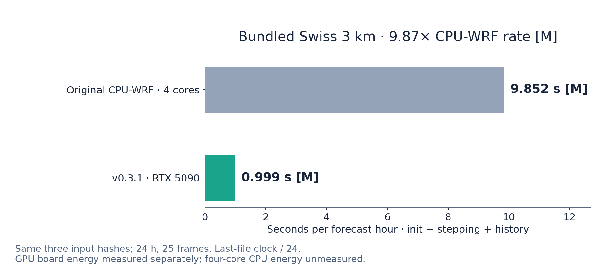
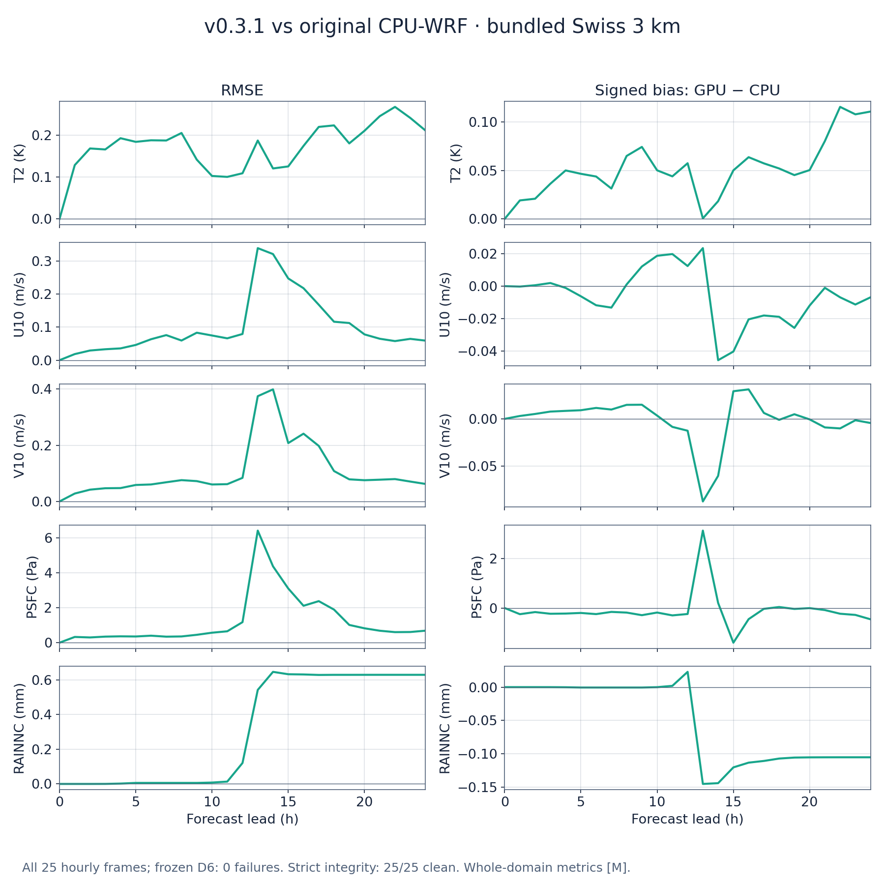
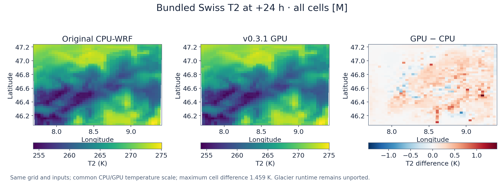

# Switzerland 3 km demo — v0.3.1

This small Alpine forecast is a starting point for running `wrf_gpu` with real
WRF inputs. It contains one **42×42×44 domain at 3 km**, initialized on
**2023-01-15 00Z**, and a 24-hour boundary window. The physics is Thompson
microphysics, RRTMG longwave/shortwave radiation, Noah-MP land physics and MYNN
turbulence/surface layer; cumulus is disabled.

The current results below were measured on **v0.3.1**, not relabelled from an
older GPU run. The reference is **original Fortran CPU-WRF v4**, using the same
three input-file hashes and the same executable used for the project's CPU
reference forecasts. It ran with four MPI ranks on four physical Ryzen 9 9950X
cores. This single-domain demo is distinct from the larger two-domain Swiss
winter forecasts in the [release validation](../../docs/release/V0.3.1.md).

## Run the forecast

Install the CUDA-enabled JAX build and `wrf_gpu` as described in the
[main README](../../README.md). This case reads WRF runtime tables, so point
`GPUWRF_WRF_ROOT` at a WRF v4 tree containing `run/` and its tables:

```bash
export GPUWRF_WRF_ROOT=/path/to/WRF
python -m gpuwrf.cli run \
  --input-dir examples/switzerland_d01 \
  --output-dir runs/switzerland_d01 \
  --domain d01 --hours 24 \
  --scratch-dir runs/switzerland_scratch

ncdump -h runs/switzerland_d01/wrfout_d01_2023-01-15_00:00:00
```

The normal recipe uses the release defaults. No flag file or force override is
required. The first run compiles the geometry and physics; the measured fresh
setup plus 24-hour forecast took **287.40 s, about 4.8 minutes** [M]. Cached
runs reuse those programs. Your driver, host, caches and other workloads can
change that time, so a silent compilation interval before output is expected.

A successful full run writes **25 hourly NetCDF frames**, including the initial
frame and ending at `2023-01-16_00:00:00`, plus its run proof. Use a fresh output
directory for a new run. Inspect the completion status and proof as well as
the files; a partially written forecast is not a complete 24-hour result.
The NetCDF files use WRF names/dimensions and can be opened with familiar
NetCDF/xarray tools. `ncdump` is optional; it does not perform a fidelity test.

## Measured cached performance

Hardware: **RTX 5090 (sm_120, CUDA 13), Ryzen 9 9950X host**. Both CPU and GPU
measurements include initialization, stepping and output. The rate clock ends
at the last history file; full process clocks are listed separately.

| Measurement | Original CPU-WRF, 4 cores | v0.3.1, RTX 5090 |
|---|---:|---:|
| Last-file wall / 24 forecast hours [M] | 9.852 s/hour | **0.999 s/hour** |
| Full process wall, 24-hour forecast [M] | 236.56 s | **24.90 s** |
| Energy per forecast hour | Unmeasured [U] | **142 J, GPU board [M]** |

The measured last-file wall is **236.46 s CPU** and **23.97 s GPU**: **9.87×
the original four-core CPU-WRF rate** [M]. An hourly output frame represents
one simulated hour; the denominator is 24 hourly intervals even though the
initial frame is also written. Cold setup is excluded from this cached rate.
The cached GPU run used a short quiet-host timing window.

<picture><source media="(prefers-color-scheme: dark)" srcset="img/benchmark_v031_dark.png"></picture>

GPU energy integrates **23 seconds of actual timestamped board-power samples**
inside the 24.90-second process window with the E158 trapezoid rule. The largest
sample gap is one second; **1.90 seconds of endpoint tails are unlogged and
excluded**. GPU host energy is not included in this board value. CPU energy for
this four-core example is unmeasured; the twelve-core power assumption elsewhere
is not reused for it.

The [CPU receipt](evidence/cpu_reference.json),
[fresh GPU receipt](evidence/gpu_reference_v031.json) and
[benchmark/sample evidence](evidence/benchmark_v031.json) preserve the input
hashes, measured build and clocks.

## Agreement with original CPU-WRF

All **25 paired hourly frames** pass the frozen D6 numerical limits, with zero
bound failures [M]. This is an independent original-WRF comparison, not a
GPU-to-GPU identity claim. The same source/inputs/cadence define every comparison.

| Worst hourly whole-domain RMSE through 24 h [M] | Value |
|---|---:|
| T2 | 0.267 K |
| U10 / V10 | 0.339 / 0.399 m/s |
| PSFC | 6.421 Pa |
| RAINNC | 0.645 mm |

These are whole-domain RMSE values, not maximum single-cell errors. The plot
shows RMSE and signed GPU-minus-CPU bias at each lead; the map compares T2 on
the full grid at +24 h with a common temperature scale and a separate difference
scale. Individual glacier cells can differ more than the domain RMSE suggests.

<picture><source media="(prefers-color-scheme: dark)" srcset="img/identity_v031_dark.png"></picture>
<picture><source media="(prefers-color-scheme: dark)" srcset="img/map_v031_dark.png"></picture>

**Direct strict output integrity passes all 25 frames**, with zero degenerate
fields, missing CPU variables or global-header gaps [M]. This new v0.3.1 result
supersedes the demo's older disclosed v0.3.0 writer findings; it does not erase
those [historical reports](../../docs/release/VALIDATION.md#switzerland-24-h).
See the [current field/lead evidence](evidence/identity_v031.json) and
[all-frame integrity report](evidence/integrity_v031.json).

The actual compiled step passes the hard stack criterion, maximum **16 B** [M].
The conservative static scan still flags six CALL roots and six kInput fusions;
those lists are retained, not described as absent. The
[compiled-program scan](evidence/cubin_v031.json) qualifies that resource result.

## Scope, provenance and license

Glacier initialization and missing-value conventions follow the corrected WRF
path, but the dedicated `NOAHMP_GLACIER` runtime remains unported. Those cells
evolve through the standard Noah-MP surface model. The full-domain tolerance
pass does not prove every glacier process or bit-identical trajectories.
Other physics/geometry choices need their own validation.

The meteorological inputs are derived from **NCEP GFS** analysis through WPS
and `real.exe` (`OUTPUT FROM REAL_EM V4.7.1 PREPROCESSOR`). GFS is public domain;
terrain, land-use and soil data retain their providers' terms. That distinction
also applies to WRF runtime tables. See [THIRD_PARTY_NOTICES.md](../../THIRD_PARTY_NOTICES.md)
and the main [license](../../LICENSE).
