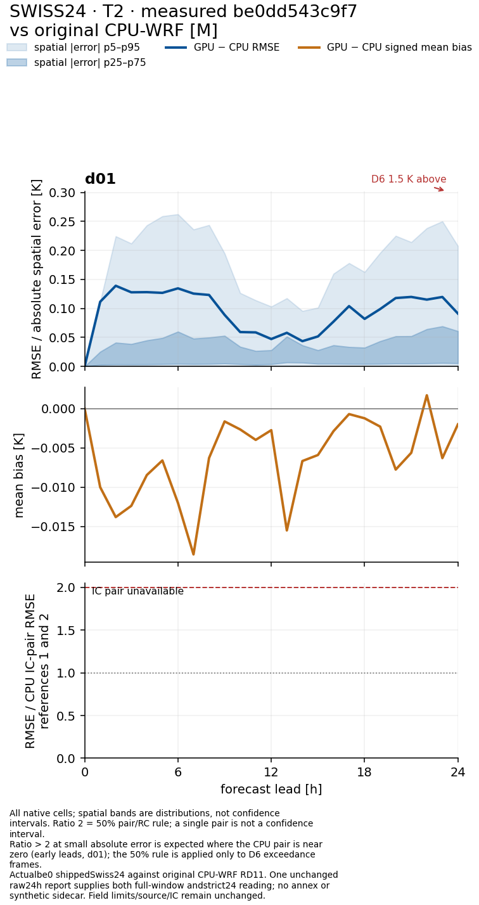
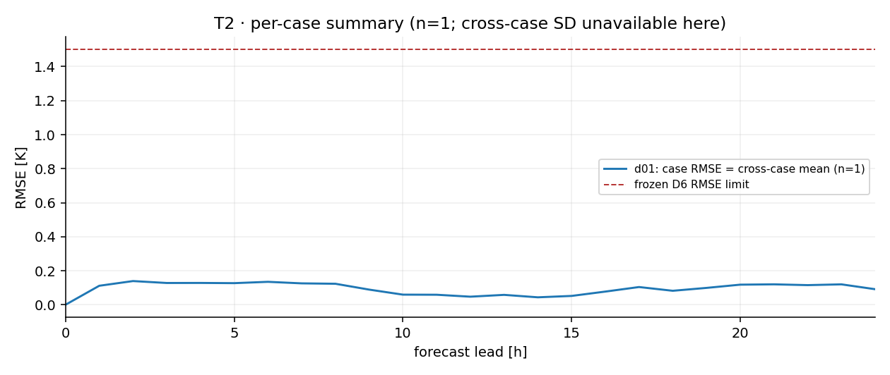

# Switzerland 3 km demo — v0.3.3

This bundled Alpine forecast contains one **42×42×44 domain at 3 km**, initialized
on **2023-01-15 00Z**, with a full 24-hour boundary window. It uses Thompson,
RRTMG, Noah-MP and MYNN; cumulus is off. The final v0.3.3 comparison below
uses source `be0dd543` and original CPU-WRF RD11. Earlier measurements are
source-dated historical evidence, not relabelled as this final run.

## Final v0.3.3 comparison

The final 24 h run on be0 compares all 25 hourly frames against original CPU-WRF RD11: raw D6 PASS and all-frame integrity PASS. [Current RMSE/bias/spatial-band plots and source/reference manifest](../../docs/release/evidence/v033/final_w3/SWISS24/index.html) retain the exact source. Earlier plots and benchmark clocks below keep their original source labels. The required small-grid stability firewall adds about 12% kernels and 8% ordinary-root time only on grids with ≤4096 columns; this is not a new whole-run benchmark.

## Run

Install CUDA-enabled JAX and the package as in the [main README](../../README.md).
Set the original WRF v4 runtime-table root, then use the normal public CLI:

```bash
export GPUWRF_WRF_ROOT=/path/to/WRF
python -m gpuwrf.cli run \
  --input-dir examples/switzerland_d01 \
  --output-dir runs/switzerland_d01 \
  --domain d01 --hours 24 \
  --scratch-dir runs/switzerland_scratch
```

Release defaults apply; no flag file or force override is required. The first
run compiles this geometry. A new version changes the cache namespace; cached
performance assumes those programs already exist. Use a fresh output directory.
A complete run writes **25 hourly NetCDF files**, including t0 and ending at
`2023-01-16_00:00:00`, plus its run proof. Inspect completion status and proof,
not only file presence. Standard NetCDF/xarray tools can read the history.

## Identity against original CPU-WRF [M]

The reference is original Fortran WRF v4 on four MPI ranks/four physical
Ryzen 9 9950X cores, with matched input files and runtime tables. This is not
an older GPU forecast used as truth. The new frozen-source run passes D6 on
**all 25 frames**, with **zero bounded-field failures**. Full-frame strict
integrity also passes 25/25: no missing CPU variables, degenerate fields or
CPU-header gaps. The larger two-domain winter examples are separate cases.





These are lead-time plots, not a spatial map. The [final Swiss gallery](../../docs/release/evidence/v033/final_w3/SWISS24/index.html)
contains all variables, the hourly heatmap and source-bound numerical data.
Every native cell is included without masks. Agreement is tolerance-based,
not bitwise identity; it does not establish every glacier process. The dedicated
Noah-MP glacier runtime remains unported.

## Benchmark provenance

No final-v0.3.3 complete-process Swiss benchmark figure is supplied here.
The final identity plots above are not a performance benchmark. Earlier
[Swiss v0.3.1 benchmark evidence](evidence/benchmark_v031.json) retains its
original version and clocks; its figure and metrics are not relabelled v0.3.3.
No new board-power samples or four-core CPU energy claim are made for the final run.

See the [v0.3.3 technical validation appendix](../../docs/release/TECHNICAL_VALIDATION_APPENDIX_v0.3.3.md)
for the 72-hour cases, frozen annexes, native checks and accepted disclosures.
