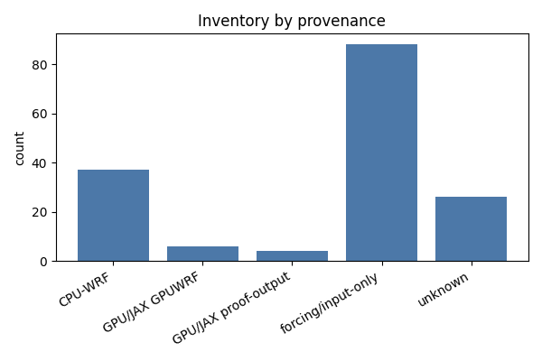
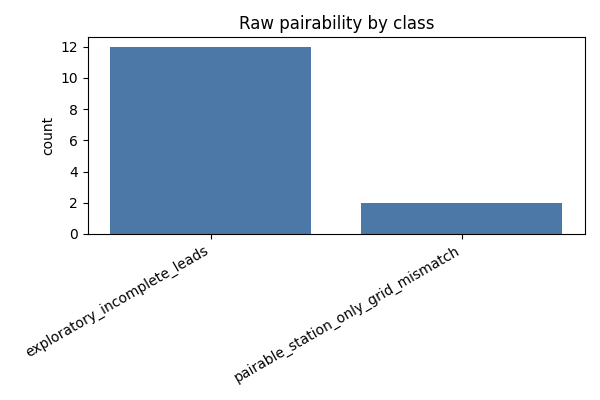

# Canary Existing-Data Summary

Generated UTC: 2026-06-08T16:25:07.083068+00:00

- Inventory records: 161
- Raw CPU/GPU pair candidates: 14

## Inventory By Provenance

- CPU-WRF: 37
- GPU/JAX GPUWRF: 6
- GPU/JAX proof-output: 4
- forcing/input-only: 88
- unknown: 26

## Pairability

- exploratory_incomplete_leads: 12
- pairable_station_only_grid_mismatch: 2

## Pairability By Domain

- d01: exploratory_incomplete_leads=5
- d02: exploratory_incomplete_leads=5, pairable_station_only_grid_mismatch=2
- d03: exploratory_incomplete_leads=2
