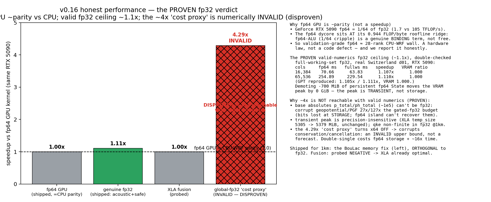

## v0.16 honest performance — no false speedup (PROVEN fp32 verdict)

- **fp64 GPU ≈ CPU-WRF parity (NOT a speedup).** A GeForce RTX 5090 runs fp64 at 1/64 of fp32; the fp64 dycore sits at its 0.944 FLOP/byte roofline ridge, so the fp64-ALU term genuinely binds. Validation-grade fp64 ≈ 28-rank CPU-WRF wall — a hardware law, reported honestly. **Unchanged headline.**
- **The valid-numerics fp32 ceiling is a real but small ~1.1× — PROVEN and double-confirmed.** The make-or-break full-working-set fp32 investigation is **complete** (Opus implementation + independent GPT reproduction): the genuine fp32 win (acoustic + safe-compute; oracles pass) is **~1.1×** with **0 % VRAM-peak reduction from precision alone**. Measured full-working-set, real Switzerland d01, RTX 5090: **16k 1.107× / 65k 1.110×, VRAM ratio 1.000** (`proofs/perf/v016/fullws_fp32_km_bench.json`); the numerically-defensible `safe` lane is **16k 1.108×, VRAM 1.000** (`fullws_safe_km_bench.json`). GPT independently reproduced **1.105× / 1.111×, VRAM 1.000** (`gpt_fullws_reproduce.json`).
- **~4× is NOT reachable with valid numerics — PROVEN by three measured pillars.** (1) Demoting the **whole** persistent State to fp32 (−700 MiB carried fp64 arrays at 65k) moves the VRAM peak by **0 GiB** — the peak is **transient** working memory, not persistent storage. (2) The base absolutes `p_total`/`ph_total` (~1e5) **cannot be stored fp32**: doing so corrupts the geopotential/PGF gradients **27× / 127×** beyond the gated-fp32 budget (bits are lost at *storage*, so an in-loop fp64 island is powerless), and they are conservation-pinned to fp64 **and** are the large arrays (`fullws_base_absolute_oracle.json`, `GATE_PASS=False`). (3) The transient peak is **precision-insensitive** (XLA `temp_size` 5305→5379 MiB, unchanged), dominated by fp64 cancellation islands + the qke-pinned MYNN work (qke goes non-finite in fp32 at 1 km: 3036 cells).
- **The 4.3× 'cost proxy' is a numerically-INVALID global-fp32 artifact (DISPROVEN), not a next-version target.** The 70.49 → 16.44 ms/step (4.29×) figure turns JAX x64 **off** and downcasts the cancellation/conservation compute, corrupting the very pins that keep the forecast finite (qke non-finite at 1 km). It is an **upper-bound cost proxy for invalid numerics**, not a reachable WRF-faithful speedup. Double-single recovery costs **fp64-equivalent storage + ~16× time**; 6× always exceeded the RTX 5090 roofline.
- **Fusion gives ~0%** — the env-gated carry-split probe is bit-identical (60/60) with wall −1.6 % and bytes −0.14 %: XLA already fuses the step optimally.
- **The real wins shipped in 0.16:** the genuine ~1.1× fp32 lane **plus** the **1 km-unlock** — the chunked / O(nz) MYNN BouLac memory fix (above), which is **orthogonal to fp32** and makes a 1 km single domain fit on one RTX 5090. The boundary-forced long-horizon fixture is **built** (fp64 stable under LBC; fp64-vs-fp64 control = 0.000 RMSE).

> Full evidence + the two double-confirming verdict reports: `proofs/v016/fp32_verdict/`.

