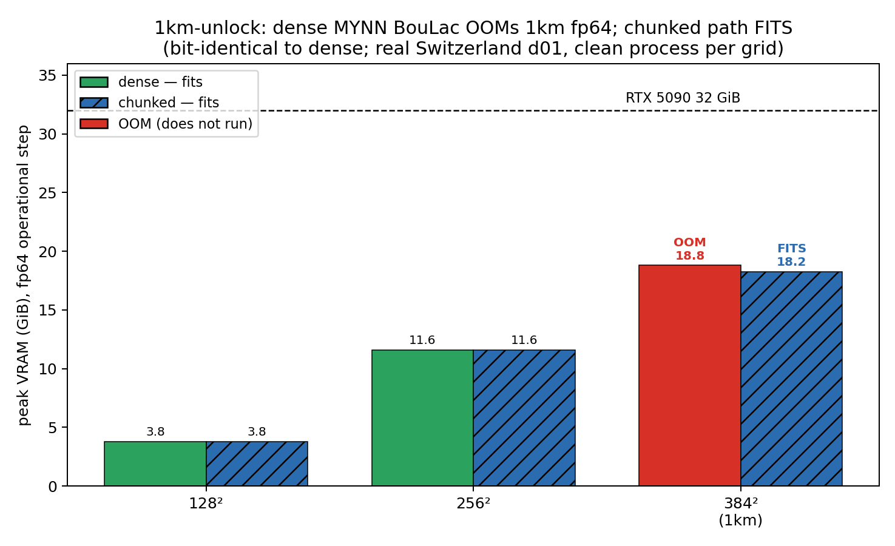

## v0.16 1km-unlock — chunked MYNN BouLac

The dense `(B, nz, nz)` MYNN BouLac parcel-search matrix is the single large allocation that OOMs the **1km / 147,456-column fp64** operational step. The **source-chunked dense** path (`GPUWRF_MYNN_BOULAC_CHUNKED=1`, default chunk=1; default OFF — dense stays the untouched default) keeps the fusion-friendly cumsum kernel but caps memory at `(B, chunk, nz)`, so the 1km step now **fits on one RTX 5090** and is **bit-identical** to dense.

| grid | ncol | dense BouLac | chunked BouLac (CHUNKED=1) | 1km fits? |
|---|---:|---|---|---|
| 128² | 16,384 | OK 3.77 GiB, 70.4 ms/step | OK 3.47 GiB, 72.2 ms/step | — |
| 256² | 65,536 | OK 11.61 GiB, 254.7 ms/step | OK 10.18 GiB, 260.7 ms/step | — |
| 384² **(1km)** | 147,456 | **OOM (attempted 18.80 GiB)** | **OK 18.25 GiB, finite, 567 ms/step** | **YES** |

**Bit-identity (oracle, 8 WRF stratification regimes, chunk ∈ {1,3,4,7,16} incl. non-divisors of nz=44):** chunked vs whole-domain dense `max_abs == 0.0` (**BIT-IDENTICAL**); chunked vs independent WRF nested-DO-WHILE NumPy reference `max_rel = 2.41e-16` (machine eps). Source: `proofs/perf/v016/boulac_chunked_oracle.json`.

**Caveat (honest):** the 1km fit is **measured in a fresh process per grid**. Repeated multi-grid runs in one process can **fragment allocator memory**, so production should **isolate grids per process or recycle the process** between grids rather than sweeping many resolutions in one long-lived process. This unlock is a pure algorithmic memory partition, **orthogonal to fp32** (precision does not move the transient-dominated peak — see `HONEST_PERF_PANEL.md`).

