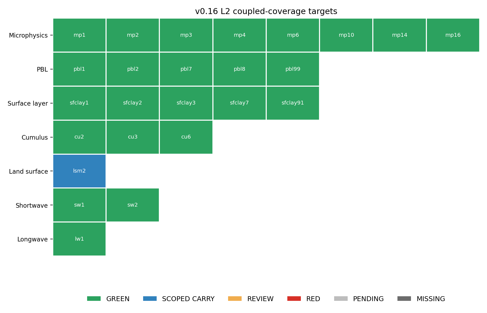
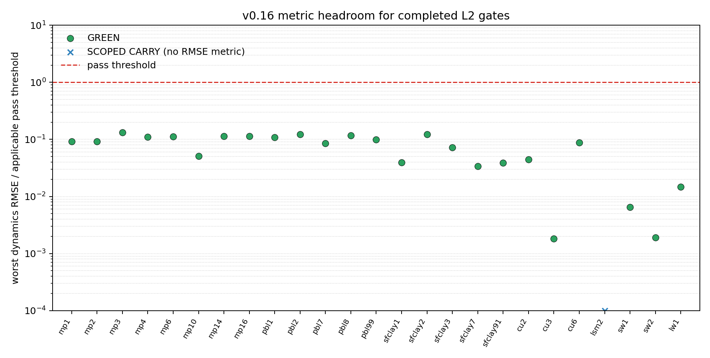

## v0.16 Coupled-Coverage Status

Generated: 2026-06-14T03:51:03+00:00

Inputs: `proofs/v016/coverage_map.json` and `proofs/v016/coverage`.

Only an explicit gate verdict of `PASS` is classified as GREEN. `SCOPED_CARRY` is a distinct status — a recognized scheme that is not coupled-runnable on this real case without an additional data build (an honest, scoped carry, **not** a missing proof). `FAIL` is RED, absent gate files are PENDING, and unreadable/incomplete gate files are MISSING. `REVIEW` is kept separate and is not counted as green.

Summary: **25 L2 targets: 24 GREEN + 1 scoped carry**.

The first plot shows GREEN/SCOPED-CARRY/RED/REVIEW/PENDING coverage across every L2 target by family. The second plot shows each completed scheme's worst dynamics RMSE divided by the applicable pass threshold on a log scale; values below 1.0 are inside the gate threshold.

| scheme | family | option | name | verdict | key metric vs oracle | tolerance |
|---|---|---:|---|---|---|---|
| mp1 | mp_physics | 1 | Kessler warm rain | GREEN | U RMSE 0.1657 (0.09205x manifest) | U RMSE <= 1.8 |
| mp2 | mp_physics | 2 | Purdue-Lin | GREEN | U RMSE 0.1652 (0.0918x manifest) | U RMSE <= 1.8 |
| mp3 | mp_physics | 3 | WSM3 simple ice | GREEN | U RMSE 0.2366 (0.1315x manifest) | U RMSE <= 1.8 |
| mp4 | mp_physics | 4 | WSM5 | GREEN | U RMSE 0.199 (0.1105x manifest) | U RMSE <= 1.8 |
| mp6 | mp_physics | 6 | WSM6 | GREEN | U RMSE 0.2002 (0.1112x manifest) | U RMSE <= 1.8 |
| mp10 | mp_physics | 10 | Morrison two-moment | GREEN | U RMSE 0.09229 (0.05127x manifest) | U RMSE <= 1.8 |
| mp14 | mp_physics | 14 | WDM5 | GREEN | U RMSE 0.2031 (0.1128x manifest) | U RMSE <= 1.8 |
| mp16 | mp_physics | 16 | WDM6 | GREEN | U RMSE 0.2041 (0.1134x manifest) | U RMSE <= 1.8 |
| pbl1 | bl_pbl_physics | 1 | YSU | GREEN | U RMSE 0.5864 (0.3258x manifest) | U RMSE <= 5.4 (3x manifest 1.8) |
| pbl2 | bl_pbl_physics | 2 | MYJ | GREEN | U RMSE 0.658 (0.3655x manifest) | U RMSE <= 5.4 (3x manifest 1.8) |
| pbl7 | bl_pbl_physics | 7 | ACM2 | GREEN | U RMSE 0.4583 (0.2546x manifest) | U RMSE <= 5.4 (3x manifest 1.8) |
| pbl8 | bl_pbl_physics | 8 | BouLac | GREEN | U RMSE 0.6295 (0.3497x manifest) | U RMSE <= 5.4 (3x manifest 1.8) |
| pbl99 | bl_pbl_physics | 99 | MRF | GREEN | U RMSE 0.5338 (0.2966x manifest) | U RMSE <= 5.4 (3x manifest 1.8) |
| sfclay1 | sf_sfclay_physics | 1 | sfclayrev | GREEN | U RMSE 0.2117 (0.1176x manifest) | U RMSE <= 5.4 (3x manifest 1.8) |
| sfclay2 | sf_sfclay_physics | 2 | Janjic Eta surface layer | GREEN | U RMSE 0.658 (0.3655x manifest) | U RMSE <= 5.4 (3x manifest 1.8) |
| sfclay3 | sf_sfclay_physics | 3 | NCEP GFS surface layer | GREEN | U RMSE 0.3869 (0.2149x manifest) | U RMSE <= 5.4 (3x manifest 1.8) |
| sfclay7 | sf_sfclay_physics | 7 | Pleim-Xiu surface layer | GREEN | U RMSE 0.1829 (0.1016x manifest) | U RMSE <= 5.4 (3x manifest 1.8) |
| sfclay91 | sf_sfclay_physics | 91 | old MM5 surface layer | GREEN | U RMSE 0.2105 (0.117x manifest) | U RMSE <= 5.4 (3x manifest 1.8) |
| cu2 | cu_physics | 2 | Betts-Miller-Janjic | GREEN | U RMSE 0.2383 (0.1324x manifest) | U RMSE <= 5.4 (3x manifest 1.8) |
| cu3 | cu_physics | 3 | Grell-Freitas | GREEN | W RMSE 0.001632 (0.00544x manifest) | W RMSE <= 0.9 (3x manifest 0.3) |
| cu6 | cu_physics | 6 | Tiedtke | GREEN | U RMSE 0.4719 (0.2621x manifest) | U RMSE <= 5.4 (3x manifest 1.8) |
| lsm2 | sf_surface_physics | 2 | Noah classic | SCOPED_CARRY | scoped carry (needs real-case data build) | n/a |
| sw1 | ra_sw_physics | 1 | Dudhia shortwave | GREEN | T RMSE 0.0098 (0.006533x manifest) | T RMSE <= 1.5 |
| sw2 | ra_sw_physics | 2 | GSFC (Chou-Suarez) shortwave | GREEN | T RMSE 0.002861 (0.001907x manifest) | T RMSE <= 1.5 |
| lw1 | ra_lw_physics | 1 | RRTM longwave | GREEN | T RMSE 0.02201 (0.01468x manifest) | T RMSE <= 1.5 |
