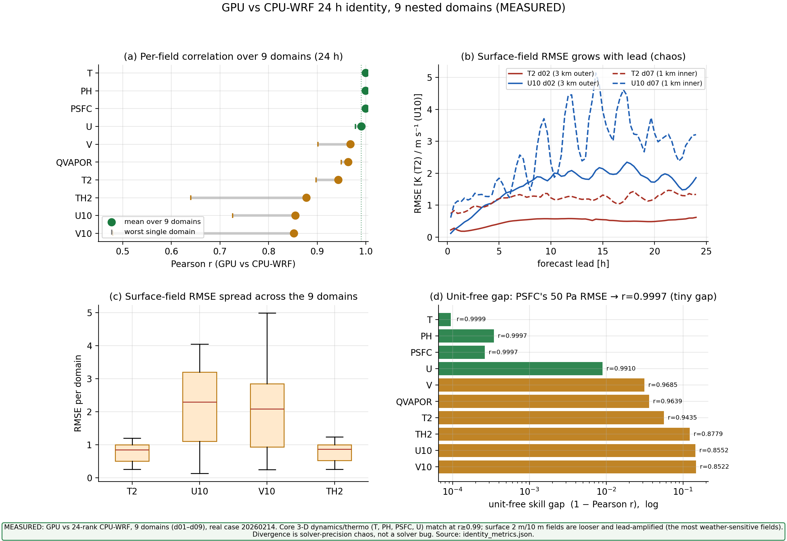
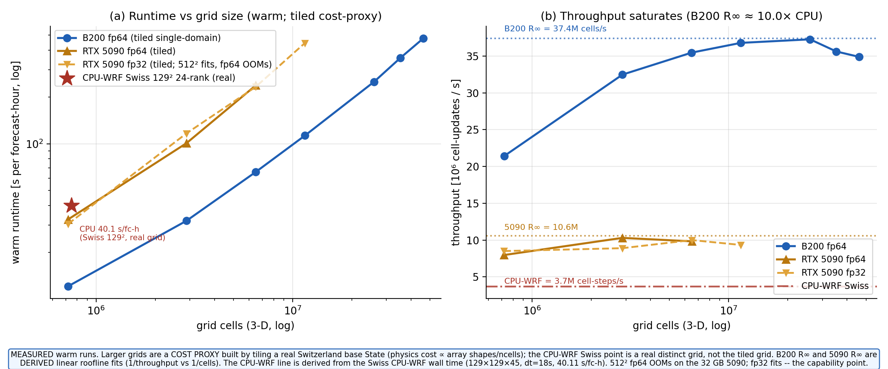
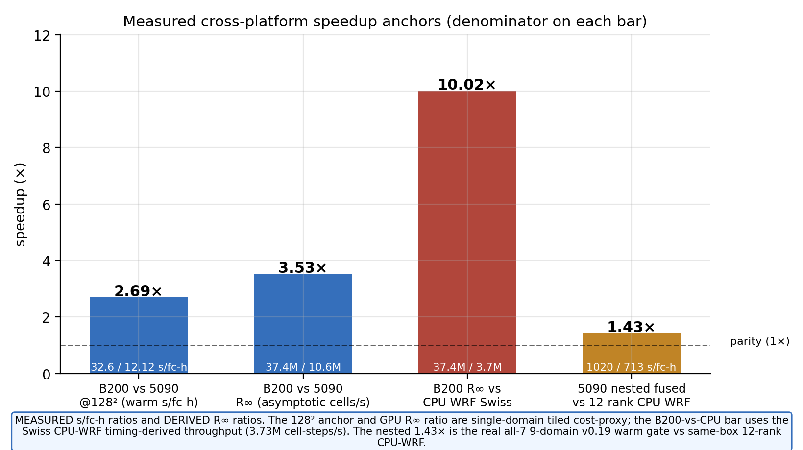
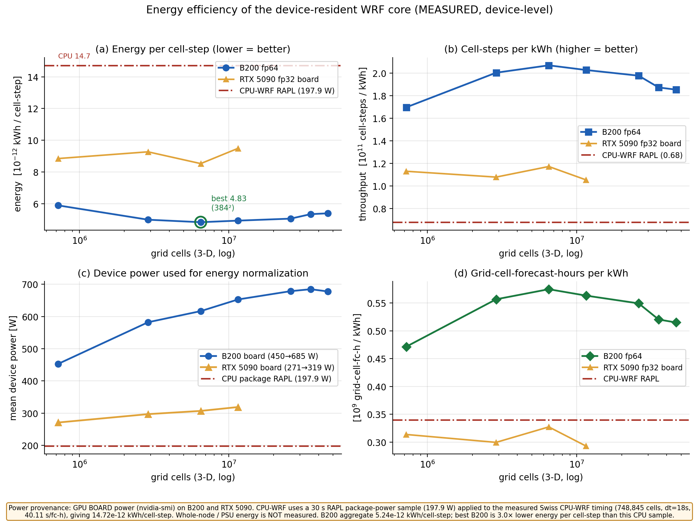
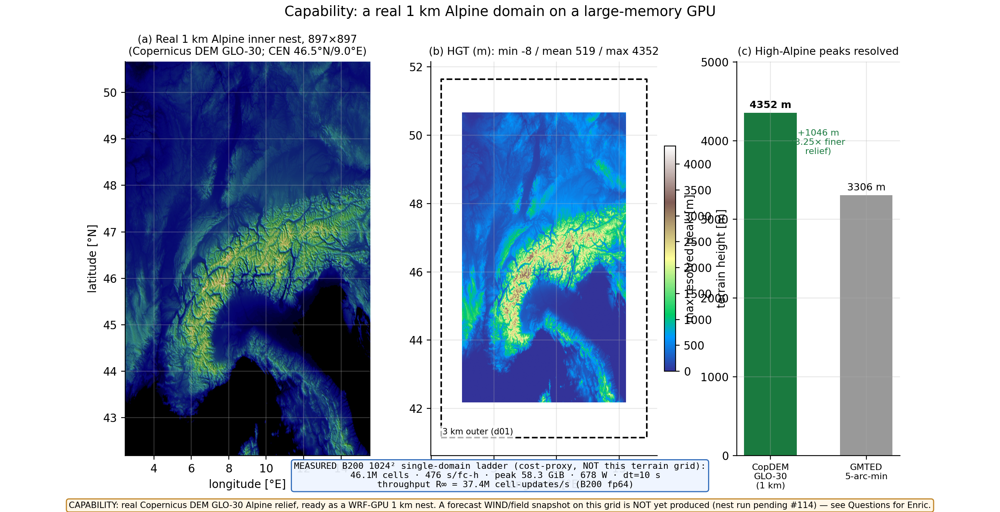

# wrf_gpu

**A GPU-native, WRF-compatible regional weather model.** `wrf_gpu` runs a
standalone WRF v4 ARW forecast end-to-end on a single GPU: it reads a standard
WRF `namelist.input`, assembles its own initial/boundary state from `met_em`
forcing (no `real.exe`, no CPU-WRF dependency), integrates a nonhydrostatic
split-explicit ARW dycore on the GPU, and writes a WRF-compatible `wrfout`
history file.

It is **not** a port of legacy WRF Fortran. It is a clean JAX rewrite that
targets the GPU memory hierarchy from day one and validates against WRF as an
**oracle** — proving cell-for-cell identity to CPU-WRF v4 rather than inheriting
WRF's architecture. The dynamical core runs in **fp64** (around the
pressure-gradient / buoyancy cancellation). The original operational target is
**Canary Islands daily forecasting** (3 km then 1 km) on a single-workstation
RTX 5090 — but its real strength is at the **opposite end of the spectrum: large
grids, big fp64-native GPU systems, and GPU clusters** (B200 / GB300 /
NVL72-class).

**The current release is v0.21.0** — a **stability + compile-cache-speed**
release on top of the v0.20.x line. Its defining changes are:

- a **dycore boundary-stability fix** that makes the all-7-island, 9-domain
  Canary nest run **finite through the divergence window** that previously failed
  near step 67 (MEASURED on the gate case);
- a **default-on fail-fast finite guard** that stops a forecast at the first
  `NaN`/`Inf` with the exact `{domain, field, level, step, sim-time, index}`
  instead of letting corruption reach the output writer;
- a **version-keyed compile cache** so a new release never mistakes a stale cache
  for a warm one; and
- an **AOT "cheap-key" cross-process warm-start**, now **on by default**: a fresh
  process **loads the already-compiled GPU executables from disk and skips the
  multi-tens-of-minutes re-lower** the old cache still paid. This is the genuine
  compile-time speed win of the release.

**Scope of the v0.21.0 speed win — read this first.** v0.21.0 is faster at
**getting a run started** (compile / warm-start time), **not** at running the
forecast itself. Warm forecast throughput (seconds per forecast-hour) is
**unchanged** from v0.20 and stays byte-identical on the fp64 default path. Full
v0.21.0 notes: `RELEASE_NOTES_v0.21.0.md`. The
capability and identity narrative below is carried forward from v0.20 and still
applies.

### What it is good for

- **Running real regional ARW forecasts on a GPU** from a standard WRF namelist —
  single-domain or live-nested (d01→d02→d03, down to the 1 km nest), with native
  init, restart, and a WRF-compatible `wrfout`.
- **Capability the CPU stack cannot reach on one box.** **MEASURED:** a **1 km
  single domain fits one RTX 5090 bit-identically**, and the **all-7-island 1 km
  nested case runs end-to-end on one card**; a real **897² 1 km Alpine inner nest**
  (Copernicus DEM GLO-30 terrain, 3.25× finer relief than GMTED) is built and
  runnable. **PROJECTED:** large single grids and **cluster / multi-GPU
  weak-scaling** — the throughput path (memory arithmetic + fake-mesh bit-identity
  proven; real multi-GPU throughput **not yet benchmarked**).
- **Energy efficiency + modern-HPC fit (MEASURED at the device level / PROJECTED
  at scale).** **MEASURED (device/board power only):** on the parametrized scaling
  ladder the best B200 point is **4.83×10⁻¹² kWh per cell-step** (at 384²) versus a
  CPU RAPL package-power sample of 1.47×10⁻¹¹ — roughly an order of magnitude fewer
  joules per cell-step at the device level for large grids. **Whole-node / PSU
  energy is NOT measured**, and the per-kWh advantage is a large-grid device-level
  result, **not** a single-card small-nest claim. **PROJECTED:** that the
  device-bound kernel rides the GPU price/efficiency trend at scale — projected from
  the architecture, not yet benchmarked at production scale.
- **A transparent, forkable research artifact.** Every claim has a proof object on
  disk; every architecture decision has a documented design record.

### What it is NOT

- **Not a universal WRF v4.** It covers the common operational ARW subset (the
  wired physics menu below); every unsupported namelist option **fails closed before
  any compute** with a named reason — it never silently substitutes a scheme.
- **Not proven for full 24 h/72 h forecast-skill equivalence.** The
  dynamics/thermodynamics core is proven **cell-for-cell identical** to CPU-WRF; the
  broader T2/U10/V10 forecast-skill equivalence is the **open credibility gate** (see
  [Boundaries](#boundaries--what-is-not-claimed)).
- **Not a blanket single-card speedup story.** On tiny standalone geometries the GPU
  can still be launch/occupancy-bound — on a single-domain 129² grid it is **~2.3×
  SLOWER** than 24-rank CPU-WRF (host/launch-bound). The GPU advantage **grows with
  scale**: the all-7-island 1 km nested fast path is **MEASURED ~1.53× faster than the
  same-box 12-rank CPU-WRF baseline** (and ~1.07× faster than v0.19), byte-identical to
  v0.19 (1926/1926 vars, maxΔ=0). The broader value remains **capability** (1 km +
  scale), **fidelity**, **stability/reliability**, and **energy efficiency**.
- **Not a warm-forecast speedup in v0.21.0.** v0.21.0's speed win is **compile /
  warm-start time** (skip the re-lower), not the per-forecast-hour wall — that is
  unchanged from v0.20 and byte-identical on the default path.
- **Not** DFI / FDDA / spectral-nudging / WRF-Chem / WRF-Fire / urban / lake.

> ### v0.21.0 in one box — stability + a seconds-fast warm start
>
> **Stability.** The split-explicit acoustic boundary fix (a mass-drain limiter +
> a positive `c2a`/`alt` floor, WRF-faithful and identity-preserving) lets the
> canonical all-7-island 9-domain Canary nest integrate **past the old step-67
> divergence window with no NaN and no finite-guard abort** — MEASURED on the gate
> case. A new **default-on finite guard** (`GPUWRF_FINITE_CHECK=1`) makes any residual
> non-finite state **fail fast** with the exact first-bad
> `{domain, field, level, step, sim-time, index}`, instead of letting corruption reach
> the writer. Set `GPUWRF_FINITE_CHECK=0` only for an explicit max-performance
> experiment.
>
> *Honest limitation:* the **Mont-Blanc / 1042 m-per-cell EXTREME** case still
> relocates the instability and is **deferred to v0.21.1**; and the long-horizon
> 9-nest can still hit a **GPU-VRAM OOM** beyond ~90 min on the de-fuse path
> (#123, mitigated not eliminated — see Known issues).

> ### Compile/warm-start: a cache that "just works" — and a seconds-fast warm start
>
> The first forecast **JIT-compiles the GPU kernels**. A single-domain case compiles
> in roughly **½–12 min** (scales with grid size); the large all-7 9-domain nest is a
> separate, larger one-time compile (**de-fuse sequential ~70–75 min** cold on the
> reference RTX 5090, MEASURED). It is compiling, not hung.
>
> **New in v0.21.0 — the warm start skips the re-lower.** Two changes matter:
>
> 1. **Version-keyed cache directory.** The persistent, per-user, zero-config on-disk
>    cache now lives under a directory keyed by `wrf_gpu` version + JAX/JAXLIB version
>    + backend, so a stale older-release cache is never mistaken for a warm one.
>    Controls: `GPUWRF_JAX_CACHE=0` (disable), `GPUWRF_CACHE` (project cache root),
>    `GPUWRF_JAX_CACHE_DIR` (explicit dir, honored verbatim).
> 2. **AOT cheap-key cross-process warm-start (default on).** Previously, even with a
>    warm HLO cache, a fresh process had to **re-lower** the giant nested module to find
>    the right cached executable — tens of minutes for the 9-nest. v0.21.0 serializes
>    the compiled per-domain executables to disk and indexes them by a **cheap key** (a
>    fast hash over the call metadata that fully determines the compiled program,
>    computed **without lowering**). A fresh process **loads the executable directly and
>    skips the re-lower**. MEASURED on the 9-nest gate: **all 9 domains `loaded=true
>    source=aot_blob` cross-process, 0 fallback, 0 re-lower, warm keys byte-match the
>    cold keys, finite (0 NaN), warm peak host RSS 16.4 GB, load in seconds.**
>
> **The three compile modes:** the nest default is **fused + AOT**.
> *Default* (no env) = fused cascade + AOT — higher runtime throughput and
> warm-start in seconds. *De-fuse* (opt-in, `GPUWRF_NESTED_DEFUSE_COMPILE=1` or
> `GPUWRF_NESTED_FUSE=0`) = lower host compile RAM with documented runtime cost.
> *Parallel prewarm* (opt-in with de-fuse, `GPUWRF_NESTED_PARALLEL_COMPILE=N`) =
> faster cold compile, more host RAM.
>
> *Honest scope:* **de-fuse is a RAM-for-WALL trade, not a faster cold compile.** The
> de-fuse path compiles each domain separately, which **lowers peak host RAM** but is
> **slower** to compile cold than the fused single module (9 separate lowers), and
> slower at runtime. The genuine compile-time win is the **AOT warm-start above**,
> which removes the re-lower on every subsequent run. The AOT warm-start ships verify-off (a fresh load is
> numerically inert — the cheap key only locates the blob; the loaded executable is
> byte-identical to a cold compile); `GPUWRF_AOT_VERIFY=1` is the fail-closed backstop.
>
> A single-domain warm cache hit was already fast in v0.20 (**cold ~147 s → cache-hit
> ~29 s** on the d01 hour-1 wrapper, cached executable bit-identical), and the cache
> also **hits across forecast dates** (re-running the same configuration on a new or
> leap-year date is a warm hit with 0 new cache entries, default path bit-identical).

> ### Optional fp32 mixed-precision mode (capability + VRAM, opt-in)
>
> An **opt-in** perturbation-authoritative fp32 mode
> (`GPUWRF_ACOUSTIC_PRECISION_MODE=mixed_perturb_fp32_v020`) is available; **the
> default stays fp64 (`fp64_default`) and is byte-for-byte unchanged**. fp32 buys
> **capability + VRAM headroom**, NOT single-card speed: it cuts whole-run VRAM by
> **−14.4%** (aggressive mode) and extends full-physics cell capability **~1.16×**
> (fits a 700² grid where fp64 caps at 650²; fits 512²/11.5 M cells where fp64 OOMs).
> On the single RTX 5090 it is **NOT a speedup** (fp32/fp64 throughput-ceiling ratio
> **≈0.91**). Its fidelity is checked only at the **1 h lead** (19/19 fields green) —
> real but **not** a 24–120 h skill proof.

---

## WRF-v4 identity — proven cell-for-cell against CPU-WRF v4

`wrf_gpu` is validated by a **reproducible, CPU-only identity-proof system**: it
compares a GPU `wrfout` against a CPU-WRF `wrfout` from the same init, over **all
grid cells, all forecast leads, and all core prognostic variables**, against a
**frozen tolerance manifest** (read before comparison, never tuned). This
**cell-identity** method is the project's primary fidelity gate — a per-cell,
per-lead, per-variable proof, not an aggregate station-RMSE summary. Full method +
reproduce commands: **docs/IDENTITY_PROOF.md**.

The result is **9 of 10 hard-gate fields within frozen tolerance with the full
dynamics/thermodynamics core cell-for-cell identical** (`r ≈ 0.99–1.00`). The one
out-of-envelope field is a **bounded diagnostic, drawn red, never painted green**:
accumulated precipitation `RAINNC`, which stays inside a bounded multiple of a tight
1.0 mm bound (see the framing below the plots).

**24 h, nine nested domains — GPU vs 24-rank CPU-WRF v4 (MEASURED):**


> *MEASURED 24 h, nine-domain GPU-vs-24-rank-CPU-WRF comparison: core fields hold
> r ≥ 0.99 (T r=0.9999, RMSE 0.69 K; PH/PSFC r=0.9997), while near-surface fields are
> the disclosed weak point and grow with forecast lead — more on the 1 km inner nest
> than the 3 km outer (e.g. U10 r≈0.86, innermost-nest V10 as low as r≈0.48). This is
> solver-precision chaos (different rounding realizations of the same deterministic
> case), the most-sensitive surface behavior, not a solver bug.*

> **Reading the per-field correlations honestly.** On low-variance / accumulator fields
> (e.g. RAINNC, a near-flat 2 m potential temperature) a low Pearson `r` is a **metric
> effect — low-variance Pearson collapse, not a solver defect**: with a near-identical
> *absolute* error, a nearly flat field scores a collapsed `r`. We therefore report a
> variance-normalized error (**nRMSE = RMSE/field-std**) alongside `r`, so a flat field
> is not scored as broken.

> **The one red field — RAINNC — in plain terms.** Nine of ten gate fields are within
> tolerance; the single miss is **RAINNC**, total accumulated precipitation. Its physics
> is correct (the individual microphysics processes match WRF to ~1e-7, oracle-green).
> What does not close to the tight 1.0 mm bound is the *accumulated total*: precipitation
> placement is the most chaotically-sensitive field in any weather model, so tiny,
> physically-legitimate differences move a shower a grid cell over, and summed over the
> forecast that grows to a few-mm cell-by-cell difference. **RAINNC is a derived
> diagnostic** that does not feed back into the forecast; the prognostic fields that
> drive skill — wind, temperature, moisture — are all within tolerance. We draw RAINNC
> red and carry it honestly rather than widen the frozen tolerance.

> **Framing — read this first.** `wrf_gpu` is a **WRF-compatible reimplementation** (a
> clean JAX rewrite validated against WRF as an oracle), **not a Fortran-source port**,
> and a **transparent research artifact, not a full WRF replacement.** The cell-identity
> proofs above show the **dynamics/thermodynamics core is cell-for-cell identical** to
> CPU-WRF v4; the broader **24 h/72 h forecast-skill equivalence (T2/U10/V10) vs CPU-WRF
> is the credibility gate and is NOT claimed closed**. No "TOST PASS" /
> "statistically-proven equivalence" is claimed.

---

## Quickstart

A fresh clone → install → **standalone GPU forecast** → `wrfout` in three steps.
Full walk-through (prerequisites, troubleshooting, output): **docs/quickstart.md**.

> **Prerequisite environment variables.** The table-using schemes (Noah-MP and
> RRTM/RRTMG) load lookup tables from a pristine WRF v4 install at runtime, so set
> `GPUWRF_WRF_ROOT` (root of a pristine WRF v4 source/run tree) before running a case
> that selects them. Without it, those schemes **fail closed with a clear named error**
> before any compute — they never silently substitute a scheme. Cases whose physics menu
> does not use those schemes run without it. Optional (all defaulted):
> `GPUWRF_JAX_CACHE_DIR` / `GPUWRF_CACHE` (the persistent, version-keyed compile-cache
> location) and `GPUWRF_TMPDIR` (scratch root).

```bash
# 1. Clone + install (CUDA 13 GPU build of JAX, then the package)
git clone https://github.com/wrf-gpu/wrf_gpu.git && cd wrf_gpu
python -m venv .venv && . .venv/bin/activate
pip install --upgrade "jax[cuda13]"
pip install -e .
python -c "import jax; print(jax.devices())"     # should list a cuda device

# 2. Run the BUNDLED Switzerland 3 km case (real GFS-initialized inputs in the repo at
#    examples/switzerland_d01: wrfinput_d01 + wrfbdy_d01 + namelist.input; native-init,
#    no CPU wrfout needed). Its physics (RRTMG + Noah-MP) read WRF tables, so point
#    GPUWRF_WRF_ROOT at your pristine WRF v4 tree first:
export GPUWRF_WRF_ROOT=/path/to/your/WRF
python -m gpuwrf.cli run \
    --input-dir   examples/switzerland_d01 \
    --output-dir  runs/switzerland_d01 \
    --domain      d01 \
    --hours       1 \
    --scratch-dir /tmp/gpuwrf_scratch           # any real (non-tmpfs) fast disk

# 3. Read the WRF-compatible history file
ncdump -h runs/switzerland_d01/wrfout_d01_*
```

`run` **auto-detects** the input directory: a case with a CPU-WRF `wrfout` → replay
mode; a case with only `real.exe` outputs → **standalone native-init mode** (assembles
`wrfinput`/`wrfbdy` and integrates on the GPU, no CPU-WRF dependency). Bring your existing
WRF `namelist.input` — the supported matrix runs as-is; unsupported options fail closed
with a named reason (docs/namelist-compatibility.md).

For a **live-nested** forecast (d01→d02→d03, down to the 1 km nest), add `--max-dom N` —
the parent builds each child's lateral boundary live, with no pre-supplied `wrfbdy_d02`:

```bash
python -m gpuwrf.cli run --input-dir my_case --output-dir runs/nested \
    --max-dom 3 --hours 24 --scratch-dir /fast/nvme/gpuwrf_scratch
```

> Remember the **one-time cold compile** (no output) on the first run; later runs read
> the persistent, version-keyed JIT cache and, with the AOT warm-start, **skip the
> re-lower** (load in seconds). Compile time scales with domain size: the bundled
> single-domain d01 case compiles in roughly **½–2 min**, the large 9-nest in
> **~70–75 min** cold (de-fuse sequential). See the compile box above.

## Performance

Measured on the reference RTX 5090 workstation vs same-box CPU-WRF. Full detail:
**docs/PERFORMANCE.md**.

> **What v0.21.0 changed for performance:** v0.21.0 improves **compile and warm-start
> time** (version-keyed cache + the AOT cheap-key warm-start that skips the re-lower —
> 9-nest gate: all 9 domains `loaded=true source=aot_blob` cross-process, 0 re-lower,
> load in seconds, MEASURED) and **stability** (the 9-nest is now finite through the
> divergence window). It does **not** change warm forecast throughput — the
> s/forecast-hour numbers below are the MEASURED v0.20-line results and remain current
> and byte-identical on the default path.

**Single-domain warm scaling (MEASURED runtimes / DERIVED roofline):**


> *Single-domain warm scaling: runtime vs grid and throughput saturating to a **derived**
> roofline R∞. **MEASURED:** runtimes, VRAM, OOM points (the 512² fp32 point fits the
> 32 GB card where fp64 OOMs — a capability result). **DERIVED:** the R∞ roofline fit; on
> the larger ladder B200 ≈3.5× the 5090 throughput and ≈10.0× the Swiss CPU-WRF
> throughput **denominator**. Larger grids are a tiled cost-proxy, not real large physical
> domains; the CPU comparison is a timing-derived denominator, not a same-grid CPU run.*

**Cross-platform speedup anchors, each labeled with its denominator (MEASURED / DERIVED):**


> *Each bar is labeled with its own denominator. **MEASURED:** B200 vs 5090 at 128² =
> 2.69×; the only *nested, real* speedup is the v0.19 fused all-7 9-domain path at
> **1.43× the same-box 12-rank CPU-WRF**. **DERIVED:** the asymptotic-throughput ratio
> (3.53×) and the 10.0×-vs-CPU bar (built on the derived R∞ and a timing-derived CPU
> throughput). No single-card multi-× headline is claimed — the consumer card is
> launch-bound on small grids and fp32 cannot move that.*

- **The all-7 nested fast path is faster than CPU, byte-identically (MEASURED, v0.20
  line).** The default all-7-island, 9-domain run measures **~668 s/forecast-hour warm**
  (range 645–680) on the reference GPU versus **713 s/forecast-hour for v0.19** and the
  canonical **12-rank CPU-WRF baseline at 1020 s/forecast-hour** — **~1.07× faster than
  v0.19** and **~1.53× faster than CPU** — and is **byte-identical to v0.19 output
  (1926/1926 vars, maxΔ=0.000e+00)**, the gain coming entirely from a numerics-free CUDA
  stream-ordered allocator (`cuda_async`, the default). *Honest framing:* this nest is
  **host-bound** (~7–8% GPU duty) and the headline is a **range, not a point** (±2–3%
  run-to-run).
- **Single-domain scaling is measured and honest.** On a tiny single-domain 129² grid the
  GPU is **~2.3× slower** than 24-rank CPU-WRF (host/launch-bound); it pulls ahead at 1 km
  / large / nested scale. Throughput saturates to a derived roofline by ~384²; fp32 fits
  512²/11.5 M cells where fp64 OOMs (capability), with **no single-domain speed win** from
  fp32.

**Device-level energy efficiency (MEASURED device power / DERIVED CPU sample; whole-node UNMEASURED):**


> *Best B200 **4.83×10⁻¹² kWh per cell-step** at 384² vs a CPU RAPL package-power **sample**
> (197.9 W, 30 s) → 1.47×10⁻¹¹ — roughly an order of magnitude fewer joules per cell-step at
> the **device** level on large grids (≈3.05× at the best point, ≈2.81× ladder-aggregate).
> **MEASURED:** GPU board power (via nvidia-smi) and the resulting GPU kWh/cell-step.
> **DERIVED:** the CPU point (a current package-power sample applied to the measured Swiss
> CPU-WRF wall time — not a historical same-run RAPL log). **Whole-node / PSU energy is NOT
> measured (open gap); there is no same-large-grid CPU run.** The CPU is a modern Zen-5
> part, so this is not a legacy-CPU comparison.*

### Capability — a real 1 km Alpine domain (MEASURED terrain only)



> **MEASURED (terrain only).** A real 897² 1 km Alpine inner nest from Copernicus DEM
> GLO-30 (heights −8…4352 m, +1046 m higher peaks and 3.25× finer relief than the GMTED
> 5-arc-minute terrain usually used at this scale). This is a **terrain / capability**
> figure — it shows we have built and can run a grid of this class. It does **not** show a
> forecast wind field on this grid yet (an explicit, honest open gap), and the B200
> performance annotation on the figure belongs to the separate tiled 1024² cost-proxy
> ladder, not to a run on this 897² nest.

**The whole Earth at 1 km fits in a single rack (PROJECTED).** The global 1 km 50-level
state — ~25 billion cells, ~4.3 TB (≈13 TB with solver working memory) — fits in the HBM of
one NVIDIA GB300 NVL72. This is **exact memory arithmetic, a "where this is going" note, not
a near-term capability**: the multi-GPU domain-decomposition path is bit-identity-proven on a
CPU fake mesh only; **real multi-GPU throughput is not yet shipped**, and a global wall-clock
figure is **not claimed**.

> *The repository also ships an explanatory `fig_scaling_regimes` schematic of the
> launch-bound → throughput-bound transition (where the GPU starts to win). It is an
> explanatory schematic, **not** a measurement.*

### Apples-to-apples vs other GPU-WRF efforts (EXPECTATION / PROJECTED — not measured)

`wrf_gpu` is not the first GPU WRF effort. **No head-to-head benchmark has been run**
against other GPU-WRF ports. On a like-for-like basis (same GPU class, precision regime,
domain size, physics) we **EXPECT** to land in the same ballpark as hand-tuned CUDA/OpenACC
ports, because the dominant cost is the same memory-bound stencil + column-physics work.
This is an **EXPECTATION / PROJECTED** positioning note, **not** an established competitive
claim.

**Selected performance / identity env flags:**
`GPUWRF_FINITE_CHECK` (default **on**; fail-fast NaN/Inf guard; opt out with `0` only for
max-performance experiments),
`GPUWRF_NESTED_FUSE=0` / `GPUWRF_NESTED_DEFUSE_COMPILE=1` (explicit eager/de-fuse path;
lower host compile RAM, slower runtime),
`GPUWRF_NESTED_PARALLEL_COMPILE=N` (opt-in parallel prewarm — faster cold, more host RAM;
`=0` opts out; default is sequential, no spawn),
`GPUWRF_NESTED_AOT=0` (opt out of the AOT cheap-key warm-start; on by default),
`GPUWRF_AOT_VERIFY=1` (fail-closed warm-load HLO-verify backstop; default off),
`GPUWRF_JAX_CACHE` / `GPUWRF_CACHE` / `GPUWRF_JAX_CACHE_DIR` (version-keyed compile-cache
controls),
`GPUWRF_XLA_AUTOTUNE_CACHE` (XLA autotune cache, default-on with the compile cache, fail-open
flag probing),
`GPUWRF_MIN_FREE_VRAM_GIB` (grid-scaled free-VRAM preflight floor),
`GPUWRF_BITWISE=1` (eager non-fused bitwise/debug path),
`GPUWRF_ACOUSTIC_PRECISION_MODE` (`fp64_default` **default**, byte-identical;
`mixed_perturb_fp32_v020` — opt-in fp32 for VRAM/capability, **not** a single-card speedup).

## System requirements & resource profile

Measured on the reference RTX 5090. Full detail: **docs/resource-profile.md**.

| Resource | What to expect |
|---|---|
| GPU / VRAM | The **1 km-NESTED all-island case** (9/3/1) fits the reference RTX 5090 at **~18.1 GiB peak VRAM**. Retained 72 h gate peaks: **22.9 GiB** (Switzerland d01) / **29.8 GiB** (Canary L2 d02, nested); d01 9 km standalone **≈ 4.7 GiB**; 1 km single domain **18.25 GiB**. **v0.21.0 known limit:** the deep 9-nest can still hit a **GPU-VRAM OOM** beyond ~90 min on the de-fuse path (#123, mitigated not eliminated); use `GPUWRF_NESTED_FUSE=1` for VRAM-bound long integration. |
| First-run compile | **~½–12 min** one-time cold JIT compile for ordinary single-domain/nested programs (scales with grid size). The **persistent, version-keyed on-disk cache** (default on, zero config) turns later runs into a fast cache read, **including across forecast dates**; and the **AOT cheap-key warm-start** loads the compiled executables cross-process and **skips the re-lower** (9-nest gate: 9/9 `loaded=true`, 0 re-lower, load in seconds, MEASURED). The 9-nest is a separate **de-fuse sequential ~70–75 min** cold compile. |
| Host RAM | A fused 9-nest cold compile peaks at **~60 GB** host RAM; the **opt-in de-fuse sequential** path lowers that to **~20–27 GB** (RAM-for-WALL/runtime trade — slower compile/runtime, lower host compile RAM, AOT warm-start). |
| Scratch | A **real (non-tmpfs) NVMe scratch dir**, a few GiB free. Set via `--scratch-dir` / `$GPUWRF_SCRATCH`. Do **not** use a RAM disk. |
| Throughput | **All-7 nested fast path: ~668 s/forecast-hour warm (645–680) vs 713 for v0.19 and 1020 for 12-rank CPU-WRF — ~1.07× vs v0.19, ~1.53× vs CPU, byte-identical to v0.19**. On a tiny 129² single domain the GPU is ~2.3× slower than 24-rank CPU (host-bound); it pulls ahead at 1 km/large/nested scale. No multi-× single-card speedup claimed. |
| Runtime data | The vendored `data/fixtures/` tables (~147 MiB: Thompson + RRTMG) are loaded at import. |
| Toolchain | CUDA 13 + a JAX CUDA build that sees the GPU. |

## Version history

Newest first. Full per-release evidence is under `proofs/` and the
`RELEASE_NOTES_v*.md` files.

| Version | Headline |
|---|---|
| **v0.21.0** | **Stability + compile-cache speed; fused runtime default.** Dycore boundary fix (acoustic mass-drain limiter + positive `c2a`/`alt` floor, WRF-faithful, identity-preserving) makes the **all-7 9-domain Canary nest finite through the old step-67 divergence window** (MEASURED). The nest default is **fused + AOT cheap-key warm-start** — a fresh process loads the serialized fused cascade executable cross-process and **skips the multi-tens-of-minutes re-lower**. De-fuse is an explicit low-host-compile-RAM fallback (`GPUWRF_NESTED_DEFUSE_COMPILE=1` / `GPUWRF_NESTED_FUSE=0`) with documented runtime cost; parallel de-fuse prewarm remains opt-in (`GPUWRF_NESTED_PARALLEL_COMPILE=N`). Also: default-on fail-fast finite guard, opt-in steep-terrain GPU gate, version-keyed compile cache, XLA autotune-cache default-on. Full CPU suite A/B = zero new failures. **Carried limitations:** the most-extreme 1 km Mont-Blanc (~1042 m/cell) terrain relocates the instability → **v0.21.1**. |
| **v0.20.2** | Cloud-validation output fields (OLR/RAINC/SWDNB; 36→39 vars, output-only, default byte-identical; compile-cache-identical to v0.20.1). |
| **v0.20.1** | Reliability + I/O readiness + honesty refresh; fp64 default byte-identical. Fail-closed nested-OOM preflight; bit-identical RRTMG transient reduction; cross-date warm nested compile cache; opt-in compact training output. |
| **v0.20.0** | Correctness + stability + capability + reliability; modest measured nest speedup. Default all-7 9-domain nest ~1.07× vs v0.19 / ~1.53× vs 12-rank CPU-WRF, byte-identical to v0.19, via a numerics-free `cuda_async` allocator. Opt-in fp32 mixed-precision (−14.4% VRAM / ~1.16× cells; fp64 default byte-identical). |
| **v0.19.0** | Fast all-7 nested fusion + terrain-blend fidelity; `max_dom=9` 1.43× faster than 12-rank CPU-WRF (713 vs 1020 s/forecast-hour). |
| **v0.18.x** | Feature-completeness + scheme triage (every WRF v4 namelist scheme classified, no silent substitution); 1 km nested VRAM-efficiency fix; max_dom=9 compile fix. |
| **v0.16.0 / v0.17.0** | Stability + 1 km-unlock; performance + ceiling (tiny-nest launch/occupancy-bound). |
| **v0.9.0 – v0.15.0** | Live nesting / restart / conservation / VRAM ceiling lifts / standalone CLI / fp64 kernel + WRF-fidelity. |

## Boundaries — what is NOT claimed

- **Not a universal WRF v4.** Standard regional ARW configs only; every other scheme is
  classified (reference-only-with-oracle or documented-boundary) and fails closed with a
  named reason.
- **24 h/72 h forecast-skill equivalence is NOT closed — the credibility gate.** On the
  runnable equivalence demo (24 h d02), the verdict is `NOT_EQUIVALENT`: short-lead fields
  track CPU-WRF within tolerance, but by 24 h the run diverges, dominated by lead-time wind
  divergence. This is the gate for any "operational / replacement" claim.
- **Cell-identity proof passes 9/10 with one bounded miss** (accumulated `RAINNC`; derived
  diagnostic, no expected skill impact, drawn red; no tolerance widening).
- **9-nest stability holds the standard gate, NOT the extreme.** The v0.21.0 dycore fix
  makes the standard all-7 Canary nest finite through the divergence window (MEASURED), but
  the **Mont-Blanc / 1042 m-per-cell EXTREME** case still relocates the instability —
  deferred to **v0.21.1**. We do not claim universal nest stability.
- **The v0.21.0 speed win is compile/warm-start, not forecast throughput.** Warm
  s/forecast-hour is unchanged from v0.20 and byte-identical on the default path. De-fuse is
  a host-RAM lever (slower cold compile, not faster); the AOT warm-start removes the re-lower
  on subsequent runs (verify-off by default; `GPUWRF_AOT_VERIFY=1` is the fail-closed
  backstop). Two AOT hardening follow-ups (`_walk`-repr; import-time env scanner) are carried.
- **Single-card speedup is measured but modest and scale-dependent** (~1.53× vs 12-rank CPU
  on the all-7 nest; ~2.3× slower than CPU at 129²; ≥2×/3× NOT single-card reachable; fp32
  cannot move it, ratio ≈0.91).
- **Multi-GPU throughput is PROJECTED, not measured** (bit-identity validated on a fake/CPU
  mesh; one physical RTX 5090 here; the whole-Earth memory note stays PROJECTED; no
  per-watt/per-kWh *system* claim — device power only).
- **fp32 is opt-in, capability/VRAM-only** (−14.4% VRAM, ~1.16× cells, ratio ≈0.91; fidelity
  verified only at the 1 h lead).
- **#123 GPU-VRAM OOM is mitigated-not-eliminated** — the deep 9-nest can still OOM beyond
  ~90 min; the nest default is fp64 + `cuda_async`; no OOM-proof / 24 h large-nest claim.
- **No statistical-equivalence (TOST) claim** (superseded by cell-identity).
- **Not** DFI / FDDA / spectral-nudging / adaptive-Δt; aerosol-coupled Morrison (`mp=40`) and
  NSSL fail closed; **not** urban / lake / WRF-Chem / WRF-Fire / WRF-Hydro.

## Where to look first (in this order)

| When you want to… | Read |
|---|---|
| Install and run your first forecast | `docs/quickstart.md` |
| Run the bundled real-data case (no download) | `examples/switzerland_d01/` |
| See the WRF-v4 cell-identity proof + reproduce it | `docs/IDENTITY_PROOF.md` |
| Understand the performance (capability/cache/identity) | `docs/PERFORMANCE.md` |
| Know which namelist options run vs fail-closed | `docs/namelist-compatibility.md` |
| Check current known issues | `KNOWN_ISSUES.md` |
| Understand the project scope | `PROJECT_CONSTITUTION.md`, `CHANGELOG.md` |
