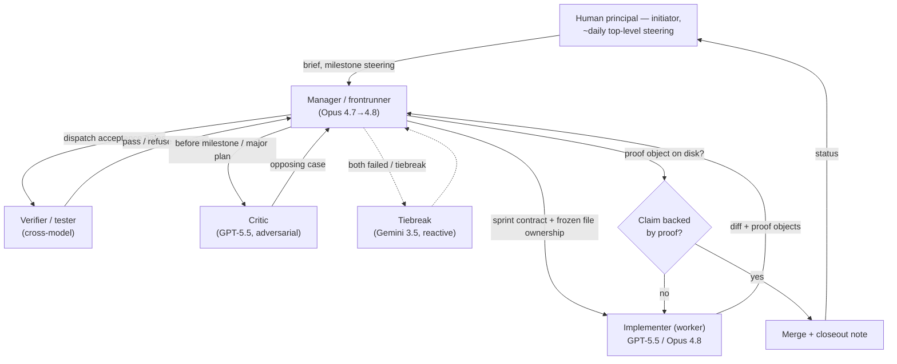

# Verifiable AI-Engineered Scientific Software: A GPU-Native JAX Reimplementation of a WRF-Compatible Regional Forecast Path

**Preprint categories:** cs.SE primary; cs.AI secondary; physics.ao-ph secondary; cs.DC tertiary.

**Authors:** Enric R.G. (human principal, initiator, and corresponding author); the wrf_gpu2 multi-agent AI system — Claude Opus 4.7 / 4.8 (Anthropic) and GPT-5.5 Codex (OpenAI), with Gemini 3.5 (Google) in a reactive tiebreak role.

> **Authorship and AI-use disclosure (read first; see also §9.5).** The model code, the validation harnesses, the performance analysis, and the bulk of this manuscript were produced by AI agents under a governed multi-agent process. The human author was the initiator and roughly-daily top-level steerer, and is the sole accountable party for the public claims. We disclose this plainly because it is the literal subject of the paper, and because the same honesty discipline that caught the system's own bugs (§3, §6.5) must apply to its authorship.

---

## Abstract

AI code generation and the modernization of legacy scientific software both suffer from the same evidence gap: it is easy to produce code quickly and hard to prove that the result is trustworthy at real scale. We report a governed multi-agent AI system that planned, implemented, falsified, repaired, and proof-object-validated a GPU-native, JAX/XLA, WRF-compatible regional forecast path with the high-frequency model state resident on a single consumer GPU, built end-to-end on free-tier model budgets with only roughly-daily human steering. The evidence is what makes the claim falsifiable: the artifact is validated against hard oracles — idealized analytic benchmarks (Skamarock warm bubble, Straka density current), WRF operator savepoints, persistence baselines, three real 72 h Canary 3 km cases scored against same-workstation CPU-WRF, conservation and finiteness invariants, a zero-in-loop device-transfer audit, and a roofline-grounded performance study reporting an honest ~5.3x (clean) to ~7.8x (realistic) speedup over 28-rank CPU-WRF on one RTX 5090 — and, equally, by the errors the process caught and publicly retracted (a "bitwise WRF parity" claim that was a JAX-vs-JAX self-compare; an inflated 22.26x speedup; a missing Coriolis force exposed by a persistence baseline; a 1 km nested-boundary pressure-pump). The artifact is not a complete WRF replacement: v0.1.0 is a single-domain replay path that still consumes CPU-WRF/Gen2 boundary and land artifacts, and lacks live nesting, native initialization, prognostic land surface, and a passing strict 1 km gate; these are scoped as release gates, not hidden. The contribution is therefore methodological as much as numerical: in a domain with objective oracles, an autonomous AI process can build hard, correctness-critical scientific software whose trustworthiness — and whose failures — can be checked rather than asserted.

---

## 1. Introduction

This project began from a wish, not a research agenda. The human author runs a nightly WRF v4 forecast for the Canary Islands and wanted it fast enough to be operationally useful — to compress the runs from roughly 8 h on CPU toward ~2 h on GPU so the local forecast system works in time, and so it could eventually be offered for free to people on the islands, whose complex microclimates are poorly served by coarser regional products. **[VERIFY: AEMET/HARMONIE-AROME resolution-adequacy claim for the Canaries — cite a product spec or soften to "in the author's operational experience." See `missing_elements.md` (ii).]** The author judged the task beyond a single agent and gave a single, roughly-reconstructed brief to a frontier model:

> *"I need a WRF GPU port that is at least 3–4x faster on my system, stays true to WRF v4 solutions, and is built with a modern architecture. This is beyond a single agent, so build an agent framework: a manager keeps the project plan and dispatches workers. To minimize bias and maximize swarm intelligence, use both GPT-5.5 and Opus. Phase 0 explores the optimal kernel architecture and estimates how fast each could theoretically be. The remaining phases work toward the goal with verifiable milestones. Research what standardized tests should be passed to declare success. The mandatory test is comparison against the existing 3 km and 1 km WRF v4 solutions in [the corpus folder]."*

That brief, plus occasional top-level steering (about once or twice a day: a status check, an occasional context compaction, a small course correction such as which model to prefer when one was short on tokens, and — toward the end — a request for real-world proof and for help framing this release), is essentially the entire human engineering contribution.

The result is a testable scientific question that we believe is more interesting than either of its halves:

> **Can autonomous AI agents produce trustworthy scientific software when the domain has hard oracles?**

Neither half of this question makes a strong paper alone. "AI writes code" is demonstrated often, usually on toy or unverifiable tasks, and amounts to an anecdote. "A JAX GPU weather model" is interesting systems work but incremental against the broader GPU-NWP and ML-weather wave. The conjunction is what matters: numerical weather prediction (NWP) is *objectively verifiable*. WRF savepoints, published idealized analytic cases, persistence baselines, CPU-WRF comparison, conservation diagnostics, and GPU profilers are *hard oracles*. They make "an AI built it" falsifiable rather than rhetorical. The verifiability is what turns the AI story from a demo into science.

WRF — the Weather Research and Forecasting model, in its Advanced Research WRF (ARW) configuration [CITE: skamarock2019description; powers2017weather] — is a deliberately hard target. It couples a fully compressible nonhydrostatic dynamical core (third-order Runge–Kutta with split-explicit acoustic substeps) on an Arakawa C-grid in terrain-following hybrid mass coordinates, lateral boundary relaxation, a suite of physics parameterizations (microphysics, surface layer, planetary boundary layer, radiation, land surface, cumulus), a radiation cadence, and an extensive I/O and verification surface. It is over twenty years of accreted Fortran, MPI, and host-resident control flow. A directive-based GPU port can accelerate components, but any unported component forces repeated host/device transfer; and as the author observes, a clean GPU rewrite sits at the intersection of GPU kernel design, senior software engineering, atmospheric physics, and the ability to read WRF's Fortran — a combination of expertise that is individually rare and jointly very rare.

The second motivation is methodological. Repository-scale code agents can now make edits, run harnesses, and use shell environments, but safety-critical scientific software cannot be treated like an ordinary feature backlog. A model that silently invents a formula, a unit conversion, or a validation gate moves quickly in the wrong direction and produces plausible-looking but wrong fields. This project therefore ran under a governance discipline in which nothing was "done" without a falsifiable *proof object* on disk, and in which a cross-model adversarial critic was tasked with rejecting claims.

We bound our claims carefully. We do **not** claim the first GPU NWP system, the first GPU regional model, or a full WRF port. Following the narrowest defensible wording, the artifact is, to our knowledge, *the first open, JAX-native, whole-state-device-resident, WRF-compatible regional replay forecast path built and validated end-to-end by a multi-agent AI process on a consumer workstation GPU.* **[VERIFY: prior abandoned open-source GPU-WRF attempts and the completeness of commercial variants — soften to "to the best of our knowledge" if not citable. See `missing_elements.md` (ii).]**

**Contributions.**

1. A proof-object-governed multi-agent method for producing correctness-critical scientific software, including its role structure, sprint-contract and file-ownership discipline, patch protocol, and — as first-class evidence — a documented record of the false claims the process caught and corrected (§3, §6.5).
2. A JAX/XLA, GPU-native, WRF-compatible regional forecast implementation with whole-state device residency (§4).
3. A tiered validation stack spanning WRF savepoints, idealized analytic cases, real-case CPU-WRF comparison, persistence baselines, conservation/finiteness invariants, transfer audits, and profiler provenance, reported with both passes and failures (§5, §6).
4. An honest, roofline-grounded performance characterization explaining *why* a faithful fp64 GPU NWP workload is memory- and launch-bound, with four candidate accelerations measured and refuted (§6.4).
5. A real Canary d02 demonstration and a gap-bounded roadmap (§6, §8), explicitly scoping what v0.1.0 is and is not.

A recurring theme: performance is only meaningful when the proof object matches the claim. The project's own history is the strongest evidence for this — the system repeatedly produced fast, finite, restartable forecasts that were nonetheless wrong, and the process is what caught them.

---

## 2. Related Work

### 2.1 WRF and prior WRF GPU efforts

ARW solves a fully compressible nonhydrostatic system in flux form on a terrain-following dry-hydrostatic-pressure coordinate, with C-grid staggering and a split-explicit RK3 + acoustic-substep integrator [CITE: skamarock2019description]. This structure is attractive for regional forecasting but awkward for GPUs, mixing horizontally coupled stencils, vertically implicit solves, boundary relaxation, and physics tendencies with disparate memory-access patterns. Prior WRF acceleration has largely been directive-based — moving microphysics or selected kernels to accelerators while leaving other components host-resident — or commercial. AceCAST represents a CUDA-Fortran/OpenACC WRF-acceleration line reporting a 5–14x range in vendor materials; we treat that as context, not a peer-reviewed end-to-end comparator [CITE: tempoquest2025acecast]. WRF I/O modernization work (e.g. ADIOS2) targets streaming rather than whole-forecast device residency [CITE: fredj2023adios2wrf]. We make no first-GPU-WRF claim.

### 2.2 GPU NWP and model rewrites

GPU regional NWP is established. MeteoSwiss COSMO and the ICON-CH migration are important precedents for operational GPU regional forecasting [CITE: fuhrer2026icon; lapillonne2026benchmarking]. Domain-specific-language approaches separate stencil expression from backend codegen: Pace reimplemented the FV3 dynamical core in Python using GT4Py and DaCe [CITE: dahm2023pace; bennun2019dace; whitaker2023gt4py]. SCREAM is the clean-slate C++/Kokkos exascale path [CITE: bertagna2024scream]; NIM is an earlier native-GPU precursor [CITE: govett2017parallelization]. A comparator table of reported speedups and hardware classes is staged at `publish/tables/comparators.md` (it must be re-grounded against current proof objects; see `missing_elements.md`). These systems establish that GPU NWP is real and that production ports require more than kernel translation. Our distinct combination is: open, JAX-native, whole-state-device-resident, workstation-scale, proof-objected, and AI-built.

### 2.3 ML weather models

Data-driven and hybrid global forecasting — GraphCast, Pangu-Weather, FourCastNet, GenCast, Aurora, NeuralGCM, Stormer, AIFS — produces fast, skillful forecasts under the right evaluation regime [CITE: lam2023graphcast; bi2022pangu; pathak2022fourcastnet; price2023gencast; bodnar2024aurora; kochkov2023neuralgcm; nguyen2023stormer; lang2024aifs; lang2025update]. The present work is not an ML emulator: we reimplement the physics-based equations rather than learn a surrogate. The distinction matters for evaluation — ML systems are usually scored on global reanalysis fields at medium range, whereas a 3 km regional model must satisfy local terrain, boundary forcing, and station-scale requirements. A JAX core does, however, open ML-hybrid futures (differentiability, learned parameterizations, gradient-based assimilation); we state this as a structural property and future work only — we did not exercise it (§7).

### 2.4 AI agents and repository-scale software engineering

Repository-level AI coding has moved beyond autocomplete. SWE-bench measures whether agents resolve real GitHub issues [CITE: jimenez2024swebench]; SWE-agent frames agent–computer interfaces for software work [CITE: yang2024sweagent]; orchestrator–worker and evaluator–optimizer patterns describe decomposition and critique loops [CITE: anthropic2024effective]; terminal harnesses made it practical for agents to run tests, edit code, and report evidence in a persistent repository [CITE: anthropic2026claude]. Scientific software changes the risk profile: a web bug is caught by integration tests and users, whereas a numerical-weather bug can produce plausible fields while losing the forecast. The open question is not whether an AI can write code quickly, but whether a multi-agent process can build, test, falsify, and revise scientific claims under explicit governance — and whether a verifiable domain makes that result *checkable*. Discussions of AI authorship and accountability emphasize that human responsibility and disclosure remain central [CITE: arxiv2026policy; pcmag2026arxiv; nature2024editorial; schmidt2025senior].

---

## 3. The AI Engineering System

This section is deliberately early: the governed multi-agent process is the headline contribution, and the artifact (§4) is its existence proof.

### 3.1 Roles

The build used a role taxonomy rather than a single assistant:

- **Manager / frontrunner** — owned the project plan, sprint definition, repository-state synthesis, cross-sprint memory, ADR routing, diff review, acceptance-gate execution, and merge/closeout decisions.
- **Implementer (worker)** — implemented scoped changes inside a frozen file-ownership boundary under a sprint contract, producing proof objects.
- **Verifier / tester** — challenged the worker's result, reran commands, inspected proof objects, and could refuse completion if the evidence did not support the claim.
- **Critic** — a cross-model adversary tasked with arguing the opposing position before milestone closes and major plan commitments.
- **Tiebreak** — a third model engaged reactively only when the first two had both failed on the same defect or for an architecture tiebreak.

This division encodes different failure surfaces: the worker moves fast inside a narrow boundary, the verifier assumes the implementation is wrong until proof says otherwise, the critic attacks the plan, and the manager sees repeated failure patterns and changes the contract. Crucially, *the critic and verifier were different models from the implementer*, so single-model blind spots were less likely to survive review.

### 3.2 Model-role timeline

The role assignments shifted over the build week as the foundations became trustworthy and as relative model strengths became clear:

- **GPT-5.5 Pro built the foundations** — the skill files, the memory system, and the manager/frontrunner/verifier role scaffolding the rest of the project ran on.
- **Manager:** Opus 4.7 initially; **Opus 4.8** took the manager role toward the end of the build.
- **Implementer (frontrunner):** mostly **GPT-5.5** early/middle; **Opus 4.8 (max effort)** became the code frontrunner in the later stages.
- **Verifier:** ran **every sprint** initially, then **every milestone** (to conserve tokens once the foundations were trustworthy).
- **When stuck:** GPT-5.5, and occasionally **Gemini 3.5**, were dispatched for independent angles; the manager collected the intel and decided.
- **Human:** roughly once or twice a day — a status check, an occasional `/compact`, and small high-level course corrections.

**[PLACEHOLDER: a model-role timeline figure (stage on x-axis, role band per model) — render to `publish/figures/model_role_timeline.png` from the git-history accounting in `publish/tables/effort_accounting.md`.]** The existing `publish/figures/timeline.md` spec is M7-era and must be regenerated for the v0.1.0 stages.

### 3.3 Proof-object discipline

Work was not considered complete until a falsifiable artifact existed on disk: a JSON measurement, a Markdown verdict, a log, or a generated figure — never a chat summary. Each claim type binds to a required proof:

| Claim type | Required proof object |
|---|---|
| Performance | timing/roofline JSON with an explicit denominator definition |
| Transfer residency | device-to-host (D2H) audit with a defined profiler window |
| Restart / repeatability | comparator output over a defined window |
| Operator / savepoint correctness | WRF (or analytic) savepoint parity comparator |
| Physical stability | finite/bounds/invariant/conservation JSON |
| Idealized correctness | analytic-benchmark close-gate verdict (PASS asserted, not PASS-or-FAIL) |
| Operational skill | CPU/GPU/observation side-by-side scoring with persistence baseline |
| Release readiness | closeout memo plus an audit script |

Several historical failures came precisely from matching the *wrong* proof to a claim — finite station scores are a measurement, not a skill-equivalence proof; a warm wall-clock is speed under a window definition, not meteorological usefulness; bitwise agreement at one step is local evidence, not a 24 h forecast gate (§6.5). Making "done" auditable is what allowed those mismatches to be caught.

### 3.4 Sprint contracts, file ownership, and the patch protocol

Every implementation sprint launched from a contract stating objective, non-goals, acceptance criteria, file ownership, proof objects, validation commands, branch name, and a worker-report token. Workers could not edit outside owned paths; two active workers could not edit the same core files unless an interface had been frozen first. Governance files — memory, rules, skills, contracts — were production assets changeable only via a patch protocol (evidence + reviewer approval + validation), never edited in-place by a worker. This prevented the most insidious agentic failure mode: silently relaxing the goal or the gate to make a sprint "pass."

### 3.5 Process metrics

**[PLACEHOLDER: AI process-metrics table — sprints by stage, role, model, objective, proof objects produced, verdict, and major claim affected. Render to `publish/tables/ai_process_ledger.md` (the existing `publish/tables/sprint_ledger.md` is an M7-era seed and must be regenerated from git history for v0.1.0).]**

**[PLACEHOLDER: effort accounting — agent-runs/sprints per stage (the honest unit; the build was nightly free-token runs, not 24/7 wall-clock), an approximate total-token count, and the real cost envelope (the build fit within a €200/mo Claude Max + €100/mo GPT Pro budget, plausibly reproducible for ~€100, with no funding of any kind). Render to `publish/tables/effort_accounting.md`. Wall-clock must be reported as the span from nothing to (a) the v0.0.1 working kernel, (b) the v0.1.0 path, and (c) publication, explicitly excluding the dead earlier attempt — see human author notes §3.]** We deliberately report agent-runs/sprints rather than human-equivalent hours, and we make no claim that future work will be "finished within hours or days": a future-work cadence is not evidence.

### 3.6 Error-catch ledger

The following false or inflated claims were *generated and then caught* by the process. They are the strongest evidence that the validation regime has teeth, and we feature rather than hide them (full case studies in §6.5):

| Caught claim | What it actually was | How / who caught it | Resolution |
|---|---|---|---|
| "Bitwise WRF parity at 100 coupled steps" (v0.0.1 headline) | A JAX-vs-JAX self-compare (the comparator read back the model's own output, never WRF Fortran); the dycore was missing ~7 WRF operators | Reactive cross-model audit during the project reset | Publicly retracted; dycore honestly rebuilt against analytic references + pristine WRF savepoints |
| "22.26x speedup" (and earlier 50.20x / 156.82x lineage) | One GPU d02 domain divided by the *whole multi-domain CPU nest* wall time | Roofline / denominator audit | Corrected to ~5.3x clean / ~7.8x realistic, d02-vs-d02 |
| "Winds operationally usable" / finite station scores as a gate | A measurement, not a CPU-vs-GPU skill comparison; V10 was below persistence | Persistence baseline + side-by-side CPU-WRF scoring | Root cause = missing Coriolis force in the dycore; added; winds now beat persistence on the main case |
| d03 1 km "validated" implied by d02 success | A nested geopotential-boundary forcing term pumping the interior (+6.8 K T2, 2.5x wind bias) | Nested-domain validation against CPU-WRF | WRF-faithful boundary fix collapsed overnight bias to d02-quality; a separate daytime surface-flux warm bias remains, scoped honestly |

**[PLACEHOLDER: workflow visualization — the manager→dispatch→worker→verifier→critic→manager-decide→merge loop, with the human's roughly-daily top-level steering. Render both a mermaid diagram and an ASCII version to `publish/figures/workflow_loop.{md,png}`. A draft is given below; it must be reconciled with the final process-metrics ledger.]**



```text
   Human principal (initiator; ~daily status + small course corrections)
        |  brief / milestone steering                         ^ status
        v                                                     |
   +----------- MANAGER / FRONTRUNNER (Opus 4.7 -> 4.8) -------------+
   |   scopes contract, freezes file ownership, reviews diff,       |
   |   runs acceptance gates, decides, merges                       |
   +---------------------------------------------------------------+
        | dispatch (contract)        | dispatch gates    | before milestone
        v                            v                   v
   WORKER (GPT-5.5 / Opus 4.8)   VERIFIER (cross-model)  CRITIC (GPT-5.5)
   edits owned files,            reruns, inspects proofs adversarial
   writes proof objects          pass / REFUSE           opposing case
        |                            |                   |
        +------------> "Claim backed by a proof object on disk?" <----+
                          yes -> merge + note      no -> back to WORKER
                          (tiebreak: Gemini 3.5, only if both above failed)
```

---

## 4. The Model Artifact

The numerical implementation follows ARW *structure* without inheriting WRF's *software architecture*. It is a clean Python/JAX rewrite that targets the GPU memory hierarchy from day one.

**State and grid.** Model state is a structure-of-arrays JAX pytree (ADR-002) of fp64 device arrays with explicit C-grid staggering conventions, in a terrain-following hybrid mass (eta) coordinate. The operational d02 grid for the measured cases has mass shape (44, 66, 159) and WRF staggered extent (45, 67, 160). The state carries dry-air mass, perturbation and base pressure and geopotential, staggered winds, water species and number concentrations, surface fluxes, lateral boundary side histories, and Coriolis metrics (`f`, `e`, `sina`, `cosa`). A halo interface (`contracts/halo.py`) is designed in as an MPI-shaped no-op for future multi-GPU work; v0.1.0 is single-GPU and makes no scaling claim.

**Whole-state device residency.** After initialization, the entire high-frequency state remains in GPU memory through the operational loop, which is expressed as a `jax.lax.scan` compiled graph rather than a Python loop. Step-boundary I/O for output and restart is allowed; inter-kernel host/device transfer inside the forecast loop is a constitutional prohibition without an ADR, and is verified to be zero by audit (§6.4). This distinguishes the design from partial ports where an unported scheme pulls full fields to the host at every coupling point.

**Dynamical core.** RK3 outer steps advance the meteorological modes; split-explicit acoustic substeps (10 per step at dt = 10 s for d02) handle fast pressure waves. The acoustic core advances `u/v` momentum, then dry-air mass and coupled potential temperature, then `w` and geopotential via an implicit vertical solve, then recomputes pressure/density each substep — matching the WRF cadence. The vertical implicit `w`/φ solve is lowered by XLA to an NVIDIA cuSPARSE batched parallel-cyclic-reduction kernel. Advection is WRF flux-form (5th-order horizontal, 3rd-order vertical) with the WRF-correct upwind-correction sign (a sign error here was a real bug, §6.5). The Coriolis force is the WRF-faithful standard form on the coupled `ru/rv` tendency (added late; §6.5). Dissipation uses WRF's 6th-order numerical filter (`diff_6th_opt=2`), Rayleigh damping, and `w_damping`.

**Physics suite.** The operational column physics is Thompson microphysics, the WRF revised surface layer (`sfclayrev`), a MYNN level-2.5 PBL closure, and RRTMG-style shortwave/longwave radiation called at a held cadence (180 steps). Land surface is a *prescribed* Noah-MP subset (skin temperature, top soil moisture, land/lake masks, roughness), explicitly **not** prognostic Noah-MP; in the operational replay path the land fields are refreshed hourly from corpus artifacts. The implemented physics has documented parity debts (fixed-cap Thompson sedimentation substeps, neglected cloud-water sedimentation, MYNN EDMF/cloud terms disabled, RRTMG topographic-shading/slope-radiation and real-lat/lon coupling absent); these are inventoried in §8.

**Boundary replay and limits.** The d02 forecast uses lateral boundary side histories (`spec_bdy_width=5`, relaxation zone) packed from corpus WRF/Gen2 hourly output, not live AIFS/GFS ingestion. **This makes v0.1.0 a single-domain replay path, not a native WPS/`real.exe` replacement** — it still consumes CPU-WRF/Gen2 boundary, metric, and land artifacts.

**Output and precision.** The writer is a minimal WRF-compatible `wrfout` producer (a defined minimum variable set plus M9 surface diagnostics); restart is via project checkpoints, not full `wrfrst` interoperability. Precision is fail-closed fp64 in the operational mode (declared and re-gated), with fp32 paths gated opt-in only where validated; §6.4 shows fp32 gives no speedup on this workload, so fp64 is kept as the safe default.

---

## 5. The Validation Stack

The validation stack is the paper's trust engine. It is organized by *evidence type*, and we report pass **and** fail status (§6).

- **Tier 1 — WRF savepoints / operator parity.** Local, strict comparison of individual operators against WRF Fortran (and analytic) savepoints: coefficient generation, the tridiagonal/implicit solve, the acoustic-substep recurrence, advection convergence order, mass semantics. This is decisive for transcription bugs but is *not* a forecast-skill gate. The pristine WRF v4.7.1 arbiter is a from-scratch gfortran build with per-acoustic-substep center-column savepoints.
- **Tier 2 — invariants / conservation / guards.** Finiteness, physical bounds, dry-mass and water-budget behavior, tracer positivity, and limiter/guard-engagement reporting. This prevents a model from matching a local savepoint yet producing an impossible coupled state, and it blocks "performance fixes" that silently introduce NaNs or negative species. The idealized warm bubble passes 6/6 fully guards-off, and the real d02 dycore runs finite guards-off — i.e. the safety guards are a net, not load-bearing.
- **Tier 3 — idealized analytic benchmarks.** Skamarock warm bubble and Straka density current versus published references, through the *operational* entry point (bitwise-identical to the idealized harness over 50 warm-bubble steps).
- **Tier 4 — real-case skill + persistence baselines.** RMSE versus same-workstation CPU-WRF at multiple leads on real Canary cases, with a persistence baseline (1 − GPU_RMSE/persistence_RMSE) as the skill discriminant. The persistence baseline is what exposed the wind deficiency that finite-forecast checks missed (§6.5). A formal seasonal-ensemble TOST equivalence test is *future work*, not claimed here.
- **Systems validation.** Zero in-loop D2H transfer audit, restart continuity, warm-run repeatability, and profiler provenance, each bound to a proof object.

**[PLACEHOLDER: validation-pyramid figure — regenerate `publish/figures/validation_pyramid.png` from the M7-era `publish/figures/validation_pyramid.md` spec to reflect v0.1.0 status (Tier 1–3 green; Tier 4 d02 green / d03 marginal / TOST future).]**

---

## 6. Results

We order Results from the most local oracle to the most operational, then performance, then the AI self-correction case studies. We do **not** lead with any historical speedup multiplier.

### 6.1 Dynamical core and idealized validation

Both idealized analytic gates **PASS** through the operational entry point [proof: `proofs/sprintU/close_gate/warm_bubble_verdict.json`, `density_current_verdict.json`; `proofs/f7/DYCORE_STATUS.md`]:

- **Skamarock warm bubble — PASS 6/6:** coherent thermal rise (~1925 m), bounded `w` (max |w| ≈ 11.7 m/s), θ′ max ≈ 1.9 K, symmetry, dry-mass drift ≈ 0.
- **Straka density current — PASS 6/6:** finite through the integration; front ≈ 14.15 km; θ′ min ≈ −9.97 K; max |w| ≈ 14.6 m/s; rotor structure present; mass drift ≈ 2.25e-9.

The operational/real-case path uses the *same* validated dycore operators as the idealized gates (50-step warm-bubble bitwise identity), so the idealized PASS transfers to the operational dynamics. Honest scope: the full 3D u/v/w deformation tensor, 3D terrain-slope diffusion cross-terms, map factors, and lateral specified/nested-boundary order degradation remain Phase-B items (§8); the operational forecast uses the 6th-order filter, not `km_opt` deformation diffusion.

**[PLACEHOLDER: idealized figure set — warm-bubble θ′/w panel and Straka density-current panel. Render to `publish/figures/warm_bubble_panel.png`, `publish/figures/straka_density_current_panel.png` from existing PPM/plot outputs under `proofs/f7n/`, `proofs/sprintU/close_gate/`, `proofs/wind/idealized_postfix/plots`. Companion table `publish/tables/idealized_gate_summary.md` (case, reference target, GPU metric, pass/fail, proof path).]**

### 6.2 Real-case d02 (3 km) validation

Across three independent real Canary cases (init 2026-05-09, -21, -29 18Z), the GPU d02 forecast runs **stable and finite to 72 h** and is scored against same-workstation CPU-WRF at 6/12/24/48/72 h. The verdict is **D02_VALIDATED (all cases pass)** [proof: `proofs/v010_validation/v010_d02_result.json`, HEAD `5319b8d`, Coriolis-corrected dycore]. Representative full-domain RMSE (case1):

| Field | 6 h | 12 h | 24 h | 48 h | 72 h | Units |
|---|---:|---:|---:|---:|---:|---|
| T2 | 1.88 | 2.10 | 1.34 | 1.09 | 1.06 | K |
| U10 | 1.51 | 1.55 | 1.54 | 1.79 | 1.80 | m s⁻¹ |
| V10 | 1.70 | 1.76 | 2.07 | 2.34 | 2.38 | m s⁻¹ |
| PRECIP | 0.01 | 0.10 | 0.35 | 1.25 | 1.56 | mm |

These surface RMSEs are in a physically meaningful range against CPU-WRF, and after the Coriolis fix the winds beat the persistence baseline broadly on the main case family (e.g. case3 V10 skill went from −0.13 to +0.17; §6.5) [proof: `proofs/m19/verdict_result.json`, `proofs/wind/revalidate_wind.json`]. **PRECIP is explicitly not a skill claim:** its RMSE grows monotonically with lead and persistence skill is poor at longer leads in the full-domain comparison; we report precipitation as a diagnostic/limitation, not validated skill (§8).

**[PLACEHOLDER: d02 validation table — full-domain and Tenerife-box RMSE at 6/12/24/48/72 h for T2/U10/V10/PRECIP with persistence-skill columns for T2/U10/V10, all three cases. Render to `publish/tables/v010_d02_validation.md` via `proofs/v010_validation/render_table.py --result proofs/v010_validation/v010_d02_result.json`. Note: a parallel worker is generating this; the numbers above are read directly from the proof JSON and must match the rendered table.]**

### 6.3 Real-case d03 (1 km) status — boundary-pump fix and an honest residual

The 1 km Tenerife nest is the harder case and the honest one. An earlier d03 run failed badly (final T2 RMSE ≈ 10.8 K, U10 ≈ 8.6, V10 ≈ 9.8, all beaten by persistence). Root cause: a **nested geopotential-boundary forcing term that pumped the interior** (+6.8 K T2, ~2.5x wind bias). The WRF-faithful boundary fix collapsed the overnight bias to d02-quality. The current 24 h d03 proof [`proofs/v010_validation/d03_summary_run24h_v5fix.json`]:

| Field | RMSE | Threshold | Within threshold | Beats persistence | Units |
|---|---:|---:|:--:|:--:|---|
| T2 | 3.01 | 3.0 | no (marginal) | no | K |
| U10 | 3.49 | 7.5 | yes | no | m s⁻¹ |
| V10 | 4.40 | 7.5 | yes | yes | m s⁻¹ |

The strict bounded gate is therefore still **`D03_1KM_BOUNDED_FAIL`** — T2 RMSE 3.01 K sits marginally above the 3.0 K threshold — even though this is a dramatic improvement (≈ 10.8 K → 3.0 K) and U10/V10 are within their thresholds. The remaining residual is a **daytime surface-flux (HFX) warm bias shared across domains**: once the lower-column temperature is allowed to warm diurnally, the surface-layer/MYNN coupling over-deposits sensible heat into the bottom level and T2 overshoots. We state d03 precisely: *the boundary-pump bug is fixed and overnight d03 reaches d02-quality, but the strict 1 km gate is not yet passed*; 1 km is therefore **not** in the positive v0.1.0 claim and is listed as a release gate (§8).

**[PLACEHOLDER: d03 status table + before/after — final-lead RMSE and the pre-fix → post-fix bias collapse. Render to `publish/tables/v010_d03_status.md` from `proofs/v010_validation/d03_summary_run24h_v5fix.json` (and the pre-fix d03 summary for the self-correction row).]**

### 6.4 Performance and roofline

On one RTX 5090 (fp64, single domain, dt = 10 s, RRTMG cadence 180), the 3 km Canary d02 forecast runs **~5.3x faster (clean) / ~7.8x faster (realistic)** than 28-rank CPU-WRF v4.7.1 on the same workstation and the same domain [proof: `publish/runtime_optimization_analysis.md`; `proofs/perf/roofline_costonly.json`, `speedup_denominator.md`, `compute_cycle_analysis.md`; `proofs/thompson_perf/coupled_timing_base_vs_opt.json`].

| Framing | CPU-WRF d02 (s/fc-hr) | GPU d02 (s/fc-hr) | Speedup |
|---|---:|---:|---:|
| Conservative — CPU clean compute | 83 | 15.68 | **5.29x** |
| Realistic — CPU incl. radiation + I/O | 123 | 15.68 | **7.84x** |
| dt-matched floor (GPU forced to CPU dt = 6 s) | 83 | ~26.1 | ~3.2x |

The headline is the *analysis*, not the multiplier. The dycore sits at arithmetic intensity ≈ 0.40 FLOP/byte — below even the fp64 roofline ridge (0.915) and 146x below the fp32 ridge (58.5) — achieving ~18.7% of HBM bandwidth and only ~8.2% of fp64 peak, with a ~5.3x kernel-launch/serialization tax over the bandwidth floor. The step issues ~11,000 GPU operations (~7,200 tiny elementwise kernels + ~3,900 memory ops), and the GPU is idle ~43–68% of each step waiting between dependent micro-launches. **The model is memory- and launch-bound, not fp64-compute-bound** — which is why fp32 does not help. Four candidate accelerations were each implemented and measured, and each refuted:

| Lever | Measured effect | Why it fails faithfully |
|---|---|---|
| fp32 dynamics | ~1.00x | launch/bandwidth-bound; mandatory-fp64 acoustic-island boundary converts cancel the byte saving |
| CUDA command-buffer graph capture | **0.83–0.87x (slower)** coupled | coupled step is physics-compute-dominated; graph-capture overhead exceeds launch-tax saving |
| fp32 Thompson microphysics | ~1.0x | Thompson is ~85% sedimentation = launch/bandwidth-bound (64 substeps × 4 species) |
| implicit (backward-Euler) sedimentation | 2.25–2.44x kernel, **REJECTED** | over-precipitates +47% vs a purpose-built precipitating WRF oracle; accuracy-recovering nsub≥4 erodes the win below 1.6x |

The one shipped safe win is a bit-identical sedimentation scan-unroll (~+5% coupled), which moves the headline from 5.06x/7.5x to 5.29x/7.84x; a gated acoustic-substep unroll adds ~1.225x on the dynamics at fp64 round-off (default off). The scientifically grounded ceiling under strict WRF fidelity is ~8–11x, reachable only by precision-invariant kernel-launch-count reduction (fusion), which must be re-certified against the idealized gates. The retracted 22.26x/50.20x/156.82x headlines came from dividing one GPU d02 against the *whole multi-domain CPU nest* — apples-to-oranges (§6.5).

**[PLACEHOLDER: roofline figure — dycore AI 0.40, HBM/fp64 ridges, 5.3x-over-floor placement. Render to `publish/figures/roofline_dycore.png` from `proofs/perf/roofline_costonly.json` + `phase_breakdown.json`. Companion table `publish/tables/performance_current.md` (replaces the stale `publish/tables/performance_evolution.md`) and `publish/tables/optimization_refutations.md`.]**

**Systems evidence.** Inter-kernel D2H inside the compiled forecast loop is **0 copies / 0 bytes** (the constitutional invariant) [historical M7 proof `proofs/perf` / `d2h_audit_v2.json`; **needs a fresh v0.1.0 re-audit — see `missing_elements.md` (ii)**]. The current v0.1.0 d02 pipeline reports a 24 h end-to-end speedup of ~9.1x against the derived CPU d02 denominator [proof: `proofs/v010_validation/speedup_vs_cpu_24h.json`], consistent with the per-forecast-hour roofline framing once IC load, hourly writes, inventory and scoring overhead are included. **[PLACEHOLDER: device-residency / restart / repeatability systems table → `publish/tables/systems_invariants.md`. The current v0.1.0 `repeatability.json` and `restart_in_pipeline.json` proofs are `NOT_RUN` (the validation flags were not requested); these must be re-run for release — `missing_elements.md` (ii).]**

### 6.5 AI self-correction case studies

Each case below is a *receipt* that the multi-agent process detects and corrects its own errors — the core credibility question for autonomous AI scientific engineering.

**(a) The self-compare retraction.** The v0.0.1 headline "bitwise dycore parity at 100 coupled steps vs WRF" was found to be a JAX-vs-JAX self-compare: the comparator read back the model's own output and never touched WRF Fortran. The operational dycore was in fact missing ~7 WRF operators (a stubbed `rhs_ph`, a re-coupled/decoupled work-theta that advanced θ at 1/N of the correct rate, a dropped geopotential EOS term, and more) and produced fast-but-wrong forecasts. The claim was publicly retracted; the dycore was honestly rebuilt (the F7 chain) against published analytic references and a from-scratch pristine WRF v4.7.1 savepoint arbiter [proof: `proofs/f7/DYCORE_STATUS.md`]. *Lesson: validate against the external oracle, never against the system's own output.*

**(b) The speedup denominator correction.** A roofline/denominator audit found the celebrated 22.26x (and the earlier 50.20x and 156.82x) divided one GPU d02 domain by the full five-domain CPU nest wall time. Corrected to a like-for-like d02-vs-d02 comparison, the honest number is ~5.3x clean / ~7.8x realistic, with a ~3.2x dt-matched floor [proof: `proofs/perf/speedup_denominator.md`]. *Lesson: a performance number is only as good as its denominator definition.*

**(c) Missing Coriolis, exposed by a persistence baseline.** Finite-forecast and savepoint checks passed, yet near-surface winds were below persistence (V10 skill negative). A persistence baseline — *holding the initial condition constant* — discriminated a genuine model deficiency from a metric artifact, and a momentum-budget probe localized it: **the GPU dycore momentum tendency had no Coriolis force.** Adding the WRF-faithful Coriolis term (with `f`/`e`/`sina`/`cosa` defaulting to the no-rotation values so the idealized f=0 gates stayed bit-identical and PASS) flipped the wrong-sign lower-column wind, improved case2 winds ~50%, and moved case3 V10 from beating-persistence-by −0.13 to **+0.17** [proof: `proofs/wind/coriolis_fix_verdict.md`, `proofs/wind/WIND_SKILL_ROOT_CAUSE.md`]. *Lesson: a cheap baseline (persistence) catches what "the forecast is finite and looks plausible" cannot.*

**(d) The d03 boundary-pump self-correction.** The 1 km nest blew up its surface bias (+6.8 K T2, ~2.5x wind bias). Validation against CPU-WRF localized it to a nested geopotential-boundary forcing term pumping the interior; a WRF-faithful fix collapsed the overnight bias to d02-quality and — critically — *exposed a separate, previously masked daytime surface-flux warm bias* now reported honestly (§6.3, §8). *Lesson: fixing one defect often unmasks another; the proof-object trail keeps both visible.*

Two meta-lessons run through these: agents benefit from narrow contracts but suffer when the contract names the *wrong proxy* (the pipeline-integration sprint correctly produced finite fields and station-score rows — the error was treating those as proof of operational *skill*); and cross-model disagreement is useful only when *attached to files* — the productive sprints wrote JSON tables, verdicts, and failed hypotheses, so the repository could preserve both the result and the contradiction.

---

## 7. Discussion

**What verifiability buys the AI claim.** The reason this is science rather than a demo is that every load-bearing assertion is checkable against an oracle the AI did not author: analytic benchmark solutions, WRF Fortran savepoints, a persistence baseline, same-workstation CPU-WRF, conservation laws, and hardware profilers. In that setting, "an autonomous AI built it" stops being a marketing claim and becomes a falsifiable one — and the four self-correction case studies (§6.5) are the demonstration that the process can falsify *itself*. The method is not infallible: the manager was itself an AI system and initially made the v0.0.1 over-claim; the validation discipline is stronger than chat-based coding but is not yet equivalent to an independent human numerical-methods review (§8). What it reliably provides is *internal friction* — adversarial, proof-object-driven review that caught a self-compare, a denominator error, a missing force, and a boundary pump before they reached a public claim.

**Implications for legacy scientific-code modernization.** The transferable result is a *recipe*, not a WRF-specific artifact: target the GPU memory hierarchy in a clean rewrite, validate against the legacy code (and analytic cases) as an oracle rather than inheriting its architecture, and bind every claim to a proof object under multi-agent governance. WRF is the existence proof, not the boundary; the recipe should apply to any correctness-critical domain with hard oracles. The human author's reflection is pointed here: this codebase sits at the intersection of GPU engineering, software engineering, physics, and Fortran archaeology — exactly the multi-field intersection where individual human experts are scarcest and where, strikingly, the AI swarm performed well.

**What JAX enables (future work, not claimed).** A physics-based JAX core is end-to-end differentiable in principle, which opens gradient-based data assimilation, parameter calibration, and ML-hybrid parameterizations, and makes the model a natural generator of physically constrained training data. We did not exercise differentiability and make no skill claim from it; we flag it as a structural property and a future direction.

**Why the performance ceiling is fidelity-bounded.** The honest ~5.3–7.8x is not a failure of GPU engineering; it is what faithful fp64 split-explicit acoustic integration costs on a memory- and launch-bound workload (§6.4). The one large algorithmic lever that would roughly halve the microphysics cost (implicit sedimentation) is fidelity-rejected because it over-precipitates against a WRF oracle. This is itself a small methodological point: component micro-benchmarks routinely over-promise relative to a faithful coupled forecast, and the honest number plus the refutations is the contribution.

**The human reflection (first person, author's voice).** *A GPU port of WRF — one of the most complex, 20-plus-year-old codebases in the geosciences — has never really existed as open source, not because it isn't useful but because it is hard: it eluded single-agent attempts and an earlier GPT-5.4-era swarm. AI seems to have become just capable enough, right now, to actually do it — and once capable, to do it fast. What struck me most is how well it performs at the intersection of several scientific fields, exactly where human experts are scarcest. The genuinely impressive thing was the end-to-end capability: from a simple wish — "I need a faster WRF so my runs fit in time and I can offer a free forecast" — through to a written publication and a published repository, for code that had never been open-sourced. My own input was so simplistic that it feels only one iteration away from being fully replaceable. One of the hardest, most battle-tested codebases on Earth went from not-doable to done in roughly a week in May 2026, on free tokens, with barely any human input — predictable if you extrapolate the curves, but still genuinely striking.*

---

## 8. Limitations and Roadmap

We state the claim boundary precisely and without apology. **v0.1.0 IS** a validated single-domain GPU *replay* forecast for Canary d02 (3 km), with a WRF-faithful fp64 RK3+acoustic dycore (including Coriolis), flux-form advection, Thompson/MYNN/`sfclayrev`/RRTMG physics, passing idealized analytic gates and WRF operator savepoints, near-CPU-WRF surface skill that beats persistence on winds over three 72 h cases, an honest ~5.3–7.8x speedup, and a much-improved-but-not-strictly-passing 1 km nest. **v0.1.0 IS NOT** a complete WRF replacement: it consumes CPU-WRF/Gen2 boundary and land artifacts. The single source of truth for the gap inventory is `publish/GPU_PORT_GAPS_TODO.md`; the sequencing is `.agent/decisions/POST-0.1.0-ROADMAP.md`.

**P0 — blocks a true standalone port (each closes with a proof object and a 0.1.x/0.2.0 release note):**

| Gap | What is missing | Target |
|---|---|---|
| P0-6 | Real-terrain / map-factor / specified-nested boundary dynamics closure (full 3D u/v/w deformation, terrain-slope diffusion/PGF, boundary-order degradation) — tied to residual wind skill | 0.1.x, first |
| P0-1 | Live multi-domain nesting (parent/child state carries, interpolation, subcycling) | 0.2.0 |
| P0-3 | Prognostic Noah-MP land surface (currently a prescribed subset, refreshed from corpus) | 0.2.0 |
| P0-5 | Full WRF-compatible `wrfout`/`wrfrst` + diagnostics; true restart interoperability | 0.1.x |
| P0-4 | d01 parent-domain Kain–Fritsch cumulus (needed for a live parent) | 0.2.0 |
| P0-7 | Coupled conservation budgets + non-masking guard policy (report limiter engagement; remove/justify fallbacks) | 0.1.x |
| P0-2 | Native initialization / WPS / `real.exe` replacement | LAST, after 0.2.0 (highest risk) |

**P1 — fidelity/robustness debts:** RRTMG topo-shading/slope-radiation and real lat/lon (P1-3); MYNN EDMF/cloud completeness, central to marine PBL and the residual wind skill (P1-4); Thompson parity debts — adaptive sedimentation substeps, cloud-water sedimentation (P1-5); explicit precision-policy proof gates (P1-8); gravity-wave drag if load-bearing (P1-7); positive-definite/monotonic scalar advection and boundary-order options (P1-6); data assimilation/FDDA only if a future namelist requires it (P1-1). **0.2.0 scalability:** single-node multi-GPU domain decomposition (S1), pre-designed via the frozen halo interface.

**Honest caveats on timing.** The validated core benefited from unusually clean oracles (analytic cases + WRF savepoints); the two items with the messiest validation — native init (P0-2) and prognostic Noah-MP (P0-3) — have error bars that skew high. We report a roadmap, not a schedule, and explicitly do not promise that unfinished items will be "finished within hours or days." Hardware portability is favorable: the pure JAX/XLA code recompiles for Hopper (H100/H200) with no source changes and should run faster (full-rate fp64, higher HBM bandwidth) on larger single-GPU domains; speedup-vs-CPU is hardware-specific and must be re-measured on that hardware (we have none).

---

## 9. Reproducibility and Release

### 9.1 Repository and version

| Item | Value |
|---|---|
| Public repository | **[PLACEHOLDER: public repo URL at release — `missing_elements.md` (ii)]** |
| Release tag | **[PLACEHOLDER: `v0.1.0` tag at release]** |
| Exact commit | **[PLACEHOLDER: release commit hash; current validated HEAD is `5319b8d` (Coriolis), with d02/d03 fixes through `234265a`]** |

### 9.2 Environment manifest

**[PLACEHOLDER: pin the exact runtime — Python, JAX, jaxlib, CUDA toolkit, NVIDIA driver, XLA flags, OS — at the release commit. The drafting environment reports Python 3.13.x / JAX 0.10.x / CUDA 13.x / RTX 5090 (32607 MiB), but the package currently declares only `python>=3.10`, `jax>=0.4`; the release must pin a single manifest. — `missing_elements.md` (ii)]** CPU baseline: WRF v4.7.1, 28 MPI ranks, same workstation; AI/Python work pinned to cores 0–3 (`taskset -c 0-3`), leaving 4–31 for CPU-WRF.

### 9.3 Proof-object manifest

The canonical proof objects backing this paper:

- Idealized gates: `proofs/sprintU/close_gate/{warm_bubble,density_current}_verdict.json`, `proofs/f7/DYCORE_STATUS.md`, `proofs/f7n/`.
- Real-case d02: `proofs/v010_validation/v010_d02_result.json`, `proofs/m19/verdict_result.json`, `proofs/m19/persistence_baseline.json`.
- Real-case d03: `proofs/v010_validation/d03_summary_run24h_v5fix.json` (+ pre-fix summary for the self-correction row).
- Winds / Coriolis: `proofs/wind/coriolis_fix_verdict.md`, `WIND_SKILL_ROOT_CAUSE.md`, `revalidate_wind.json`.
- Performance: `publish/runtime_optimization_analysis.md`; `proofs/perf/{roofline_costonly.json,speedup_denominator.md,compute_cycle_analysis.md,phase_breakdown.json}`; `proofs/thompson_perf/{PRECIP_ORACLE_AND_IMPLICIT_SED.md,kernel_lever_summary.json,coupled_timing_base_vs_opt.json}`.
- Systems (v0.1.0 pipeline): `proofs/v010_validation/{speedup_vs_cpu_24h.json,wrfout_inventory.json}` (+ **re-run** `repeatability.json`, `restart_in_pipeline.json`, and a fresh D2H audit — currently `NOT_RUN`/historical).
- Gaps + roadmap: `publish/GPU_PORT_GAPS_TODO.md`, `.agent/decisions/POST-0.1.0-ROADMAP.md`.
- Process: `.agent/` (decisions, sprints, roles), git history, and the to-be-generated `publish/tables/ai_process_ledger.md` + `effort_accounting.md`.

### 9.4 Data/fixture policy and audit command

The real-case validation consumes the author's existing Gen2/CPU-WRF Canary corpus (boundary side histories, metric fields, land state) and AEMET station observations [CITE: aemet2026observations]. **[PLACEHOLDER: data-availability statement — which fixtures ship with the release, which are too large or licensed and are described for regeneration. `missing_elements.md` (ii).]** A lightweight publication audit (word count, BibTeX/cited-key integrity, required-proof existence, AgentOS validation) is invoked as below; heavy GPU/CPU reruns are separate as they require the RTX 5090 and the corpus:

```bash
taskset -c 0-3 bash scripts/m7_publication_audit.sh
```

**[PLACEHOLDER: update `scripts/m7_publication_audit.sh` to target the new `publish/paper/` paths and the current v0.1.0 proof objects (it currently targets `publication/draft`); paste its output into `publish/manifest/publication_audit_v1.json`. — `missing_elements.md` (i).]**

### 9.5 AI-use disclosure and human responsibility

The model code, validation harnesses, performance analysis, and the bulk of this manuscript were produced by the AI agents named in the byline; the human author was initiator and roughly-daily steerer and is the sole party accountable for the public claims. The AI systems cannot approve the manuscript, hold legal accountability, or satisfy human-only authorship criteria; if a target venue requires human-only authorship, the byline becomes Enric R.G. alone with the AI systems moved to this disclosure and acknowledgements [CITE: arxiv2026policy; pcmag2026arxiv; nature2024editorial; schmidt2025senior]. The project has **not** yet had an independent human numerical-methods review; for an arXiv preprint this is disclosed as a limitation, and it should precede any journal submission. This is a hobby project with no funding; the author intends to step back from active contribution and welcomes others continuing it.

---

## 10. Conclusion

We set out to answer a testable question: can autonomous AI agents produce trustworthy scientific software when the domain has hard oracles? On the evidence here, the answer is a qualified yes. A governed multi-agent AI system, steered by a human for minutes a day on free-tier budgets, built a GPU-native, WRF-compatible regional forecast path that passes published idealized analytic gates and WRF operator savepoints, reproduces real Canary 3 km surface fields near same-workstation CPU-WRF over three 72 h cases while beating a persistence baseline on winds, runs with the full state resident on a single consumer GPU at an honest ~5.3–7.8x over 28-rank CPU-WRF, and exposes — rather than hides — a not-yet-passing 1 km gate and a clear inventory of what separates it from a complete WRF replacement. The deeper result is methodological: the same process that built the artifact also caught and publicly retracted its own false claims — a self-compare, an inflated speedup, a missing Coriolis force, a boundary pump — and it could do so *because the domain is verifiable*. In a field where numerical trust matters more than demonstration speed, that self-correction is not a caveat on the result. It is the result.

---

## References

References are rendered from `publish/paper/references.bib`. Existing bibkeys cover WRF and ARW, GPU-NWP comparators (Pace, ICON, SCREAM, NIM, AceCAST, ADIOS2-WRF), ML weather models, agentic software engineering, AI-authorship policy, JAX, and the RTX 5090 / AEMET / observation references. New bibkeys assumed in this draft and flagged for addition are listed in `publish/paper/missing_elements.md`.
