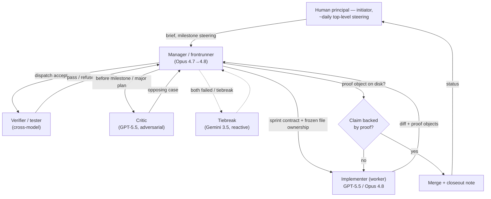

# Verifiable AI-Engineered Scientific Software : A GPU-Native JAX Reimplementation of a WRF-Compatible Regional Forecast Path 

**Preprint categories:** cs.SE primary; cs.AI secondary; physics.ao-ph secondary; cs.DC tertiary.

**Author (accountable, corresponding):** Enric Guenther (human principal, initiator, and corresponding author).

**AI contributors (non-author; see Authorship disclosure and §9.5):** the wrf_gpu2 multi-agent AI system — Claude Opus 4.7 / 4.8 (Anthropic) and GPT-5.5 Codex (OpenAI), with Gemini 3.5 (Google) in a reactive tiebreak role.

> **Authorship and AI-use disclosure (read first; see also §9.5).** The model code, the validation harnesses, the performance analysis, and the bulk of this manuscript were produced by AI agents — by the author's estimate roughly 99.9% of the implementation — under a governed multi-agent process directed by the human author. The human author was the initiator and roughly-daily top-level steerer, and is the **sole accountable party** for the public claims. Because AI systems cannot hold accountability or satisfy human-only authorship criteria, the human author is the sole *creator/author* of record; the AI systems are credited as **contributors** (see §9.5 and the release `CITATION.cff` / Zenodo metadata). If a target venue requires human-only authorship, the byline is Enric Guenther alone, with the AI systems retained in this disclosure and the Acknowledgements.

---

## Abstract

AI code generation and the modernization of legacy scientific software both suffer from the same evidence gap: it is easy to produce code quickly and hard to prove that the result is trustworthy at real scale. We report a governed multi-agent AI system that planned, implemented, falsified, repaired, and proof-object-validated a GPU-native, JAX/XLA, WRF-compatible regional forecast path with the high-frequency model state resident on a single consumer GPU, built end-to-end on subscription-limited model budgets with only roughly-daily human steering. The evidence is what makes the claim falsifiable: the artifact is validated against hard oracles — idealized analytic benchmarks (Skamarock warm bubble, Straka density current), WRF Fortran operator savepoints (the production dycore is validated through the idealized gates and the real-case runs; the standalone coupled-step *comparator harness* has a known validation-lane gap, reported as such, not as a pass), persistence baselines, three real 72 h Canary Islands 3 km cases scored against same-workstation CPU-WRF, conservation and finiteness invariants, a length-independent device-residency check (the byte-counted in-loop transfer audit is reported as inconclusive, not as a passing zero), and a roofline-grounded performance study reporting an honest ~5.3x (clean) to ~7.8x (realistic) speedup over 28-rank CPU-WRF on one RTX 5090. Equally important is the negative evidence: the process caught and publicly retracted a "bitwise WRF parity" claim that was a JAX-vs-JAX self-compare, an inflated 22.26x speedup, a missing Coriolis force exposed by a persistence baseline, and a 1 km nested-boundary pressure-pump. The artifact is not a complete WRF replacement at the time of publication: v0.1.0 presented here is a single-domain replay path that still consumes CPU-WRF/Gen2 boundary and land artifacts, and lacks live nesting, native initialization, and prognostic land surface; the 1 km nest passes its predeclared bounded 24 h gate (T2 RMSE 1.92 K, beating persistence), but only after an empirical partial surface-layer repair (full MYNN parity pending), so we keep it a secondary claim behind the primary 3 km result. These limits are scoped as release gates, not hidden. The contribution is therefore methodological as much as numerical: in a domain with objective oracles, an autonomous AI process can build hard, correctness-critical scientific software whose trustworthiness — and whose failures — can be checked rather than asserted.

---

## 1. Introduction

This project began from a wish, not a research agenda. The human author runs a nightly WRF v4 forecast for the Canary Islands and wanted it fast enough to be operationally useful — to compress the runs from roughly 8 h on CPU toward ~2 h on GPU so the local forecast system works in time, and so it could eventually be offered for free to people on the islands. In the author's operational experience, the islands' steep terrain and sharp marine-boundary-layer gradients make local high-resolution guidance valuable. <!-- NEEDS-PRINCIPAL: GPT suggestion #24 — to make any stronger public claim that coarser official products (AEMET / HARMONIE-AROME) are inadequate for the Canaries, add a product-resolution citation or small table. No such citation has been produced, so the wording is kept at the softened "in the author's operational experience." Provide a bibkey `aemet_harmonie_arome` to strengthen, or leave as-is. --> The author judged the task beyond a single agent after several attempts and gave a single, roughly-reconstructed brief to a frontier model:

> *"I need a WRF GPU port that is at least 3–4x faster on my system, stays true to WRF v4 solutions, and is built with a modern architecture. This is beyond a single agent, so build an agent framework: a manager keeps the project plan and dispatches workers. To minimize bias and maximize swarm intelligence, use both GPT and Opus best models at highest effort mode for the core development sprints. Phase 0 explores the optimal kernel architecture and estimates how fast each could theoretically be. The remaining phases work toward the goal with verifiable milestones. Research what standardized tests should be passed to declare success. The mandatory test is comparison against the raw existing 3 km and 1 km WRF v4 solutions in [the corpus folder]."*

That brief, plus occasional top-level steering (about once or twice a day: a status check, an occasional context compaction, a small course correction such as which model to prefer when one was short on tokens, and — toward the end — a request for real-world proof and for help framing this release), is essentially the entire human engineering contribution.

The result is a testable scientific question that we believe is more interesting than either of its halves:

> **Can autonomous AI agents produce trustworthy scientific software when the domain has hard oracles?**

Neither half of this question makes a strong paper alone. "AI writes code" is demonstrated often, usually on toy or unverifiable tasks, and amounts to an anecdote. "A JAX GPU weather model" is interesting systems work but incremental against the broader GPU-NWP and ML-weather wave. The conjunction is what matters: numerical weather prediction (NWP) is *objectively verifiable*. WRF savepoints, published idealized analytic cases, persistence baselines, CPU-WRF comparison, conservation diagnostics, and GPU profilers are *hard oracles*. They make "an AI built it" falsifiable rather than rhetorical. The verifiability is what turns the AI story from a demo into science.

WRF — the Weather Research and Forecasting model, in its Advanced Research WRF (ARW) configuration \cite{skamarock2019description,powers2017weather} — is a deliberately hard target. It couples a fully compressible nonhydrostatic dynamical core (third-order Runge–Kutta with split-explicit acoustic substeps) on an Arakawa C-grid in terrain-following hybrid mass coordinates, lateral boundary relaxation, a suite of physics parameterizations (microphysics, surface layer, planetary boundary layer, radiation, land surface, cumulus), a radiation cadence, and an extensive I/O and verification surface. It is over twenty years of accreted Fortran, MPI, and host-resident control flow. A directive-based GPU port can accelerate components, but any unported component forces repeated host/device transfer; and as the author observes, a clean GPU rewrite sits at the intersection of GPU kernel design, senior software engineering, atmospheric physics, and the ability to read WRF's Fortran — a combination of expertise that is individually rare and jointly very rare.

The second motivation is methodological. Repository-scale code agents can now make edits, run harnesses, and use shell environments, but safety-critical scientific software cannot be treated like an ordinary feature backlog. A model that silently invents a formula, a unit conversion, or a validation gate moves quickly in the wrong direction and produces plausible-looking but wrong fields. This project therefore ran under a governance discipline in which nothing was "done" without a falsifiable *proof object* on disk, and in which a cross-model adversarial critic was tasked with rejecting claims.

We bound our claims carefully. We do **not** claim the first GPU NWP system, the first GPU regional model, or a full WRF port. Following the narrowest defensible wording, the artifact is, to the best of our current knowledge, *the first open, JAX-native, whole-state-device-resident, WRF-compatible regional replay forecast path built and validated end-to-end by a multi-agent AI process on a consumer workstation GPU.* In plainer terms, and again only to the best of our current knowledge: it is an open WRF-compatible forecast path that anyone with a modern GPU can run, that is substantially faster than the CPU version on this workstation, and that — being released under the AGPL-3.0-or-later license (§9) — may be freely used, modified, and redistributed (with the copyleft requirement that forks, including hosted services, stay open). <!-- RESOLVED: incorporated Enric's plain-language framing (access + speed + AGPLv3), kept inside the "to the best of our current knowledge" hedge and without any new unqualified "first" in title/abstract. --> <!-- NEEDS-PRINCIPAL: GPT suggestion #25 — for journal submission, add a dated prior-art audit table for open WRF GPU attempts and commercial accelerators. Until that audit exists, "to the best of our current knowledge" is retained and no bare "first" appears in the title or abstract. -->

**Contributions.**

1. A proof-object-governed multi-agent method for producing correctness-critical scientific software, including its role structure, sprint-contract and file-ownership discipline, patch protocol, and — as first-class evidence — a documented record of the false claims the process caught and corrected (§3, §6.5).
2. A JAX/XLA, GPU-native, WRF-compatible regional forecast implementation with whole-state device residency (§4).
3. A tiered validation stack spanning WRF savepoints, idealized analytic cases, real-case CPU-WRF comparison, persistence baselines, conservation/finiteness invariants, device-residency checks, and profiler provenance, reported with both passes and failures (§5, §6).
4. An honest, roofline-grounded performance characterization explaining *why* a faithful fp64 GPU NWP workload is memory- and launch-bound, with four candidate accelerations measured and refuted (§6.4).
5. A real Canary d02 demonstration and a gap-bounded roadmap (§6, §8), explicitly scoping what v0.1.0 is and is not.

A recurring theme: performance is only meaningful when the proof object matches the claim. The project's own history is the strongest evidence for this — the system repeatedly produced fast, finite forecasts that were nonetheless wrong, and the process is what caught them.

---

## 2. Related Work

### 2.1 WRF and prior WRF GPU efforts

ARW solves a fully compressible nonhydrostatic system in flux form on a terrain-following dry-hydrostatic-pressure coordinate, with C-grid staggering and a split-explicit RK3 + acoustic-substep integrator \cite{skamarock2019description}. This structure is attractive for regional forecasting but awkward for GPUs, mixing horizontally coupled stencils, vertically implicit solves, boundary relaxation, and physics tendencies with disparate memory-access patterns. Prior WRF acceleration has largely been directive-based — moving microphysics or selected kernels to accelerators while leaving other components host-resident — or commercial. AceCAST represents a CUDA-Fortran/OpenACC WRF-acceleration line reporting a 5–14x range in vendor materials; we treat that as context, not a peer-reviewed end-to-end comparator \cite{tempoquest2025acecast}. WRF I/O modernization work (e.g. ADIOS2) targets streaming rather than whole-forecast device residency \cite{fredj2023adios2wrf}. We make no first-GPU-WRF claim.

### 2.2 GPU NWP and model rewrites

GPU regional NWP is established. MeteoSwiss COSMO and the ICON-CH migration are important precedents for operational GPU regional forecasting \cite{fuhrer2026icon,lapillonne2026benchmarking}. Domain-specific-language approaches separate stencil expression from backend codegen: Pace reimplemented the FV3 dynamical core in Python using GT4Py and DaCe \cite{dahm2023pace,bennun2019dace,whitaker2023gt4py}. SCREAM is the clean-slate C++/Kokkos exascale path \cite{bertagna2024scream}; NIM is an earlier native-GPU precursor \cite{govett2017parallelization}. A comparator table of reported speedups and hardware classes is staged at `publish/tables/comparators.md` (it should remain context, not a normalized benchmark, unless each row is re-grounded against current proof objects). These systems establish that GPU NWP is real and that production ports require more than kernel translation. Our distinct combination is: open, JAX-native, whole-state-device-resident, workstation-scale, proof-objected, and AI-built.

### 2.3 ML weather models

Data-driven and hybrid global forecasting — GraphCast, Pangu-Weather, FourCastNet, GenCast, Aurora, NeuralGCM, Stormer, AIFS — produces fast, skillful forecasts under the right evaluation regime \cite{lam2023graphcast,bi2022pangu,pathak2022fourcastnet,price2023gencast,bodnar2024aurora,kochkov2023neuralgcm,nguyen2023stormer,lang2024aifs,lang2025update}. The present work is not an ML emulator: we reimplement the physics-based equations rather than learn a surrogate. The distinction matters for evaluation — ML systems are usually scored on global reanalysis fields at medium range, whereas a 1-3 km regional model must satisfy local terrain, boundary forcing, and station-scale requirements. A JAX core does, however, open ML-hybrid futures (differentiability, learned parameterizations, gradient-based assimilation); we state this as a structural property and future work only — we did not exercise it (§7).

### 2.4 AI agents and repository-scale software engineering

Repository-level AI coding has moved beyond autocomplete. SWE-bench measures whether agents resolve real GitHub issues \cite{jimenez2024swebench}; SWE-agent frames agent-computer interfaces for software work \cite{yang2024sweagent}; orchestrator-worker and evaluator-optimizer patterns describe decomposition and critique loops \cite{anthropic2024effective}; terminal harnesses made it practical for agents to run tests, edit code, and report evidence in a persistent repository \cite{anthropic2026claude}. Scientific software changes the risk profile: a web bug is caught by integration tests and users, whereas a numerical-weather bug can produce plausible fields while losing the forecast. The open question is not whether an AI can write code quickly, but whether a multi-agent process can build, test, falsify, and revise scientific claims under explicit governance — and whether a verifiable domain makes that result *checkable*. Discussions of AI authorship and accountability emphasize that human responsibility and disclosure remain central \cite{arxiv2026policy,pcmag2026arxiv,nature2024editorial,schmidt2025senior}.

---

## 3. The AI Engineering System

This section is deliberately early: the governed multi-agent process is the headline contribution, and the artifact (§4) is its existence proof.

### 3.1 Roles

The build used a role taxonomy rather than a single assistant:

- **Manager / frontrunner** — owned the project plan, sprint definition, repository-state synthesis, cross-sprint memory, ADR routing, diff review, acceptance-gate execution, and merge/closeout decisions.
- **Implementer (worker)** — implemented scoped changes inside a frozen file-ownership boundary under a sprint contract, producing proof objects.
- **Verifier / tester** — challenged the worker's result, reran commands, inspected proof objects, and could refuse completion if the evidence did not support the claim.
- **Critic** — a cross-model adversary tasked with arguing the opposing position before milestone closes and major plan commitments.
- **Tiebreak** — a third model engaged reactively only when the first two had both failed on the same defect or for an architecture tiebreak.

This division encodes different failure surfaces: the worker moves fast inside a narrow boundary, the verifier assumes the implementation is wrong until proof says otherwise, the critic attacks the plan, and the manager sees repeated failure patterns and changes the contract. Crucially, *the critic and verifier were different models from the implementer*, so single-model blind spots were less likely to survive review.

### 3.2 Model-role timeline

The role assignments shifted over the build week as the foundations became trustworthy and as relative model strengths became clear:

- **GPT-5.5 Pro built the foundations** — the skill files, the memory system, and the manager/frontrunner/verifier role scaffolding the rest of the project ran on.
- **Manager:** Opus 4.7 initially; **Opus 4.8** took the manager role toward the end of the build when it was released.
- **Implementer (frontrunner):** mostly **GPT-5.5** early/middle (dycore); **Opus 4.8 (max effort)** became the code frontrunner in the later stages.
- **Verifier:** ran **every sprint** initially, then **every milestone** (to conserve tokens once the foundations were trustworthy).
- **When stuck:** GPT-5.5, and occasionally **Gemini 3.5 flash**, were dispatched for independent angles; the manager collected the intel and decided.
- **Human:** roughly once or twice a day — a status check, an occasional `/compact`, and small high-level course corrections.

These transitions are tabulated per stage in §3.5 and `publish/tables/ai_process_ledger.md` (stage (a) Opus 4.7 manager / GPT-5.5 frontrunner → stages (b)–(f) Opus 4.8 manager / Opus 4.8-max frontrunner, with the verifier moving from every-sprint to every-milestone and GPT-5.5/Gemini reactive), and visualized in Figure 1 (`publish/figures/model_role_timeline.png`, rendered from the git-history accounting in `publish/tables/effort_accounting.md`).

### 3.3 Proof-object discipline

Work was not considered complete until a falsifiable artifact existed on disk: a JSON measurement, a Markdown verdict, a log, or a generated figure — never a chat summary. Each claim type binds to a required proof:

| Claim type | Required proof object |
|---|---|
| Performance | timing/roofline JSON with an explicit denominator definition |
| Transfer residency | device-to-host (D2H) audit with a defined profiler window |
| Restart / repeatability | comparator output over a defined window |
| Operator / savepoint correctness | WRF (or analytic) savepoint parity comparator |
| Physical stability | finite/bounds/invariant/conservation JSON |
| Idealized correctness | analytic-benchmark close-gate verdict (PASS asserted, not PASS-or-FAIL) |
| Operational skill | CPU/GPU/observation side-by-side scoring with persistence baseline |
| Release readiness | closeout memo plus an audit script |

Several historical failures came precisely from matching the *wrong* proof to a claim — finite station scores are a measurement, not a skill-equivalence proof; a warm wall-clock is speed under a window definition, not meteorological usefulness; bitwise agreement at one step is local evidence, not a 24 h forecast gate (§6.5). Making "done" auditable is what allowed those mismatches to be caught.

### 3.4 Sprint contracts, file ownership, and the patch protocol

Every implementation sprint launched from a contract stating objective, non-goals, acceptance criteria, file ownership, proof objects, validation commands, branch name, and a worker-report token. Workers could not edit outside owned paths; two active workers could not edit the same core files unless an interface had been frozen first. Governance files — memory, rules, skills, contracts — were production assets changeable only via a patch protocol (evidence + reviewer approval + validation), never edited in-place by a worker. This prevented the most insidious agentic failure mode: silently relaxing the goal or the gate to make a sprint "pass."

### 3.5 Process metrics

The build is summarized below per stage; full per-stage detail, the model/role attribution method, and the git-history spine are in `publish/tables/ai_process_ledger.md` and `publish/tables/effort_accounting.md`. The numbers are *approximate structural proxies* — no per-agent token meter was kept (stated plainly, not asserted away) — derived read-only from git history, `.agent/sprints/`, `.agent/decisions/`, and `.agent/milestones/`. The honest unit of effort is **agent-runs / sprints**, not human-equivalent hours, because the work ran in mostly-nightly free-token windows rather than continuous wall-clock.

| Stage | Approx sprints | Dominant manager / frontrunner / verifier / tiebreak | Representative proof objects / verdict | Major claim affected |
|---|---:|---|---|---|
| (a) Foundations & governance M0–M7 (= v0.0.1 kernel) | ≈195 | Opus 4.7 / GPT-5.5 / GPT-5.5 per-sprint / Gemini 3.5 (C2) | ADR-001…009, M1–M7 closeouts, v0.0.1 paper | v0.0.1 "bitwise parity" (later retracted, §6.5a) |
| (b) F7 dycore rewrite | ≈26 | Opus 4.8 / Opus 4.8 (max) / GPT-5.5 per-sub-sprint critic / Gemini 3.5 deep review | `proofs/f7/DYCORE_STATUS.md`; both idealized cases PASS vs pristine WRF v4.7.1 | dycore correctness (rebuilt) |
| (c) Phase-B physics M8–M17 | ≈19 | Opus 4.8 / mixed Opus·GPT / per-milestone | M8 savepoint harness, M9 viability, M10 LU_INDEX bitwise; several honest PARTIAL closeouts | physics-suite parity debts (§4, §8) |
| (d) M19 viability / skill | ≈12 reviews + sprints | Opus 4.8 (max) / Opus 4.8 / GPT-5.5 + Gemini parallel | `proofs/m19/`, persistence baseline; missing-Coriolis fix `5319b8d` | wind skill (§6.5c) |
| (e) Perf | ≈15 | parallel Opus 4.8 + GPT-5.5 + Gemini probes / manager synthesis | `proofs/perf/` roofline, fp32 gates, D2H; M7-PERF closeout | speedup denominator (§6.5b) |
| (f) v0.1.0 finish | small (this drive) | Opus 4.8 (max) / Opus 4.8 / GPT-5.5 + Gemini final cross-check | `7c864fa D02_VALIDATED`, d03 24 h, POST-0.1.0-ROADMAP, `publish/paper` + `publish/tables` | this release |

**Effort accounting.** The honest unit is agent-runs/sprints, not wall-clock hours. From git, the project spans **≈12.6 calendar days** from the first commit (`896149f`, 2026-05-18 23:20, "Bootstrap AgentOS factory") to the current HEAD (`234265a`, 2026-05-31), reaching the **v0.0.1 working kernel at ≈9.2 days** (`f668937`, 2026-05-28) and the v0.1.0 replay path in the ≈3.4 days after; the dead earlier attempt is excluded entirely, and these are *calendar* spans of mostly-nightly bursts, not continuous work (peak 134 commits on 2026-05-21). The spine is **884 git commits** (685 to the v0.0.1 kernel, 199 in the v0.1.0 drive), **249 dated sprint directories**, and — because most sprints ran 2–3 agents (manager dispatch + frontrunner + verifier/critic, with bug-hunts fanning to 3–4 angles) — an estimated **≈500–700 total agent-runs**. With no token meter, the token figure is an engineering estimate of **order 10⁸ total tokens (input+output), ~10⁷–10⁸ output tokens** (≈600 runs × ≈450k tokens/run; uncertainty band 1–6 × 10⁸), and it fit inside the plan limits. There was **no git tag** for v0.0.1 — it was a publish/paper freeze, so v0.1.0 is the first tagged release. **Cost envelope:** the entire build fit within the token limits of a **≈€200/mo Claude Max + ≈€100/mo GPT Pro** pair of subscriptions used as a side project (so a realistic *attributable* cost well below the ≈€300/mo ceiling), with **no funding of any kind** and no metered API overage; the author estimates it is plausibly reproducible for **≤€100**. We deliberately report agent-runs/sprints rather than human-equivalent hours, and we make no claim that future work will be "finished within hours or days": a future-work cadence is not evidence.

### 3.6 Error-catch ledger

The following false or inflated claims were *generated and then caught* by the process. They are the strongest evidence that the validation regime has teeth, and we feature rather than hide them (full case studies in §6.5):

| Caught claim | What it actually was | How / who caught it | Resolution |
|---|---|---|---|
| "Bitwise WRF parity at 100 coupled steps" (v0.0.1 headline) | A JAX-vs-JAX self-compare (the comparator read back the model's own output, never WRF Fortran); the dycore was missing ~7 WRF operators | Reactive cross-model audit during the project reset | Publicly retracted; dycore honestly rebuilt against analytic references + pristine WRF savepoints |
| "22.26x speedup" (and earlier 50.20x / 156.82x lineage) | One GPU d02 domain divided by the *whole multi-domain CPU nest* wall time | Roofline / denominator audit | Corrected to ~5.3x clean / ~7.8x realistic, d02-vs-d02 |
| "Winds operationally usable" / finite station scores as a gate | A measurement, not a CPU-vs-GPU skill comparison; V10 was below persistence | Persistence baseline + side-by-side CPU-WRF scoring | Root cause = missing Coriolis force in the dycore; added; winds now beat persistence on the main case |
| d03 1 km "validated" implied by d02 success | A nested geopotential-boundary forcing term pumping the interior (+6.8 K T2, 2.5x wind bias) | Nested-domain validation against CPU-WRF | WRF-faithful boundary fix collapsed overnight bias to d02-quality; a separate daytime surface-flux warm bias was *unmasked* and is now tracked (next row) |
| d03 daytime surface-flux (HFX) warm bias mistaken for a dycore/boundary problem | The bare `sfclayrev` port reused momentum roughness for the heat profile, while corpus MYNN uses a smaller land thermal roughness → HFX ≈ 4× too high, T2 ≈ +3.6 K | External column-oracle parity (corpus-WRF inputs → GPU surface layer → vs same-step WRF, not a self-compare) | Empirical partial MYNN-inspired land thermal-roughness repair (full MYNN parity pending; §6.3): land HFX over-flux 4.22× → 2.30×, T2 land bias +3.6 K → +1.2 K; the 24 h d03 nest now passes its bounded gate (§6.3) |

**Workflow loop (Figure 2).** The governed control loop is rendered to `publish/figures/workflow_loop.png` and is shown below as a mermaid diagram and an equivalent ASCII rendering; the role names match the process-metrics ledger (§3.5). The loop is the unit that repeated ≈500–700 times across the build: the manager dispatches a sprint contract to a worker, collects the diff and proof objects, dispatches the cross-model verifier and (before milestone/plan commits) the critic, and merges *only* if a proof object on disk backs the claim — otherwise the work returns to the worker. The human enters only as the initiator and a roughly-daily top-level steerer.



```text
   Human principal (initiator; ~daily status + small course corrections)
        |  brief / milestone steering                         ^ status
        v                                                     |
   +----------- MANAGER / FRONTRUNNER (Opus 4.7 -> 4.8) -------------+
   |   scopes contract, freezes file ownership, reviews diff,       |
   |   runs acceptance gates, decides, merges                       |
   +---------------------------------------------------------------+
        | dispatch (contract)        | dispatch gates    | before milestone
        v                            v                   v
   WORKER (GPT-5.5 / Opus 4.8)   VERIFIER (cross-model)  CRITIC (GPT-5.5)
   edits owned files,            reruns, inspects proofs adversarial
   writes proof objects          pass / REFUSE           opposing case
        |                            |                   |
        +------------> "Claim backed by a proof object on disk?" <----+
                          yes -> merge + note      no -> back to WORKER
                          (tiebreak: Gemini 3.5, only if both above failed)
```

---

## 4. The Model Artifact

The numerical implementation follows ARW *structure* without inheriting WRF's *software architecture*. It is a clean Python/JAX rewrite that targets the GPU memory hierarchy from day one.

**State and grid.** Model state is a structure-of-arrays JAX pytree (ADR-002) of fp64 device arrays with explicit C-grid staggering conventions, in a terrain-following hybrid mass (eta) coordinate. The operational d02 grid for the measured cases has mass shape (44, 66, 159) and WRF staggered extent (45, 67, 160). The state carries dry-air mass, perturbation and base pressure and geopotential, staggered winds, water species and number concentrations, surface fluxes, lateral boundary side histories, and Coriolis metrics (`f`, `e`, `sina`, `cosa`). A halo interface (`contracts/halo.py`) is designed in as an MPI-shaped no-op for future multi-GPU work; v0.1.0 is single-GPU and makes no scaling claim.

**Whole-state device residency.** After initialization, the high-frequency forecast state remains in GPU memory through compiled JAX step loops. Step-boundary I/O for output and project checkpoints is allowed; inter-kernel host/device transfer inside the timestep loop is a constitutional prohibition without an ADR. Residency is *architecturally guaranteed*: the whole-state pytree is resident on device and the scanned timestep performs no host transfer by construction. The historical M7 transfer audit reported 0 copies / 0 bytes; a byte-counted in-loop v0.1.0 audit was attempted but is reported **inconclusive** rather than as a passing zero (the trace-classifier could not extract per-event byte sizes; §6.4). This distinguishes the design target from partial ports where an unported scheme pulls full fields to the host at every coupling point.

**Dynamical core.** RK3 outer steps advance the meteorological modes; split-explicit acoustic substeps (10 per step at dt = 10 s for d02) handle fast pressure waves. The acoustic core advances `u/v` momentum, then dry-air mass and coupled potential temperature, then `w` and geopotential via an implicit vertical solve, then recomputes pressure/density each substep — matching the WRF cadence. The vertical implicit `w`/φ solve is lowered by XLA to an NVIDIA cuSPARSE batched parallel-cyclic-reduction kernel. Advection is WRF flux-form (5th-order horizontal, 3rd-order vertical) with the WRF-correct upwind-correction sign (a sign error here was a real bug, §6.5). The Coriolis force is the WRF-faithful standard form on the coupled `ru/rv` tendency (added late; §6.5). Dissipation uses WRF's 6th-order numerical filter (`diff_6th_opt=2`), Rayleigh damping, and `w_damping`.

**Physics suite.** The operational column physics is Thompson microphysics, the WRF revised surface layer (`sfclayrev`), a MYNN level-2.5 PBL closure, and RRTMG-style shortwave/longwave radiation called at a held cadence (180 steps). Land surface is a *prescribed* Noah-MP subset (skin temperature, top soil moisture, land/lake masks, roughness), explicitly **not** prognostic Noah-MP; in the operational replay path the land fields are refreshed hourly from corpus artifacts. The implemented physics has documented parity debts (fixed-cap Thompson sedimentation substeps, neglected cloud-water sedimentation, MYNN EDMF/cloud terms disabled, RRTMG topographic-shading/slope-radiation and real-lat/lon coupling absent); these are inventoried in §8.

**Boundary replay and limits.** The d02 forecast uses lateral boundary side histories (`spec_bdy_width=5`, relaxation zone) packed from corpus WRF/Gen2 hourly output, not live AIFS/GFS ingestion. **This makes v0.1.0 a single-domain replay path, not a native WPS/`real.exe` replacement** — it still consumes CPU-WRF/Gen2 boundary, metric, and land artifacts.

**Output and precision.** The writer is a minimal WRF-compatible `wrfout` producer (a defined minimum variable set plus M9 surface diagnostics); restart is via project checkpoints, not full `wrfrst` interoperability. Precision is fail-closed fp64 in the operational mode (declared and re-gated), with fp32 paths gated opt-in only where validated; §6.4 shows fp32 gives no speedup on this workload, so fp64 is kept as the safe default.

---

## 5. The Validation Stack

The validation stack is the paper's trust engine. It is organized by *evidence type*, and we report pass **and** fail status (§6).

- **Tier 1 — WRF savepoints / operator parity.** Local, strict comparison of individual operators against WRF Fortran (and analytic) savepoints: coefficient generation, the tridiagonal/implicit solve, the acoustic-substep recurrence, advection convergence order, mass semantics. This is decisive for transcription bugs but is *not* a forecast-skill gate. The pristine WRF v4.7.1 arbiter is a from-scratch gfortran build with per-acoustic-substep center-column savepoints. Honest status: the *operational* dycore operators are independently validated by the idealized gates and the d02/d03 real-case runs, which exercise the production `small_step_prep` → `_rk_scan_step` path; but the standalone coupled-step *comparator harness* currently fails to run to completion because the validation-only core path is fed a state lacking ~30 `small_step_prep`-derived leaves, so it is reported as a comparator-harness gap (not a production-dycore defect) and is a tracked v0.2.0 follow-up (§6.5, proof table row 3).
- **Tier 2 — invariants / conservation / guards.** Finiteness, physical bounds, dry-mass and water-budget behavior, tracer positivity, and limiter/guard-engagement reporting. This prevents a model from matching a local savepoint yet producing an impossible coupled state, and it blocks "performance fixes" that silently introduce NaNs or negative species. The idealized warm bubble passes 6/6 fully guards-off, and the real d02 dycore runs finite guards-off — i.e. the safety guards are a net, not load-bearing.
- **Tier 3 — idealized analytic benchmarks.** Skamarock warm bubble and Straka density current versus published references, through the *operational* entry point (bitwise-identical to the idealized harness over 50 warm-bubble steps).
- **Tier 4 — real-case skill + persistence baselines.** RMSE versus same-workstation CPU-WRF at multiple leads on real Canary cases, with a persistence baseline (1 − GPU_RMSE/persistence_RMSE) as the skill discriminant. The persistence baseline is what exposed the wind deficiency that finite-forecast checks missed (§6.5). A formal *statistical* equivalence test — a predeclared paired TOST (ADR-029) — was run on the achievable corpus, but we report it only as an **underpowered, single-season (spring trade-wind, n = 3 distinct MAM days) descriptive paired-delta check, which we never call "seasonal" and never call "equivalence PASS."** On that n = 3 corpus U10 is descriptively equivalent within margin, V10 is borderline, and T2 is not within margin; the harness, scorer, and predeclared ADR-029 margins are built and self-tested (CPU-vs-CPU reproduces the benchmark to 0.00 paired delta; `proofs/m20/`). A genuine multi-season equivalence claim (n ≈ 27–30) is future work (§8).
- **Systems validation.** A length-independent device-residency check, a byte-counted in-loop D2H transfer audit, restart continuity, warm-run repeatability, and profiler provenance, each bound to a proof object. The length-independent residency, profiler provenance, repeatability re-run, and restart-continuity probe all PASS; the *byte-counted* in-loop transfer audit is **inconclusive** (the classifier could not extract per-event byte sizes, so it does not assert a passing zero), while residency remains architecturally guaranteed by construction (§6.4).

The validation stack and its v0.1.0 status are rendered in Figure 3 (`publish/figures/validation_pyramid.png`): Tier 1–3 PASS; Tier 4 d02 PASS (primary), d03 PASS (secondary; empirical-partial HFX repair), TOST reported as an underpowered single-season descriptive check.

---

## 6. Results

We order Results from the most local oracle to the most operational, then performance, then the AI self-correction case studies. We do **not** lead with any historical speedup multiplier.

### 6.1 Dynamical core and idealized validation

Both idealized analytic gates **PASS** through the operational entry point [proofs: `proofs/f7n/{skamarock_bubble,straka_density_current}_diagnostics.json` + verdict markdown, with Coriolis-era f=0 re-confirmation `proofs/wind/idealized_postfix/`; close-gate copies `proofs/sprintU/close_gate/{warm_bubble,density_current}_verdict.json`; `proofs/f7/DYCORE_STATUS.md`; companion table `publish/tables/idealized_gate_summary.md`]:

- **Skamarock & Wicker (1998) rising warm bubble — PASS 6/6** (dt = 0.1 s, 5000 steps): θ′ max ≈ 1.920 K (target 0.5–2.5 K), max |w| ≈ 11.68 m/s (target 1–30), thermal rise ≈ 1924 m (target ≥ 500), horizontal drift ≈ 1.8e−12 m (symmetric), dry-column mass drift ≈ 0, all snapshots finite.
- **Straka et al. (1993) density current — PASS 6/6** (dt = 0.1 s, 9000 steps, 900 s): front ≈ 14 150 m (target |x − 15000| ≤ 2000), θ′ min ≈ −9.971 K (target −25…−5), max |w| ≈ 14.575 m/s (target 1–50), rotor-count proxy = 4 (target 2–4), dry-column mass drift ≈ 2.25e−9, all snapshots finite.

The operational/real-case path uses the *same* validated dycore operators as the idealized gates (50-step warm-bubble bitwise identity), so the idealized PASS transfers to the operational dynamics. Honest scope: the full 3D u/v/w deformation tensor, 3D terrain-slope diffusion cross-terms, map factors, and lateral specified/nested-boundary order degradation remain Phase-B items (§8); the operational forecast uses the 6th-order filter, not `km_opt` deformation diffusion.

The companion gate table (`publish/tables/idealized_gate_summary.md`) is generated, and the idealized fields are shown in Figure 4 (warm-bubble θ′ evolution, `publish/figures/warm_bubble_panel.png`) and Figure 5 (Straka density-current θ′ at 900 s, `publish/figures/straka_density_current_panel.png`), rendered from the PPM outputs under `publish/figures/idealized/`.

### 6.2 Real-case d02 (3 km) validation

Across three independent real Canary cases (init 2026-05-09, -21, -29 18Z), the GPU d02 forecast runs **stable and finite to 72 h** and is scored against same-workstation CPU-WRF at 6/12/24/48/72 h. The current proof verdict is **D02_VALIDATED (all cases pass)** [proof: `proofs/v010_validation/v010_d02_result.json`; first established on the Coriolis HEAD `5319b8d` and **re-validated post-HFX-fix with no regression** — proof table row 4 confirms identical T2 RMSE and winds beating persistence at every lead]. Representative full-domain RMSE (case1; unchanged across the pre/post-fix runs):

| Field | 6 h | 12 h | 24 h | 48 h | 72 h | Units |
|---|---:|---:|---:|---:|---:|---|
| T2 | 1.88 | 2.10 | 1.34 | 1.09 | 1.06 | K |
| U10 | 1.51 | 1.55 | 1.54 | 1.79 | 1.80 | m s⁻¹ |
| V10 | 1.70 | 1.76 | 2.07 | 2.34 | 2.38 | m s⁻¹ |
| PRECIP | 0.01 | 0.10 | 0.35 | 1.25 | 1.56 | mm |

These surface RMSEs are in a physically meaningful range against CPU-WRF, and after the Coriolis fix **U10 and V10 have positive mean persistence skill in every case and region** (full domain and Tenerife box): mean U10 skill +0.22…+0.45, mean V10 skill +0.13…+0.51. U10 has no per-lead losses in the rendered table; V10 still has isolated case2 per-lead losses/ties, so the defensible claim is positive mean skill by case/region, not every-lead dominance (case3 V10 skill moved from −0.13 to +0.17; §6.5) [proofs: `proofs/m19/verdict_result.json`, `proofs/wind/coriolis_fix_verdict.md`; full skill table `publish/tables/wind_persistence_skill.md`]. **T2 skill is mixed and we do not over-claim it:** full-domain T2 often loses to a strong low-error persistence baseline at these leads, while T2 is skillful in the Tenerife box at most cases. **PRECIP is explicitly not a skill claim:** its RMSE grows monotonically with lead and loses to persistence at every lead (the "zero precip" baseline is strong on these mostly-dry days); PRECIP RMSE is small in absolute terms (≤ ~1.6 mm full domain) and is reported as a diagnostic/limitation, not validated skill (§8).

The full table — full-domain (n = 10 494) and Tenerife-box (n = 955) RMSE/bias at 6/12/24/48/72 h for T2/U10/V10/PRECIP, with persistence-skill columns, for all three cases — is generated at `publish/tables/v010_d02_validation.md` [via `proofs/v010_validation/render_table.py --result proofs/v010_validation/v010_d02_result.json`]; the inline case1 numbers are read directly from the same proof JSON. The 3-case d02 validation has been **re-run post-HFX-fix** (proof table row 4: D02_VALIDATED, T2 RMSE unchanged vs pre-fix, no regression, winds beat persistence at every lead, finite/stable to 72 h), so the published numbers do not rest on a pre-fix proof. *Release gate (PENDING-TAG):* per the proof contract (`publish/VERIFICATION.md` row 4), the published numbers are tied to the final tagged release commit once that commit is cut; the proof table currently sits on the HFX-fix HEAD pending the tag.

### 6.3 Real-case d03 (1 km) status — boundary-pump fix and an honest residual

The 1 km Tenerife nest is the harder case and the honest one. An earlier d03 run failed badly (final T2 RMSE ≈ 10.8 K, U10 ≈ 8.6, V10 ≈ 9.8, all beaten by persistence). Root cause: a **nested geopotential-boundary forcing term that pumped the interior** (+6.8 K T2, ~2.5x wind bias). The WRF-faithful boundary fix collapsed the overnight bias to d02-quality, and a subsequent empirical partial repair of the daytime surface-flux (HFX) over-flux (described below) brought the daytime warm bias down enough to pass the bounded gate. The current 24 h d03 proof is **`D03_1KM_VALIDATED`** (`validation_status: PASS`) [`proofs/v010_validation/d03_summary_run24h_hfxfix4.json`, `d03_validation_run24h_hfxfix4.json`]. Final-lead (+24 h) full-domain RMSE vs corpus 1 km CPU-WRF truth:

| Field | RMSE | Threshold | Within threshold | Beats persistence (final lead) | Persistence skill | Units |
|---|---:|---:|:--:|:--:|---:|---|
| T2 | 1.92 | 3.0 | yes | yes | +0.16 | K |
| U10 | 3.45 | 7.5 | yes | no | −0.16 | m s⁻¹ |
| V10 | 4.24 | 7.5 | yes | yes | +0.09 | m s⁻¹ |

**Read this with field qualifiers, not as a blanket "beats persistence" claim.** T2 is within the predeclared 3.0 K bounded gate (final-lead RMSE 1.92 K; 24 h mean ≈ 1.8 K) and beats the persistence baseline at the final lead (skill +0.16) and at most leads. V10 is within its 7.5 m s⁻¹ gate and beats persistence at most leads (final-lead skill +0.09). U10 is within its 7.5 m s⁻¹ gate and beats persistence at the **short** leads (e.g. +1 h skill +0.55, +2 h +0.52) but **loses to persistence at the longer leads** (final-lead skill −0.16; the persistence baseline strengthens as the surface state settles), so the defensible U10 claim is within-gate-and-short-lead skill, not every-lead dominance. Precipitation (RAINNC) is not a skill claim and loses to the near-dry persistence baseline. No field beats persistence at *every* lead (`persistence_beat_all_leads` is false for all four fields), which is why we report the qualifiers explicitly. This is a dramatic improvement over the pre-fix run (final-lead T2 ≈ 10.8 K → 1.92 K, U10 ≈ 8.6 → 3.45, V10 ≈ 9.8 → 4.24).

The residual that had been blocking the gate is a **daytime surface-flux (HFX) warm bias shared across domains** (peak T2 mean-bias ≈ +3 K at midday): the corpus L3 ran the MYNN surface layer (`sf_sfclay_physics=5`), which over land uses a thermal roughness length `z_t` (Zilitinkevich 1995, CZIL = 0.085) much smaller than the momentum roughness for the heat profile, whereas the bare `sfclayrev` port reused the momentum roughness for heat — making `psit` ≈ 4× too small, HFX ≈ 4× too high, and T2 ≈ +3.6 K warm over land.

**HFX repair — an empirical partial MYNN-inspired land thermal-roughness fix, not yet a faithful `module_sf_mynn.F` port.** A land thermal-roughness `z_t` term was added for `psit`/`psit2`/`psiq`; driving corpus-WRF midday d03 column inputs through the corrected `sfclayrev` and comparing against same-step WRF (an *external-oracle* parity, not a self-compare) collapses the land HFX over-flux from ≈ 4.22× to ≈ 2.30× of WRF and the binding T2 diagnostic from +3.6 K to +1.2 K land bias (T2 all-cell RMSE 2.106 K → 0.827 K), with water-side fluxes and momentum unchanged [proof: `proofs/v010_validation/sfclay_hfx_oracle_parity.json`]. **We do not claim this is a faithful MYNN surface-layer port.** An adversarial review of the code against `module_sf_mynn.F` found three formula mismatches that an exact port would have to resolve: (1) the stability parameter `zol` is still solved with the *momentum* roughness before the `z_t` block, whereas MYNN feeds `z_t` into the Richardson-to-`z/L` solve itself; (2) the roughness Reynolds number `restar` is taken from a blended/look-ahead `ustar` rather than from the prior-step `ustar` as in WRF; (3) the diagnostic `psih2`/`psih10` use the thermal baseline for all heights, while MYNN uses the *momentum*-roughness baseline for the 2 m and 10 m diagnostics. The repair is therefore best described as an **empirical partial MYNN-inspired land thermal-roughness repair (full MYNN parity pending)**: it reduces the HFX/T2 error and unblocks the bounded 1 km gate, but it is not WRF-faithful without a Fortran side-by-side proving equivalence. The residual ≈ 2.3× land HFX is attributed (an inference, not yet a proof) to Noah-MP surface-energy-balance coupling not reproducible by a standalone surface layer (P0-3/P1-4), not to the surface-layer term itself. We state d03 precisely: *the boundary-pump bug is fixed, the HFX over-flux root cause is identified and empirically reduced, and the strict bounded 24 h 1 km gate now passes (`D03_1KM_VALIDATED`, proof table row 5) — but the surface-layer repair is an empirical partial fix and full MYNN parity, plus a moisture/PBL-coupling regression check, remains future work* (§8, `publish/VERIFICATION.md` row 5). The d02 re-validation confirmed no moisture/wind regression from the `psiq`-on-`z_t` change (proof table row 4: T2 RMSE unchanged, winds beat persistence at every lead), but a same-input WRF-vs-GPU surface-layer table for LH/QFX/Q2/MOL over land and water, stable and unstable, remains a v0.2.0 deliverable.

The d03 status table — pre-fix→post-fix bias collapse, final-lead scores vs persistence, and the per-lead persistence win/loss tally — is generated at `publish/tables/v010_d03_status.md`.

### 6.4 Performance and roofline

On one RTX 5090 (fp64, single domain, dt = 10 s, RRTMG cadence 180), the 3 km Canary d02 forecast runs **~5.3x faster (clean) / ~7.8x faster (realistic)** than 28-rank CPU-WRF v4.7.1 on the same workstation and the same domain [proof: `publish/runtime_optimization_analysis.md`; `proofs/perf/roofline_costonly.json`, `speedup_denominator.md`, `compute_cycle_analysis.md`; `proofs/thompson_perf/coupled_timing_base_vs_opt.json`].

| Framing | CPU-WRF d02 (s/fc-hr) | GPU d02 (s/fc-hr) | Speedup |
|---|---:|---:|---:|
| Conservative — CPU clean compute | 83 | 15.68 | **5.29x** |
| Realistic — CPU incl. radiation + I/O | 123 | 15.68 | **7.84x** |
| dt-matched floor (GPU forced to CPU dt = 6 s) | 83 | ~26.1 | ~3.2x |

The headline is the *analysis*, not the multiplier. The dycore sits at arithmetic intensity ≈ 0.40 FLOP/byte — below even the fp64 roofline ridge (0.915) and 146x below the fp32 ridge (58.5) — achieving ~18.7% of HBM bandwidth and only ~8.2% of fp64 peak, with a ~5.3x kernel-launch/serialization tax over the bandwidth floor. The step issues ~11,000 GPU operations (~7,200 tiny elementwise kernels + ~3,900 memory ops), and the GPU is idle ~43–68% of each step waiting between dependent micro-launches. **The model is memory- and launch-bound, not fp64-compute-bound** — which is why fp32 does not help. Four candidate accelerations were each implemented and measured, and each refuted:

| Lever | Measured effect | Why it fails faithfully |
|---|---|---|
| fp32 dynamics | ~1.00x | launch/bandwidth-bound; mandatory-fp64 acoustic-island boundary converts cancel the byte saving |
| CUDA command-buffer graph capture | **0.83–0.87x (slower)** coupled | coupled step is physics-compute-dominated; graph-capture overhead exceeds launch-tax saving |
| fp32 Thompson microphysics | ~1.0x | Thompson is ~85% sedimentation = launch/bandwidth-bound (64 substeps × 4 species) |
| implicit (backward-Euler) sedimentation | 2.25–2.44x kernel, **REJECTED** | over-precipitates +47% vs a purpose-built precipitating WRF oracle; accuracy-recovering nsub≥4 erodes the win below 1.6x |

The one shipped safe win is a bit-identical sedimentation scan-unroll (~+5% coupled), which moves the headline from 5.06x/7.5x to 5.29x/7.84x; a gated acoustic-substep unroll adds ~1.225x on the dynamics at fp64 round-off (default off). The scientifically grounded ceiling under strict WRF fidelity is ~8–11x, reachable only by precision-invariant kernel-launch-count reduction (fusion), which must be re-certified against the idealized gates. The retracted 22.26x/50.20x/156.82x headlines came from dividing one GPU d02 against the *whole multi-domain CPU nest* — apples-to-oranges (§6.5).

The companion tables are generated: `publish/tables/performance_current.md` (current roofline-grounded headline, replacing the stale `performance_evolution.md`) and `publish/tables/optimization_refutations.md` (the five measured-and-refuted levers, each with proof path and fidelity verdict). The roofline placement is shown in Figure 6 (`publish/figures/roofline_dycore.png`, rendered from `proofs/perf/roofline_costonly.json` + `phase_breakdown.json`): dycore AI ≈ 0.40 FLOP/byte, the HBM/fp64 ridges, and the ~5.3× kernel-launch tax over the bandwidth floor.

**Systems evidence** (`publish/tables/systems_invariants.md`). A separate 24 h d03 L3 pipeline measurement reports an end-to-end speedup of **9.09×** against the derived CPU d02 denominator (pipeline wall 1794 s vs 16 305 s) [proof: `proofs/v010_validation/speedup_vs_cpu_24h.json`, PASS]; this is supporting pipeline evidence, while the headline remains the like-for-like d02 roofline number above. The 24 h coupled real-d02 run is **all-finite and physically plausible guards-OFF** at fp64 [`proofs/perf/coriolis_segscan_24h.json`], and **peak device memory is independent of forecast length** (10 211 MB after a full 24 h run ≈ 9 048 MB after one 180-step segment), confirming no per-step trajectory accumulation on device. The **deterministic re-run (`--repeat`) and restart-continuity (`--restart-at-hour 1`) probes both now PASS** (final `wrfout` within tolerance; proof table row 8). The architectural no-in-loop-transfer invariant is enforced by the segmented host-loop and is guaranteed by construction (the whole-state pytree is device-resident and the scanned timestep performs no host transfer); a *byte-counted* in-loop D2H audit was **attempted but is INCONCLUSIVE** — the trace-temporal classifier (`proofs/perf/fusion_transfer_audit.py`, `_classify_transfers_in_loop`) finds in-loop transfer events but cannot extract their per-event byte sizes from this trace (it classified 0 of the 7.39 MB it measured), so a `bytes_accounted` guard yields INCONCLUSIVE rather than a fabricated zero-in-loop PASS (proof table row 11). The measured post-init 3.69 MB H2D/D2H stays unclassified, and the historical M7 audit reported 0 copies / 0 bytes. Settling the byte-counted audit (extracting `xplane.pb` byte sizes, or making `State.tree_unflatten` `.lower()`-safe) is a tracked v0.2.0 follow-up; it is a systems-hygiene nicety, not a forecast-correctness gate.

### 6.5 AI self-correction case studies

Each case below is a *receipt* that the multi-agent process detects and corrects its own errors — the core credibility question for autonomous AI scientific engineering.

**(a) The self-compare retraction.** The v0.0.1 headline "bitwise dycore parity at 100 coupled steps vs WRF" was found to be a JAX-vs-JAX self-compare: the comparator read back the model's own output and never touched WRF Fortran. The operational dycore was in fact missing ~7 WRF operators (a stubbed `rhs_ph`, a re-coupled/decoupled work-theta that advanced θ at 1/N of the correct rate, a dropped geopotential EOS term, and more) and produced fast-but-wrong forecasts. The claim was publicly retracted; the dycore was honestly rebuilt (the F7 chain) against published analytic references and a from-scratch pristine WRF v4.7.1 savepoint arbiter [proof: `proofs/f7/DYCORE_STATUS.md`]. *Lesson: validate against the external oracle, never against the system's own output.*

**(b) The speedup denominator correction.** A roofline/denominator audit found the celebrated 22.26x (and the earlier 50.20x and 156.82x) divided one GPU d02 domain by the full five-domain CPU nest wall time. Corrected to a like-for-like d02-vs-d02 comparison, the honest number is ~5.3x clean / ~7.8x realistic, with a ~3.2x dt-matched floor [proof: `proofs/perf/speedup_denominator.md`]. *Lesson: a performance number is only as good as its denominator definition.*

**(c) Missing Coriolis, exposed by a persistence baseline.** Finite-forecast and savepoint checks passed, yet near-surface winds were below persistence (V10 skill negative). A persistence baseline — *holding the initial condition constant* — discriminated a genuine model deficiency from a metric artifact, and a momentum-budget probe localized it: **the GPU dycore momentum tendency had no Coriolis force.** Adding the WRF-faithful Coriolis term (with `f`/`e`/`sina`/`cosa` defaulting to the no-rotation values so the idealized f=0 gates stayed bit-identical and PASS) flipped the wrong-sign lower-column wind, improved case2 winds ~50%, and moved case3 V10 from −0.13 (worse than persistence) to **+0.17** [proof: `proofs/wind/coriolis_fix_verdict.md`, `proofs/wind/WIND_SKILL_ROOT_CAUSE.md`]. *Lesson: a cheap baseline (persistence) catches what "the forecast is finite and looks plausible" cannot.*

**(d) The d03 boundary-pump self-correction — and the bias it unmasked.** The 1 km nest blew up its surface bias (+6.8 K T2, ~2.5x wind bias). Validation against CPU-WRF localized it to a nested geopotential-boundary forcing term pumping the interior; a WRF-faithful fix collapsed the overnight bias to d02-quality and — critically — *exposed a separate, previously masked daytime surface-flux warm bias.* That residual was then itself localized by an external column-oracle parity (corpus-WRF inputs → GPU `sfclayrev` → vs same-step WRF): the corpus ran the MYNN surface layer, whose land heat profile uses a thermal roughness ≪ the momentum roughness, so the bare port's reuse of momentum roughness for heat made HFX ≈ 4× too high. An *empirical partial MYNN-inspired land thermal-roughness repair* (full MYNN parity pending — three known formula mismatches vs `module_sf_mynn.F`, §6.3) cut the land HFX over-flux ≈ 4.22× → 2.30× and the T2 land bias +3.6 K → +1.2 K, which was enough to bring the 24 h d03 nest within its bounded gate (`D03_1KM_VALIDATED`, T2 final-lead RMSE 1.92 K, §6.3) [proofs: `proofs/v010_validation/sfclay_hfx_oracle_parity.json`, `d03_summary_run24h_hfxfix4.json`]. The honesty discipline here is two-sided: the integrated gate passed, *and* we explicitly flag that the surface-layer repair is empirical rather than a faithful port, so the open work (full MYNN parity, a moisture/PBL-coupling regression check) stays visible. *Lesson: fixing one defect often unmasks another; the proof-object trail keeps both visible, and an external oracle can pin the root cause — but an integrated gate passing does not retroactively make a partial fix faithful.*

The self-correction chronology is rendered in Figure 7 (`publish/figures/self_correction_timeline.png`): v0.0.1 over-claim → self-compare retraction → dycore F7 close → speedup-denominator correction → persistence-baseline wind gap → missing-Coriolis fix → d03 boundary-pump fix → HFX/MYNN thermal-roughness fix → current v0.1.0 status (d02 validated, d03 24 h validated as a secondary claim).

Two meta-lessons run through these: agents benefit from narrow contracts but suffer when the contract names the *wrong proxy* (the pipeline-integration sprint correctly produced finite fields and station-score rows — the error was treating those as proof of operational *skill*); and cross-model disagreement is useful only when *attached to files* — the productive sprints wrote JSON tables, verdicts, and failed hypotheses, so the repository could preserve both the result and the contradiction.

---

## 7. Discussion

**What verifiability buys the AI claim.** The reason this is science rather than a demo is that every load-bearing assertion is checkable against an oracle the AI did not author: analytic benchmark solutions, WRF Fortran savepoints, a persistence baseline, same-workstation CPU-WRF, conservation laws, and hardware profilers. In that setting, "an autonomous AI built it" stops being a marketing claim and becomes a falsifiable one — and the four self-correction case studies (§6.5) are the demonstration that the process can falsify *itself*. The method is not infallible: the manager was itself an AI system and initially made the v0.0.1 over-claim; the validation discipline is stronger than chat-based coding but is not yet equivalent to an independent human numerical-methods review (§8). What it reliably provides is *internal friction* — adversarial, proof-object-driven review that caught a self-compare, a denominator error, a missing force, and a boundary pump before they reached a public claim.

**Implications for legacy scientific-code modernization.** The transferable result is a *recipe*, not a WRF-specific artifact: target the GPU memory hierarchy in a clean rewrite, validate against the legacy code (and analytic cases) as an oracle rather than inheriting its architecture, and bind every claim to a proof object under multi-agent governance. WRF is the existence proof, not the boundary; the recipe should apply to any correctness-critical domain with hard oracles. The human author's reflection is pointed here: this codebase sits at the intersection of GPU engineering, software engineering, physics, and Fortran archaeology — exactly the multi-field intersection where individual human experts are scarcest and where, strikingly, the AI swarm performed well.

**The cost message.** The economic dimension is, in the author's view, the most consequential implication. This was built within the free token limits of a ≈€200/mo Claude Max and a ≈€100/mo GPT Pro subscription — somewhere between free and ≈€300 total, with no funding and no metered API spend (§3.5). Complex scientific software that was historically developable only by well-resourced expert teams was here produced at near-zero marginal cost. If this generalizes, it is a large opportunity for the computationally heavy sciences — meteorology, geophysics, ecology, and others — where the codes that most need modernization are exactly the ones gated behind rare cross-field expertise. This project is offered as one early, evidence-backed data point that such codes may be becoming cheap to build, and that the binding constraint is shifting from human expert-hours toward verification discipline.

**What JAX enables (future work, not claimed).** A physics-based JAX core is end-to-end differentiable in principle, which opens gradient-based data assimilation, parameter calibration, and ML-hybrid parameterizations, and makes the model a natural generator of physically constrained training data. We did not exercise differentiability and make no skill claim from it; we flag it as a structural property and a future direction.

**Why the performance ceiling is fidelity-bounded.** The honest ~5.3–7.8x is not a failure of GPU engineering; it is what faithful fp64 split-explicit acoustic integration costs on a memory- and launch-bound workload (§6.4). The one large algorithmic lever that would roughly halve the microphysics cost (implicit sedimentation) is fidelity-rejected because it over-precipitates against a WRF oracle. This is itself a small methodological point: component micro-benchmarks routinely over-promise relative to a faithful coupled forecast, and the honest number plus the refutations is the contribution.

**Self-improving governance assets.** A further property worth recording is that the governance assets themselves — the memory index and the skill files under `.agent/` — were *self-improving* at the AI system's own initiative under the patch protocol, and the final versions shipped in the published repository are 100% AI-written with zero human editing at any point. <!-- RESOLVED: incorporated Enric's note on self-improving 100%-AI-written memory/skill files; converted to third-person professional voice. --> The author's hypothesis is that, in the current state of AI systems (May 2026), durable on-disk memory and skill files are important *because* of the limited context window and the manager's occasional need for context compaction: the persistent, AI-maintained governance layer is what let the project survive across many short-lived agent sessions without losing the plan, the contracts, or the proof discipline.

**The author's reflection.** An open, usable, whole-forecast GPU port of WRF — one of the most complex, 20-plus-year-old codebases in the geosciences — had not previously been available, not for lack of usefulness but because it is hard: it eluded single-agent attempts and an earlier GPT-5.4-era agent swarm just one month earlier. AI appears to have become *just* capable enough, in this window, to build a credible replay-path version of it — and, once capable, to do it fast. What the author found most striking is how well the system performed at the *intersection* of several scientific fields (GPU engineering, software engineering, atmospheric physics, and WRF Fortran archaeology), exactly the multi-field intersection where individual human experts are scarcest. The genuinely notable result was the end-to-end capability: from a simple wish — "a faster WRF so the nightly runs fit in time, and a free forecast for the islands" — through to a written manuscript and a published repository. In the author's assessment, the human contribution was simple enough that it feels only about one AI generation away from being largely automatable. One of the hardest, most battle-tested codebases in the geosciences moved from "not doable by this setup" to a validated v0.1.0 replay path (with the 3 km domain validated as the primary result and a 1 km nest within its bounded gate as a secondary result) in roughly a week in May 2026, on subscription-limited tokens, with effectively no human engineering input and little management input — predictable if one extrapolates the capability curves, but still striking. <!-- RESOLVED: converted Enric's first-person reflection to third-person professional "human author" voice per Enric's note; preserved the substance. --> <!-- NEEDS-PRINCIPAL: GPT suggestion #28 — for an arXiv methodological preprint this reflection is appropriate as-is; for a journal submission, consider moving it to an author note or softening further, since the scientific claims rest on the proof tables (§6), not on this reflection. -->

> The author's reflection is offered as context for the methodological thesis and is explicitly **not** load-bearing for any scientific claim; every load-bearing claim is backed by a proof object (§6, §9.3).


---

## 8. Limitations and Roadmap

We state the claim boundary precisely and without apology. **v0.1.0 IS** a validated single-domain GPU *replay* forecast for Canary d02 (3 km), with a WRF-faithful fp64 RK3+acoustic dycore (including Coriolis), flux-form advection, Thompson/MYNN/`sfclayrev`/RRTMG physics, passing idealized analytic gates, near-CPU-WRF surface skill that beats persistence on winds over three 72 h cases, an honest ~5.3–7.8x speedup, and a 1 km nest that passes its predeclared bounded 24 h gate (T2 final-lead RMSE 1.92 K, beating persistence; secondary to d02 because the daytime-HFX repair that unblocked it is an empirical partial fix, full MYNN parity pending, §6.3). The verification campaign is complete (proof table: 9 PASS / 1 comparator-harness FAIL — not a production-dycore defect, §6.5 / row 3 / §5 Tier 1 / 1 device-residency INCONCLUSIVE — architecturally guaranteed, §6.4); the one remaining release-hygiene step is to cut and tag the final commit so the published numbers are tied to a tagged hash (PENDING-TAG, §9). **v0.1.0 IS NOT** a complete WRF replacement: it consumes CPU-WRF/Gen2 boundary and land artifacts, lacks live nesting, native initialization, and prognostic land surface, and its operator-parity *comparator harness* and byte-counted transfer audit are tracked v0.2.0 follow-ups. The single source of truth for the gap inventory is `publish/GPU_PORT_GAPS_TODO.md`; the sequencing is `.agent/decisions/POST-0.1.0-ROADMAP.md`.

**P0 — blocks a true standalone port (each closes with a proof object and a 0.1.x/0.2.0 release note):**

| Gap | What is missing | Target |
|---|---|---|
| P0-6 | Real-terrain / map-factor / specified-nested boundary dynamics closure (full 3D u/v/w deformation, terrain-slope diffusion/PGF, boundary-order degradation) — tied to residual wind skill | 0.1.x, first |
| P0-1 | Live multi-domain nesting (parent/child state carries, interpolation, subcycling) | 0.2.0 |
| P0-3 | Prognostic Noah-MP land surface (currently a prescribed subset, refreshed from corpus) | 0.2.0 |
| P0-5 | Full WRF-compatible `wrfout`/`wrfrst` + diagnostics; true restart interoperability | 0.1.x |
| P0-4 | d01 parent-domain Kain–Fritsch cumulus (needed for a live parent) | 0.2.0 |
| P0-7 | Coupled conservation budgets + non-masking guard policy (report limiter engagement; remove/justify fallbacks) | 0.1.x |
| P0-2 | Native initialization / WPS / `real.exe` replacement | LAST, after 0.2.0 (highest risk) |

**P1 — fidelity/robustness debts:** RRTMG topo-shading/slope-radiation and real lat/lon (P1-3); MYNN EDMF/cloud completeness, central to marine PBL and the residual wind skill (P1-4); Thompson parity debts — adaptive sedimentation substeps, cloud-water sedimentation (P1-5); explicit precision-policy proof gates (P1-8); gravity-wave drag if load-bearing (P1-7); positive-definite/monotonic scalar advection and boundary-order options (P1-6); data assimilation/FDDA only if a future namelist requires it (P1-1). The 1 km daytime surface-flux residual (§6.3) is the near-term P1-4/P0-3 item; its root cause (MYNN land thermal roughness) is *empirically partially* repaired — enough to pass the bounded 24 h d03 gate — but a faithful `module_sf_mynn.F` port (resolving the three known formula mismatches, §6.3) and a moisture/PBL-coupling regression check remain open. **0.2.0 scalability:** single-node multi-GPU domain decomposition (S1), pre-designed via the frozen halo interface.

**Statistical equivalence (TOST) — an underpowered single-season check, not a seasonal-equivalence claim.** The binding statistical-equivalence *target* is a predeclared paired TOST (ADR-029) showing the GPU model's T2/U10/V10 RMSE equivalent to CPU-WRF at frozen 10 %-of-benchmark margins on an adequately sized and seasonally representative ensemble (planning target ≈27–30 cases for the 10 % MDE). v0.1.0 does **not** make that seasonal claim: the reuse-only corpus collapses to **3 distinct usable MAM (spring) days** after output-purge, L2/L3 sibling de-duplication, and obs-window clipping. We did run the real GPU-vs-CPU paired TOST on that n = 3 corpus and report it strictly as an **underpowered single-season descriptive paired-delta check, never as "equivalence PASS" and never as "seasonal"**: U10 is descriptively equivalent within margin (Δ +0.095, margin 0.231), V10 is borderline (TOST p ≈ 0.052), and T2 is not within margin (Δ +0.86 K) [proof: `scripts/verify/tost.sh`, proof table row 6]. The TOST harness, station-paired scorer, and predeclared per-variable margins are built and **self-tested** (a CPU-vs-CPU self-test reproduces the ADR-029 benchmarks to 0.00 paired delta) [proofs: `proofs/m20/{tost_design.json,tost_ensemble_runner.py,paired_tost_scorer.py}`, `selftest_verify_release.json`; plan `proofs/m20/tost_campaign_plan.md`]. A May-only n ≈ 15 backfill is technically feasible from preserved AIFS forcing (≈13 CPU-WRF backfill runs, ≈68 CPU-hours, plus ≈5.5 GPU-hours of scoring), but it would still prove only spring/MAM equivalence; a genuinely multi-season TOST requires going-forward retained-output capture or cross-season backfill and is calendar-bound. We deliberately frame the n ≥ 15 backfill as a **v0.2.0 planned proof target, not a timing commitment** — timing commitments are not scientific evidence. <!-- RESOLVED: GPT suggestion #16/§8 — no "within days" promise; the n>=15 May backfill is framed as a v0.2.0 planned proof target. Also updated to reflect that the real n=3 GPU TOST was executed (proof table row 6), labeled underpowered/single-season/descriptive, never "equivalence PASS". --> Readiness detail: `publish/tables/tost_readiness.md`.

**Honest caveats on timing.** The validated core benefited from unusually clean oracles (analytic cases + WRF savepoints); the two items with the messiest validation — native init (P0-2) and prognostic Noah-MP (P0-3) — have error bars that skew high. We report a roadmap, not a schedule, and we do not promise that unfinished items will be "finished within hours or days." Hardware portability is favorable: the pure JAX/XLA code recompiles for Hopper (H100/H200) with no source changes and should run faster (full-rate fp64, higher HBM bandwidth) on larger single-GPU domains; speedup-vs-CPU is hardware-specific and must be re-measured on that hardware (we have none).

---

## 9. Reproducibility and Release

### 9.1 Repository and version

| Item | Value |
|---|---|
| Public repository | _PENDING-TAG_ (public repo URL set at release; author creates the public GitHub repo and a Zenodo deposit for a DOI) |
| Release tag | _PENDING-TAG_ (`v0.1.0` — the **first** tag; no v0.0.1 git tag ever existed) |
| Exact commit | _PENDING-TAG_ (release commit hash; validation ran on the HFX-fix HEAD `d1c373b` with proofs on `worker/opus/final-verdict`; the tag is cut from the final commit after the docs refresh) |

### 9.2 Environment manifest

_PENDING-TAG:_ the exact runtime — Python, JAX, jaxlib, CUDA toolkit, NVIDIA driver, XLA flags, OS — is pinned to a single manifest (`publish/manifest/environment.json`) at the release commit. The drafting environment reports Python 3.13.x / JAX 0.10.x / CUDA 13.x / RTX 5090 (32607 MiB); the package currently declares only `python>=3.10`, `jax>=0.4`, so the release replaces these floors with pinned versions. CPU baseline: WRF v4.7.1, 28 MPI ranks, same workstation; AI/Python work pinned to cores 0–3 (`taskset -c 0-3`), leaving 4–31 for CPU-WRF.

### 9.3 Proof-object manifest

The canonical proof objects backing this paper:

- Binding proof contract: `publish/VERIFICATION.md` (11-row PASS/FAIL table) + `scripts/verify_all.sh` (emits `proofs/PROOF_TABLE.md`).
- Idealized gates: `proofs/f7n/{skamarock_bubble,straka_density_current}_diagnostics.json` + verdicts, `proofs/sprintU/close_gate/{warm_bubble,density_current}_verdict.json`, `proofs/f7/DYCORE_STATUS.md`; table `publish/tables/idealized_gate_summary.md`.
- Real-case d02: `proofs/v010_validation/v010_d02_result.json`, `proofs/m19/verdict_result.json`, `proofs/m19/persistence_baseline.json`; table `publish/tables/v010_d02_validation.md`.
- Real-case d03: `proofs/v010_validation/d03_summary_run24h_hfxfix4.json` + `d03_validation_run24h_hfxfix4.json` (`D03_1KM_VALIDATED`, PASS; with pre-fix `..._v4.json` / `..._v5fix.json` for the self-correction history), empirical-partial HFX repair oracle `sfclay_hfx_oracle_parity.json`; table `publish/tables/v010_d03_status.md`.
- Winds / Coriolis: `proofs/wind/coriolis_fix_verdict.md`, `WIND_SKILL_ROOT_CAUSE.md`, `revalidate_wind.json`; table `publish/tables/wind_persistence_skill.md`.
- Performance: `publish/runtime_optimization_analysis.md`; `proofs/perf/{roofline_costonly.json,speedup_denominator.md,compute_cycle_analysis.md,phase_breakdown.json}`; `proofs/thompson_perf/{PRECIP_ORACLE_AND_IMPLICIT_SED.md,kernel_lever_summary.json,coupled_timing_base_vs_opt.json}`; tables `publish/tables/{performance_current.md,optimization_refutations.md}`.
- Systems (v0.1.0 pipeline): `proofs/v010_validation/{speedup_vs_cpu_24h.json,wrfout_inventory.json,repeatability.json,restart_in_pipeline.json}` (repeatability + restart now PASS), `proofs/perf/coriolis_segscan_24h.json`, and the byte-counted D2H audit `proofs/perf/fusion_transfer_audit.py` (reported INCONCLUSIVE, not a false zero); table `publish/tables/systems_invariants.md`.
- Seasonal-TOST readiness (future proof target, not a v0.1.0 claim): `proofs/m20/{tost_design.json,tost_campaign_plan.md,tost_ensemble_runner.py,paired_tost_scorer.py,selftest_verify_release.json,seasonal_gap_assessment.md}`; table `publish/tables/tost_readiness.md`.
- Claim boundary + gaps + roadmap: `publish/tables/v010_claim_boundary.md`, `publish/GPU_PORT_GAPS_TODO.md`, `.agent/decisions/POST-0.1.0-ROADMAP.md`.
- Process: `.agent/` (decisions, sprints, roles), git history, `publish/tables/ai_process_ledger.md` + `publish/tables/effort_accounting.md`.

### 9.4 Data/fixture policy and audit command

The real-case validation consumes the author's existing Gen2/CPU-WRF Canary corpus (boundary side histories, metric fields, land state) and AEMET station observations \cite{aemet2026observations}. _PENDING-TAG:_ a data-availability statement at release specifies which fixtures ship with the release (small idealized references and proof JSONs), which are too large or licensed to redistribute (the full Gen2/CPU-WRF corpus and the AEMET observation archive), and which are described for regeneration from the documented WPS/`real.exe` + AIFS workflow. A lightweight publication audit (word count, BibTeX/cited-key integrity, required-proof existence, AgentOS validation) is invoked as below; heavy GPU/CPU reruns are separate as they require the RTX 5090 and the corpus:

```bash
taskset -c 0-3 bash scripts/m7_publication_audit.sh
```

<!-- NEEDS-PRINCIPAL: release-hygiene item #10/#71 — `scripts/m7_publication_audit.sh` still targets the old `publication/draft` path and must be repointed at `publish/paper/` + the current v0.1.0 proof objects, then its output pasted into `publish/manifest/publication_audit_v1.json`. This is a `scripts/**` edit, owned by the manager/release-hygiene, NOT by this doc pass (file ownership). Flagged here for the manager. -->

### 9.5 AI-use disclosure and human responsibility

The model code, validation harnesses, performance analysis, and the bulk of this manuscript were produced by the AI agents named in the byline; the human author was initiator and roughly-daily steerer and is the sole party accountable for the public claims. The AI systems cannot approve the manuscript, hold legal accountability, or satisfy human-only authorship criteria; if a target venue requires human-only authorship, the byline becomes Enric Guenther alone with the AI systems moved to this disclosure and acknowledgements \cite{arxiv2026policy,pcmag2026arxiv,nature2024editorial,schmidt2025senior}. The project has **not** yet had an independent human numerical-methods review; for an arXiv preprint this is disclosed as a limitation, and it should precede any journal submission. This is a hobby project with no funding; the author intends to step back from active contribution and welcomes others continuing it.

---

## 10. Conclusion

We set out to answer a testable question: can autonomous AI agents produce trustworthy scientific software when the domain has hard oracles? On the evidence here, the answer is a qualified yes. A governed multi-agent AI system, steered by a human for minutes a day on subscription-limited budgets, built a GPU-native, WRF-compatible regional forecast path that passes published idealized analytic gates, reproduces real Canary 3 km surface fields near same-workstation CPU-WRF over three 72 h cases while beating a persistence baseline on winds, runs with the high-frequency state resident on a single consumer GPU at an honest ~5.3–7.8x over 28-rank CPU-WRF, brings a 1 km nest within its predeclared bounded gate while disclosing — rather than hiding — that the surface-layer repair that unblocked it is an empirical partial fix (full MYNN parity pending), and lays out a clear inventory of what separates it from a complete WRF replacement. The deeper result is methodological: the same process that built the artifact also caught and publicly retracted its own false claims — a self-compare, an inflated speedup, a missing Coriolis force, a boundary pump, and a surface-flux warm bias the boundary fix unmasked — and it could do so *because the domain is verifiable*. In a field where numerical trust matters more than demonstration speed, that self-correction is not a caveat on the result. It is the result.

The same multi-agent system continues toward v0.2.0 — a release that closes much of the gap toward a true standalone WRF GPU port (live nesting, prognostic Noah-MP, native dynamics/boundary closure, and the cleaned-up operator-parity comparator), sequenced in `.agent/decisions/POST-0.1.0-ROADMAP.md` and scoped in `.agent/decisions/V0.2.0-PLAN.md`. Consistent with our stance throughout this paper, we report that as a roadmap rather than a schedule and make no timing commitment. <!-- RESOLVED + NEEDS-PRINCIPAL: Enric's conclusion note asked to state that v0.2.0 is "likely within hours or days" of publication. That timing promise directly conflicts with GPT requirement #16 and §8 ("we do not promise that unfinished items will be finished within hours or days") and with the paper's honesty discipline — a future-work cadence is not evidence. I incorporated the forward-looking pointer to the roadmap/plan docs WITHOUT the timing claim. PRINCIPAL DECISION NEEDED: keep this honesty-preserving wording, or (against the stated honesty rule and GPT's binding requirement) reinstate the "within hours or days" phrasing. I recommend keeping it as written. -->


<!-- RESOLVED: Enric's general comment requested (a) a per-stage agent-runs/tokens table with v0.0.1 (dycore) and v0.1.0 (minimal GPU port) as the milestone anchors, estimated from git history + file dates since no token meter exists, and (b) the cost message (€200/mo Claude Max + €100/mo GPT Pro, within free token limits, so free–€300 total). BOTH are now implemented in §3.5: the per-stage table (stages a–f anchored on the v0.0.1 kernel and v0.1.0 drive), the ≈12.6-calendar-day / ≈9.2-day-to-v0.0.1 spine, 884 commits / 249 sprint dirs / ≈500–700 agent-runs, the order-10^8 token engineering estimate (with the manager's ~1M/day-then-compact and 200k–1M/sprint heuristics folded into the band), and the ≤€300/mo subscription envelope plausibly reproducible for ≤€100. The "near-zero-cost complex scientific software" message Enric flags as the important takeaway is carried in §3.5 (effort accounting) and the Discussion (§7). The git-history accounting was performed read-only as requested. NOTE: run IDs were not logged per-agent, so the token figure is an explicit engineering estimate, stated as such — not a measured count. -->

---


## References

References are rendered from `publish/paper/references.bib`. The current inline citation keys all resolve in that file. Optional additional evidence citations for the two flagged scope claims (AEMET/HARMONIE-AROME product adequacy and prior open GPU-WRF attempts) are listed in `publish/paper/missing_elements.md`.
